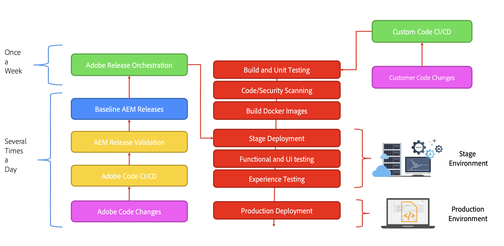

# An Introduction to the Architecture of Adobe Experience Manager as a Cloud Service {#an-introduction-to-the-architecture-adobe-experience-manager-as-a-cloud-service}

>[!CONTEXTUALHELP]
>id="intro_aem_cloudservice_architecture"
>title="Introduction to AEM as a Cloud Service Architecture"
>abstract="In this tab, you can view the new architecture of AEM as a Cloud Service and understand the changes. AEM has resulted in a dynamic architecture with a variable number of images so it is important to take the time to understand the cloud architecture."
>additional-url="https://video.tv.adobe.com/v/330542/" text="Architecture Overview"

Adobe Experience Manager (AEM) as a Cloud Service offers a set of composable services for the creation and management of high impact experiences. 

This page provides an introduction to the logical architecture, the service architecture, the system architecture, and the development architecture for AEM as a Cloud Service.

## Logical architecture {#logical-architecture}

AEM as a Cloud Service is made up of high-level solutions such as AEM Sites, AEM Assets, and AEM Forms. These services are licensed individually, but can be used in collaboration. Each solution uses a combination of composable services provided by AEM as a Cloud Service, dependent on their respective use cases.

### Programs {#programs}

AEM applications are materialized in the form of a [Program](/help/implementing/cloud-manager/getting-access-to-aem-in-cloud/program-types.md) that you create in the Cloud Manager application, according to your licensing entitlements. These programs give you full control over how the associated AEM application is named, configured and how permissions are allocated, in the context of a particular project.

As a customer, you are usually identified by Adobe as a **tenant**, also known as an *IMS organization* (Identity Management System). A tenant can have as many programs as needed, and licensed. For example, it is quite usual to see a central program for AEM Assets, while AEM Sites might be used in multiple programs corresponding to multiple online experiences. 

>[!NOTE]
>
>AEM Edge Delivery Services are exposed as a top-level solution in Cloud Manager, while being part of the other main solutions from a licensing standpoint. For example, AEM Sites with Edge Delivery Services.

A program can be configured with any combination of the high-level solutions, and each solution can support from one-to-many add-ons. For example, Commerce or Screens for AEM Sites, Dynamic Media or Brand Portal for AEM Assets.

### Environments {#environments}

Once a program is created with the AEM Sites, AEM Assets or AEM Forms solutions, the associated AEM instances will be represented in the form of AEM environments in this program.

There are four types of [environment](/help/implementing/cloud-manager/manage-environments.md) available with AEM as a Cloud Service:

* Production environment:

  * A production environment hosts the applications for the business practitioners and runs the live experiences.

* Stage environment:

  * A stage environment is usually coupled to a production environment in a 1:1 relationship. 
  * The stage environment is primarily designed for automated testing before changes to the application are pushed to the production environment. 
    * This is independent from the changes being initiated either by Adobe as part of a maintenance update, or by your code deployments. 
    * You can also conduct manual testing in the case of a code deployment. 
  * The content of the stage environment is usually kept in sync with the production content using the self-service content copy feature.
  * Conduct performance and security tests on stage environment.  It has the same sizing as production.
* Development environment:
  * A development environment allows your developers to implement, and test AEM applications under the same runtime conditions as the stage and production environments. 
  * The changes go through a deployment pipeline allowing for the same code quality and security gates as in production deployment pipelines.
  * Development environments do not have the same sizing as stage and production, and should not be used to conduct performance and security tests. 
* Rapid development environment (RDE):
  * An RDE environment allows for rapid development iterations when deploying new or existing code into the RDE instances, without going through a formal deployment pipeline as found on regular development environments.

### Edge Delivery Services {#logical-architecture-edge-delivery-services}

An AEM program can be configured with the [Edge Delivery Services](/help/edge/overview.md) as well. 

Once configured, AEM can reference GitHub code repositories used for building the experiences with Edge Delivery Services. As a result, new configuration options become available for the associated experiences. These include setting up the Adobe-Managed CDN, and accessing licensing metrics or SLA reports.
 
## Service architecture {#service-architecture}

The list of high-level composable services in AEM as a Cloud Service can be represented with two segments - Content Management and Experience Delivery:

For content management, there are two main sets of services for the authoring of content, both represented as *content sources*:

* The AEM Author tier:
  Provides a web-based interface (with associated APIs) for the management of Web content. This operates for both approaches:
  * Headful - via the Page editor and the Universal Editor
  * Headless - via the Content Fragment editor
* The Document-based Authoring  tier:
  Allows you to author content using standard applications, such as:
  * Microsoft Word and Excel - via SharePoint
  * Google Docs and Sheets - via Google Drive

For experience delivery, when using AEM Sites or AEM Forms, there are also two main sets of services, non-mutually exclusive and operating under a shared Adobe-Managed CDN (Content Delivery Network) as different origins:

* The AEM Publish tier:
  * Runs a farm of standard AEM publishers and dispatchers, allowing for the dynamic rendering of web pages and API content (for example, GraphQL) assembled with published content.
  * Is primarily based on server-side application logic.
* The Edge Delivery Publish tier:
  * Allows for the dynamic rendering of web pages and API content from various content sources such as the AEM Author tier or the Document-based Authoring  tier.
  * Is based on client-side application logic and designed for maximum performance.

There are also the key adjacent services:

* The Edge Delivery Assets tier:
  * Allows for the delivery of approved and published media items from AEM Assets. For example, images, and videos. 
  * The media items are usually referenced from experiences running on the AEM publish tier, or the Edge Delivery publish tier, or from any other Adobe Experience Cloud application integrated with AEM Assets.
* The AEM Preview tier and the Edge Delivery Services Preview tier:
  * Are also available for experiences built with the AEM Publish tier or the Edge Delivery publish tier respectively. 
  * Allows content authors to preview content in-context before publish operations. 

>[!NOTE]
>
>By default Assets-only programs do not have a publish tier, nor a preview tier.

There are other adjacent services:

* The Replication Service:
  * Situated in between the content management tier and the experience delivery tier.
  * Is responsible for processing the *publish* operations issued by content authors, then providing the published content to the publish tiers (AEM or Edge Delivery). 

  >[!NOTE]
  >The replication service went through a complete redesign compared to the 6.x versions of AEM, as the replication framework from previous versions of AEM is no longer used to publish content. 
  >
  >The latest architecture is based on a *publish and subscribe* approach with cloud-based content queues. For the AEM publish tier, it allows a variable number of publishers to subscribe to the publish content and is an essential part of achieving true and rapid autoscaling for AEM as a Cloud Service

* The Content Repository service:
  * Is used by the AEM author tier.
  * Is a cloud-based instance of a JCR-compliant content repository, implemented by the Apache Oak technology.  
  * The persistence of content is primarily based on blob-based cloud storage.
* The CI/CD service:
  * Represents the subset of Cloud Manager functionalities dedicated to managing deployment pipelines to the AEM environments.
* The Testing service:
  * Represents the underlying infrastructure used to execute:
    * functional tests, 
    * UI tests: for example, based on Selenium or Cypress scripts, 
    * experience audit tests: for example, Lighthouse scores, 

    as part of a deployment pipeline to an AEM environment, or as part of a GitHub pull request to an Edge Delivery code repository.
* The Data service:
  * Is responsible for exposing customer data such as licensing metrics (for example, Content Requests, Storage, Users) or usage reports (such as the number of uploads, downloads).
  * The customer data can be exposed via APIs, and within product user interfaces (such as the Cloud Manager).
* The Real-User Metric (RUM) service:
  * Is responsible for collecting key metrics from a customer experience (such as page views, core web vitals, conversion events), and responding to associated queries (for example, top page views for a given domain in the last 7 days).
* The Assets Compute service:
  * Is responsible for processing uploaded images, videos and documents; for example, PDF and Adobe Photoshop files. Processing can use Adobe Sensei to extract image and video metadata (such as descriptive tags or primary color tones), then generate renditions (such as different sizes or formats), with access to APIs such as the Adobe Photoshop and Adobe Lightroom APIs.
* The Identity Management Service (IMS):
  * Is the central place responsible for managing and authenticating users and user groups for a given Adobe Experience Cloud application (for example, the Cloud Manager or the AEM author tier).
  * Is accessed via the Adobe Admin Console.
 
## System architecture {#system-architecture}

### AEM Author, Preview and Publish Tiers {#aem-author-preview-publish-tiers}

The AEM Author and Publish tiers are implemented as a set of Docker containers, operated by a standard Container Orchestration Service. The resulting containerized architecture means a fully dynamic system with a variable number of pods, dependent on actual activity (for content management) and actual traffic (for experience delivery). This enables AEM as a Cloud Service to accommodate your traffic patterns as they change.

The AEM Author tier is operated as a cluster of AEM author pods sharing a single content repository. A minimum of two pods allows for business continuity while maintenance tasks are running, or while a deployment process is happening. 

The AEM Publish tier is operated as a farm of AEM publish instances, each with their own content repository of published content. Each publisher is coupled to a single Apache instance equipped with the AEM dispatcher module for a materialized view of the content, serving as the origin for the Adobe-managed CDN. A minimum of two pods allows for business continuity as well, but it is not unusual to see this number expanding in periods of high traffic.

The AEM Preview tier is comprised of a single AEM node. This is used for quality assurance of content before publishing to the publish tier. Occasional downtimes, especially during deployments, can happen on the preview tier.

### Edge Delivery Services {#system-architecture-edge-delivery-services}

The Edge Delivery Services are operated on top of a CDN and serverless infrastructure for assembling the pages in the most performant way. When a resource is requested, the serverless infrastructure is responsible for converting the published content into semantic HTML and serves as the origin to the CDN.

The conversion to semantic HTML happens from the published content served from the AEM author tier or the Document-based Authoring  environment.

The following diagram illustrates how you can edit Sites content in Microsoft Word (Document-based Authoring ) and publish to Edge Delivery. It also shows the traditional AEM publishing method using the various editors.

As Edge Delivery Services are part of Adobe Experience Manager and as such, Edge Delivery, AEM Sites and AEM Assets can co-exist on the same domain. This is a common use case for larger websites. For instance, a customer might want to migrate a particular page with high traffic to Edge Delivery Services, while all other pages might remain on the AEM Publish Tier.

## Development Architecture {#development-architecture}

### Code repositories {#code-repositories}

The code and configuration for AEM projects is stored in a code repository, from which deployment pipelines are issued when changes are made. There are different types of code repositories:

* AEM full stack:
  * For storing server-side Java code and OSGI configurations for the AEM author and publish tiers.
* AEM front end:
  * For storing client-side JS, CSS and HTML code for the AEM author and publish tiers. 
    For more details on clientlibs, see [Using Client-Side Libraries on AEM as a Cloud Service](/help/implementing/developing/introduction/clientlibs.md).
* AEM web tier:
  * Stores the dispatcher configuration files for the AEM publish tier.
* AEM configuration:
  * Allows for storing various configuration options (such as CDN settings, or maintenance tasks settings) for the AEM publish tier and the Edge Delivery Services publish tier.
* AEM edge delivery:
  * For storing the client-side JS, CSS and HTML code for sites built with the Edge Delivery Services 

### Deployment pipelines {#deployment-pipelines}

Developers and administrators manage the AEM as a Cloud Service application by using a Continuous Integration/Continuous Delivery (CI/CD) service, made available via the Cloud Manager. Cloud Manager also exposes anything related to monitoring, maintenance, troubleshooting (for example, access to log files) and licensing.

Cloud Manager manages all updates to your instances of the AEM as a Cloud Service. It is mandatory, being the only way to build, test, and deploy the customer application to the author, the preview, and the publish tiers. These updates can be triggered by Adobe, when a new version of the AEM Cloud Service is ready, or by yourself, when a new version of your application is ready.

This is implemented by a deployment pipeline, coupled to each environment within a program. When a Cloud Manager pipeline is running, it creates a new version of the customer application, both for the author and the publish tiers. This is achieved by combining the latest customer packages with the latest baseline Adobe image.

The deployment pipeline is triggered either when customers are making code changes, or when Adobe is deploying a new maintenance release.

In both cases, the same set of automated tests is executed. It is made up of tests:

* contributed by Adobe to ensure the product integrity
* tests contributed by the customer
  * Functional tests: via http requests to the AEM author or publish tier  
  * UI tests: based on Selenium or Cypress technology

These automated tests are run on the Stage environment – which is why it is important to keep the Stage environment content as close as possible to the content on the Production instance.

Once all tests pass successfully, the new code is deployed to the Production environment.

### Rolling updates {#rolling-updates}

The Cloud Manager fully automates the cut-over to the latest version of the AEM application by updating all service nodes using a rolling update pattern. This means there is **no downtime** for either the author or publish service.

## Major innovations since AEM 6.x {#major-innovations-since-aem-6x}

The latest architecture for AEM as a Cloud Service introduces some fundamental changes and innovations compared to the previous generations (AEM 6.x and previous):

* All files are directly uploaded and served from a Cloud Data Store. The associated stream of bits never goes through the JVM of the AEM Author and Publish services. As a result, the nodes of the AEM author and publish services can be smaller in size, and therefore more compatible with the expectation of fast autoscaling. For business practitioners, this results in a faster experience when uploading and downloading images, video, and other tasks.

* All operations consisting of publishing content now involve a pipeline following a subscription pattern. Published content is pushed to various queues in the pipeline, to which all nodes of the publish service subscribe. As a result, the author tier does not need to be aware of the number of nodes in the publish service; this allows for fast autoscaling of the publish tier.

* The architecture completely separates the application content from the application code and configuration. All code and configuration is practically immutable and baked into the baseline image used to create the various nodes of the author and publish services. As a result, there is an absolute guarantee that each node is identical, and the changes to code and configuration can only be made globally by running a Cloud Manager pipeline.

* The architecture includes multiple micro-services built on serverless technology, especially with the Adobe I/O runtime

## Further Information {#further-information}

* Program Setup
  * [Onboarding Journey](/help/journey-onboarding/overview.md)
  * [Programs and Program Types](/help/implementing/cloud-manager/getting-access-to-aem-in-cloud/program-types.md)
* Development Architecture
  * [Cloud Manager Repositories](/help/implementing/cloud-manager/managing-code/managing-repositories.md)
  * [CI/CD Pipeline](/help/implementing/cloud-manager/configuring-pipelines/introduction-ci-cd-pipelines.md)
  * [Code Quality Testing](/help/implementing/cloud-manager/code-quality-testing.md)
* Edge Delivery Services:
  * [AEM as a Cloud Service Overview - with Edge Delivery Services](/help/edge/overview.md)
  * [Using Edge Delivery Services](/help/edge/using.md)
  * [Explore the underlying architecture and important pieces of AEM as a Cloud Service with Edge Delivery Services](https://experienceleague.adobe.com/docs/experience-manager-learn/cloud-service/introduction/architecture.html)
