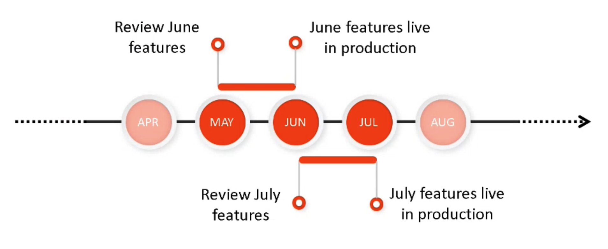

# Release Information {#release-information}

| Product | Adobe Experience Manager as a Cloud Service |
|---|---|
| Version | 2025.12.0 |
| Type | Continuous Updates |
| Availability date | Continuous Update |

## AEM's Release Schedule {#release-schedule}

With the continuous release model in [!DNL Adobe Experience Manager] as a Cloud Service, the application is auto-updated on an ongoing basis. There are two types of updates, feature releases and maintenance releases:

* **Feature releases** are done with a predictable monthly frequency and are focused on new capabilities and product innovations.
  * Check out the [current release notes](/help/release-notes/release-notes-cloud/release-notes-current.md) for details on the latest feature release.
* **Maintenance releases** are done frequently and are focused on security updates, bug fixes, and performance enhancements.
  * This ensures that [!DNL Adobe Experience Manager] as a Cloud Service is always up-to-date with any critical fixes.
  * Check out the [current maintenance release notes](/help/release-notes/maintenance/latest.md) for details on the latest maintenance release.

This model ensures continuous releases with no interruption of service. Upcoming features generally will be announced in one release and then made publicly available in a following release. In this way you can evaluate upcoming functionality and plan for its possible implementation for your own projects. It lets you plan ahead for the next feature release where the feature is available.

For example, if it is May, you can evaluate upcoming features that will become generally available in an upcoming release such as June.

This cadence gives you a rolling window to assess the impact of any upcoming features to your projects and customizations and plan roll outs of such features, testing, and user training.

Check the [Experience Manager releases roadmap](https://experienceleague.adobe.com/docs/experience-manager-release-information/aem-release-updates/update-releases-roadmap.html#aem-as-cloud-service) for details about upcoming releases.

## How to Prepare for a Release {#how-to-prepare}

To prepare for a release:

1. [Mark your calendars](#mark-calendars)
1. [Review the release notes](#release-notes)
1. [Access and try the upcoming features](#upcoming-features)
1. [Train your users](#train-users)

## Mark Your Calendars {#mark-calendars}

Feature releases are scheduled well in advance and the feature release activation dates are published on [Adobe Experience League.](https://experienceleague.adobe.com/docs/experience-manager-release-information/aem-release-updates/update-releases-roadmap.html#aem-as-cloud-service)

Take note of the release dates so you can plan time to review and test upcoming features.

## Review the Release Notes {#release-notes}

Once you have the release dates marked in your calendar, be sure to check the [Adobe Experience League](/help/release-notes/release-notes-cloud/release-notes-current.md) website on the day of the release for the latest release notes.

Each release is accompanied by release notes that document not only what is new in that release, but also the upcoming features that are available for evaluation. Get in the know ahead of time, and plan to take advantage of the latest features from AEMaaCS!

You can also [check the known issues](/help/release-notes/maintenance/latest.md) that are published along with every release so you can also be aware of any technical issues that may present a challenge to your evaluation or eventual adoption of any new features.

## Access and Try Upcoming Features {#upcoming-features}

Upcoming features are generally made available in one of two ways:

* As part of an Alpha, Beta or Limited Availability program
* As part of the prerelease channel

How an upcoming feature is made available will be detailed in the [release notes.](#release-notes)

* If it is part of an Alpha, Beta or Limited Availability  program, you generally need to contact Adobe in order to enable it as detailed in the release notes.
* If it is part of the prerelease channel, you will need to [enable the prerelease channel in a development or sandbox environment.](/help/release-notes/prerelease.md)

## Train Your Users {#train-users}

Once you have tested the upcoming features and have decided to use them in your projects, you need to train your users.

Adobe Experience League offers lots of resources to learn AEMaaCS.

* [The AEMaaCS documentation](https://experienceleague.adobe.com/docs/experience-manager-cloud-service.html)
* [Tutorials](https://experienceleague.adobe.com/docs/experience-manager-learn/aem-tutorials/overview.html)
* [The monthly release overview video](/help/release-notes/release-notes-cloud/release-notes-current.md#release-video) in the release notes

## Key Release Information {#key-articles}

* [Feature Release Notes](/help/release-notes/release-notes-cloud/release-notes-current.md)
* [Maintenance Release Notes](/help/release-notes/maintenance/latest.md)
* [What is New](what-is-new.md)
* [Notable Changes](aem-cloud-changes.md)
* [Deprecated and Removed Features](deprecated-removed-features.md)
