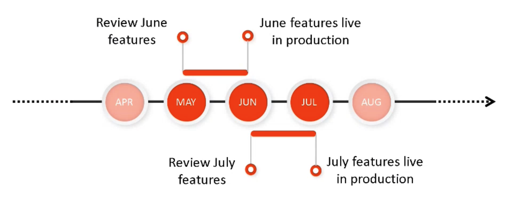
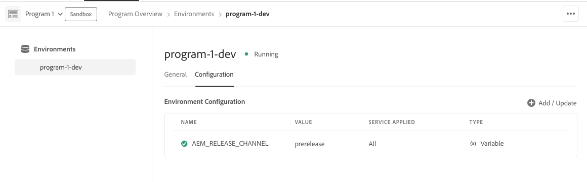

# Adobe Experience Manager as a Cloud Service Prerelease Channel {#prerelease-channel}

Learn how to use the prerelease channel to get a preview of upcoming features to AEM as a Cloud Service.

## Introduction {#introduction}

Adobe Experience Manager as a Cloud Service delivers new features on a regular cadence, according to the [Experience Manager releases roadmap](https://experienceleague.adobe.com/docs/experience-manager-release-information/aem-release-updates/update-releases-roadmap.html#aem-as-cloud-service).

To become familiar with the features scheduled to go live the following feature release, you can subscribe to the prerelease channel, which is accessible by configuring your development environments or any sandbox environments. You can preview changes accessible by way of the AEM user interface and build code against any new prerelease APIs.

The list of prerelease features for a given feature release is posted within the [release notes](/help/release-notes/release-notes-cloud/release-notes-current.md).

## AEM as a Cloud Service Releases {#releases}

AEM as a Cloud Service has two types of releases.

* **Feature Releases** add capabilities and features to AEM as a Cloud Service, upon activation
* **Maintenance Releases** add security updates, performance enhancements, and bug fixes, and are applied on a regular and frequent basis.

This pattern ensures continuous releases with no interruption of service.

The prerelease channel lets you preview features scheduled for the upcoming feature release so you can evaluate upcoming functionality and plan for its possible implementation for your own projects. It lets you plan ahead for the next feature release.

For example, if it is May and you are subscribed to the prerelease channel, you can evaluate features in the upcoming June release.



Prerelease gives you a rolling one-month window into upcoming AEMaaCS features, giving you time to assess the impact of any new features to your projects and customizations and plan roll outs of such features, testing, and user training.

Effectively taking advantage of the prerelease channel requires four steps.

1. [Mark your calendars](#mark-calendars)
1. [Review the release notes](#release-notes)
1. [Access and try the new features](#new-features)
1. [Train your users](#train-users)

## Mark Your Calendars {#mark-calendars}

Feature releases are scheduled well in advance and the feature release activation dates are published on [Adobe Experience League](https://experienceleague.adobe.com/docs/experience-manager-release-information/aem-release-updates/update-releases-roadmap.html#aem-as-cloud-service).

Take note of the release dates so you can plan time to review and test the upcoming features.

## Review the Release Notes {#release-notes}

Once you have the release dates marked in your calendar, be sure to check the [Adobe Experience League](/help/release-notes/release-notes-cloud/release-notes-current.md) website on the day of the release for the latest release notes.

Each release is accompanied by release notes that document not only what is new in that release, but also the features that are available for prerelease evaluation. Get in the know ahead of time, and plan to take advantage of the latest features from AEMaaCS!

You can also [check the known issues](/help/release-notes/maintenance/latest.md) that are published along with every release so you can also be aware of any technical issues that may present a challenge to your evaluation or eventual adoption of any new features.

## Enable the Prerelease Channel to Access and Try New Features {#new-features}

The prerelease channel can be enabled on any development or sandbox environment. Prerelease cannot be enabled on staging or production environments.

The prerelease features can be experienced in different ways:

* [Cloud environments](#cloud-environments)
* [Local SDK](#local-sdk)

### Cloud Environments {#cloud-environments}

To update a cloud environment to use the prerelease, you must add a new environment variable. You can do this either using the Cloud Manager UI or via CLI.

#### Add Environment Variable Using the UI {#add-with-ui}

1. Log into Cloud Manager at [my.cloudmanager.adobe.com](https://my.cloudmanager.adobe.com/) and select the appropriate organization.

1. Navigate to the program where you want to enable prerelease.
 
1. Select the environment where you want to enable prerelease and access its configuraiton via **Program** &gt; **Environment** &gt; **Environment Configuration**.

1. Add a new [environment variable](../implementing/cloud-manager/environment-variables.md)

    | Name | Value | Service Applied | Type |
    |------|-------|-----------------|------|
    | `AEM_RELEASE_CHANNEL` | `prerelease` | All | Variable|

1. Save the changes and the environment will refresh with prerelease feature toggles enabled.

    

#### Add Environment Variable Using the CLI {#add-with-cli}

You can also use the Cloud Manager API and CLI to update the environment variables.

* Using [Cloud Manager API's environment variables endpoint](https://developer.adobe.com/experience-cloud/cloud-manager/reference/api/#operation/patchEnvironmentVariables), set the `AEM_RELEASE_CHANNEL` environment variable to the value `prerelease`. 

    ```text
    PATCH /program/{programId}/environment/{environmentId}/variables
    [
            {
                    "name" : "AEM_RELEASE_CHANNEL",
                    "value" : "prerelease",
                    "type" : "string"
            }
    ]
    ```

* [The Cloud Manager CLI](https://github.com/adobe/aio-cli-plugin-cloudmanager#aio-cloudmanagerset-environment-variables-environmentid) can also be used

    ```shell
    aio cloudmanager:environment:set-variables <ENVIRONMENT_ID> --programId=<PROGRAM_ID> --variable AEM_RELEASE_CHANNEL "prerelease
    ```

The variable can be deleted or set back to a different value if you want the environment to be restored to the behavior of the regular (non-prerelease) channel.

### Local SDK {#local-sdk}

You can see new features in the Sites console in the local Quickstart SDK and code against new APIs in the prerelease by configuring your Maven project to reference the prerelease `API Jar` located in Maven Central. You can also see these prerelease features in your local development environment by starting the regular Quickstart SDK in prerelease mode.

#### Start Quickstart SDK in Prerelease Mode {#prerelease-mode}

1. Download the SDK from the software distribution portal and install as described in [Accessing the AEM as a Cloud Service SDK](/help/implementing/developing/introduction/aem-as-a-cloud-service-sdk.md).
1. When launching the SDK Quickstart, include the argument `-r prerelease`.

The value is sticky so it can only be selected on the first startup. Reinstall the SDK to change the command-line option.

Since there may be multiple AEM maintenance releases between monthly feature releases, you can download these new SDKs and reference the new SDK API Jar versions in maven projects. The maintenance releases will not add additional prerelease features, but could include other smaller changes such as bug fixes, security fixes, and performance enhancements.
Javadocs are published to Maven Central.

#### Build Against the Prerelease SDK {#build-sdk}

1. Modify your maven project's `pom.xml` to reference a distinct prerelease SDK API jar, which is published to Maven Central. It contains any new Java API for the prerelease features and has a dependency on the SDK API jar. It uses the same version.

   As an example, here is a snippet from the parent pom's dependency management section referencing the regular API jar:

   ```
   <dependencyManagement>
    <dependencies>
        <dependency>
            <groupId>com.adobe.aem</groupId>
            <artifactId>aem-sdk-api</artifactId>
            <version>${aem.sdk.api}</version>
            <scope>provided</scope>
        </dependency>
   ```
        
   And then the usage in a module:

   ```
    <dependencies>
     <dependency>
         <groupId>com.adobe.aem</groupId>
         <artifactId>aem-sdk-api</artifactId>
     </dependency>
   ```

   To change to the prerelease SDK, simply change the dependency from `com.adobe.aem:aem-sdk-api` to `com.adobe.aem:aem-prerelease-sdk-api` as noted below:

   ```
   <dependencyManagement>
    <dependencies>
      <dependency>
            <groupId>com.adobe.aem</groupId>
            <artifactId>aem-prerelease-sdk-api</artifactId>
            <version>${aem.sdk.api}</version>
            <scope>provided</scope>
      </dependency>
   <dependencies>
      <dependency>
         <groupId>com.adobe.aem</groupId>
         <artifactId>aem-prerelease-sdk-api</artifactId>
      </dependency>
   ```

   As usual, individual projects can use the dependency.

1. Deploy to your local server.

1. If satisfied that it works as expected locally, commit code to a development branch and use a Cloud Manager non-production pipeline to deploy to an environment that subscribes to the prerelease channel.

>[!CAUTION]
> 
> The `aem-prerelease-sdk-api` artifactId must never be used when deploying to stage or production. Always user the `aem-sdk-api` when deploying via the production pipeline. Similarly, code that references prerelease APIs should not be deployed via the production pipeline.  

The [AEM CS SDK build Analyzer maven plugin v1.0 and higher](https://experienceleague.adobe.com/docs/experience-manager-core-components/using/developing/archetype/build-analyzer-maven-plugin.html#developing) will detect if the prerelease API is used in a project by inspecting the dependencies. If the analyzer finds it, it will use the prerelease SDK API to analyze the project.

## Train Your Users {#train-users}

Once you have tested the new features in the prerelease channel and have decided to use them in your projects, you need to train your users.

Adobe Experience League offers lots of resources to learn AEMaaCS.

* [The AEMaaCS documentation](https://experienceleague.adobe.com/docs/experience-manager-cloud-service.html)
* [Tutorials](https://experienceleague.adobe.com/docs/experience-manager-learn/aem-tutorials/overview.html)
* [The monthly release overview video](/help/release-notes/release-notes-cloud/release-notes-current.md#release-video) in the release notes

## Considerations {#considerations}

There are a few items to note when using the prerelease channel.

* The prerelease channel does not necessarily contain all new features to be rolled out in the following release.
* Features in the prerelease are put through rigorous quality assurance and intended to be feature complete rather than beta quality. If you notice any issues, report them, just as you would do if you suspect bugs in features in a regular AEM release.  
* To determine if an environment is configured for the prerelease channel, go to the AEM console's **About** page and check if the AEM version number includes a *prerelease* suffix such as ```Adobe Experience Manager 2021.4.5226.20210427T070726Z-210429-PRERELEASE```.


