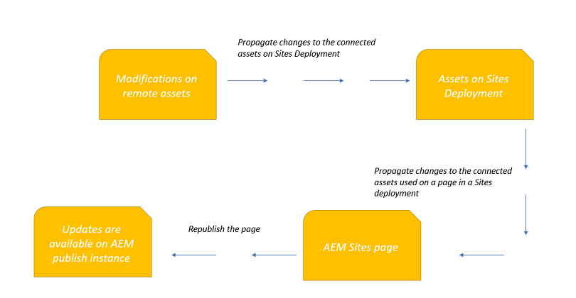

# Current Release Notes for [!DNL Adobe Experience Manager] as a Cloud Service {#release-notes}

The following section outlines the general Release Notes for the current (latest) version of [!DNL Experience Manager] as a Cloud Service.

>[!NOTE]
>
>From here, you can navigate to release notes of previous versions; for example, for those in 2020, 2021, and so on.

>[!NOTE]
>
>See [Recent Documentation Updates](https://experienceleague.adobe.com/docs/experience-manager-release-information/aem-release-updates/doc-updates/documentation-updates.html) for details of documentation updates not directly related to a release.

## Release Date {#release-date}

The release date of [!DNL Adobe Experience Manager] as a [!DNL Cloud Service] current release (2021.11.0) is December 16, 2021.
The following release (2022.1.0) is on January 27, 2022.

## Release Video {#release-video}

Have a look at the [December 2021 Release Overview](https://video.tv.adobe.com/v/339278) video for a summary of the features added.

## [!DNL Experience Manager Sites] as a [!DNL Cloud Service] {#sites}

### New feature in [!DNL Sites] {#sites-features}

* Content Fragment models are now automatically set in read-only state once they are published, to avoid unintentionally breaking live API queries after re-publishing an edited model. Users are prompted with a warning when attempting to edit a published model. Editing is possible upon accepting the warning. 

## [!DNL Experience Manager Assets] as a [!DNL Cloud Service] {#assets}

### New features in [!DNL Assets] {#assets-features}

* Dynamic Media Image Smart Crop and Swatch is now powered by latest Sensei services, that generates improved crops and swatches. Also, an enhancement has been launched to generate different crop content, for same aspect ratio but across different resolutions. In addition, any manual edits will be preserved on reprocessing, if there is no change in the width and height in the Image Profile.

### New features in the [!DNL Assets] prerelease channel {#assets-prerelease-features}

* [!DNL Dynamic Media] - You can now use AEM Dynamic Media interface to configure General Settings and Publish Setup instead of having to go through the Dynamic Media Classic desktop application.

* [!DNL Dynamic Media] now supports ingestion, preview, playback and publish for MXF videos. Annotation and shoppable video for MXF videos is not yet supported.

* Experience Manager enables you to modify the assets available on the remote DAM deployment and propagate those changes, with some delay, to the connected assets on the local Sites deployment. As a result, the connected assets available on both deployments remain in sync.

## [!DNL Experience Manager Forms] as a [!DNL Cloud Service] {#forms}

### What is new in [!DNL Forms] {#what-is-new-forms}

* **Forms Portal**: You can use [Forms Portal](/help/forms/configure-forms-portal.md) to list your published adaptive forms on an AEM Sites page. It helps a site vistor discover all available forms. Moreover, the visitor can use forms portal to save and access draft of an adaptive form and look at the PDF version of a submitted adaptive form.  

* **Externalize AEM Workflow data for secure processing**: You can store in-process AEM Workflows data (AEM Workflow Variables data) that contains Sensitive Personal Data (SPD) elements in a customer-managed repository for secure processing. The data elements and workflow variables are not stored in AEM repository and are fetched on demand from a customer-managed repository while processing the Workflow.

### New features available in [!DNL Forms] prerelease channel {#prerelease-features-forms}

* **[!DNL AEM Forms as a Cloud Service - Communications]**: [Communication APIs](https://experienceleague.adobe.com/docs/experience-manager-forms-cloud-service/forms/using-communications/aem-forms-cloud-service-communications.html) help you combine a template and XML data to generate print documents in various formats. The service allows you to generate documents in synchronous and batch modes. The APIs enables you to create applications that let you:

  * Generate documents by populating template files (PDF and XDP) with XML data.
  * Generate output forms in various formats, including non-interactive PDF print streams.

* **Custom fonts for Document of Record and PDF documents created with Communications APIs**: You can now specify custom fonts for PDF documents generated using Communications APIs and Document of Records making identical looking PDF available for all platforms. 

## CIF Add-on {#cloud-services-cif}

### What is New {#what-is-new-cif}

* Extended myAccount components that are based on Commerce's extensible Peregrine components

* Authors can create ad-hoc Commerce Product Recommendations using additional recommendation types

* Support for gift cards in AEM Storefront

## Cloud Manager {#cloud-manager}

This section outlines the Release Notes for Cloud Manager in AEM as a Cloud Service 2021.10.0.

### Release Date {#release-date-cm-nov}

The Release Date for Cloud Manager in AEM as a Cloud Service 2021.11.0 is November 04, 2021.
The next release is planned for December 09, 2021.

### What's New {#what-is-new-cm-nov}

* Users can now leverage new Front End pipelines to exclusively deploy front end code in an accelerated manner. See [Cloud Manager Front End Pipelines](/help/implementing/cloud-manager/configuring-pipelines/introduction-ci-cd-pipelines.md#front-end) to learn more.

   >[!IMPORTANT]
   >You must be on AEM version `2021.10.5933.20211012T154732Z` to leverage new Front End pipelines.

* Code Quality pipeline duration is significantly reduced by performing the code analysis in a more efficient way without the need of building a whole AEM image. This change will roll out progressively over the weeks following the release.

* The Git Commit ID will now be displayed in the pipeline execution details making it easier to track the code that was built.

* Program Creation is now available via publicly exposed API.

* Environment Creation is now available via publicly exposed API.

* The `x-request-id` response header is now visible in the API Playground on [www.adobe.io](https://www.adobe.io/). This header is useful when submitting customer care issues for troubleshooting.

* As a user, I see  Pipeline card with zero pipelines provide me with appropriate guidance. 

* A new Activity Page is now available where activities such as pipeline and code executions can be viewed along with their associated details. Over time, the activities listed in this page will expand in scope along with the details provided.

* A new Pipelines page with an on-hover, status popover for easy view of the summary of details is now available. Pipeline executions can be viewed along with their associated details.

* The Edit Pipeline API now supports changing the environment used in the deploy phases.

* An optimization in the OakPal scanning process has been introduced for large packages.

* The quality issue CSV file will now contain the timestamp for each quality issue. 

### Bug Fixes {#bug-fixes-nov}

* Certain unorthodox build configurations resulted in unnecessary files being stored in the pipeline's Maven artifact cache which resulted in extraneous network I/O when starting and stopping the build container. 

* Pipeline PATCH API fails if deploy phase does not exist.

* The `ClientlibProxyResourceCheck` quality rule was producing false positive issues when there were client libraries with common base paths.

* Error message when max number of repositories has been reached did not specify the reason for the error.

* In rare cases, pipelines were failing due to inappropriate retry handling of certain response codes. 

## Release Date {#release-date-cm-oct}

The Release Date for Cloud Manager in AEM as a Cloud Service 2021.10.0 is October 14, 2021.

### What's New {#what-is-new-cm-oct}

* In preparation for some upcoming changes, existing deployment pipelines will now be referenced and labelled in the user interface as **Full Stack** pipelines.

* Pipeline card has been refreshed to now display a single, integrated face that shows both production and non-production pipelines, and user can select Run/Pause/Resume directly from the action menu associated with each pipeline.

* A user in Deployment Manager role can now delete Production pipeline in a self-service manner via the UI.

* Add and edit pipeline experiences have been refreshed to now use familiar, modern modals.

* Users of Cloud Manager can now submit feedback directly from the user interface via the **Feedback** button on top right of the landing page.

* Yearly SLA Graphs can now be downloaded from the Cloud Manager's user interface. 

* Code quality and non-production pipeline executions will now use a more efficient shallow cloning process during the build step, leading to a faster build time for customers with especially large git repositories. 

* Add IP Allow List wizard will now inform the user if maximum allowed number of IP Allow Lists has been reached. 

* The Cloud Manager API documentation now includes an interactive playground that allows logged-in users to experiment with the API from their browser. See [Cloud Manager API Playground](https://www.adobe.io/experience-cloud/cloud-manager/reference/playground/) for more details.

* The tool tip on the Program card will be more descriptive if a selection option under 'Navigate To' is disabled. It now displays "A production environment does not exist." 

### Bug Fixes {#bug-fixes-cm-oct}

* In rare situations, when an Adobe staff would restore a customer's environment, the restore was considered complete before the environment was fully operational.

* Certain internal requests made during environment creation were not being retried.

* If deployment failed error occurs following domain name verification, the error message has been corrected to request the customer to contact their Adobe representative.

## Best Practices Analyzer {#best-practices-analyzer}

### Release Date {#release-date-bpa-latest}

The Release Date for Best Practices Analyzer v2.1.20 is October 05, 2021.

### What's New {#what-is-new}

* Ability to detect and report on node name length.

* Ability to detect and report on the total Index size.

* Ability to detect and report on assets that are missing their original rendition.

## Best Practices Analyzer {#bpa-release}

### Release Date {#release-date-bpa}

The Release Date for Best Practices Analyzer v2.1.22 is December 01, 2021.

### What's New {#what-is-new-bpa}

* Ability to detect and report on the version of ACS commons used.
* Ability to detect and report on the number of users and sub-groups in a group.
* Ability to detect and report on node property values in MongoDB that exceed 16MB.

### Bug Fixes {#bug-fixes-bpa}

* Detection of Foundation components was refined to reduce false negatives.
* For AEM Forms customers, BPA messaging regarding `EMAIL_PDF_SUBMIT_ACTION` not being available on AEM as a Cloud Service has been fixed. 
