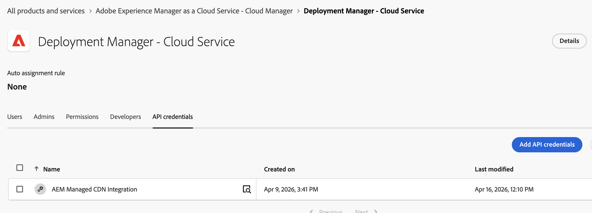

# Adobe-Managed API Integrations in Adobe Admin Console {#adobe-managed-api-integrations-in-adobe-admin-console}

Adobe provisions a small number of **Service Integrations** into your IMS organization as part of AEM as a Cloud Service and related Adobe Experience Cloud capabilities. These integrations appear in the [Adobe Admin Console](https://adminconsole.adobe.com/) alongside integrations you create yourself. Adobe services own and operate them on your behalf.

As a System Administrator or Product Administrator for your IMS organization, you can review what each integration does, which Adobe feature depends on it, and whether it remains enabled. You can disable any Adobe-managed Service Integration at any time and restore it later if needed.

## Overview {#overview}

Use this article to:

* Identify Adobe-managed integrations that have access to your AEM environments.
* Understand the purpose of each integration and the Adobe feature it supports.
* Disable or restore integrations from the Admin Console when your organization requires it.

Adobe applies the following principles for every Service Integration listed here:

* **Named transparently** — Each integration uses a human-readable name that describes its purpose.
* **Documented** — Each integration is described here with the feature it supports.
* **Least privilege** — Each integration receives only the product profile, role, or permission required for its function, not broad administrator rights.
* **Customer-controllable** — Each integration is visible in your Admin Console, and your administrators can disable or restore it.

## Where to Find These Integrations {#where-to-find-these-integrations}

1. Sign in to the [Adobe Admin Console](https://adminconsole.adobe.com/) with a System Administrator or Product Administrator account for your IMS organization.
1. To view all API credentials, go to **Users** > **API Credentials**. To inspect integrations that hold a specific permission, go to **Products** > *the Adobe product named in the catalog* > *the relevant product profile*.
1. Look for Service Integrations whose name begins with `Adobe` or that match a name in the catalog below.

>[!NOTE]
>
>Each catalog entry lists the Adobe product and the product profile, role, or permission for that Service Integration. Use that path when you inspect, disable, or restore an integration.
>
>The name shown in the Admin Console is the authoritative identifier. If you see a Service Integration that is not listed below, contact [Adobe Customer Support](https://helpx.adobe.com/support.html) before you disable it.

## Catalog of Adobe Managed Integrations {#catalog-of-adobe-managed-integrations}

The following table lists Service Integrations that Adobe provisions for AEM as a Cloud Service customers.

| Name as shown in Admin Console | What it does | Used by | Permissions granted | Enabled by default |
|---|---|---|---|---|
| **AEM Managed CDN Integration** | Allows the LLM Optimizer service to update your AEM as a Cloud Service Managed CDN **agentic-traffic routing rules** on your behalf so AI and agent crawlers (such as ChatGPT, Perplexity, and Claude) can be routed to LLM Optimizer optimized origins without manual CDN changes by your team. | **LLM Optimizer** through the [Optimize At Edge](https://experienceleague.adobe.com/en/docs/llm-optimizer/using/resources/optimize-at-edge/overview) capability | Cloud Manager **Deployment Manager** role | Yes |

The following screenshot is an example of the **AEM Managed CDN Integration** mentioned in the table above.

>[!NOTE]
>
>Adobe currently provisions one Service Integration under this model. Adobe updates this table when additional services use the same approach. If your Admin Console shows another Adobe-provisioned Service Integration that is not listed here, use the Admin Console as the source of truth and contact [Adobe Customer Support](https://helpx.adobe.com/support.html) for details.

## Impact of Disabling an Integration {#impact-of-disabling-an-integration}

You can disable an Adobe-managed Service Integration at any time. When you do, the Adobe feature that depends on that integration stops working for your organization until you restore it. Review the following table before you disable an integration.

| Integration | What stops working if disabled | What continues to work |
|---|---|---|
| **AEM Managed CDN Integration** | <ul><li><strong>LLM Optimizer users will no longer be able to update AEM as a Cloud Service Managed CDN agentic-traffic routing rules</strong> for your domains. Any subsequent attempt by an LLMO Admin to enable, change, or revoke agentic routing will fail authorization at the CDN layer.</li><li>Routing of AI/agent crawlers (ChatGPT, Perplexity, Claude, etc.) to LLM Optimizer-optimized origins cannot be (re)configured until the integration is reinstated.</li><li>Already-applied agentic routing rules remain in effect at the edge but cannot be modified or removed without re-enabling the integration (or coordinating manually with Adobe Customer Support).</li></ul> | <ul><li>Your AEM as a Cloud Service author, publish, and preview environments continue to serve traffic normally.</li><li>Standard (non-agentic) CDN delivery of your already-deployed sites continues unchanged.</li><li>Cloud Manager pipelines and deployments continue to work for your human operators with Deployment Manager rights.</li><li>Any LLM Optimizer features that do not depend on edge routing continue to function.</li></ul> |

## How to Disable an Integration {#how-to-disable-an-integration}

**Who can perform this task:** An IMS organization **System Administrator**, or the **Product Administrator** for the Adobe product whose profile, role, or permission grants access to the Service Integration (see *Permissions granted* in the catalog row).

The steps are the same for every Service Integration in this article. Only the navigation path in the Admin Console changes based on the product profile for that integration.

1. Sign in to the [Adobe Admin Console](https://adminconsole.adobe.com/).
1. Identify the **Adobe product** and the **product profile, role, or permission** for the Service Integration. Both are listed in the catalog row.
1. Go to **Products** > *the Adobe product* > *the product profile*.
1. Open the **API Credentials** or **Users** tab for that profile.
1. Locate the Service Integration using the exact name from the catalog row.
1. Remove the Service Integration from the product profile. The integration is disabled for your organization. The next time the Adobe service acts on your behalf, authorization is denied.

**Example — AEM Managed CDN Integration:** Go to **Products** > **Adobe Experience Manager as a Cloud Service** > **Cloud Manager** > **Deployment Manager**, locate **AEM Managed CDN Integration**, and remove it from the product profile.

## How to Restore an Integration {#how-to-restore-an-integration}

If you previously disabled an integration and want to enable it again:

1. Sign in to the [Adobe Admin Console](https://adminconsole.adobe.com/) as a System or Product Administrator.
1. Navigate to the **same product and product profile** identified for the Service Integration in the catalog above — this is the profile from which the Service Integration was removed when it was disabled.
1. Select **Add user** or **Add API**, then search for the Service Integration by the exact name listed in the catalog.
1. Add the Service Integration back to the product profile. The integration resumes on its next scheduled or user-initiated run.

**Example — AEM Managed CDN Integration:** Go to **Cloud Manager** > **Deployment Manager** and add **AEM Managed CDN Integration** again using **Add user** or **Add API**. 

>[!NOTE]
>
>If you cannot find the Service Integration in the add-user dialog (for example, because Adobe removed it from your organization rather than from the profile only), contact [Adobe Customer Support](https://helpx.adobe.com/support.html) to request provisioning. Adobe does not automatically re-add a Service Integration that your administrator removed.
