# Configuring Advanced Networking for AEM as a Cloud Service {#configuring-advanced-networking}

This article introduces the different advanced networking features in AEM as a Cloud Service, including self-service and API provisioning of VPN, non-standard ports, and dedicated egress IP addresses.

>[!TIP]
>
>In addition to this documentation, there is also a series of tutorials designed to walk you through each of the advanced networking options at this [location.](https://experienceleague.adobe.com/en/docs/experience-manager-learn/cloud-service/networking/advanced-networking)

## Overview {#overview}

AEM as a Cloud Service offers the following advanced networking options:

* [Flexible port egress](#flexible-port-egress) - Configure AEM as a Cloud Service to allow outbound traffic out of non-standard ports.
* [Dedicated egress IP address](#dedicated-egress-ip-address) - Configure traffic out of AEM as a Cloud Service to originate from a unique IP.
* [Virtual Private Network (VPN)](#vpn) - Secure traffic between your infrastructure and AEM as a Cloud Service, if you have a VPN.

This article describes each of these options in detail and why you might use them, before describing how they are configured using the Cloud Manager UI and by using the API. The article concludes with some advanced use cases.

>[!CAUTION]
>
>If you are already provisioned with legacy dedicated egress technology and want to configure one of these advanced networking options, [contact Adobe Client Care](https://experienceleague.adobe.com/?support-solution=Experience+Manager#home).
>
>Attempting to configure advanced networking with legacy egress technology can impact site connectivity.

### Requirements and Limitations {#requirements}

When configuring advanced networking features, the following restrictions apply.

* A program can provision a single advanced networking option (flexible port egress, dedicated egress IP address, or VPN).
* Advanced networking is not available for [sandbox programs.](/help/implementing/cloud-manager/getting-access-to-aem-in-cloud/program-types.md)
* A user in must have the **Administrator** role to add and configure network infrastructure in your program.
* The production environment must be created before network infrastructure can be added in your program.
* Your network infrastructure must be in the same region as your production environment's primary region.
  * In the case where your production environment has [extra publish regions](/help/implementing/cloud-manager/manage-environments.md#multiple-regions), you may create another network infrastructure mirroring each additional region.
  * You are not allowed to create more network infrastructures than the maximum number of regions configured in your production environment.
  * You can define as many network infrastructures as available regions in your production environment, but new infrastructure must be the same type as the previously created infrastructure.
  * When creating multiple infrastructures, you are permitted to select from only those regions in which advanced networking infrastructure has not been created.

### Configuring and Enabling Advanced Networking {#configuring-enabling}

Using advanced networking features requires two steps:

1. Configuration of the advanced networking option, whether [flexible port egress,](#flexible-port-egress) [dedicated egress IP address,](#dedicated-egress-ip-address) or [VPN,](#vpn) must first be done at the program level. 
1. To be used, the advanced networking option must then be [enabled at the environment level.](#enabling)

Both steps can be done either using the Cloud Manager UI or the Cloud Manager API.

* When using the Cloud Manager UI, this means creating advanced network configurations using a wizard at the program level and then editing each environment where you want to enable the configuration.

* When using the Cloud Manager API, the `/networkInfrastructures` API endpoint is invoked at the program level to declare the desired type of advanced networking. It is followed by a call to the `/advancedNetworking` endpoint for each environment to enable the infrastructure and configure environment-specific parameters. 

## Flexible Port Egress {#flexible-port-egress}

This advanced networking feature lets you configure AEM as a Cloud Service to egress traffic through ports other than HTTP (port 80) and HTTPS (port 443), which are open by default.

>[!TIP]
>
>When deciding between flexible port egress and dedicated egress IP address, it is recommended you choose flexible port egress if a specific IP address is not required. The reason is because Adobe can optimize performance of flexible port egress traffic.

>[!NOTE]
>
>After creation, flexible port egress infrastructure types cannot be edited. The only way to change configuration values is to delete and recreate them.

### UI Configuration {#configuring-flexible-port-egress-provision-ui}

1. Log into Cloud Manager at [my.cloudmanager.adobe.com](https://my.cloudmanager.adobe.com/) and select the appropriate organization.

1. On the **[My Programs](/help/implementing/cloud-manager/navigation.md#my-programs)** console, select the program.

1. From the **Program Overview** page, navigate to the **Environments** tab and select **Network Infrastructure** in the left panel.

   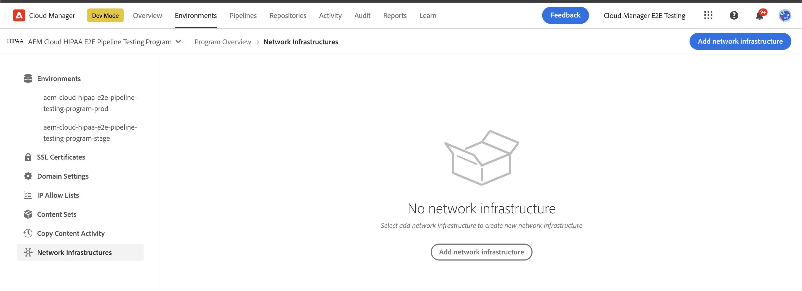

1. In the **Add network infrastructure** wizard, select **Flexible port egress** and the region where it should be created from the **Region** drop-down menu and click **Continue**.

   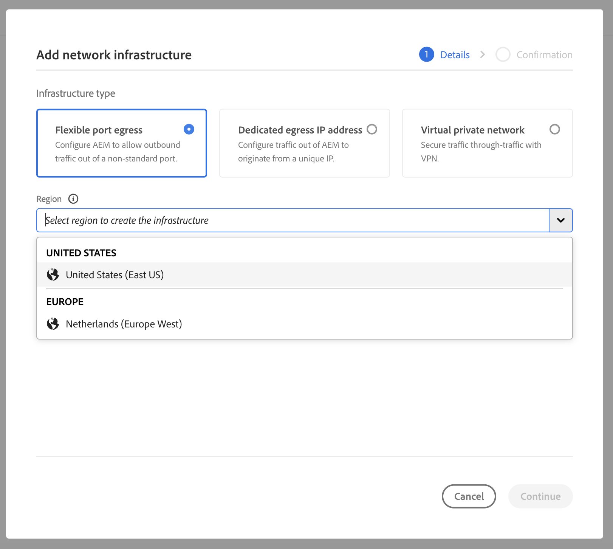

1. The **Confirmation** tab summarizes your selection and the next steps. Click **Save** to create the infrastructure.

   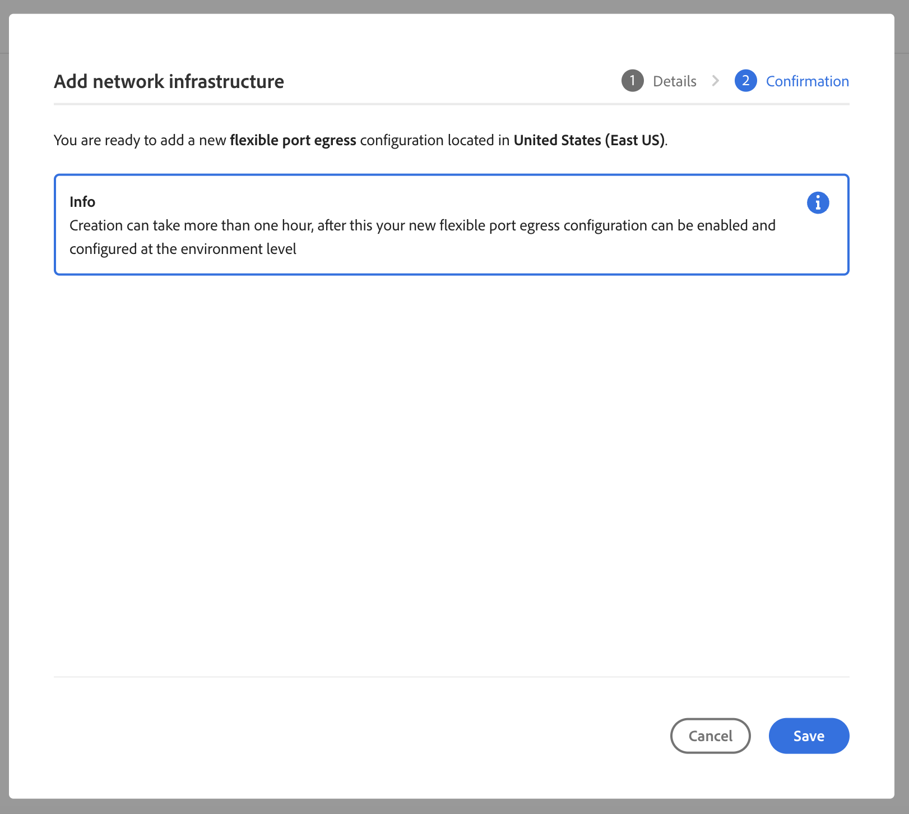

A new record appears below the **Network Infrastructure** heading in the side panel including details of the type of infrastructure, status, region, and environments on which it has been enabled.

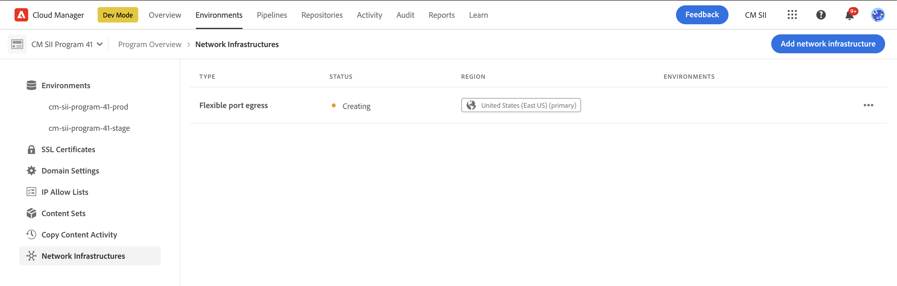

>[!NOTE]
>
>Creation of the infrastructure for flexible port egress can take up to an hour after which it can be configured at the environment level.

### API Configuration {#configuring-flexible-port-egress-provision-api}

Once per program, the POST `/program/<programId>/networkInfrastructures` endpoint is invoked, simply passing the value of `flexiblePortEgress` for the `kind` parameter and region. The endpoint responds with the `network_id`, and other information including the status.

Once called, it typically takes approximately 15 minutes for the networking infrastructure to be provisioned. A call to the Cloud Manager's [network infrastructure GET endpoint](https://developer.adobe.com/experience-cloud/cloud-manager/reference/api/#operation/getNetworkInfrastructure) would show a status of **ready**.

>[!TIP]
>
>The full set of parameters, exact syntax, and important information like what parameters cannot be changed later, [can be referenced in the API documentation.](https://developer.adobe.com/experience-cloud/cloud-manager/reference/api/#operation/createNetworkInfrastructure)

### Traffic Routing {#flexible-port-egress-traffic-routing}

For http or https traffic going to ports other than 80 or 443 a proxy should be configured using the following host and port environment variables:

* for HTTP: `AEM_PROXY_HOST` / `AEM_HTTP_PROXY_PORT ` (default to `proxy.tunnel:3128` in AEM releases < 6094)
* for HTTPS: `AEM_PROXY_HOST` / `AEM_HTTPS_PROXY_PORT ` (default to `proxy.tunnel:3128` in AEM releases < 6094)

For example, here's sample code to send a request to `www.example.com:8443`:

```java
String url = "www.example.com:8443"
String proxyHost = System.getenv().getOrDefault("AEM_PROXY_HOST", "proxy.tunnel");
int proxyPort = Integer.parseInt(System.getenv().getOrDefault("AEM_HTTPS_PROXY_PORT", "3128"));
HttpClient client = HttpClient.newBuilder()
      .proxy(ProxySelector.of(new InetSocketAddress(proxyHost, proxyPort)))
      .build();
 
HttpRequest request = HttpRequest.newBuilder().uri(URI.create(url)).build();
HttpResponse<String> response = client.send(request, BodyHandlers.ofString());
```

If using non-standard Java&trade; networking libraries, configure proxies using the properties above, for all traffic.

Non-http/s traffic with destinations through ports declared in the `portForwards` parameter should reference a property called `AEM_PROXY_HOST`, along with the mapped port. For example:

```java
DriverManager.getConnection("jdbc:mysql://" + System.getenv("AEM_PROXY_HOST") + ":53306/test");
```

The table below describes traffic routing:

<table>
<thead>
  <tr>
    <th>Traffic</th>
    <th>Destination condition</th>
    <th>Port</th>
    <th>Connection</th>
    <th>External destination example</th>
  </tr>
</thead>
<tbody>
  <tr>
    <td><b>Http or https protocol</b></td>
    <td>Standard http/s traffic</td>
    <td>80 or 443</td>
    <td>Allowed</td>
    <td></td>
  </tr> 
  <tr>
    <td></td>
    <td>Non-standard traffic (on other ports outside 80 or 443) through http proxy configured using the following environment variable and proxy port number. Do not declare the destination port in the Cloud Manager API call's portForwards parameter:<br><ul>
     <li>AEM_PROXY_HOST (default to `proxy.tunnel` in AEM releases < 6094)</li>
     <li>AEM_HTTPS_PROXY_PORT (default to port 3128 in AEM releases < 6094)</li>
    </ul>
    <td>Ports outside 80 or 443</td>
    <td>Allowed</td>
    <td>example.com:8443</td>
  </tr>
  <tr>
    <td></td>
    <td>Non-standard traffic (on other ports outside of ports 80 or 443) not using http proxy</td>
    <td>Ports outside 80 or 443</td>
    <td>Blocked</td>
    <td></td>
  </tr>
  <tr>
    <td><b>Non-http or non-https</b></td>
    <td>Client connects to the <code>AEM_PROXY_HOST</code> environment variable using a <code>portOrig</code> declared in the <code>portForwards</code> API parameter.</td>
    <td>Any</td>
    <td>Allowed</td>
    <td><code>mysql.example.com:3306</code></td>
  </tr>
  <tr>
    <td></td>
    <td>Everything else</td>
    <td>Any</td>
    <td>Blocked</td>
    <td><code>db.example.com:5555</code></td>
  </tr>
</tbody>
</table>

#### Apache / Dispatcher Configuration {#apache-dispatcher}

The AEM Cloud Service Apache/Dispatcher tier's `mod_proxy` directive can be configured using the properties described above.

```
ProxyRemote "http://example.com:8080" "http://${AEM_PROXY_HOST}:3128"
ProxyPass "/somepath" "http://example.com:8080"
ProxyPassReverse "/somepath" "http://example.com:8080"
```

```
SSLProxyEngine on //needed for https backends
 
ProxyRemote "https://example.com:8443" "http://${AEM_PROXY_HOST}:3128"
ProxyPass "/somepath" "https://example.com:8443"
ProxyPassReverse "/somepath" "https://example.com:8443"
```

## Dedicated Egress IP Address {#dedicated-egress-ip-address}

A dedicated IP address can enhance security when integrating with SaaS vendors (like a CRM vendor) or other integrations outside of AEM as a Cloud Service that offer an allowlist of IP addresses. By adding the dedicated IP address to the allowlist, it ensures that only traffic from the AEM Cloud Service is permitted to flow into the external service. This is in addition to traffic from any other IPs allowed.

The same dedicated IP is applied to all environments in a program, and applies to both Author and Publish services.

Without the dedicated IP address feature enabled, traffic coming out of AEM as a Cloud Service flows through a set of IPs shared with other customers of AEM as a Cloud Service.

Configuring dedicated egress IP address is similar to [flexible port egress.](#flexible-port-egress) The main difference is that after configuration, traffic will always egress from a dedicated, unique IP. To find that IP, use a DNS resolver to identify the IP address associated with `p{PROGRAM_ID}.external.adobeaemcloud.com`. The IP address is not expected to change, but if it must change, advanced notification is provided.

>[!TIP]
>
>When deciding between flexible port egress and dedicated egress IP address, choose flexible port egress if a specific IP address is not required. The reason is because Adobe can optimize performance of flexible port egress traffic.

>[!NOTE]
>
>If you were provisioned with a dedicated egress IP before 2021.09.30 (that is, before the September 2021 release), your dedicated egress IP feature only supports HTTP and HTTPS ports.
>
>This includes HTTP/1.1, and HTTP/2 when encrypted. Also, one dedicated egress endpoint can talk to any target only over HTTP/HTTPS on ports 80/443 respectively.

>[!NOTE]
>
>Once created, dedicated egress IP address infrastructure types cannot be edited. The only way to change configuration values is to delete and recreate them.

### UI Configuration {#configuring-dedicated-egress-provision-ui}

1. Log into Cloud Manager at [my.cloudmanager.adobe.com](https://my.cloudmanager.adobe.com/) and select the appropriate organization.

1. On the **[My Programs](/help/implementing/cloud-manager/navigation.md#my-programs)** console, select the program.

1. From the **Program Overview** page, navigate to the **Environments** tab and select **Network Infrastructure** in the left panel.

   

1. In the **Add network infrastructure** wizard that starts, select **Dedicated egress IP address** and the region where it should be created from the **Region** drop-down menu and click **Continue**.

   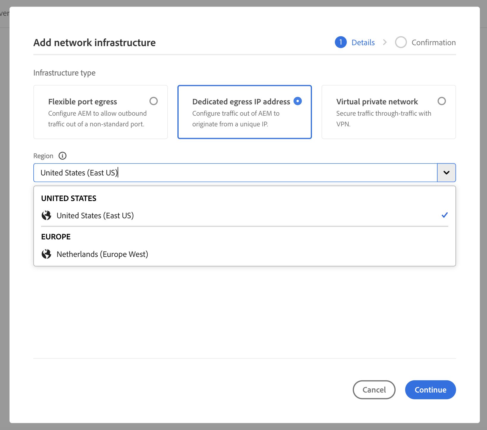

1. The **Confirmation** tab summarizes your selection and the next steps. Click **Save** to create the infrastructure.

   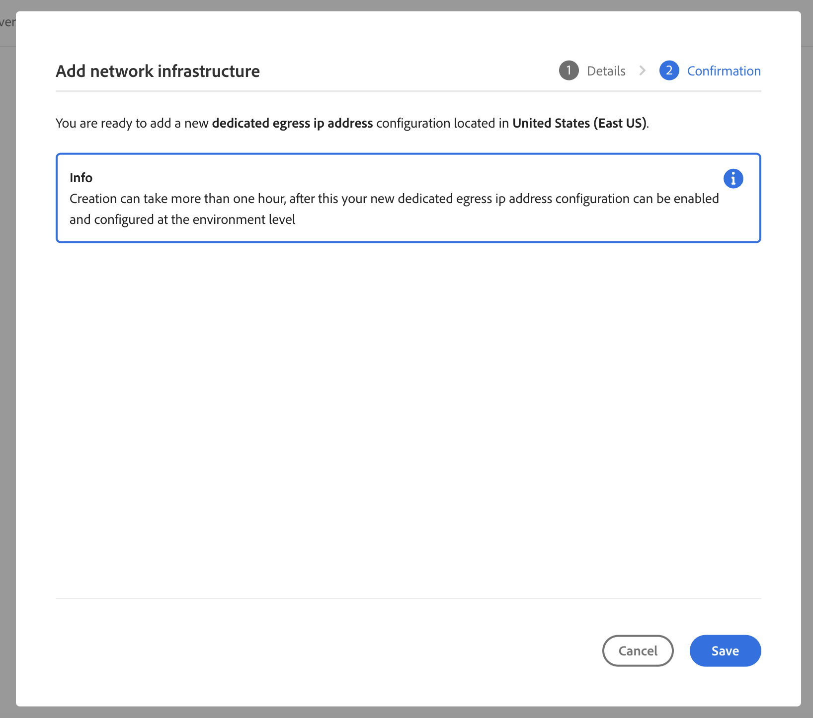

A new record appears below the **Network Infrastructure** heading in the side panel including details of the type of infrastructure, status, region, and environments on which it has been enabled.


>[!NOTE]
>
>Creation of the infrastructure for flexible port egress can take up to an hour after which it can be configured at the environment level.

### API Configuration {#configuring-dedicated-egress-provision-api}

Once per program, the POST `/program/<programId>/networkInfrastructures` endpoint is invoked, simply passing the value of `dedicatedEgressIp` for the `kind` parameter and region. The endpoint responds with the `network_id`, and other information including the status.

Once called, it typically takes approximately 15 minutes for the networking infrastructure to be provisioned. A call to the Cloud Manager's [network infrastructure GET endpoint](https://developer.adobe.com/experience-cloud/cloud-manager/reference/api/#operation/getNetworkInfrastructure) would show a status of **ready**.

>[!TIP]
>
>The full set of parameters, exact syntax, and important information like what parameters cannot be changed later, [can be referenced in the API documentation.](https://developer.adobe.com/experience-cloud/cloud-manager/reference/api/#operation/createNetworkInfrastructure)

### Traffic Routing {#dedicated-egress-ip-traffic-routing}

Http or https traffic go through a preconfigured proxy, provided they use standard Java&trade; system properties for proxy configurations.

Non-http/s traffic with destinations through ports declared in the `portForwards` parameter should reference a property called `AEM_PROXY_HOST`, along with the mapped port. For example:

```java
DriverManager.getConnection("jdbc:mysql://" + System.getenv("AEM_PROXY_HOST") + ":53306/test");
```

<table>
<thead>
  <tr>
    <th>Traffic</th>
    <th>Destination condition</th>
    <th>Port</th>
    <th>Connection</th>
    <th>External destination example</th>
  </tr>
</thead>
<tbody>
  <tr>
    <td><b>Http or https protocol</b></td>
    <td>Traffic to Azure (*.windows.net) or Adobe services</td>
    <td>Any</td>
    <td>Through the shared cluster IPs (not the dedicated IP)</td>
    <td>adobe.io<br>api.windows.net</td>
  </tr>
  <tr>
    <td></td>
    <td>Host matching the <code>nonProxyHosts</code> parameter</td>
    <td>80 or 443</td>
    <td>Through the shared cluster IPs</td>
    <td></td>
  </tr>
  <tr>
    <td></td>
    <td>Host matching the <code>nonProxyHosts</code> parameter</td>
    <td>Ports outside 80 or 443</td>
    <td>Blocked</td>
    <td></td>
  </tr>
  <tr>
    <td></td>
    <td>Through http proxy configuration, configured by default for http/s traffic using standard Java&trade; HTTP client library</td>
    <td>Any</td>
    <td>Through the dedicated egress IP</td>
    <td></td>
  </tr>
  <tr>
    <td></td>
    <td>Ignores http proxy configuration (for example, if explicitly removed from standard Java&trade; HTTP client library or if a Java&trade; library that ignores standard proxy configuration is used)</td>
    <td>80 or 443</td>
    <td>Through the shared cluster IPs</td>
    <td></td>
  </tr>
  <tr>
    <td></td>
    <td>Ignores http proxy configuration (for example, if explicitly removed from standard Java&trade; HTTP client library or if a Java&trade; library that ignores standard proxy configuration is used)</td>
    <td>Ports outside 80 or 443</td>
    <td>Blocked</td>
    <td></td>
  </tr>
  <tr>
    <td><b>Non-http or non-https</b></td>
    <td>The client connects to <code>AEM_PROXY_HOST</code> env variable using a <code>portOrig</code> declared in the <code>portForwards</code> API parameter</td>
    <td>Any</td>
    <td>Through the dedicated egress IP</td>
    <td><code>mysql.example.com:3306</code></td>
  </tr>
  <tr>
    <td></td>
    <td>Anything else</td>
    <td></td>
    <td>Blocked</td>
    <td></td>
  </tr>
</tbody>
</table>

### Feature Usage {#feature-usage}

The feature is compatible with Java&trade; code or libraries that result in outbound traffic, provided they use standard Java&trade; system properties for proxy configurations. In practice, this should include most common libraries. 

Below is a code sample:

```java
public JSONObject getJsonObject(String relativePath, String queryString) throws IOException, JSONException {
  String relativeUri = queryString.isEmpty() ? relativePath : (relativePath + '?' + queryString);
  URL finalUrl = endpointUri.resolve(relativeUri).toURL();
  URLConnection connection = finalUrl.openConnection();
  connection.addRequestProperty("Accept", "application/json");
  connection.addRequestProperty("X-API-KEY", apiKey);

  try (InputStream responseStream = connection.getInputStream(); Reader responseReader = new BufferedReader(new InputStreamReader(responseStream, Charsets.UTF_8))) {
    return new JSONObject(new JSONTokener(responseReader));
  }
}
```

Some libraries require explicit configuration to use standard Java&trade; system properties for proxy configurations.

An example using Apache HttpClient that requires explicit calls to
[`HttpClientBuilder.useSystemProperties()`](https://hc.apache.org/httpcomponents-client-4.5.x/current/httpclient/apidocs/org/apache/http/impl/client/HttpClientBuilder.html) or use
[`HttpClients.createSystem()`](https://hc.apache.org/httpcomponents-client-4.5.x/current/httpclient/apidocs/org/apache/http/impl/client/HttpClients.html#createSystem()):

```java
public JSONObject getJsonObject(String relativePath, String queryString) throws IOException, JSONException {
  String relativeUri = queryString.isEmpty() ? relativePath : (relativePath + '?' + queryString);
  URL finalUrl = endpointUri.resolve(relativeUri).toURL();

  HttpClient httpClient = HttpClientBuilder.create().useSystemProperties().build();
  HttpGet request = new HttpGet(finalUrl.toURI());
  request.setHeader("Accept", "application/json");
  request.setHeader("X-API-KEY", apiKey);
  HttpResponse response = httpClient.execute(request);
  String result = EntityUtils.toString(response.getEntity());
}
```

### Debugging Considerations {#debugging-considerations}

To validate that traffic is indeed outgoing on the expected dedicated IP address, check logs in the destination service, if available. Otherwise, it may be useful to call out to a debugging service such as [https://ifconfig.me/ip](https://ifconfig.me/ip), which returns the calling IP address.

## Virtual Private Network (VPN) {#vpn}

A VPN allows connecting to an on-premise infrastructure or data center from the author, publish, or preview instances. This can be useful, for example, to secure access to a database. It also allows connecting to SaaS vendors such as a CRM vendor that supports VPN.

Most VPN devices with IPSec technology are supported. Consult the information in the **RouteBased configuration instructions** column in [this list of devices.](https://learn.microsoft.com/en-us/azure/vpn-gateway/vpn-gateway-about-vpn-devices#devicetable) Configure the device as described in the table.

>[!NOTE]
>
>The following are limitations to a VPN infrastructure:
>
>* Support is limited to a single VPN connection
>* DNS Resolvers must be listed in the Gateway Address space to resolve private host names.

### UI Configuration {#configuring-vpn-ui}

1. Log into Cloud Manager at [my.cloudmanager.adobe.com](https://my.cloudmanager.adobe.com/) and select the appropriate organization.

1. On the **[My Programs](/help/implementing/cloud-manager/navigation.md#my-programs)** console, select the program.

1. From the **Program Overview** page, navigate to the **Environments** tab and select **Network Infrastructure** in the left panel.

   

1. In the **Add network infrastructure** wizard that starts, select **Virtual private network** and provide the necessary information before clicking **Continue**.

   * **Region** - This is the region in which infrastructure should be created.
   * **Address Space** - The address space can only be one /26 CIDR (64 IP addresses) or larger IP range in your own space.
     * This value can't be changed later.
   * **DNS Information** - This is a list of remote DNS resolvers.
     * Press `Enter` after inputting a DNS server address to add another.
     * Click the `X` after an address to remove it.
   * **Shared Key** - This is your VPN preshared key.
     * Select **Show shared key** to reveal the key so you can double-check its value.

   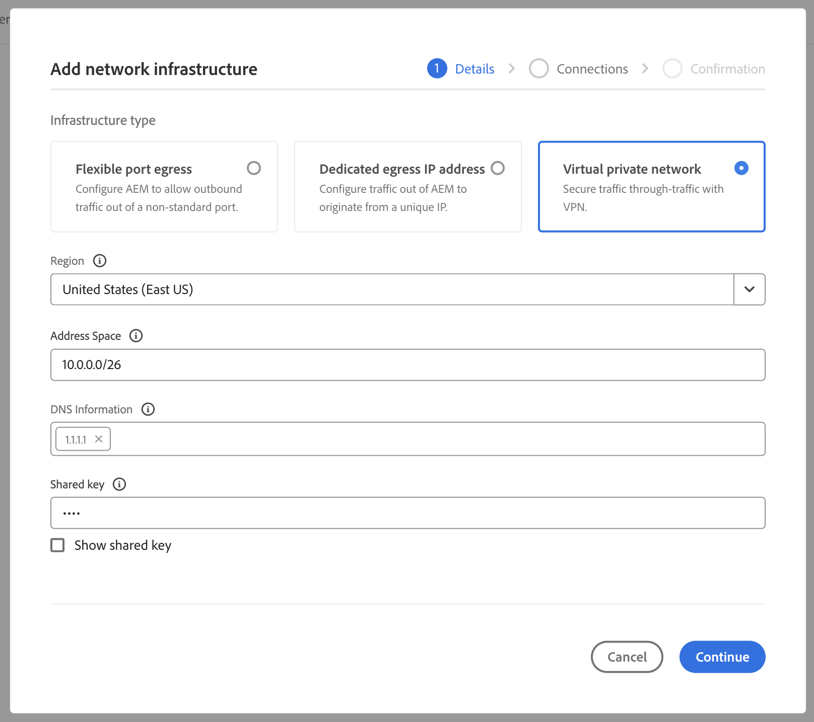

1. On the **Connections** tab of the wizard, provide a **Connection name** to identify your VPN connection and click **Add Connection**.

   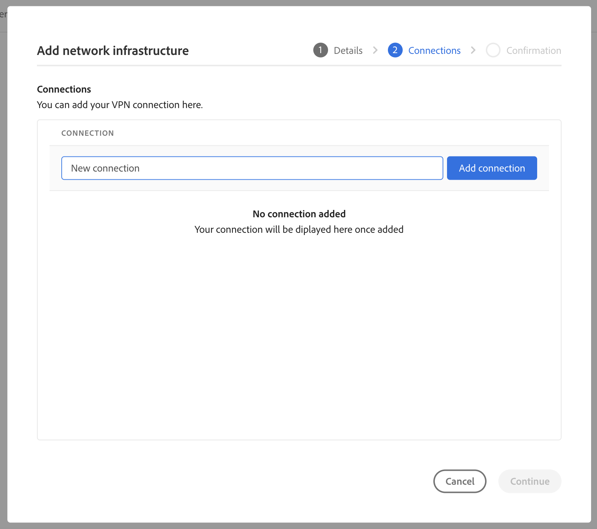

1. In the **Add connection** dialog, define your VPN connection, then click **Save**.

   * **Connection name** - This is a descriptive name of your VPN connection, which you provided in the previous step and can be updated here.
   * **Address** - This is the VPN device IP address.
   * **Address space** - These are the IP address ranges to route through the VPN.
     * Press `Enter` after inputting a range to add another.
     * Click the `X` after a range to remove it.
   * **IP Security Policy** - Adjust from the default values as required

   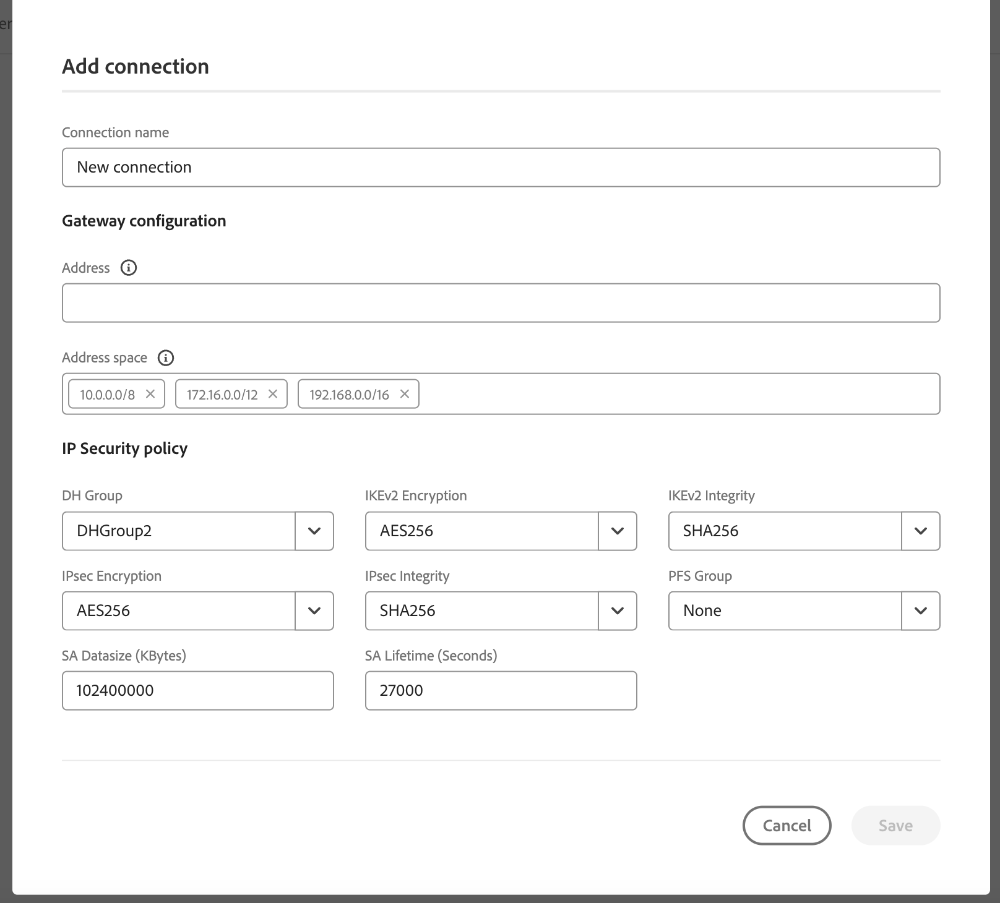

1. The dialog closes and you return to the **Connections** tab of the wizard. Click **Continue**.

   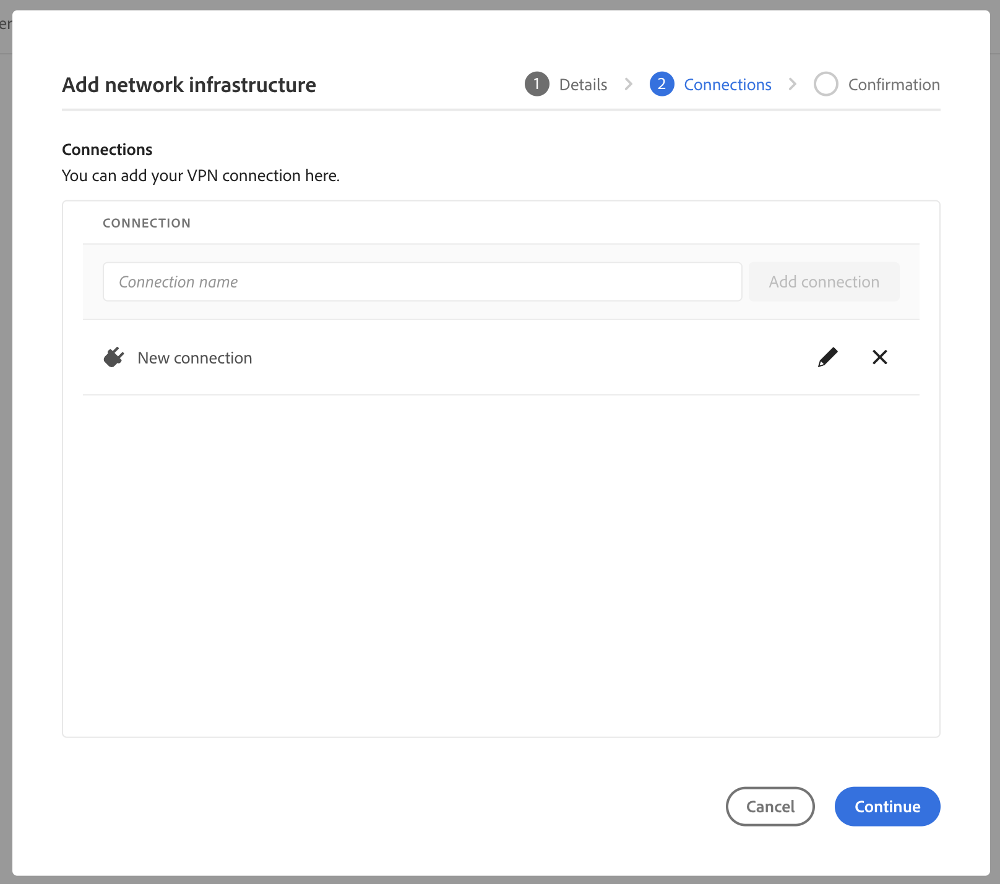

1. The **Confirmation** tab summarizes your selection and the next steps. Click **Save** to create the infrastructure.

   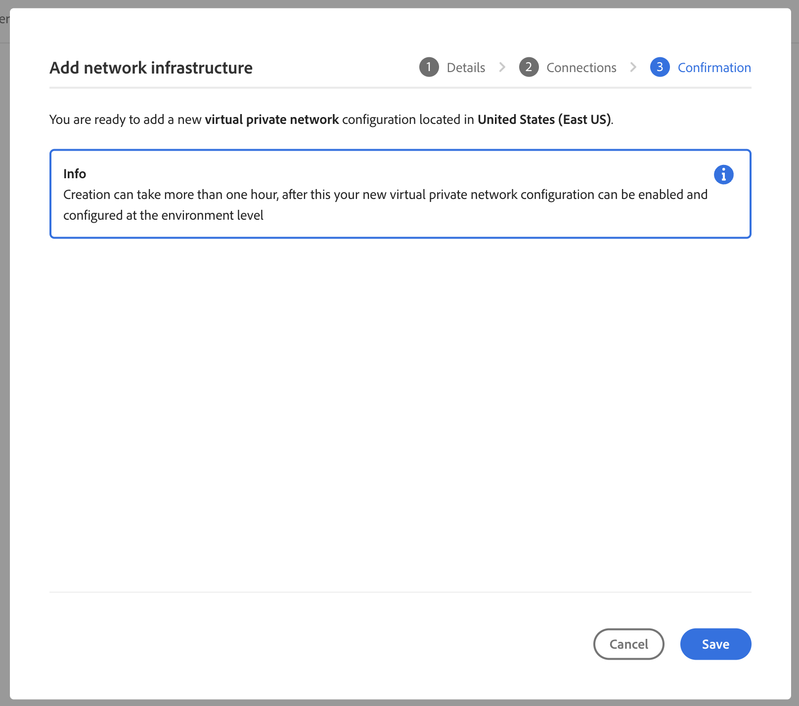

A new record appears below the **Network Infrastructure** heading in the side panel including details of the type of infrastructure, status, region, and environments on which it has been enabled.

### API Configuration {#configuring-vpn-api}

Once per program, the POST `/program/<programId>/networkInfrastructures` endpoint is invoked. It passes in a payload of configuration information. That information includes the value of **vpn** for the `kind` parameter, region, address space (list of CIDRs - note that this cannot be modified later), DNS resolvers (for resolving names in your network). It also includes VPN connection information such as gateway configuration, shared VPN key, and the IP Security policy. The endpoint responds with the `network_id`, and other information including the status. 

Once called, it typically takes from 45 through 60 minutes for the networking infrastructure to be provisioned. The GET method in the API can be called to return the status, which eventually flips from `creating` to `ready`. Consult the API documentation for all states.

>[!TIP]
>
>The full set of parameters, exact syntax, and important information like what parameters cannot be changed later, [can be referenced in the API documentation.](https://developer.adobe.com/experience-cloud/cloud-manager/reference/api/#operation/createNetworkInfrastructure)

### Traffic Routing {#vpn-traffic-routing}

The table below describes traffic routing.

<table>
<thead>
  <tr>
    <th>Traffic</th>
    <th>Destination Condition</th>
    <th>Port</th>
    <th>Connection</th>
    <th>External destination example</th>
  </tr>
</thead>
<tbody>
  <tr>
    <td><b>Http or https protocol</b></td>
    <td>Traffic to Azure or Adobe services</td>
    <td>Any</td>
    <td>Through the shared cluster IPs (not the dedicated IP)</td>
    <td>adobe.io<br>api.windows.net</td>
  </tr>
  <tr>
    <td></td>
    <td>Host matching the <code>nonProxyHosts</code> parameter</td>
    <td>80 or 443</td>
    <td>Through the shared cluster IPs</td>
    <td></td>
  </tr>
  <tr>
    <td></td>
    <td>Host matching the <code>nonProxyHosts</code> parameter</td>
    <td>Ports outside 80 or 443</td>
    <td>Blocked</td>
    <td></td>
  </tr>
  <tr>
    <td></td>
    <td>If the IP falls in the <i>VPN gateway address</i> space range, and through http proxy configuration (configured by default for http/s traffic using standard Java&trade; HTTP client library)</td>
    <td>Any</td>
    <td>Through the VPN</td>
    <td><code>10.0.0.1:443</code><br>It can be a hostname as well.</td>
  </tr>
  <tr>
    <td></td>
    <td>If the IP does not fall in the <i>VPN gateway address space</i> range, and through http proxy configuration (configured by default for http/s traffic using standard Java&trade; HTTP client library)</td>
    <td>Any</td>
    <td>Through the dedicated egress IP</td>
    <td></td>
  </tr>
  <tr>
    <td></td>
    <td>Ignores http proxy configuration (for example, if explicitly removed from standard Java&trade; HTTP client library or if using Java&trade; library that ignores standard proxy configuration)
</td>
    <td>80 or 443</td>
    <td>Through the shared cluster IPs</td>
    <td></td>
  </tr>
  <tr>
    <td></td>
    <td>Ignores http proxy configuration (for example, if explicitly removed from standard Java&trade; HTTP client library or if using Java&trade; library that ignores standard proxy configuration)</td>
    <td>Ports outside 80 or 443</td>
    <td>Blocked</td>
    <td></td>
  </tr>
  <tr>
    <td><b>Non-http or non-https</b></td>
    <td>If the IP falls in the <i>VPN gateway address space</i> range and the client connects to <code>AEM_PROXY_HOST</code> env variable using a <code>portOrig</code> declared in the <code>portForwards</code> API parameter</td>
    <td>Any</td>
    <td>Through the VPN</td>
    <td><code>10.0.0.1:3306</code><br>It can be a hostname as well.</td>
  </tr>
  <tr>
    <td></td>
    <td>If the IP does not fall in the <i>VPN gateway address space</i> range and client connects to <code>AEM_PROXY_HOST</code> env variable using a <code>portOrig</code> declared in the <code>portForwards</code> API parameter</td>
    <td>Any</td>
    <td>Through the dedicated egress IP</td>
    <td></td>
  </tr>
  <tr>
    <td></td>
    <td>Anything else</td>
    <td>Any</td>
    <td>Blocked</td>
    <td></td>
  </tr>
</tbody>
</table>

### Useful Domains for Configuration {#vpn-useful-domains-for-configuration}

The diagram below provides a visual representation of a set of domains and associated IPs that are useful for configuration and development. The table further below the diagram describes those domains and IPs.


<table>
<thead>
  <tr>
    <th>Domain pattern</th>
    <th>Egress (from AEM) meaning</th>
    <th>Ingress (to AEM) meaning</th>
  </tr>
</thead>
<tbody>
  <tr>
    <td><code>p{PROGRAM_ID}.external.adobeaemcloud.com</code></td>
    <td>Dedicated egress IP address for traffic going to the Internet rather than through private networks </td>
    <td>Connections from the VPN would show at the CDN as coming from this IP. To only allow connections from the VPN to go into AEM, configure Cloud Manager to only allow this IP and block everything else. See the "Restrict ingress to VPN connections" section for more details.</td>
  </tr>
  <tr>
    <td><code>p{PROGRAM_ID}.{REGION}-gateway.external.adobeaemcloud.com</code></td>
    <td>N/A</td>
    <td>The IP of the VPN gateway on the AEM side. Your network engineering team can use this to allow only VPN connections to your VPN gateway from a specific IP address. </td>
  </tr>
</tbody>
</table>

## Enabling Advanced Networking Configurations on Environments {#enabling}

Once you have configured an advanced networking option for a program, whether [flexible port egress](#flexible-port-egress), [dedicated egress IP address](#dedicated-egress-ip-address), or [VPN](#vpn), to use it, you must enable it at the environment level.

When you enable an advanced networking configuration for an environment, you can also enable optional port forwarding and non-proxy hosts. Parameters are configurable per environment to offer flexibility.

* **Port Forwarding** - Port forwarding rules should be declared for any destination ports other than 80/443, but only if not using http or https protocol.
  * Port forwarding rules are defined by specifying the set of destination hosts (names or IP and ports). 
  * The client connection that uses port 80/443 over http/https must still use proxy settings in their connection to have the properties of advanced networking applied to the connection.
  * For each destination host, you must map the intended destination port to a port from 30000 through 30999.
  * Port forwarding rules are available for all advanced networking types.
 
* **Non-Proxy Hosts** - Non-proxy hosts let you declare a set of hosts that should route through a shared IPs address range rather than the dedicated IP.
  * This may be useful since traffic egressing through shared IPs may be further optimized.
  * Non-proxy hosts are only available for dedicated egress IP address and VPN advanced networking types.

>[!NOTE]
>
>You cannot enable an advanced networking configuration for an environment if the environment is in the **Updating** status.

### Enabling Using the UI {#enabling-ui}

1. Log into Cloud Manager at [my.cloudmanager.adobe.com](https://my.cloudmanager.adobe.com/) and select the appropriate organization.

1. On the **[My Programs](/help/implementing/cloud-manager/navigation.md#my-programs)** console, select the program.

1. From the **Program Overview** page, navigate to the **Environments** tab and select the environment where you want to enable the advanced networking configuration under the **Environments** heading in the left panel. Then select the **Advanced network configuration** tab of the selected environment and click **Enable network infrastructure**.

   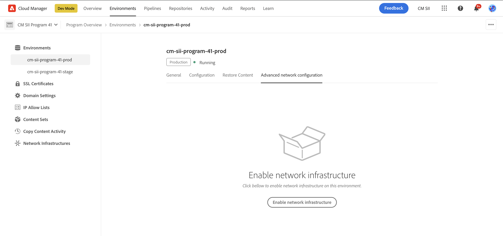

1. The **Configure advanced networking** dialog opens.

1. On the **Non-proxy hosts** tab, for dedicated egress IP addresses and VPNs, you can optionally define a set of hosts. These defined hosts should be routed through a shared IPs address range rather than the dedicated IP, by providing the host name in the **Non-Proxy Host** field and clicking **Add**.

   * The host is added to the list of hosts on the tab.
   * Repeat this step if you want to add multiple hosts.
   * Click the X to the right of the row if you wan to remove a host.
   * This tab is not available for flexible port egress configurations.

   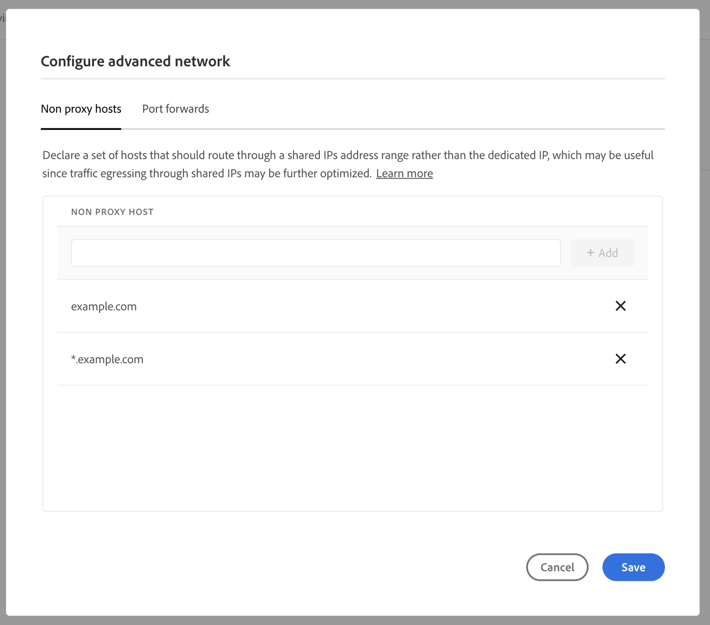

1. On the **Port forwards** tab, you can optionally define port forwarding rules for any destination ports other than 80/443 if not using HTTP or HTTPS. Provide a **Name**, **Port Orig**, and **Port Dest** and click **Add**.

   * The rule is added to the list of rules on the tab.
   * Repeat this step if you want to add multiple rules.
   * Click the X to the right of the row if you want to remove a rule.

   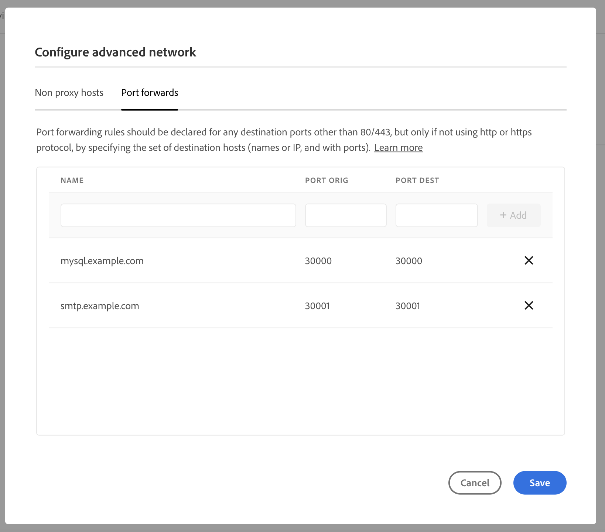

1. Click **Save** in the dialog box so you can apply the configuration to the environment.

The advanced networking configuration is applied to the selected environment. Back on the **Environments** tab, you can see the details of the configuration applied to the selected environment and their status.

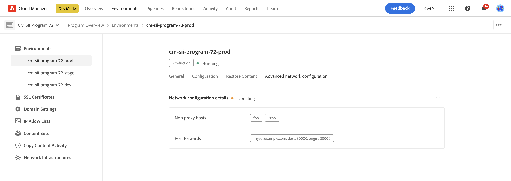

### Enabling Using the API {#enabling-api}

To enable an advanced networking configuration for an environment, the `PUT /program/<program_id>/environment/<environment_id>/advancedNetworking` endpoint must be invoked per environment.

The API should respond in just a few seconds, indicating a status of `updating`. After about 10 minutes, a call to the Cloud Manager's environment GET endpoint shows a status of `ready`, indicating that the update to the environment is applied.

Per environment port forwarding rules can be updated by invoking the `PUT /program/{programId}/environment/{environmentId}/advancedNetworking` endpoint, and including the full set of configuration parameters, rather than a subset.

Dedicated egress IP address and VPN advanced networking types support a `nonProxyHosts` parameter. This lets you declare a set of hosts that should route through a shared IPs address range rather than the dedicated IP. The `nonProxyHost` URLs may follow the patterns of `example.com` or `*.example.com`, where the wildcard is only supported at the start of the domain.

Even if there are no environment traffic routing rules (hosts or bypasses), `PUT /program/<program_id>/environment/<environment_id>/advancedNetworking` must still be called, just with an empty payload.

>[!TIP]
>
>The full set of parameters, exact syntax, and important information like what parameters cannot be changed later, [can be referenced in the API documentation.](https://developer.adobe.com/experience-cloud/cloud-manager/reference/api/#operation/createNetworkInfrastructure)

## Editing and Deleting Advanced Networking Configurations on Environments {#editing-deleting-environments}

After [enabling advanced networking configurations to environments,](#enabling) you can update the details of those configurations or delete them.

>[!NOTE]
>
>You cannot edit network infrastructure if it has the status **Creating**, **Updating**, or **Deleting**.

### Editing or Deleting using the UI {#editing-ui}

1. Log into Cloud Manager at [my.cloudmanager.adobe.com](https://my.cloudmanager.adobe.com/) and select the appropriate organization.

1. On the **[My Programs](/help/implementing/cloud-manager/navigation.md#my-programs)** console, select the program.

1. From the **Program Overview** page, navigate to the **Environments** tab and select the environment where you want to enable the advanced networking configuration under the **Environments** heading in the left panel. Then select the **Advanced network configuration** tab of the selected environment and click the ellipsis button.

   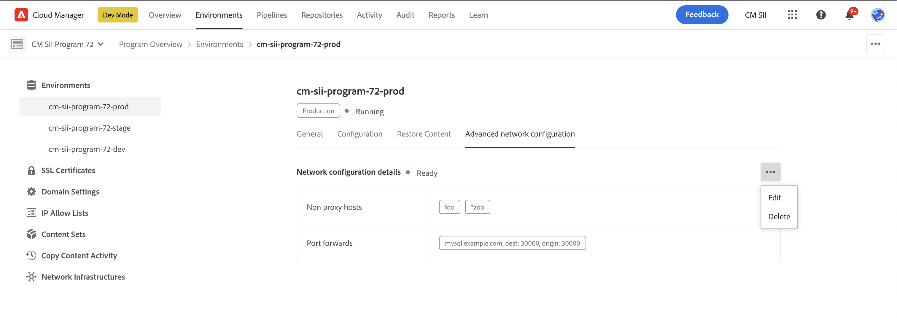

1. In the ellipsis menu, select either **Edit** or **Delete**.

   * If you choose **Edit**, update the information per the steps described in the previous section, [Enabling Using the UI,](#enabling-ui) and click **Save**.
   * If you choose **Delete**, confirm the deletion in the **Delete network configuration** dialog with **Delete** or abort with **Cancel**.

The changes are reflected on the **Environments** tab.

### Editing or Deleting using the API {#editing-api}

To delete advanced networking for a particular environment, invoke `DELETE [/program/{programId}/environment/{environmentId}/advancedNetworking]()`.

>[!TIP]
>
>The full set of parameters, exact syntax, and important information like what parameters cannot be changed later, [can be referenced in the API documentation.](https://developer.adobe.com/experience-cloud/cloud-manager/reference/api/#operation/createNetworkInfrastructure)

## Editing and Deleting a Program's Network Infrastructure {#editing-deleting-program}

Once network infrastructure is created for a program, only limited properties can be edited. If you no loner require it, you can delete the advanced networking infrastructure for your entire program.

>[!NOTE]
>
>The following are limitations to editing and deleting network infrastructure:
>
>* Delete only deletes the infrastructure if all environments have their advanced networking disabled. 
>* You cannot edit network infrastructure if it has the status **Creating**, **Updating**, or **Deleting**.
>* Only the VPN advanced networking infrastructure type can be edited once created and then only limited fields.
>* For security reasons, the **Shared key** must always be provided when editing an advanced VPN networking infrastructure, even if you are not editing the key itself.

### Editing and Deleting with the UI {#delete-ui}

1. Log into Cloud Manager at [my.cloudmanager.adobe.com](https://my.cloudmanager.adobe.com/) and select the appropriate organization

1. On the **[My Programs](/help/implementing/cloud-manager/navigation.md#my-programs)** console, select the program.

1. From the **Program Overview** page, navigate to the **Environments** tab and select **Network Infrastructure** heading in the left panel. Then click the ellipsis button next to the infrastructure that you want to delete.

   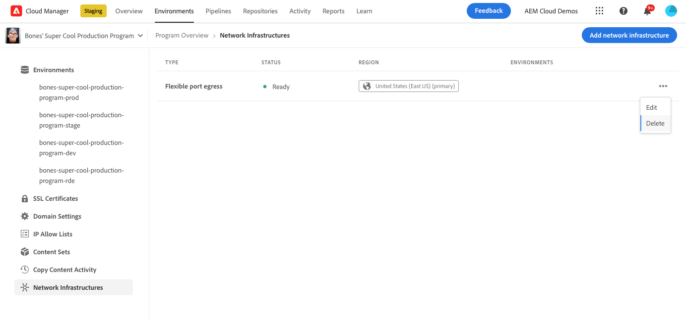

1. In the ellipsis menu, select either **Edit** or **Delete**.

1. If you choose **Edit**, the **Edit network infrastructure** wizard opens. Edit as required following the steps as described when creating the infrastructure.

1. If you choose **Delete**, confirm the deletion in the **Delete network configuration** dialog box with **Delete** or abort with **Cancel**.

The changes are reflected on the **Environments** tab.

### Editing and Deleting with the API {#delete-api}

To **delete** the network infrastructure for a program, invoke `DELETE /program/{program ID}/networkinfrastructure/{networkinfrastructureID}`. 

## Changing a Program's Advanced Networking Infrastructure Type {#changing-program}

It is only possible to have one type of advanced networking infrastructure configured for a program at a time, The advanced networking infrastructure must either flexible port egress, dedicated egress IP address, or VPN.

If you decide that you need another advanced networking infrastructure type than the one you have already configured, delete the existing one, and create another one. Do the following:

1. [Delete advanced networking in all environments.](#editing-deleting-environments)
1. [Delete the advanced networking infrastructure.](#editing-deleting-program)
1. Create the advanced networking infrastructure type you now require, either [flexible port egress,](#flexible-port-egress) [dedicated egress IP address,](#dedicated-egress-ip-address) or [VPN.](#vpn)
1. [Reenable advanced networking at the environment level.](#enabling)

>[!WARNING]
>
> This procedure results in a downtime of advanced networking services between deletion and recreation.
> If downtime would cause significant business impact, contact customer support for assistance, describing what has already been created and the reason for the change.

## Advanced Networking Configuration for Other Publish Regions {#advanced-networking-configuration-for-additional-publish-regions}

When an additional region is added to an environment that already has advanced networking configured, traffic from the additional publish region that matches the advanced networking rules route through the primary region by default. However, if the primary region becomes unavailable, the advanced networking traffic is dropped if advanced networking hasn't been enabled in the additional region. If you want to optimize latency and increase availability in case one of the regions undergoes an outage, it is necessary to enable advanced networking for the additional publish regions. Two different scenarios are described in the following sections.

>[!NOTE]
>
>All regions share [environment advanced networking configuration](https://developer.adobe.com/experience-cloud/cloud-manager/reference/api/#tag/Environment-Advanced-Networking-Configuration), so it is not possible to route traffic to different destinations based on the region the traffic is egressing out of. 

### Dedicated Egress IP Addresses {#additional-publish-regions-dedicated-egress}

#### Advanced networking already enabled in the primary region {#already-enabled}

If an advanced networking configuration is already enabled in the primary region, follow these steps:

1. If you locked down your infrastructure such that the dedicated AEM IP address is allowlisted, temporarily disable any deny rules in that infrastructure. If this is not done, there is a short period where requests from the new region's IP addresses are denied by your own infrastructure. This is not necessary if you have locked down your infrastructure by way of a FullyQualified Domain Name (FQDN), (`p1234.external.adobeaemcloud.com`, for example), because all AEM regions egress advanced networking traffic from the same FQDN
1. Create the program-scoped networking infrastructure for the secondary region through a POST call to the Cloud Manager Create Network Infrastructure API, as described in advanced networking documentation. The only difference in the payload's JSON configuration relative to primary region is the region property
1. If your infrastructure must be locked down by IP to allow AEM traffic, add the IPs that match `p1234.external.adobeaemcloud.com`. There should be one per region. 

#### Advanced networking not yet configured in any region {#not-yet-configured}

The procedure is mostly similar to the previous instructions. However, if the production environment has not yet been enabled for advanced networking, there is an opportunity to test the configuration by first enabling it in a staging environment:

1. Create networking infrastructure for all regions through POST call to the [Cloud Manager Create Network Infrastructure API](https://developer.adobe.com/experience-cloud/cloud-manager/reference/api/#tag/Network-infrastructure/operation/createNetworkInfrastructure). The only difference in the payload's JSON configuration relative to primary region is the region property.
1. For the staging environment, enable and configure the environment scoped advanced networking by running `PUT api/program/{programId}/environment/{environmentId}/advancedNetworking`. For more information, see [the API documentation](https://developer.adobe.com/experience-cloud/cloud-manager/reference/api/#tag/Environment-Advanced-Networking-Configuration/operation/enableEnvironmentAdvancedNetworkingConfiguration)
1. If necessary, lock down external infrastructure, preferably by FQDN (for example, `p1234.external.adobeaemcloud.com`). You can otherwise do it by IP address
1. If the staging environment works as expected, enable and configure the environment-scoped advanced networking configuration for production. 

#### VPN {#vpn-regions}

The procedure is nearly identical to the dedicated egress IP addresses instructions. The only difference is that in addition to the region property being configured differently from the primary region, the `connections.gateway` field can optionally be configured. The configuration can route to a different VPN endpoint operated by your organization, geographically closer to the new region.

## Troubleshooting

Please be advised that the following points are provided as informative guidelines and encompass best practices for troubleshooting. These recommendations are intended to assist in effectively diagnosing and resolving issues.

### Connection pooling {#connection-pooling-advanced-networking}

Connection pooling is a technique tailored to create and sustain a repository of connections, which stand ready for immediate use by any thread that may require them. Numerous connection pooling techniques can be found across various online platforms and resources, each with its unique merits and considerations. We encourage our customers to investigate these methodologies to identify the one most compatible with their system's architecture.

Implementing an appropriate connection pooling strategy is a proactive measure to correct a common oversight in system configuration, which often leads to suboptimal performance. By correctly establishing a connection pool, Adobe Experience Manager (AEM) can improve the efficiency of external calls. This not only reduces resource consumption but also mitigates the risk of service disruptions and decreases the probability of encountering failed requests when communicating with upstream servers.

In light of this information, Adobe advises reassessing your current AEM configuration and consider the deliberate incorporation of connection pooling in conjunction with Advanced Networking settings. By managing the number of parallel connections and minimizing the possibility of stale connections, these measures lead to a reduction in the risk of proxy servers reaching their connection limits. Consequently, this strategic implementation is designed to decrease the likelihood of requests failing to reach external endpoints.

#### Connection Limits FAQ

When using Advanced Networking the number of connections is limited in order to ensure stability across environments and to prevent that lower environments from exhausting the available connections.

The connections are limited to 1000 per AEM instance and alerts are sent to customers when the number reaches 750.

##### Is the connection limit applied only to outbound traffic out of non-standard ports or to all outbound traffic?

The limit is only for connections using Advanced Networking (egress on non-standard ports, using dedicated egress IP, or VPN).

##### We do not see a significant difference in the number of outgoing connections. Why are we receiving the notification now?

If the customer creates connections dynamically (for example, one or more for each request), an increase in traffic can cause the connections to spike.

##### Is it possible that we experienced a similar situation in the past without being alerted?

Alerts are only sent when the soft limit is reached.

##### What happens if the maximum limit is reached?

When the hard limit is reached, new egress connections from AEM through Advanced Networking (egress on non-standard ports, using dedicated egress IP, or VPN) will be dropped to protect against a DoS attack.

##### Can the limit be raised?

No, having a large number of connections can cause a significant performance impact and a DoS across pods and environments.

##### Are the connections automatically closed by the AEM system after a certain period?

Yes, connections are closed at the JVM level and different points in the networking infrastructure. However, this will be too late for any production service. Connections should be explicitly closed when no longer needed or returned to the pool when using connection pooling. Otherwise, the resource consumption will be too high and can cause exhaustion of resources.

##### If the maximum connection limit is reached, does it affect any licenses and result in extra costs?

No, there is no license or cost associated with this limit. It is a technical limit.

##### How close are we to the limit? What is the maximum limit?

The alert is triggered when connections exceed 750. The maximum limit is 1000 connections per AEM instance.

##### Is this limit applicable to VPNs?

Yes, the limit applies to connections using Advanced Networking, including VPNs.

##### If we use a Dedicated Egress IP, will this limit still be applicable?

Yes, the limit is still applicable if using a dedicated egress IP. 
