# Configure advanced networking for AEM as a Cloud Service {#configuring-advanced-networking}

This article introduces the advanced networking features available in AEM as a Cloud Service. These features include self-service and API provisioning of VPN, non-standard ports, and dedicated egress IP addresses.

In addition to this documentation, there is also a series of tutorials designed to guide you through each of the advanced networking options. See [Advanced networking](https://experienceleague.adobe.com/en/docs/experience-manager-learn/cloud-service/networking/advanced-networking).

>[!IMPORTANT]
>
>You can configure advanced networking in AEM as a Cloud Service either through the Cloud Manager UI or by using the Cloud Manager API (for example, cURL). 
>
>This article focuses on using the UI method. If you prefer to automate configuration through the API, see the [Virtual Private Network (VPN) tutorial](https://experienceleague.adobe.com/en/docs/experience-manager-learn/cloud-service/networking/vpn).
>
>**Automating advanced networking with the API**
>To automate advanced networking setup (such as VPN creation), you can use the Cloud Manager API:
>
>```bash
>curl -X POST https://cloudmanager.adobe.io/api/program/{PROGRAM_ID}/environment/{ENV_ID}/vpn \
>  -H "Authorization: Bearer {ACCESS_TOKEN}" \
>  -H "x-api-key: {API_KEY}" \
>  -H "Content-Type: application/json" \
>  -d '{
>    "providerId": "aws",
>    "portMappings": [
>      {
>        "name": "SSH",
>        "protocol": "TCP",
>        "port": 22
>      }
>    ]
>  }'
>```
>
>See the full tutorial and more API examples in the [Virtual Private Network (VPN) tutorial](https://experienceleague.adobe.com/en/docs/experience-manager-learn/cloud-service/networking/vpn).
>

## Overview {#overview}

AEM as a Cloud Service offers the following advanced networking options:

* [Flexible port egress](#flexible-port-egress) - Configure AEM as a Cloud Service to allow outbound traffic out of non-standard ports.
* [Dedicated egress IP address](#dedicated-egress-ip-address) - Configure traffic out of AEM as a Cloud Service to originate from a unique IP.
* [Virtual Private Network (VPN)](#vpn) - Secure traffic between your infrastructure and AEM as a Cloud Service, if you have a VPN.

This article describes each of these options in detail and why you use them, before describing how they are configured using the Cloud Manager UI and the API. The article concludes with some advanced use cases.

>[!CAUTION]
>
>If you are already provisioned with legacy dedicated egress technology and want to configure one of these advanced networking options, [contact Adobe Client Care](https://experienceleague.adobe.com/?support-solution=Experience+Manager#home).
>
>Attempting to configure advanced networking with legacy egress technology can impact site connectivity.

### Requirements and limitations {#requirements}

When configuring advanced networking features, the following restrictions apply.

* A program can provision a single advanced networking option (flexible port egress, dedicated egress IP address, or VPN).
* Advanced networking is not available for [sandbox programs](/help/implementing/cloud-manager/getting-access-to-aem-in-cloud/program-types.md).
* A user must have the **Administrator** role to add and configure network infrastructure in your program.
* The production environment must be created before network infrastructure can be added in your program.
* Your network infrastructure must be in the same region as your production environment.
  * If your production environment has [extra publish regions](/help/implementing/cloud-manager/manage-environments.md#multiple-regions), create network infrastructure to mirror each additional region.
  * You are not allowed to create more network infrastructures than the maximum number of regions configured in your production environment.
  * You can define as many network infrastructures as there are available regions in your production environment, but the new infrastructure must be of the same type as the previously created one.
  * When creating multiple infrastructures, you are permitted to select from only those regions in which advanced networking infrastructure has not been created.

### Configure and enable advanced networking {#configuring-enabling}

Using advanced networking features requires two steps:

1. Configuration of the advanced networking option, whether [flexible port egress](#flexible-port-egress), [dedicated egress IP address](#dedicated-egress-ip-address), or [VPN](#vpn), must first be done at the program level. 
1. To be used, the advanced networking option must then be [enabled at the environment level](#enabling).

Both steps can be done using either the Cloud Manager UI or the Cloud Manager API.

* When using the Cloud Manager UI, this means creating advanced network configurations using a wizard at the program level and then editing each environment where you want to enable the configuration.

* When using the Cloud Manager API, the `/networkInfrastructures` API endpoint is invoked at the program level to declare the desired type of advanced networking. A call to the `/advancedNetworking` endpoint for each environment follows to enable the infrastructure and configure environment-specific parameters. 

## Flexible port egress {#flexible-port-egress}

This advanced networking feature lets you configure AEM as a Cloud Service to egress traffic through ports other than HTTP (port 80) and HTTPS (port 443), which are open by default.

>[!TIP]
>
>When deciding between flexible port egress and dedicated egress IP address, it is recommended you choose flexible port egress if a specific IP address is not required. The reason is that Adobe can optimize the performance of flexible port egress traffic.

>[!NOTE]
>
>After creation, flexible port egress infrastructure types cannot be edited. The only way to change configuration values is to delete and recreate them.

### Configure flexible port egress using UI {#configuring-flexible-port-egress-provision-ui}

{{sign-in-to-cloud-manager}}

1. On the **My Programs** console, select the program.

1. From the **Program Overview** page, navigate to the **Environments** tab and select **Network Infrastructures** in the left panel.

   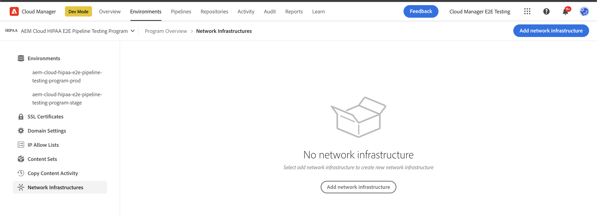

1. In the **Add network infrastructure** wizard, select **Flexible port egress**. 
1. From the **Region** drop-down menu, choose the desired region, then click **Continue**.

   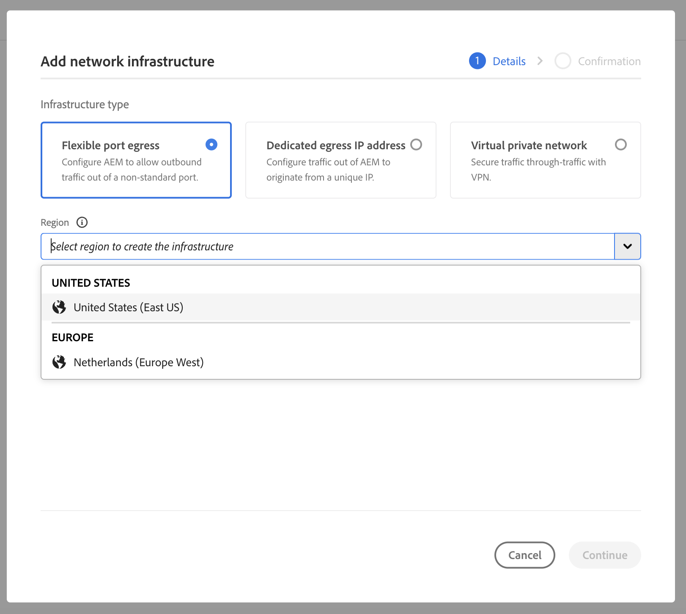

1. The **Confirmation** tab summarizes your selection and the next steps. Click **Save** to create the infrastructure.

   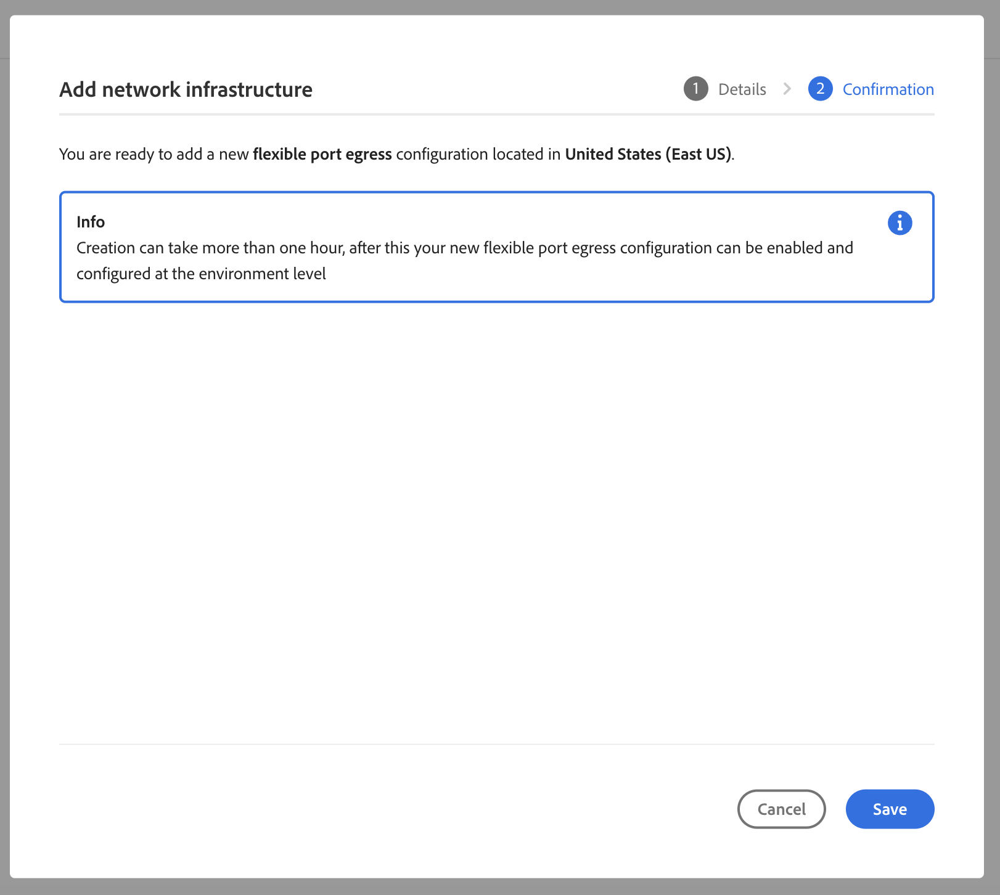

A new record appears below the **Network Infrastructure** heading in the side panel. It includes infrastructure type, status, region, and enabled environments.

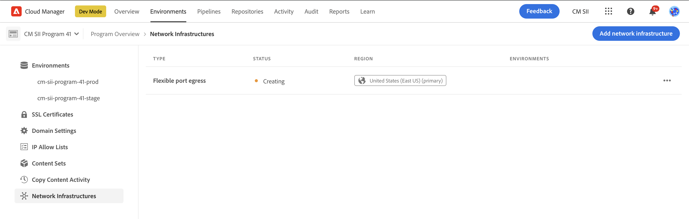

>[!NOTE]
>
>Creation of the infrastructure for flexible port egress can take up to an hour after which it can be configured at the environment level.

### Configure flexible port egress using API {#configuring-flexible-port-egress-provision-api}

Once per program, the POST `/program/<programId>/networkInfrastructures` endpoint is invoked, passing the value of `flexiblePortEgress` for the `kind` parameter and region. The endpoint responds with the `network_id`, and other information including the status.

Once called, it takes about 15 minutes for the networking infrastructure to be provisioned. A call to the Cloud Manager's [network infrastructure GET endpoint](https://developer.adobe.com/experience-cloud/cloud-manager/reference/api#operation/getNetworkInfrastructure) shows a status of **ready**.

>[!TIP]
>
>The full set of parameters, exact syntax, and important information like what parameters cannot be changed later, [can be referenced in the API documentation](https://developer.adobe.com/experience-cloud/cloud-manager/reference/api#operation/createNetworkInfrastructure).

### Traffic routing {#flexible-port-egress-traffic-routing}

For http or https traffic that goes to ports other than 80 or 443, configure a proxy using the following host and port environment variables:

* for HTTP: `AEM_PROXY_HOST`/ `AEM_HTTP_PROXY_PORT` (defaults to `proxy.tunnel:3128` in AEM releases < 6094)
* for HTTPS: `AEM_PROXY_HOST`/ `AEM_HTTPS_PROXY_PORT` (defaults to `proxy.tunnel:3128` in AEM releases < 6094)

For example, here's sample code to send a request to `www.example.com:8443`:

```java
String url = "www.example.com:8443"
String proxyHost = System.getenv().getOrDefault("AEM_PROXY_HOST", "proxy.tunnel");
int proxyPort = Integer.parseInt(System.getenv().getOrDefault("AEM_HTTPS_PROXY_PORT", "3128"));
HttpClient client = HttpClient.newBuilder()
      .proxy(ProxySelector.of(new InetSocketAddress(proxyHost, proxyPort)))
      .build();
 
HttpRequest request = HttpRequest.newBuilder().uri(URI.create(url)).build();
HttpResponse<String> response = client.send(request, BodyHandlers.ofString());
```

If using non-standard Java&trade; networking libraries, configure proxies using the properties above, for all traffic.

Non-HTTP/S traffic with destinations through ports declared in the `portForwards` parameter references a property called `AEM_PROXY_HOST`, along with the mapped port. For example:

```java
DriverManager.getConnection("jdbc:mysql://" + System.getenv("AEM_PROXY_HOST") + ":53306/test");
```

The table below describes traffic routing:

<table>
<thead>
  <tr>
    <th>Traffic</th>
    <th>Destination condition</th>
    <th>Port</th>
    <th>Connection</th>
    <th>External destination example</th>
  </tr>
</thead>
<tbody>
  <tr>
    <td><b>Http or https protocol</b></td>
    <td>Standard http/s traffic</td>
    <td>80 or 443</td>
    <td>Allowed</td>
    <td></td>
  </tr> 
  <tr>
    <td></td>
    <td>Non-standard traffic (on other ports outside 80 or 443) through http proxy configured using the following environment variable and proxy port number. Do not declare the destination port in the Cloud Manager API call's portForwards parameter:<br><ul>
     <li>AEM_PROXY_HOST (default to `proxy.tunnel` in AEM releases < 6094)</li>
     <li>AEM_HTTPS_PROXY_PORT (default to port 3128 in AEM releases < 6094)</li>
    </ul>
    <td>Ports outside 80 or 443</td>
    <td>Allowed</td>
    <td>example.com:8443</td>
  </tr>
  <tr>
    <td></td>
    <td>Non-standard traffic (on other ports outside of ports 80 or 443) not using http proxy</td>
    <td>Ports outside 80 or 443</td>
    <td>Blocked</td>
    <td></td>
  </tr>
  <tr>
    <td><b>Non-http or non-https</b></td>
    <td>Client connects to the <code>AEM_PROXY_HOST</code> environment variable using a <code>portOrig</code> declared in the <code>portForwards</code> API parameter.</td>
    <td>Any</td>
    <td>Allowed</td>
    <td><code>mysql.example.com:3306</code></td>
  </tr>
  <tr>
    <td></td>
    <td>Everything else</td>
    <td>Any</td>
    <td>Blocked</td>
    <td><code>db.example.com:5555</code></td>
  </tr>
</tbody>
</table>

#### Apache / Dispatcher configuration {#apache-dispatcher}

The AEM Cloud Service Apache / Dispatcher tier's `mod_proxy` directive can be configured using the properties described above.

```
ProxyRemote "http://example.com:8080" "http://${AEM_PROXY_HOST}:3128"
ProxyPass "/somepath" "http://example.com:8080"
ProxyPassReverse "/somepath" "http://example.com:8080"
```

```
SSLProxyEngine on //needed for https backends
 
ProxyRemote "https://example.com:8443" "http://${AEM_PROXY_HOST}:3128"
ProxyPass "/somepath" "https://example.com:8443"
ProxyPassReverse "/somepath" "https://example.com:8443"
```

## Dedicated egress IP address {#dedicated-egress-ip-address}

A dedicated IP address can enhance security when integrating with SaaS vendors (like a CRM vendor) or other integrations outside of AEM as a Cloud Service that offer an allowlist of IP addresses. By adding the dedicated IP address to the allowlist, it ensures that only traffic from the AEM Cloud Service is permitted to flow into the external service. This approach is in addition to traffic from any other IPs allowed.

The same dedicated IP is applied to all environments in a program, and applies to both Author and Publish services.

Without the dedicated IP address feature enabled, traffic from AEM as a Cloud Service flows through a shared set of IPs. Other customers of AEM as a Cloud Service use these IPs.

Configuring a dedicated egress IP address is similar to [flexible port egress](#flexible-port-egress). The main difference is that after configuration, traffic always egresses from a dedicated, unique IP. To find that IP, use a DNS resolver to identify the IP address associated with `p{PROGRAM_ID}.external.adobeaemcloud.com`. The IP address is not expected to change, but if it must change, advanced notification is provided.

>[!TIP]
>
>When deciding between flexible port egress and dedicated egress IP address, choose flexible port egress if a specific IP address is not required. The reason is that Adobe can optimize the performance of flexible port egress traffic.

>[!NOTE]
>
>If you were provisioned with a dedicated egress IP before 2021.09.30 (that is, before the September 2021 release), your dedicated egress IP feature only supports HTTP and HTTPS ports.
>
>This outcome includes HTTP/1.1, and HTTP/2 when encrypted. Also, one dedicated egress endpoint can talk to any target only over HTTP / HTTPS on ports 80/443 respectively.

>[!NOTE]
>
>Once created, dedicated egress IP address infrastructure types cannot be edited. The only way to change configuration values is to delete and recreate them.

### Configure dedicated egress IP address using UI {#configuring-dedicated-egress-provision-ui}

{{sign-in-to-cloud-manager}}

1. On the **My Programs** console, select the program.

1. From the **Program Overview** page, navigate to the **Environments** tab and select **Network Infrastructures** in the left panel.

   

1. In the **Add network infrastructure** wizard that opens, click **Dedicated egress IP address**. 
1. From the **Region** drop-down menu, choose the desired region, then click **Continue**.

   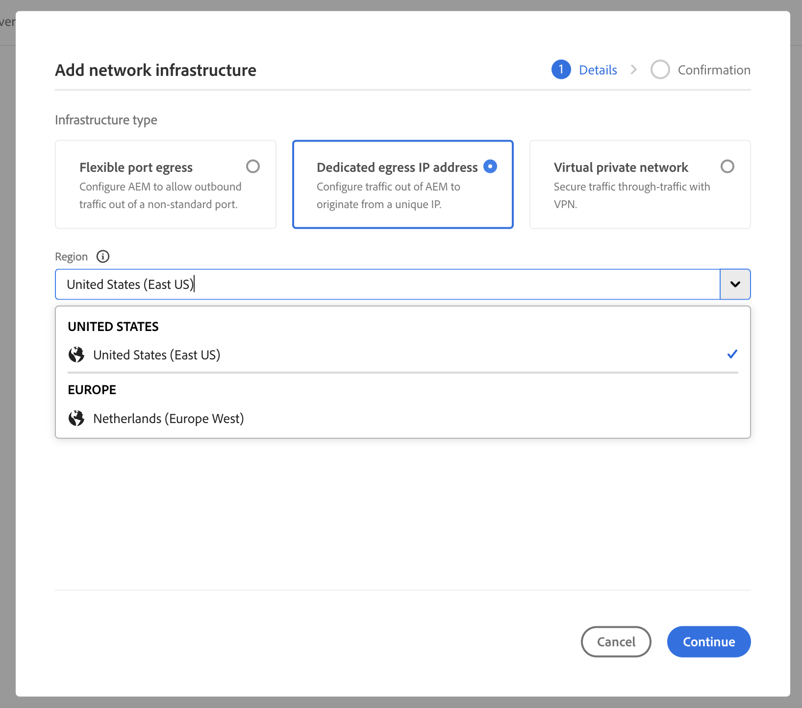

1. The **Confirmation** tab summarizes your selection and the next steps. Click **Save** to create the infrastructure.

   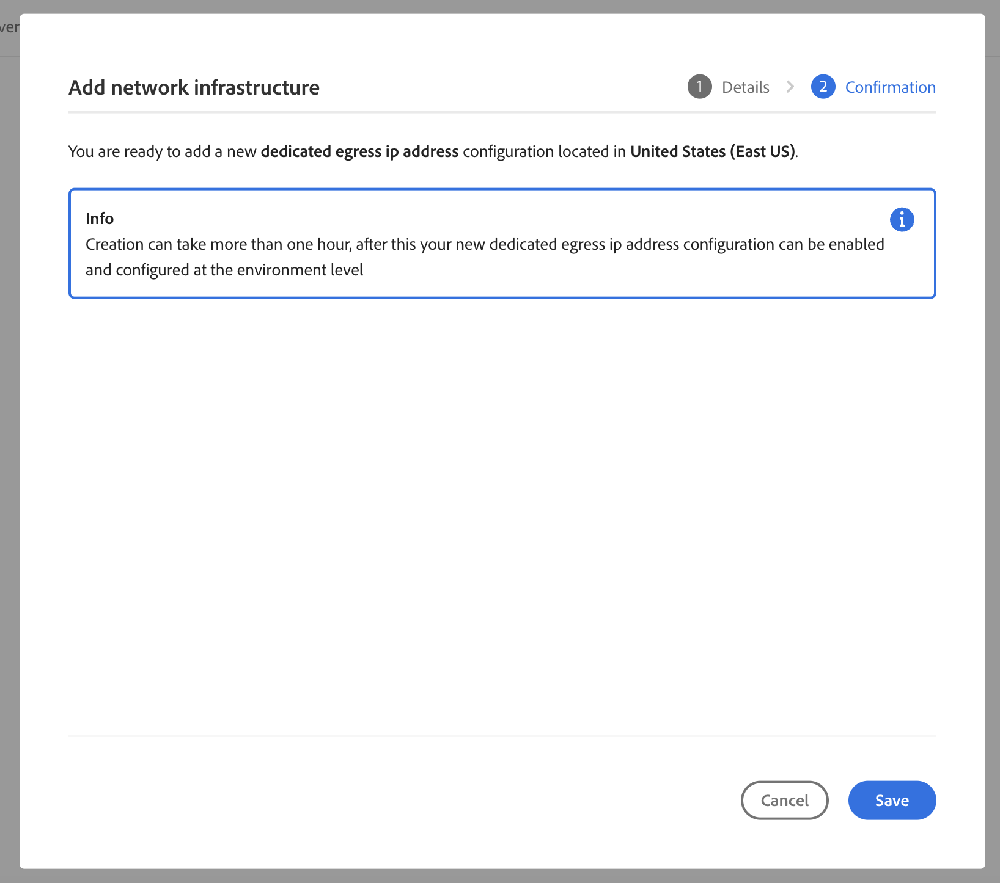

A new record appears below the **Network Infrastructures** heading in the side panel. It includes infrastructure type, status, region, and enabled environments.


>[!NOTE]
>
>Creation of the infrastructure for flexible port egress can take up to an hour after which it can be configured at the environment level.

### Configure dedicated egress IP address using API {#configuring-dedicated-egress-provision-api}

Once per program, the POST `/program/<programId>/networkInfrastructures` endpoint is invoked, passing the value of `dedicatedEgressIp` for the `kind` parameter and region. The endpoint responds with the `network_id`, and other information including the status.

Once called, it takes about 15 minutes for the networking infrastructure to be provisioned. A call to the Cloud Manager's [network infrastructure GET endpoint](https://developer.adobe.com/experience-cloud/cloud-manager/reference/api#operation/getNetworkInfrastructure) shows a status of **ready**.

>[!TIP]
>
>The full set of parameters, exact syntax, and important information like what parameters cannot be changed later, [can be referenced in the API documentation](https://developer.adobe.com/experience-cloud/cloud-manager/reference/api#operation/createNetworkInfrastructure).

### Traffic routing {#dedicated-egress-ip-traffic-routing}

HTTP or HTTPS traffic goes through a preconfigured proxy, provided they use standard Java&trade; system properties for proxy configurations.

Non-HTTP/S traffic with destinations through ports declared in the `portForwards` parameter references a property called `AEM_PROXY_HOST`, along with the mapped port. For example:

```java
DriverManager.getConnection("jdbc:mysql://" + System.getenv("AEM_PROXY_HOST") + ":53306/test");
```

<table>
<thead>
  <tr>
    <th>Traffic</th>
    <th>Destination condition</th>
    <th>Port</th>
    <th>Connection</th>
    <th>External destination example</th>
  </tr>
</thead>
<tbody>
  <tr>
    <td><b>Http or https protocol</b></td>
    <td>Traffic to Azure (*.windows.net) or Adobe services</td>
    <td>Any</td>
    <td>Through the shared cluster IPs (not the dedicated IP)</td>
    <td>adobe.io<br>api.windows.net</td>
  </tr>
  <tr>
    <td></td>
    <td>Host matching the <code>nonProxyHosts</code> parameter</td>
    <td>80 or 443</td>
    <td>Through the shared cluster IPs</td>
    <td></td>
  </tr>
  <tr>
    <td></td>
    <td>Host matching the <code>nonProxyHosts</code> parameter</td>
    <td>Ports outside 80 or 443</td>
    <td>Blocked</td>
    <td></td>
  </tr>
  <tr>
    <td></td>
    <td>Through http proxy configuration, configured by default for http/s traffic using the standard Java&trade; HTTP client library</td>
    <td>Any</td>
    <td>Through the dedicated egress IP</td>
    <td></td>
  </tr>
  <tr>
    <td></td>
    <td>Ignores http proxy configuration (for example, if explicitly removed from standard Java&trade; HTTP client library or if a Java&trade; library that ignores standard proxy configuration is used)</td>
    <td>80 or 443</td>
    <td>Through the shared cluster IPs</td>
    <td></td>
  </tr>
  <tr>
    <td></td>
    <td>Ignores http proxy configuration (for example, if explicitly removed from standard Java&trade; HTTP client library or if a Java&trade; library that ignores standard proxy configuration is used)</td>
    <td>Ports outside 80 or 443</td>
    <td>Blocked</td>
    <td></td>
  </tr>
  <tr>
    <td><b>Non-http or non-https</b></td>
    <td>The client connects to <code>AEM_PROXY_HOST</code> env variable using a <code>portOrig</code> declared in the <code>portForwards</code> API parameter</td>
    <td>Any</td>
    <td>Through the dedicated egress IP</td>
    <td><code>mysql.example.com:3306</code></td>
  </tr>
  <tr>
    <td></td>
    <td>Anything else</td>
    <td></td>
    <td>Blocked</td>
    <td></td>
  </tr>
</tbody>
</table>

### Feature usage {#feature-usage}

The feature is compatible with Java&trade; code or libraries that result in outbound traffic, provided they use standard Java&trade; system properties for proxy configurations. In practice, this approach should include most common libraries. 

Below is a code sample:

```java
public JSONObject getJsonObject(String relativePath, String queryString) throws IOException, JSONException {
  String relativeUri = queryString.isEmpty() ? relativePath : (relativePath + '?' + queryString);
  URL finalUrl = endpointUri.resolve(relativeUri).toURL();
  URLConnection connection = finalUrl.openConnection();
  connection.addRequestProperty("Accept", "application/json");
  connection.addRequestProperty("X-API-KEY", apiKey);

  try (InputStream responseStream = connection.getInputStream(); Reader responseReader = new BufferedReader(new InputStreamReader(responseStream, Charsets.UTF_8))) {
    return new JSONObject(new JSONTokener(responseReader));
  }
}
```

Some libraries require explicit configuration to use standard Java&trade; system properties for proxy configurations.

A code sample using Apache HttpClient that requires explicit calls to
[`HttpClientBuilder.useSystemProperties()`](https://hc.apache.org/httpcomponents-client-4.5.x/current/httpclient/apidocs/org/apache/http/impl/client/HttpClientBuilder.html) or 
[`HttpClients.createSystem()`](https://hc.apache.org/httpcomponents-client-4.5.x/current/httpclient/apidocs/org/apache/http/impl/client/HttpClients.html#createSystem()):

```java
public JSONObject getJsonObject(String relativePath, String queryString) throws IOException, JSONException {
  String relativeUri = queryString.isEmpty() ? relativePath : (relativePath + '?' + queryString);
  URL finalUrl = endpointUri.resolve(relativeUri).toURL();

  HttpClient httpClient = HttpClientBuilder.create().useSystemProperties().build();
  HttpGet request = new HttpGet(finalUrl.toURI());
  request.setHeader("Accept", "application/json");
  request.setHeader("X-API-KEY", apiKey);
  HttpResponse response = httpClient.execute(request);
  String result = EntityUtils.toString(response.getEntity());
}
```

### Debug considerations {#debugging-considerations}

To validate that traffic is indeed outgoing on the expected dedicated IP address, check logs in the destination service, if available. Otherwise, use a debugging service such as [https://ifconfig.me/ip](https://ifconfig.me/ip), which returns the calling IP address.

## Virtual Private Network (VPN) {#vpn}

A VPN allows connecting to an on-premise infrastructure or data center from the author, publish, or preview instances. This ability can be useful, for example, to secure access to a database. It also allows connecting to SaaS vendors such as a CRM vendor that supports VPN.

Most VPN devices with IPsec technology are supported. Consult the information in the **RouteBased configuration instructions** column in [this list of devices](https://learn.microsoft.com/en-us/azure/vpn-gateway/vpn-gateway-about-vpn-devices#devicetable). Configure the device as described in the table.

A VPN infrastructure supports multiple connections, so you can connect to more than one on-premise network or data center from the same infrastructure. Adobe recommends a maximum of 20 connections per infrastructure.

Each connection uses either static routing or BGP dynamic routing, and both types can coexist within the same infrastructure. With static routing, you define the address ranges to route through the connection. With BGP, those routes are learned dynamically. For more information, see [UI configuration](#configuring-vpn-ui).

To resolve private host names, DNS resolvers must be listed in the gateway address space.

### Configure VPN using UI {#configuring-vpn-ui}

Border Gateway Protocol (BGP) lets a VPN connection learn routes dynamically instead of relying on statically defined address ranges. When a connection uses BGP, you do not need to define its address space, because routes are exchanged automatically between your gateway and the Adobe gateway.

To use BGP, you provide an Adobe Gateway ASN at the infrastructure level, and a BGP ASN and BGP peering address for each BGP-enabled connection. You can optionally specify an Adobe APIPA address for the Adobe side of the peering. If you omit it, Adobe assigns one automatically.

When a route learned through BGP and a static route overlap for the same destination, the most specific route is selected (longest-prefix match).

**To configure VPN using UI:**

{{sign-in-to-cloud-manager}}

1. On the **My Programs** console, click a program. 

1. In the left panel, click **Network Infrastructures**.

   

1. Near the upper-right corner of the page, click **Add network infrastructure**.

1. In the **Add network infrastructure** dialog box, select **Virtual private network**.

   

1. In the **Connections** section, in the text field, type a **Connection name**, then click **Add Connection**.

1. In the **Add connection** dialog box, define your VPN connection.

    | Field | Description |
    | --- | --- |
    | Connection name | Required. A descriptive name of your VPN connection, which you provided in the previous step and can be updated here. |
    | Address | Required. The VPN device IP address. |
    | Address space | The IP address ranges to route through the VPN. *Required* for static connections. *Not required* when the connection uses BGP, that is, when **BGP ASN** and **BGP Peering Address** are set. Press `Enter` after adding a range to add another; click `X` to remove a range. |
    | BGP ASN | The Autonomous System Number on your side of the BGP peering. To enable BGP on the connection, provide this value together with BGP Peering Address. |
    | BGP Peering Address | The IP address used for BGP peering on your side of the connection. |
    | Adobe APIPA Address | The IP address for the Adobe side of the BGP peering. If you leave this field empty, Adobe assigns an address from the infrastructure-level address space. To retrieve an *auto-assigned* address, contact Adobe Support. |
    | Shared key | Required. Your VPN preshared key. Select **Show shared key** to reveal the key so you can double-check its value. |
    | IP Security policy | Required. Adjust from the default values as required. |

     

1. Click **Save**.

1. In the **Add network infrastructure** dialog box, provide the following necessary information.

    | Field | Description |
    | --- | --- |
    | Region | Required. The region in which the infrastructure should be created. |
    | Address Space | Required. The address space can only be one /26 CIDR (64 IP addresses) or larger IP range in your own space. This value cannot be changed later. |
    | DNS Information | Required. A list of remote DNS resolvers. Press `Enter` after inputting a DNS server address to add another. Click `X` after an address to remove it. |
    | Adobe Gateway ASN | Required. The Autonomous System Number of the Adobe-side VPN gateway. This value is required when any connection in the infrastructure uses BGP. The valid ranges are 64512 to 65514, or 65521 to 65534. The UI validates this value and blocks the update if it falls outside these ranges. |

1. Click **Add** to create the infrastructure.

A new record appears below the **Network Infrastructures** heading in the side panel. It includes infrastructure type, status, region, and enabled environments.

### Configure VPN using API {#configuring-vpn-api}

Once per program, the POST `/program/<programId>/networkInfrastructures` endpoint is invoked. It passes in a payload of configuration information. That information includes the value of **vpn** for the `kind` parameter, region, address space, and DNS resolvers. It also includes one or more VPN connections, each with its gateway configuration, shared VPN key, IP Security policy, and, optionally, BGP routing parameters. The endpoint responds with the `network_id` and other information including the status.

Once called, it typically takes from 45 to 60 minutes for the networking infrastructure to be provisioned. The GET method in the API can be called to return the status, which eventually changes from `creating` to `ready`. Consult the API documentation for all states.

>[!TIP]
>
>The full set of parameters, exact syntax, and important information like what parameters cannot be changed later, [can be referenced in the API documentation](https://developer.adobe.com/experience-cloud/cloud-manager/reference/api#operation/createNetworkInfrastructure).

### Traffic routing {#vpn-traffic-routing}

The table below describes traffic routing.

<table>
<thead>
  <tr>
    <th>Traffic</th>
    <th>Destination Condition</th>
    <th>Port</th>
    <th>Connection</th>
    <th>External destination example</th>
  </tr>
</thead>
<tbody>
  <tr>
    <td><b>Http or https protocol</b></td>
    <td>Traffic to Azure or Adobe services</td>
    <td>Any</td>
    <td>Through the shared cluster IPs (not the dedicated IP)</td>
    <td>adobe.io<br>api.windows.net</td>
  </tr>
  <tr>
    <td></td>
    <td>Host matching the <code>nonProxyHosts</code> parameter</td>
    <td>80 or 443</td>
    <td>Through the shared cluster IPs</td>
    <td></td>
  </tr>
  <tr>
    <td></td>
    <td>Host matching the <code>nonProxyHosts</code> parameter</td>
    <td>Ports outside 80 or 443</td>
    <td>Blocked</td>
    <td></td>
  </tr>
  <tr>
    <td></td>
    <td>If the IP falls in the <i>VPN gateway address</i> space range, and through http proxy configuration (configured by default for http/s traffic using the standard Java&trade; HTTP client library)</td>
    <td>Any</td>
    <td>Through the VPN</td>
    <td><code>10.0.0.1:443</code><br>It can be a hostname as well.</td>
  </tr>
  <tr>
    <td></td>
    <td>If the IP does not fall in the <i>VPN gateway address space</i> range, and through http proxy configuration (configured by default for http/s traffic using the standard Java&trade; HTTP client library)</td>
    <td>Any</td>
    <td>Through the dedicated egress IP</td>
    <td></td>
  </tr>
  <tr>
    <td></td>
    <td>Ignores http proxy configuration (for example, if explicitly removed from the standard Java&trade; HTTP client library or if using a Java&trade; library that ignores standard proxy configuration)
</td>
    <td>80 or 443</td>
    <td>Through the shared cluster IPs</td>
    <td></td>
  </tr>
  <tr>
    <td></td>
    <td>Ignores http proxy configuration (for example, if explicitly removed from the standard Java&trade; HTTP client library or if using a Java&trade; library that ignores standard proxy configuration)</td>
    <td>Ports outside 80 or 443</td>
    <td>Blocked</td>
    <td></td>
  </tr>
  <tr>
    <td><b>Non-http or non-https</b></td>
    <td>If the IP falls in the <i>VPN gateway address space</i> range and the client connects to <code>AEM_PROXY_HOST</code> env variable using a <code>portOrig</code> declared in the <code>portForwards</code> API parameter</td>
    <td>Any</td>
    <td>Through the VPN</td>
    <td><code>10.0.0.1:3306</code><br>It can be a hostname as well.</td>
  </tr>
  <tr>
    <td></td>
    <td>If the IP does not fall in the <i>VPN gateway address space</i> range and client connects to <code>AEM_PROXY_HOST</code> env variable using a <code>portOrig</code> declared in the <code>portForwards</code> API parameter</td>
    <td>Any</td>
    <td>Through the dedicated egress IP</td>
    <td></td>
  </tr>
  <tr>
    <td></td>
    <td>Anything else</td>
    <td>Any</td>
    <td>Blocked</td>
    <td></td>
  </tr>
</tbody>
</table>

### Useful domains for configuration {#vpn-useful-domains-for-configuration}

The diagram below provides a visual representation of a set of domains and associated IPs that are useful for configuration and development. The table further below the diagram describes those domains and IPs.


<table>
<thead>
  <tr>
    <th>Domain pattern</th>
    <th>Description</th>
  </tr>
</thead>
<tbody>
  <tr>
    <td><code>p{PROGRAM_ID}.external.adobeaemcloud.com</code></td>
    <td>Dedicated egress IP address for traffic going to the Internet rather than through private networks.</td>
  </tr>
  <tr>
    <td><code>p{PROGRAM_ID}.{REGION}-gateway.external.adobeaemcloud.com</code></td>
    <td>The IP of the VPN gateway on the AEM side. Your network engineering team can use this IP to allow only VPN connections to your VPN gateway from a specific IP address. </td>
  </tr>
</tbody>
</table>

## Enable advanced networking configurations on environments {#enabling}

Once you have configured an advanced networking option for a program, whether [flexible port egress](#flexible-port-egress), [dedicated egress IP address](#dedicated-egress-ip-address), or [VPN](#vpn), to use it, you must enable it at the environment level.

When you enable an advanced networking configuration for an environment, you can also enable optional port forwarding and non-proxy hosts. Parameters are configurable per environment to offer flexibility.

* **Port Forwarding** - Port forwarding rules should be declared for any destination ports other than 80/443, but only if not using the http or https protocol.
  * Port forwarding rules are defined by specifying the set of destination hosts (names or IP and ports). 
  * The client connection that uses port 80/443 over http / https must still use proxy settings in their connection to have the properties of advanced networking applied to the connection.
  * For each destination host, you must map the intended destination port to a port from 30000 through 30999.
  * Port forwarding rules are available for all advanced networking types.
 
* **Non-Proxy Hosts** - Non-proxy hosts let you declare a set of hosts that route through a shared IP address range rather than the dedicated IP.
  * This approach may be useful because traffic egressing through shared IP addresses may be further optimized.
  * Non-proxy hosts are only available for dedicated egress IP address and VPN advanced networking types.

>[!NOTE]
>
>You cannot enable an advanced networking configuration for an environment if the environment is in the **Updating** status.

### Enable using the UI {#enabling-ui}

{{sign-in-to-cloud-manager}}

1. On the **My Programs** console, select the program.

1. From the **Program Overview** page, navigate to the **Environments** tab and select the environment where you want to enable the advanced networking configuration under the **Environments** heading in the left panel. Then select the **Advanced network configuration** tab of the selected environment and click **Enable network infrastructure**.

   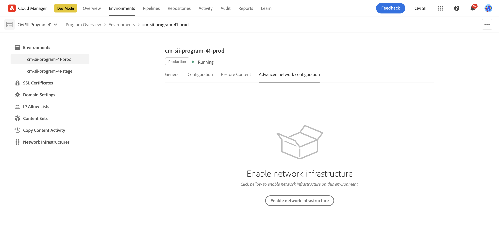

1. The **Configure advanced networking** dialog box opens.

1. On the **Non-proxy hosts** tab, for dedicated egress IP addresses and VPNs, you can optionally define a set of hosts. These defined hosts should be routed through a shared IP address range rather than the dedicated IP by providing the host name in the **Non-Proxy Host** field and clicking **Add**.

   * The host is added to the list of hosts on the tab.
   * Repeat this step if you want to add multiple hosts.
   * Click the X to the right of the row if you want to remove a host.
   * This tab is not available for flexible port egress configurations.

   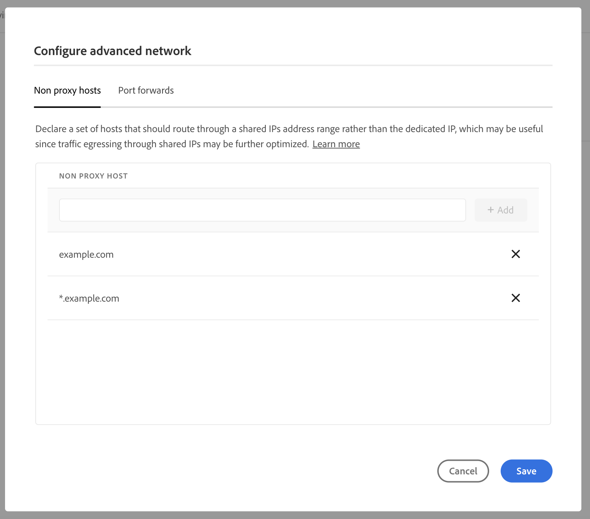

1. On the **Port forwards** tab, you can optionally define port forwarding rules for any destination ports other than 80/443 if not using HTTP or HTTPS. Provide a **Name**, **Port Orig**, and **Port Dest** and click **Add**.

   * The rule is added to the list of rules on the tab.
   * Repeat this step if you want to add multiple rules.
   * Click the X to the right of the row if you want to remove a rule.

   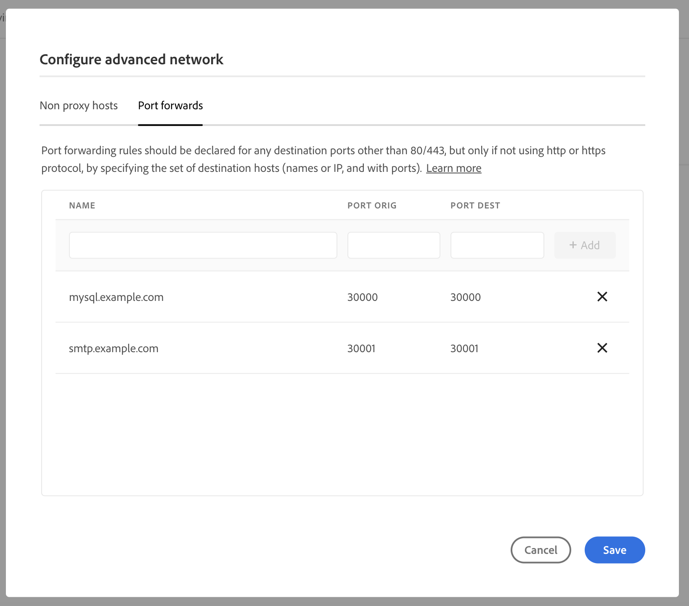

1. Click **Save** in the dialog box so you can apply the configuration to the environment.

The advanced networking configuration is applied to the selected environment. Back on the **Environments** tab, you can see the details of the configuration applied to the selected environment and its status.

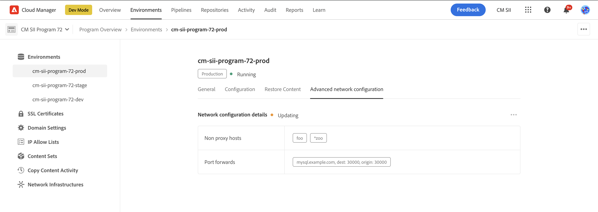

### Enable using the API {#enabling-api}

To enable an advanced networking configuration for an environment, the `PUT /program/<program_id>/environment/<environment_id>/advancedNetworking` endpoint must be invoked per environment.

The API responds in a few seconds, indicating a status of `updating`. After about 10 minutes, a call to the Cloud Manager's environment GET endpoint shows a status of `ready`, indicating that the update to the environment is applied.

Port forwarding rules per environment can be updated by invoking the `PUT /program/{programId}/environment/{environmentId}/advancedNetworking` endpoint and including the full set of configuration parameters, rather than a subset.

Dedicated egress IP address and VPN advanced networking types support a `nonProxyHosts` parameter. This support lets you declare a set of hosts that route through a shared IP address range rather than the dedicated IP. The `nonProxyHost` URLs follow the patterns of `example.com` or `*.example.com`, where the wildcard is only supported at the start of the domain.

Even if there are no environment traffic routing rules (hosts or bypasses), call `PUT /program/<program_id>/environment/<environment_id>/advancedNetworking` with an empty payload.

>[!TIP]
>
>The full set of parameters, exact syntax, and important information like what parameters cannot be changed later, [can be referenced in the API documentation](https://developer.adobe.com/experience-cloud/cloud-manager/reference/api#operation/createNetworkInfrastructure).

## Edit and delete Advanced Networking Configurations on Environments {#editing-deleting-environments}

After [enabling advanced networking configurations for environments](#enabling), you can update the details of those configurations or delete them.

>[!NOTE]
>
>You cannot edit network infrastructure if it has the status **Creating**, **Updating**, or **Deleting**.

### Edit or delete using the UI {#editing-ui}

{{sign-in-to-cloud-manager}}

1. On the **My Programs** console, select the program.

1. From the **Program Overview** page, navigate to the **Environments** tab and select the environment where you want to enable the advanced networking configuration under the **Environments** heading in the left panel. Then select the **Advanced network configuration** tab of the selected environment and click the ellipsis button.

   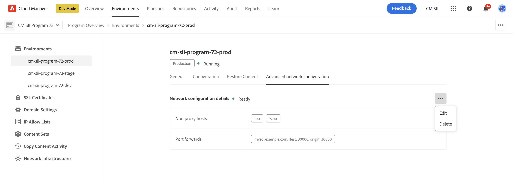

1. In the ellipsis menu, select either **Edit** or **Delete**.

   * If you choose **Edit**, update the information per the steps described in the previous section, [Enable using the UI](#enabling-ui), and click **Save**.
   * If you choose **Delete**, confirm the deletion in the **Delete network configuration** dialog box with **Delete** or abort with **Cancel**.

The changes are reflected on the **Environments** tab.

### Edit or delete using the API {#editing-api}

To delete advanced networking for a particular environment, invoke `DELETE [/program/{programId}/environment/{environmentId}/advancedNetworking]()`.

>[!TIP]
>
>The full set of parameters, exact syntax, and important information like what parameters cannot be changed later, [can be referenced in the API documentation](https://developer.adobe.com/experience-cloud/cloud-manager/reference/api#operation/createNetworkInfrastructure).

## Edit and delete a program's network infrastructures {#editing-deleting-program}

Once network infrastructure is created for a program, only limited properties can be edited. If you no longer require it, you can delete the advanced networking infrastructure for your entire program.

>[!NOTE]
>
>The following are limitations to editing and deleting network infrastructure:
>
>* Delete only deletes the infrastructure if all environments have their advanced networking disabled. 
>* You cannot edit network infrastructure if it has the status **Creating**, **Updating**, or **Deleting**.
>* Only the VPN advanced networking infrastructure type can be edited once created and then only limited fields.
>* For security reasons, the **Shared key** must always be provided when editing an advanced VPN networking infrastructure, even if you are not editing the key itself.

### Edit, test, or delete with the UI {#delete-ui}

{{sign-in-to-cloud-manager}}

1. On the **My Programs** console, select the program.

1. From the **Program Overview** page, navigate to the **Environments** tab.
1. In the left panel, click **Network Infrastructures**.
1. Click  next to the infrastructure that you want to edit, test, or delete.

   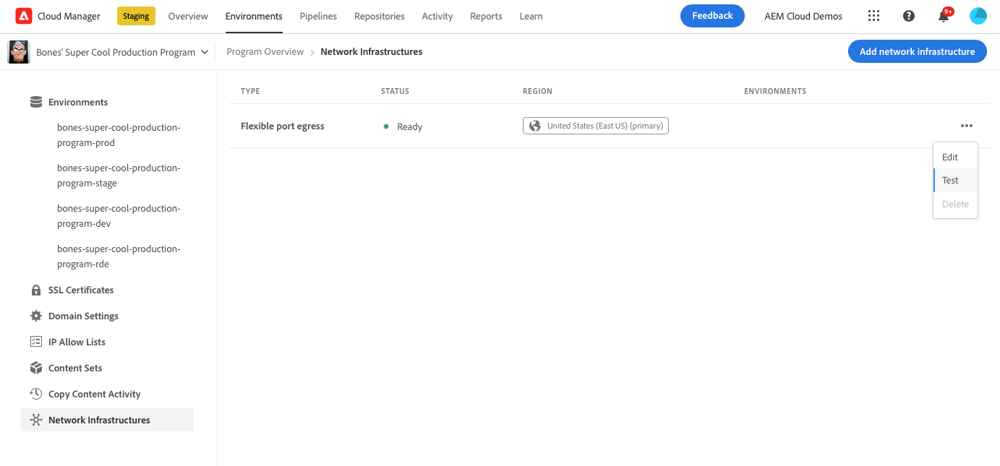

1. Click **Edit**, **Test**, or **Delete**.

1. Do one of the following:

    * If you chose **Edit**, the **Edit network infrastructure** wizard opens. Edit as required following the steps as described when creating the infrastructure.

    * If you chose **Test** to self-test your connections before enabling it on the environment level, in the **Recent Tests** drop-down menu, select an entry to reload its configuration, then click **Test**. If no tests have been run, the menu displays *No recent tests*. 
    
      Alternatively, in the **Host** text field, enter the required target hostname. Then, in the **Port** drop-down menu, select the required appropriate port. Click **Test**. The results appear in the **Testing results** section of the dialog box.

    * If you chose **Delete**, confirm the deletion in the **Delete network configuration** dialog box with **Delete** or abort with **Cancel**.

The changes are reflected on the **Environments** tab.

### Edit and delete with the API {#delete-api}

To **delete** the network infrastructure for a program, invoke `DELETE /program/{program ID}/networkinfrastructure/{networkinfrastructureID}`. 

## Change a program's advanced networking infrastructure type {#changing-program}

It is only possible to have one type of advanced networking infrastructure configured for a program at a time. The advanced networking infrastructure must be either flexible port egress, dedicated egress IP address, or VPN.

If you decide that you need an advanced networking infrastructure type other than the one you have already configured, delete the existing one, and create another one. Do the following:

1. [Delete advanced networking in all environments](#editing-deleting-environments).
1. [Delete the advanced networking infrastructure](#editing-deleting-program).
1. Create the advanced networking infrastructure type you now require, either [flexible port egress](#flexible-port-egress), [dedicated egress IP address](#dedicated-egress-ip-address), or [VPN](#vpn).
1. [Reenable advanced networking at the environment level](#enabling).

>[!WARNING]
>
> This procedure results in a downtime of advanced networking services between deletion and recreation.
> If downtime causes significant business impact, contact customer support for assistance, describing what has already been created and the reason for the change.

## Advanced networking configuration for other publish regions {#advanced-networking-configuration-for-additional-publish-regions}

When an additional region is added to an environment with advanced networking already configured, traffic from the additional publish region follows the existing rules. By default, matching traffic is routed through the primary region. However, if the primary region becomes unavailable, the advanced networking traffic is dropped if advanced networking hasn't been enabled in the additional region. If you want to optimize latency and increase availability in case one of the regions undergoes an outage, it is necessary to enable advanced networking for the additional publish regions. Two different scenarios are described in the following sections.

>[!NOTE]
>
>All regions share [environment advanced networking configuration](https://developer.adobe.com/experience-cloud/cloud-manager/reference/api#tag/Environment-Advanced-Networking-Configuration), so it is not possible to route traffic to different destinations based on the region the traffic is egressing out of. 

### Dedicated egress IP addresses {#additional-publish-regions-dedicated-egress}

#### Advanced networking already enabled in the primary region {#already-enabled}

If an advanced networking configuration is already enabled in the primary region, follow these steps:

1. If you locked down your infrastructure such that the dedicated AEM IP address is allowlisted, temporarily disable any deny rules in that infrastructure. If you skip this step, your infrastructure temporarily denies requests from the new region's IP addresses. This step is not necessary if you have locked down your infrastructure using a Fully Qualified Domain Name (FQDN), such as `p1234.external.adobeaemcloud.com`. All AEM regions egress advanced networking traffic from the same FQDN.
1. Create the program-scoped networking infrastructure for the secondary region through a POST call to the Cloud Manager Create Network Infrastructure API, as described in advanced networking documentation. The only difference in the payload's JSON configuration relative to the primary region is the region property.
1. If you need to lock down your infrastructure by IP to allow AEM traffic, add the IP addresses that correspond to `p1234.external.adobeaemcloud.com`. There is one per region. 

#### Advanced networking not yet configured in any region {#not-yet-configured}

The procedure is mostly similar to the previous instructions. However, if the production environment has not yet been enabled for advanced networking, there is an opportunity to test the configuration by first enabling it in a staging environment:

1. Create networking infrastructure for all regions through a POST call to the [Cloud Manager Create Network Infrastructure API](https://developer.adobe.com/experience-cloud/cloud-manager/reference/api#tag/Network-infrastructure/operation/createNetworkInfrastructure). The only difference in the payload's JSON configuration relative to the primary region is the region property.
1. For the staging environment, enable and configure the environment scoped advanced networking by running `PUT api/program/{programId}/environment/{environmentId}/advancedNetworking`. For more information, see [the API documentation](https://developer.adobe.com/experience-cloud/cloud-manager/reference/api#tag/Environment-Advanced-Networking-Configuration/operation/enableEnvironmentAdvancedNetworkingConfiguration)
1. If necessary, lock down external infrastructure, preferably by FQDN (for example, `p1234.external.adobeaemcloud.com`). You can otherwise do it by IP address
1. If the staging environment works as expected, enable and configure the environment-scoped advanced networking configuration for production. 

#### VPN {#vpn-regions}

The procedure is nearly identical to the dedicated egress IP addresses instructions. The only difference is that the region property is configured differently from the primary region. Additionally, you can optionally configure the `connections.gateway` field. The configuration can route to a different VPN endpoint operated by your organization, geographically closer to the new region.

## Troubleshoot

The following points are provided as informative guidelines and encompass best practices for troubleshooting. These recommendations are intended to assist in effectively diagnosing and resolving issues.

### Connection pooling {#connection-pooling-advanced-networking}

Connection pooling is a technique designed to manage a collection of connections. These connections are available for immediate use by any thread that requires them. Various connection pooling techniques are available, each with its unique merits and considerations. Adobe recommends that customers investigate these methodologies to identify the one most compatible with their system's architecture.

Implementing an appropriate connection pooling strategy is a measure to address a common issue in system configuration, which often leads to reduced performance. By correctly establishing a connection pool, Adobe Experience Manager (AEM) can improve the efficiency of external calls. This approach reduces resource consumption, mitigates the risk of service disruptions, and decreases the probability of failed requests when communicating with external servers.

Based on this information, Adobe recommends reviewing your current AEM configuration. Also consider intentionally using connection pooling alongside your advanced networking settings. Managing the number of parallel connections and reducing stale connections helps optimize network performance. These actions lower the risk of proxy servers reaching their connection limits. Consequently, this strategic implementation is designed to decrease the likelihood of requests failing to reach external endpoints.

#### Connection limits FAQ

When using advanced networking, the number of connections is limited to ensure stability across environments and to prevent lower environments from exhausting the available connections.

The connections are limited to 1000 per AEM instance and alerts are sent to customers when the number reaches 750.

##### Is the connection limit applied only to outbound traffic out of non-standard ports or to all outbound traffic?

The limit is only for connections using advanced networking (egress on non-standard ports, using dedicated egress IP, or VPN).

##### There doesn't appear to be a significant increase in the number of outgoing connections. Why is the notification being received now?

If the customer creates connections dynamically (for example, one or more for each request), an increase in traffic can cause the connections to spike.

##### Did a similar situation occur in the past without triggering an alert?

Alerts are only sent when the soft limit is reached.

##### What happens if the maximum limit is reached?

When the hard limit is reached, new egress connections from AEM through advanced networking (egress on non-standard ports, using dedicated egress IP, or VPN) are dropped to protect against a DoS attack.

##### Can the limit be raised?

No, having a large number of connections can cause a significant performance impact and a DoS across pods and environments.

##### Are the connections automatically closed by the AEM system after a certain period?

Yes, connections close at the JVM level and within the networking infrastructure. However, this workflow is too late for any production service. Connections should be explicitly closed when no longer needed or returned to the pool when using connection pooling. Otherwise, the resource consumption is too high and can cause exhaustion of resources.

##### If the maximum connection limit is reached, does it affect any licenses and result in extra costs?

No, there is no license or cost associated with this limit. It is a technical limit.

##### How close is the current usage to the limit? What is the maximum allowed limit?

The alert is triggered when connections exceed 750. The maximum limit is 1000 connections per AEM instance.

##### Is this limit applicable to VPNs?

Yes, the limit applies to connections using advanced networking, including VPNs.

##### Does the limit still apply when using a dedicated egress IP?

Yes, the limit is still applicable if using a dedicated egress IP. 
