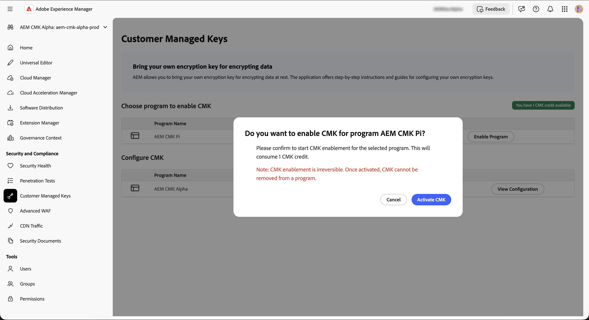
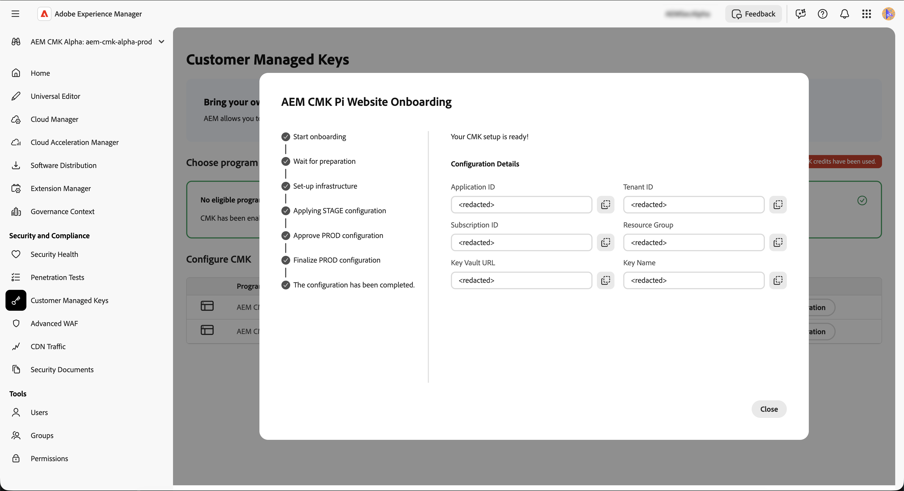

# Customer Managed Keys setup for AEM as a Cloud Service {#customer-managed-keys-for-aem-as-a-cloud-service}

AEM as a Cloud Service currently stores customer data in Azure Blob Storage and MongoDB, utilizing provider-managed encryption keys by default to secure data. While this setup meets the security needs of many organizations, businesses in regulated industries or those requiring enhanced data security seek greater control over their encryption practices. For organizations that prioritize data security, compliance, and the ability to manage their encryption keys, the Customer-Managed Keys (CMK) solution offers a critical enhancement.

>[!NOTE]
>
>Before configuring your Azure Key Vault, you must first enable CMK for your Cloud Service program in Cloud Manager. CMK is enabled on the **Security** tab during production program creation or when editing an existing program.
>
>See [Create production programs](/help/implementing/cloud-manager/getting-access-to-aem-in-cloud/creating-production-programs.md) or [Edit Programs](/help/implementing/cloud-manager/getting-access-to-aem-in-cloud/editing-programs.md).


## Purpose of this solution {#the-problem-being-solved}

Provider-managed keys can create difficulties for businesses that require additional privacy and integrity. Without control over key management, organizations face challenges in meeting compliance requirements, implementing custom security policies, and ensuring complete data security.

The introduction of Customer-Managed Keys (CMK) addresses these concerns by empowering AEM customers with full control over their encryption keys. By authenticating via Microsoft Entra ID (formerly Azure Active Directory), AEM CS securely connects to the customer's Azure Key Vault, allowing them to manage the lifecycle of their encryption keys—including key creation, rotation, and revocation.

CMK provides several advantages:

* **Manage Data and Application Encryption:** Increase security with direct governance of your AEM application and data cryptographic keys.
* **Improve Confidentiality and Integrity:** Reduce the likelihood of inadvertent access and disclosure of sensitive or proprietary data with complete encryption management.
* **Azure Key Vault Support:** Use of Azure Key Vault allows for key storage, processing secret operations, and performing key rotations.

By adopting CMK, customers can increase control over their data security and encryption practices, enhancing security and mitigating risks, while maintaining the scalability and flexibility of AEM CS.

AEM as a Cloud Service lets you use your own encryption keys for encrypting data at rest. This guide provides steps for setting up a customer-managed key (CMK) in Azure Key Vault for AEM as a Cloud Service.

>[!WARNING]
>
>After setting up CMK, you cannot revert to system-managed keys. You are responsible for securely managing your keys and providing access to your Key Vault, Key, and CMK app within Azure to prevent losing access to your data.

This guide provides the following steps for creating and configuring the required infrastructure:

1. Set up your environment
1. Obtain an application ID from Adobe
1. Create a new resource group
1. Create a key vault
1. Grant Adobe access to the key vault
1. Create an encryption key

You need to share the key vault URL, the encryption key name, and information about the key vault with Adobe.

## Set up your environment {#setup-your-environment}

The Azure Command Line Interface (CLI) is the only requirement for this guide. If you do not already have the Azure CLI installed, follow the official installation instructions [here](https://learn.microsoft.com/en-us/cli/azure/install-azure-cli?view=azure-cli-latest).

Before continuing with the rest of this guide, log in to your CLI with `az login`.

>[!NOTE]
>
>While this guide uses the Azure CLI, it is possible to perform the same operations via the Azure console. If you prefer to use the Azure console, use the commands below as a reference.


## Start the CMK configuration process for AEM as a Cloud Service {#request-cmk-for-aem-as-a-cloud-service}

You need to request the Customer Managed Keys (CMK) configuration for your AEM as a Cloud Service environment via the UI. To do this, navigate to the AEM Home Security UI, under the **Customer Managed Keys** section. 
The page will list all programs which support CMK. You can then start the onboarding process by clicking on the Enable Program button.



If CMK has been enabled within CLoud manager while creating / editing a program, click on the Start Onboarding button.


## Obtain an Application ID from Adobe {#obtain-an-application-id-from-adobe}

After starting the onboarding process, Adobe provides an Entra application ID. This application ID is necessary for the rest of the guide and creates a service principal that allows Adobe to access your key vault. If you do not already have an application ID, wait until Adobe provides it.


After the request is completed, you see the application ID in the CMK UI.


## Create a new resource group {#create-a-new-resource-group}

Create a new resource group in a location of your choice.

```powershell
# Choose a location and a name for the resource group.
$location="<AZURE LOCATION>"
$resourceGroup="<RESOURCE GROUP>"

# Create the resource group.
az group create --location $location --resource-group $resourceGroup
```

If you already have a resource group, use it instead. In the rest of this guide, the location of the resource group and its name are identified with `$location` and `$resourceGroup`, respectively.

## Create a key vault {#create-a-key-vault}

Create a key vault to contain your encryption key. The key vault must have purge protection enabled. Purge protection is necessary for encrypting data at rest from other Azure services. Public network access must be enabled to ensure that the Adobe services can access the key vault.

>[!IMPORTANT]
>Disabling Public Network Access for the Key Vault requires executing operations like key creation or rotation from an environment with network access to the Key Vault. For example, a VM that can access the Key Vault.

```powershell
# Reuse this information from the previous step.
$location="<AZURE LOCATION>"
$resourceGroup="<RESOURCE GROUP>"

# Choose a name for the key vault.
$keyVaultName="<KEY VAULT NAME>"

# Create the key vault.
az keyvault create `
  --location $location `
  --resource-group $resourceGroup `
  --name $keyVaultName `
  --default-action=Allow `
  --enable-purge-protection `
  --enable-rbac-authorization `
  --public-network-access Enabled
```

## Grant Adobe access to the key vault {#grant-adobe-access-to-the-key-vault}

In this step, you allow Adobe to access your key vault through an Entra application. Adobe should have already provided the ID of the Entra application.

First, you must create a service principal attached to the Entra application and assign it the **Key Vault Reader** and **Key Vault Crypto User** roles. The roles are limited to the key vault created in this guide.

```powershell
# Reuse this information from the previous steps.
$resourceGroup="<RESOURCE GROUP>"
$keyVaultName="<KEY VAULT NAME>"

# The application ID is provided by Adobe.
$appId="<APPLICATION ID>"

# Retrieve the ID of the key vault.
$keyVaultId=(az keyvault show --resource-group $resourceGroup --name $keyVaultName --query id --output tsv)

# Create a new service principal.
$servicePrincipalId=(az ad sp create --id $appId --query id --out tsv)

# Assign the roles to the service principal.
az role assignment create --assignee $servicePrincipalId --role "Key Vault Reader" --scope $keyVaultId
az role assignment create --assignee $servicePrincipalId --role "Key Vault Crypto User" --scope $keyVaultId
```

## Create an encryption key {#create-an-encryption-key}

Finally, you can create an encryption key in your key vault. You need the **Key Vault Crypto Officer** role to complete this step. To have this role granted to you, contact your system administrator if the logged-in user does not have this role. Alternatively, ask a person who already has that role to complete this step for you. 

Network access to the key vault is required to create the encryption key. First verify that you can access the key vault and proceed with creating the key:

```powershell
# Reuse this information from the previous steps.
$keyVaultName="<KEY VAULT NAME>"

# Choose a name for your key.
$keyName="<KEY NAME>"

# Create the key.
az keyvault key create --vault-name $keyVaultName --name $keyName
```

## Share the key vault information {#share-the-key-vault-information}

At this point, the configuration is complete. Share the required information through the CMK UI, which starts the environment configuration process.

```powershell
# Reuse this information from the previous steps.
$resourceGroup="<RESOURCE GROUP>"
$keyVaultName="<KEY VAULT NAME>"

# Retrieve the URL of your key vault.
$keyVaultUri=(az keyvault show --name $keyVaultName `
    --resource-group $resourceGroup `
    --query properties.vaultUri `
    --output tsv)

# In addition we would need the tenantId and the subscriptionId in order to setup the connection.
$tenantId=(az keyvault show --name $keyVaultName `
    --resource-group $resourceGroup `
    --query properties.tenantId `
    --output tsv)
$subscriptionId="<Subscription ID>"
```

Provide this information in the CMK UI:


## Implications of revoking key access {#implications-of-revoking-key-access}

Revoking or disabling access to the Key Vault, key, or CMK app can result in significant operational disruptions to your AEM as a Cloud Service environment. Once these keys are disabled, data in AEM as a Cloud Service becomes inaccessible, and any downstream operations that rely on this data cease to function. It is crucial to understand the potential impacts before making any changes to your key configurations.

If you decide to revoke AEM as a Cloud Service access to your data, you can do so by removing the user role associated with the application from the Key Vault within Azure.

## Stage CMK Setup {#stage-cmk-setup}

After you provide the required information in the CMK UI, Adobe starts the configuration process for your AEM as a Cloud Service Stage environment. This process requires time, and you are notified once it is completed.


## Prod CMK Setup {#prod-cmk-setup}

Once Stage setup is completed, you should do a thorough end-2-end validation. If everything is working fine, you need to confirm that the production environment can be configured accordingly.


After you confirmation in the CMK UI, Adobe starts the configuration process for your AEM as a Cloud Service Prod environment. This process requires time, and you are notified once it is completed.


## Complete the CMK setup {#complete-the-cmk-setup}

Once the configuration process is completed, you can see the status of your CMK setup in the UI. You can also see the key vault and the encryption key.


## Questions and support {#questions-and-support}

Contact Adobe if you have any questions, inquiries, or need assistance with the Customer Managed Keys setup for AEM as a Cloud Service. Adobe Support addresses any questions you have.
