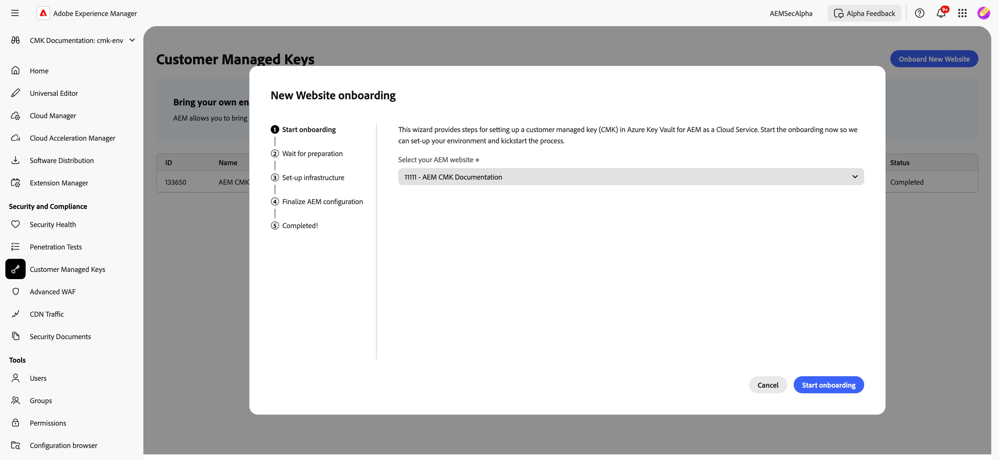
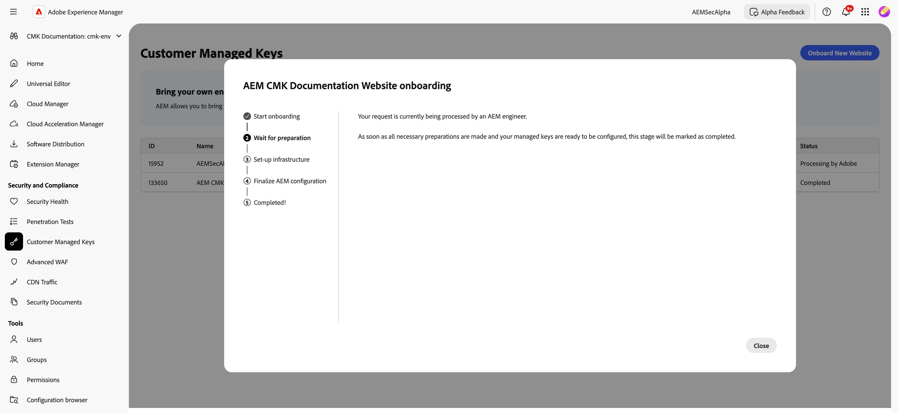
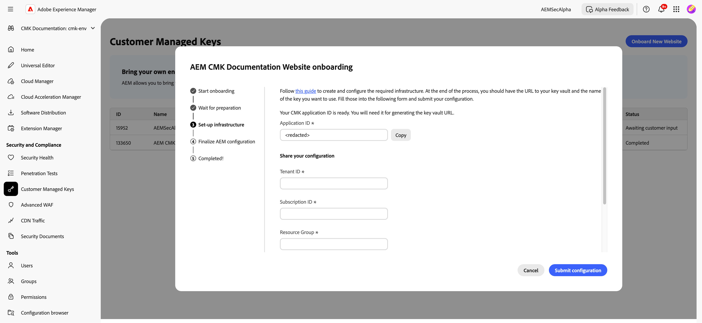
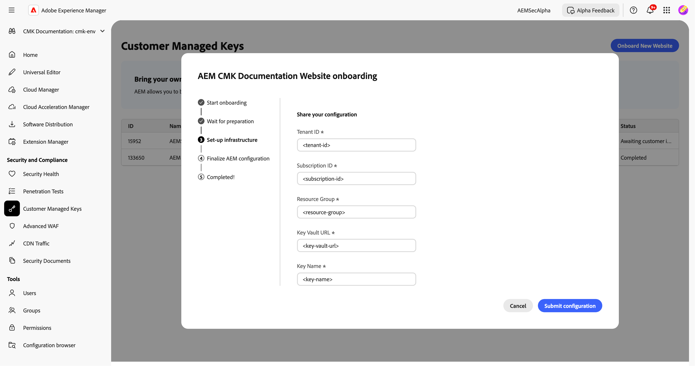

# Customer Managed Keys Setup for AEM as a Cloud Service {#customer-managed-keys-for-aem-as-a-cloud-service}

AEM as a Cloud Service currently stores customer data in Azure Blob Storage and MongoDB, utilizing provider-managed encryption keys by default to secure data. While this setup meets the security needs of many organizations, businesses in regulated industries or those requiring enhanced data security may seek greater control over their encryption practices. For organizations that prioritize data security, compliance, and the ability to manage their encryption keys, the Customer-Managed Keys (CMK) solution offers a critical enhancement.

## The Problem Being Solved {#the-problem-being-solved}

Provider managed keys can create concerns for businesses that require additional privacy and integrity. Without control over key management, organizations face challenges in meeting compliance requirements, implementing custom security policies, and ensuring complete data security.

The introduction of Customer-Managed Keys (CMK) addresses these concerns by empowering AEM customers with full control over their encryption keys. By authenticating via Microsoft Entra ID (formerly Azure Active Directory), AEM CS securely connects to the customer's Azure Key Vault, allowing them to manage the lifecycle of their encryption keys—covering key creation, rotation, and revocation.

CMK provides several advantages:

* **Control Data and Application Encryption:** Heighten security with direct governance of your AEM application and data cryptographic keys.
* **Raise Confidentiality and Integrity:** Reduce the likelihood of inadvertent access and disclosure of sensitive or proprietary data with complete encryption management.
* **Azure Key Vault Support:** Use of Azure Key Vault allows for key storage, processing secrets operations, and performing key rotations.

By adopting CMK, customers can increase control over their data security and encryption practices, enhancing security and mitigating risks, all while continuing to enjoy the scalability and flexibility of AEM CS.

AEM as a Cloud Service allows you to bring your own encryption keys for encrypting data at rest. This guide provides steps for setting up a customer managed key (CMK) in Azure Key Vault for AEM as a Cloud Service.

>[!WARNING]
>
>After setting up CMK, you cannot revert to system-managed keys. You are responsible for securely managing your keys and providing access to your Key Vault, Key, and CMK app within Azure to prevent losing access to your data.

You will also be guided through the following steps for creating and configuring the required infrastructure:

1. Set up your environment
1. Obtain an application ID from Adobe
1. Create a new resource group
1. Create a key vault
1. Grant Adobe access to the key vault
1. Create an encryption key

You will need to share the key vault URL, the encryption key name and information about the key vault with Adobe.

## Setup your Environment {#setup-your-environment}

The Azure Command Line Interface (CLI) is the only requirement for this guide. If you do not already have the Azure CLI installed, follow the official installation instructions [here](https://learn.microsoft.com/en-us/cli/azure/install-azure-cli).

Before proceeding with the rest of this guide, please login your CLI with `az login`.

>[!NOTE]
>
>While this guide uses the Azure CLI, it is possible to perform the same operations via the Azure console. If you prefer to use the Azure console, use the commands below as a reference.


## Start the CMK configuration process for AEM as a Cloud Service {#request-cmk-for-aem-as-a-cloud-service}

You need to request the Customer Managed Keys (CMK) configuration for your AEM as a Cloud Service environment via the UI. To do this, navigate to the AEM Home Security UI, under the **Customer Managed Keys** section. 
Then you can start the onboarding process by clicking on the **Start onboarding** button.




## Obtain an Application ID from Adobe {#obtain-an-application-id-from-adobe}

After starting the onboarding process, an Entra application ID will be provided by Adobe. This application ID is necessary for the rest of the guide and will be used to create a service principal that allows Adobe to access your key vault. If you don't already have an application ID, you need to wait until it is provided by Adobe.



After the request is completed, you will be able to see the application ID in the CMK UI.



## Create a New Resource Group {#create-a-new-resource-group}
Create a new resource group in a location of your choice.

```powershell
# Choose a location and a name for the resource group.
$location="<AZURE LOCATION>"
$resourceGroup="<RESOURCE GROUP>"

# Create the resource group.
az group create --location $location --resource-group $resourceGroup
```

If you already have a resource group, feel free to use it instead. In the rest of this guide, the location of the resource group and its name are identified with `$location` and `$resourceGroup`, respectively.

## Create a Key Vault {#create-a-key-vault}

You will need to create a key vault to contain your encryption key. The key vault must have purge protection enabled. Purge protection is necessary for encrypting data at rest from other Azure services. Public network access must be enabled, too, to ensure that the Adobe tenant can access the key vault.

>[!IMPORTANT]
>The creation of the Key Vault with Public Network Access disabled enforces that all Key Vault related operations, such as Key Creation or Rotation have to be executed from an environment that has network access to the KeyVault - for example, a VM that can access the KeyVault.

```powershell
# Reuse this information from the previous step.
$location="<AZURE LOCATION>"
$resourceGroup="<RESOURCE GROUP>"

# Choose a name for the key vault.
$keyVaultName="<KEY VAULT NAME>"

# Create the key vault.
az keyvault create `
  --location $location `
  --resource-group $resourceGroup `
  --name $keyVaultName `
  --default-action=Allow `
  --enable-purge-protection `
  --enable-rbac-authorization `
  --public-network-access Enabled
```

## Grant Adobe Access to the Key Vault {#grant-adobe-access-to-the-key-vault}

In this step you will allow Adobe to access your key vault via an Entra application. The ID of the Entra application should have been already provided by Adobe.

First, you must create a service principal attached to the Entra application and assign to it the **Key Vault Reader** and **Key Vault Crypto User** roles. The roles are limited to the key vault created in this guide.

```powershell
# Reuse this information from the previous steps.
$resourceGroup="<RESOURCE GROUP>"
$keyVaultName="<KEY VAULT NAME>"

# The application ID is provided by Adobe.
$appId="<APPLICATION ID>"

# Retrieve the ID of the key vault.
$keyVaultId=(az keyvault show --resource-group $resourceGroup --name $keyVaultName --query id --output tsv)

# Create a new service principal.
$servicePrincipalId=(az ad sp create --id $appId --query id --out tsv)

# Assign the roles to the service principal.
az role assignment create --assignee $servicePrincipalId --role "Key Vault Reader" --scope $keyVaultId
az role assignment create --assignee $servicePrincipalId --role "Key Vault Crypto User" --scope $keyVaultId
```

## Create an Encryption Key {#create-an-encryption-key}

Finally, you can create an encryption key in your key vault. Please note that you will need the **Key Vault Crypto Officer** role to complete this step. If the logged in user does not have this role, contact your system administrator to have this role granted to you or ask someone who already has that role to complete this step for you. 

Network access to the key vault is required to create the encryption key. First verify that you can access the key vault and proceed with creating the key:

```powershell
# Reuse this information from the previous steps.
$keyVaultName="<KEY VAULT NAME>"

# Choose a name for your key.
$keyName="<KEY NAME>"

# Create the key.
az keyvault key create --vault-name $keyVaultName --name $keyName
```

## Share the Key Vault Information {#share-the-key-vault-information}

At this point, you are all set. You just need to share some required information through the CMK UI, which will start the environment configuration process.

```powershell
# Reuse this information from the previous steps.
$resourceGroup="<RESOURCE GROUP>"
$keyVaultName="<KEY VAULT NAME>"

# Retrieve the URL of your key vault.
$keyVaultUri=(az keyvault show --name $keyVaultName `
    --resource-group $resourceGroup `
    --query properties.vaultUri `
    --output tsv)

# In addition we would need the tenantId and the subscriptionId in order to setup the connection.
$tenantId=(az keyvault show --name $keyVaultName `
    --resource-group $resourceGroup `
    --query properties.tenantId `
    --output tsv)
$subscriptionId="<Subscription ID>"
```
Provide this information in the CMK UI:


## Implications of Revoking Key Access {#implications-of-revoking-key-access}

Revoking or disabling access to the Key Vault, key, or CMK app can result in significant disruptions, that include breaking changes to your Platform's operations. Once these keys are disabled, data in Platform may become inaccessible, and any downstream operations that rely on this data will cease to function. It is crucial to fully understand the downstream impacts before making any changes to your key configurations.

If you decide to revoke Platform access to your data, you can do so by removing the user role associated with the application from the Key Vault within Azure.

## Next steps {#next-steps}
After you have provided the required information in the CMK UI, Adobe will start the configuration process for your AEM as a Cloud Service environment. This process may take some time, and you will be notified once it is completed.


<!-- Alexandru: hiding this for now

### Private Link Approvals {#private-link-approvals}

>[!TIP]
>You can also consult the [Azure Documentation](https://learn.microsoft.com/en-us/azure/key-vault/general/private-link-service?tabs=portal#how-to-manage-a-private-endpoint-connection-to-key-vault-using-the-azure-portal) on how to approve a Private Endpoint Connection.

Afterwards, an Adobe Engineer assigned to you will contact you to confirm the creation of the private endpoints, and will request you to approve a set of required Connection Requests. The requests can be approved either using the Azure Portal UI, where you can go to **KeyVault > Settings > Networking > Private Endpoint Connections** and approve the requests with names similar to these: 

`mongodb-atlas-<REGION>-<NUMBER>`, `storage-account-private-endpoint` and `backup-storage-account-private-endpoint`. 

Notify the Adobe Engineer once this process is complete and the Private Endpoints show up as **Approved**. -->

<!-- Gerald: Hiding this not to confuse customers with the Private Link Beta
## Customer Managed Keys in Private Beta {#customer-managed-keys-in-private-beta}

The Engineering team at Adobe is currently working on an enhanced implementation of CMK leveraging Azure's Private Link. The new implementation will allow sharing your key through the Azure backbone thanks to a direct Private Link connection between Adobe's tenant and your Key Vault.
__
This enhanced implementation is currently in Private Beta, and can be enabled for selected customers who agree to subscribe to the Private Beta program and work closely with Adobe Engineering. If you are interested in the Private Beta for CMK using Private Link, please contact Adobe for further information.
-->

## Complete the CMK Setup {#complete-the-cmk-setup}
Once the configuration process is completed, you will be able to see the status of your CMK setup in the UI. You can also see the key vault and the encryption key.


## Questions and Support {#questions-and-support}
Reach out to us if you have any questions, inquiries or need assistance with the Customer Managed Keys setup for AEM as a Cloud Service. Adobe Support can help you with any questions you might have.