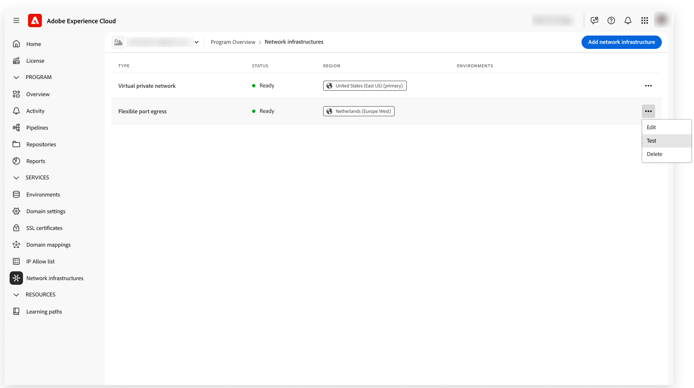
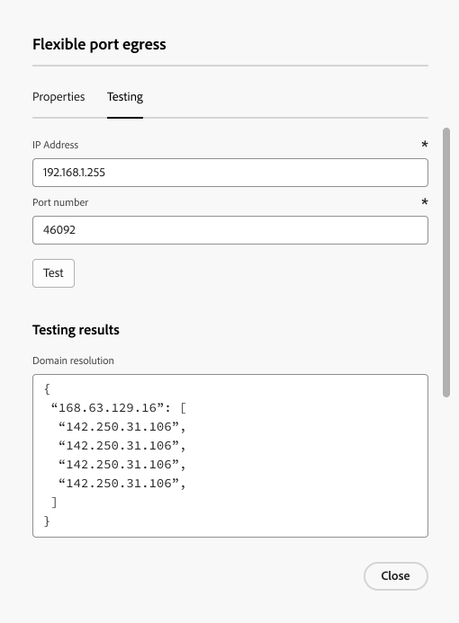

# Network Connectivity Test {#network-connectivity-test}

The **Network Connectivity Test** is a Cloud Manager diagnostic tool that lets you validate Advanced Networking and VPN configuration before you enable Advanced Networking on your environments and before you go live. Use it to verify that the hosts and ports AEM must reach, including internal or private endpoints, are reachable over the same connectivity path Advanced Networking will use.

The test runs from the **egress proxy infrastructure** that belongs to your program’s Advanced Networking setup, not from an Author or Publish pod. It uses the same outbound network path AEM uses when Advanced Networking is active. That design is especially useful for **VPN** scenarios: you can confirm DNS resolution, network routing, firewall rules, and service availability for private or on-premises systems before you go live.

For background on provisioning VPN, dedicated egress IP, or flexible port egress, see [Configuring Advanced Networking for AEM as a Cloud Service](/help/security/configuring-advanced-networking.md).

>[!IMPORTANT]
>
>A successful connectivity test proves that the network path from Advanced Networking can reach your target. Your application code must still be configured to use the Advanced Networking proxy where required (for example, proxy-related environment variables and port forwarding). If code bypasses the proxy, you may not see traffic from the expected egress path even when the test passes.

## When to Use This Tool {#when-to-use}

* After **Advanced Networking** is created at the **program** level and **before** or while enabling it on **environments**.
* To validate **VPN** connectivity to private or on-premises systems you operate (for example, internal hostnames or private IP addresses).
* To narrow down DNS issues versus firewall or routing issues when a service does not respond as expected.

>[!NOTE]
>
>This tool is for programs that use Advanced Networking (VPN, dedicated egress IP, or flexible port egress). It is not a general-purpose test of standard AEM connectivity without Advanced Networking.

## Prerequisites {#prerequisites}

* A Cloud Manager program.
* Advanced Networking infrastructure already created for the program (see [Configuring Advanced Networking](/help/security/configuring-advanced-networking.md)).

## How to Run a Test {#how-to-run-a-test}

1. Sign in to Cloud Manager at [my.cloudmanager.adobe.com](https://my.cloudmanager.adobe.com/) and open your organization and program.
1. Open the **Environments** tab for the program. In the left sidebar, select **Network Infrastructures**.

1. On the **Network Infrastructures** page, locate your infrastructure in the table. Either select a row to open the testing experience, or open the row actions menu () and choose **Test**.

   

1. The **Network Testing** dialog opens. Enter **Host** and **Port**, select **Test**, and review DNS resolution, port open, HTTP connectivity, and reachability in the results area. Optional actions such as **Copy to clipboard** and recent test history appear in the dialog. See [Understanding Results](#understanding-results) for how to interpret each section.

   

### Input Fields {#input-fields}

| Field | Description | Examples |
| --- | --- | --- |
| **Host** | Hostname or IP address of the service AEM should reach. | `internal-api.example.com`, `10.0.1.50` |
| **Port** | TCP port on the target host (1–65535). Common values may appear in a shortcut list (for example, 80, 443, 587, 22). | `443` |

### Steps {#test-steps}

1. Enter **Host** and **Port**.
1. Select **Test**. Results usually appear within a few seconds.
1. Optional: Use **Copy to clipboard** to capture the full JSON result (useful for support cases).
1. Recent tests may be listed for quick re-runs.

## Understanding Results {#understanding-results}

The tool reports several dimensions. Together they describe whether the target is reachable from Advanced Networking and how HTTP-aware checks behaved.

### DNS Resolution {#dns-resolution}

| Result | Meaning |
| --- | --- |
| `ips: ["10.0.1.50"]` | DNS resolution succeeded. The hostname resolved to the listed IP address(es) using the resolvers associated with your Advanced Networking configuration. |
| `error: "DNS resolution error: ..."` | DNS resolution failed. The configured DNS servers could not resolve the hostname (wrong name, resolver not reachable, missing record, and similar causes). |

>[!NOTE]
>
>If you enter a **numeric IP** instead of a hostname, DNS resolution is skipped for that value and the IP is used directly.

### Port Open {#port-open}

| Result | Meaning |
| --- | --- |
| `Yes` / true | TCP connection succeeded — the port is open and accepting connections. |
| `No` / false | The port is closed, filtered by a firewall, or the host is unreachable. |

### HTTP Connectivity {#http-connectivity}

An HTTP/HTTPS request is attempted on **every port**. The tool always tries **HTTPS** first, then falls back to **HTTP**. If neither works, the result is mapped to a short, readable **error** message (see the table below).

**Success Outputs**

| Output | Meaning |
| --- | --- |
| `protocol: "https"`, `status_code: 200`, `reason: "200 OK"` | HTTPS connection succeeded. |
| `protocol: "http"`, `status_code: 301`, `reason: "301 Moved Permanently"` | HTTP connection succeeded; the service is redirecting (typically to HTTPS). This is normal. |

**Classified Error Outputs**

| Error | Note | Meaning |
| --- | --- | --- |
| `"Not an HTTP/HTTPS service"` | `"The service appears to be a non-HTTP service (e.g., database, message queue, or custom TCP). Use the port_open and reachability fields to verify connectivity."` | The port is open but the service does not speak HTTP. This is expected for databases, SFTP, custom TCP, and similar services. |
| `"Connection refused"` | `"The port is not accepting connections. Verify the service is running and listening on this port."` | Nothing is listening on this port. |
| `"Connection timed out"` | `"The connection timed out. Check firewall rules and network routing."` | A firewall or routing issue is preventing the connection. |
| `"No IPs resolved for host"` | — | DNS resolution failed; HTTP cannot be tested. |

>[!NOTE]
>
>Any HTTP status code from the target service (for example, `200`, `301`, `302`, `403`, `404`, or `500`) is a **success signal** for connectivity—it means the **network path** works. The status code reflects the service’s own response, not overall network health. For non-HTTP services, the tool indicates **Not an HTTP/HTTPS service**; use **Port open** and **Reachability** as the reliable indicators for those services.

### Reachability {#reachability}

| Result | Meaning |
| --- | --- |
| **Reachable** | The target host and port are reachable from the Advanced Networking infrastructure. The network configuration is correct.  |
| **Unreachable: Port not accessible** | DNS resolved successfully, but TCP to the port did not succeed. This is typically a firewall or a routing issue. |
| **Unreachable: DNS resolution failed** | The hostname could not be resolved with your configuration. This is an indication of a DNS configuration issue. |

### Multiple DNS Resolvers {#multiple-dns-resolvers}

If your Advanced Networking infrastructure defines **more than one DNS resolver**:

* When **all resolvers return identical results**, you see a **single consolidated** result labeled `default`.
* When resolvers return **different results**, each resolver’s outcome is shown **separately** (labeled `resolver_1`, `resolver_2`, and so on), **with the resolver IP**, so you can see which DNS server is causing the inconsistency.

## Troubleshooting {#troubleshooting}

The following scenarios pair what you are likely to see in the tool with steps to narrow down the cause. For full **Copy to clipboard** JSON that illustrates the same situations, see [Example Outputs](#example-outputs).

### DNS Resolution Failed {#dns-failed}

#### Output

The hostname did not resolve using your Advanced Networking DNS settings, so the tool cannot test the port. In the results view, **DNS resolution** shows an error string, and **Reachability** reports that DNS failed:

```
DNS Resolution: error: "DNS resolution error: ..."
Reachability: "Unreachable: DNS resolution failed"
```

#### Recommendations

1. **Verify the hostname is correct**—check for typos and that you are using the intended **DNS zone** (the wrong zone is a common mistake).
1. Ensure **your DNS resolvers**—those configured in the network infrastructure—are **reachable from the Advanced Networking CIDR range** (the same address space the tool and AEM use for outbound checks). If you rely on private DNS, those servers must be reachable through the VPN tunnel or within the network address space that routing exposes to Advanced Networking.
1. **Verify that your configured DNS servers can resolve the hostname** — Advanced Networking uses **only** the resolvers defined in your network infrastructure setup, **not** public DNS (for example, `8.8.8.8`). If your internal DNS has no record for that hostname, resolution fails.
1. **For VPN setups:** Confirm the DNS server IP addresses lie within the VPN address space (the remote network CIDR the tunnel is built for). Resolvers on a subnet that is not routed through the VPN tunnel are not reachable from Advanced Networking.

### DNS Works but the Port Is Not Accessible {#dns-ok-port-blocked}

#### Output

The tool can resolve the host, but TCP to the port does not succeed. A summary often looks like this:

```
DNS Resolution: ips: ["10.0.1.50"]
Port Open: No
Reachability: "Unreachable: Port not accessible"
```

#### Recommendations

1. **Review firewall and allow-list rules on the target service**—incoming traffic from your Advanced Networking infrastructure CIDR range (and egress IP addresses AEM uses) must be permitted. If you use a VPN, include remote network CIDRs as your design requires.
1. **Verify the service is running** and **listening on the host and port** you entered in the test.
1. **For VPN setups:** Confirm the tunnel is up, routing reaches the target subnet, and the target address lies in the remote network address space carried over the VPN.
1. On your infrastructure, review **network security groups (NSGs), security rules, or equivalent** that could block the port between Advanced Networking and the target.
1. **Confirm the port number**—ensure the process is actually listening on the port you are testing.

### Test Shows Reachable but AEM Does Not Connect {#reachable-but-aem-fails}

#### Output

The connectivity check itself succeeds. A condensed summary often looks like this:

```
Port Open: Yes
Reachability: "Reachable"
```

That outcome means the path from Advanced Networking to the host and port you tested is open. It does not guarantee that AEM application traffic is using that path: when your code runs, service logs may still show no requests from the egress IP you expect.

#### Recommendations

1. **The application code must be configured to use the proxy**. The connectivity test proves the network path works, but AEM must explicitly route requests through the **Advanced Networking proxy** (for example, via the **`AEM_PROXY_HOST`** environment variable). If the code makes direct connections without the proxy, traffic does not go through the Advanced Networking infrastructure.
1. **Review proxy settings in your HTTP clients** - HTTP clients should use the same proxy configuration (`AEM_PROXY_HOST` and port forwarding where applicable).
1. **Verify the port forwarding configuration** for Advanced Networking at the **environment** level: in `portForwards`, each entry must map **`portOrig`** to **`portDest`** on the right **target host**. **`portOrig`** is the **port your AEM application code connects to** when it opens the outbound connection through the proxy. **`portDest`** is the **actual port on the target service** where the remote process is listening. The **target host** is the **hostname or address of that service** as used in the forward. All three must match how your application is written to connect.
1. **Check `nonProxyHosts`**. If the target host is listed there, requests **skip the proxy** for that host and will not follow the Advanced Networking path you validated.

### HTTP Shows an Error but Port Is Open {#http-error-port-open}

#### Output

TCP succeeds, but the HTTP/HTTPS probe still reports a failure. A summary often looks like this:

```
Port Open: Yes
HTTP Connectivity: error: "Connection error: ..." or "Both HTTPS and HTTP failed. ..."
Reachability: "Reachable"
```

#### Recommendations

1. **The service may not speak HTTP or HTTPS** — for example, raw TCP, gRPC, or another protocol. The HTTP probe can fail while `Port open: Yes` and `Reachability: Reachable` still confirm that the network path works. Use those fields as the source of truth for non-HTTP services.
1. **Investigate TLS and certificate configuration**. If HTTPS fails but HTTP succeeds (sometimes indicated by a note such as `HTTPS failed, HTTP succeeded`), the service may have certificate problems or may only offer HTTP on that port.

### Request Timeout {#timeout}

#### Output

```json
{ "error": "Request timeout" }
```

#### Recommendations

1. **Allow for service response time**—the check uses a timeout of 5 seconds. Targets that answer slower than that will time out even when they are otherwise healthy.
1. **Account for network latency**. On VPN connections, high latency or an unhealthy tunnel can push the round trip over the limit; review tunnel status and routing.
1. **Run the test again**. One-off network glitches can produce a timeout that does not recur.

## Example Outputs {#example-outputs}

### Successful HTTPS Test (e.g., Internal API on Port 443) {#example-output-successful-https}

```json
{
  "resolvers": [
    {
      "name": "default",
      "dns_resolution": {
        "ips": ["10.0.1.50"]
      },
      "port_open": true,
      "http_connectivity": {
        "protocol": "https",
        "status_code": 200,
        "reason": "200 OK"
      },
      "reachability": "Reachable"
    }
  ]
}
```

### Successful Non-HTTP Service Test (e.g., Database on Port 5432) {#example-output-successful-non-http}

```json
{
  "resolvers": [
    {
      "name": "default",
      "dns_resolution": {
        "ips": ["10.0.1.50"]
      },
      "port_open": true,
      "http_connectivity": {
        "error": "Not an HTTP/HTTPS service",
        "note": "The service appears to be a non-HTTP service (e.g., database, message queue, or custom TCP). Use the port_open and reachability fields to verify connectivity."
      },
      "reachability": "Reachable"
    }
  ]
}
```

>[!NOTE]
>
>The HTTP error is expected for non-HTTP services. **Port Open: true** and **Reachability: Reachable** confirm the network path works.

### DNS Resolution Failure {#example-output-dns-resolution-failure}

```json
{
  "resolvers": [
    {
      "name": "default",
      "dns_resolution": {
        "error": "DNS resolution error: dial udp 10.0.0.2:53: i/o timeout"
      },
      "port_open": false,
      "http_connectivity": {
        "error": "DNS resolution failed"
      },
      "reachability": "Unreachable: DNS resolution failed"
    }
  ]
}
```

### Port Not Accessible (Firewall / Service Down) {#example-output-port-not-accessible}

```json
{
  "resolvers": [
    {
      "name": "default",
      "dns_resolution": {
        "ips": ["10.0.1.50"]
      },
      "port_open": false,
      "http_connectivity": {
        "error": "Connection error: dial tcp 10.0.1.50:443: i/o timeout"
      },
      "reachability": "Unreachable: Port not accessible"
    }
  ]
}
```

## Important Notes {#important-notes}

### What This Test Does Not Do {#what-this-test-does-not-do}

* The test does not run from inside an AEM author or publish pod. It runs from **egress proxy infrastructure**. That validates the network layer, not application-level proxy configuration in your code.
* It does not validate your AEM application’s proxy settings. Even when the result is `Reachable`, AEM code must still be configured to use the proxy.
* It does not validate environment-level port forwarding configuration by itself. It tests raw connectivity from the infrastructure path.
* It does not send custom payloads. HTTP tests issue a basic `GET` request to `/`.

### Response Time {#response-time}

* **Typical:** about 2 to 3 seconds.
* **Maximum:** about five seconds timeout.
* **All DNS resolvers** and connectivity checks run in parallel.

### HTTP vs Non-HTTP Services {#http-vs-non-http-services}

The tool attempts an HTTP/HTTPS connection on every port. For non-HTTP services (for example, PostgreSQL on port 5432, MySQL on 3306, SFTP on 22, Redis on 6379), the HTTP check can fail with a connection error—this is expected. Rely on `Port open` and `Reachability` to confirm connectivity for those services.

## Related Information {#related-information}

* [Configuring Advanced Networking for AEM as a Cloud Service](/help/security/configuring-advanced-networking.md)
* [Advanced networking tutorials on Experience League](https://experienceleague.adobe.com/en/docs/experience-manager-learn/cloud-service/networking/advanced-networking)
