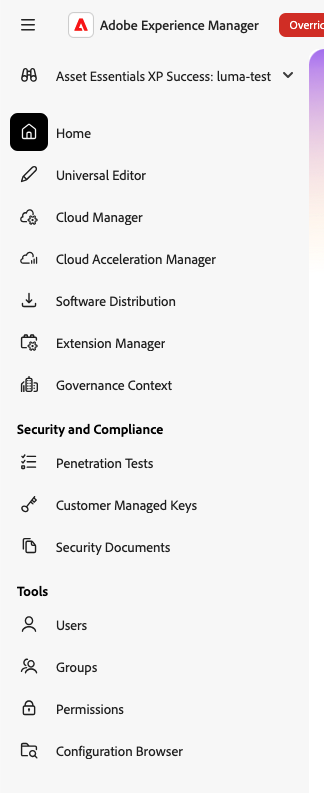
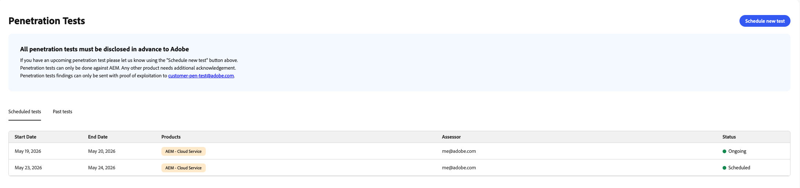
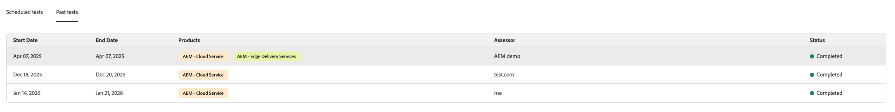
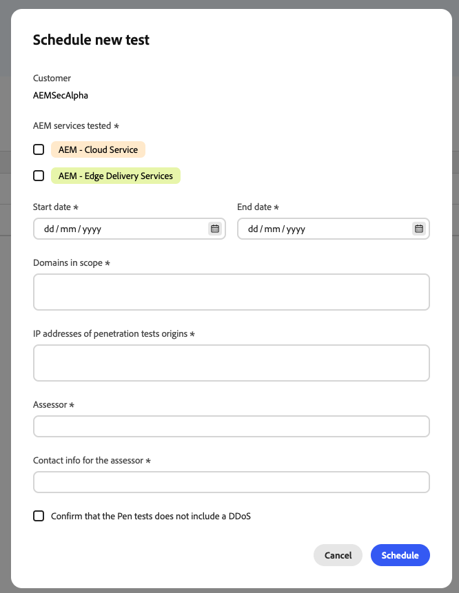
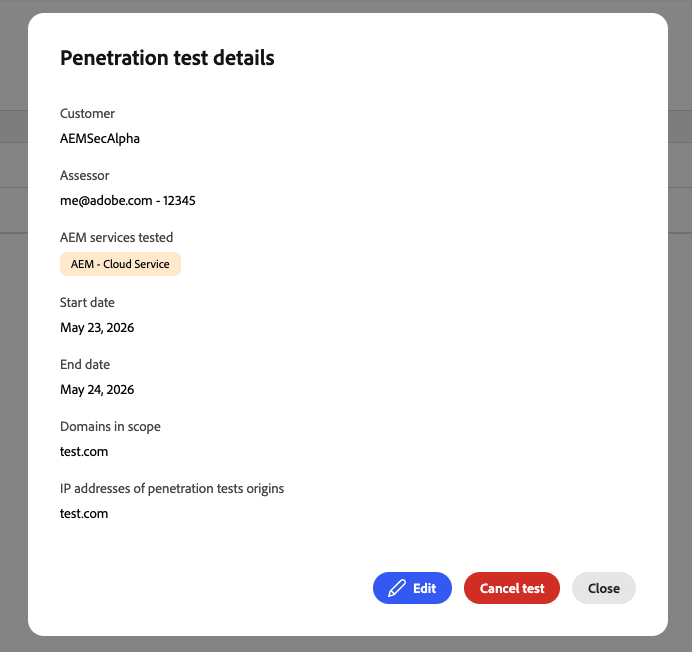
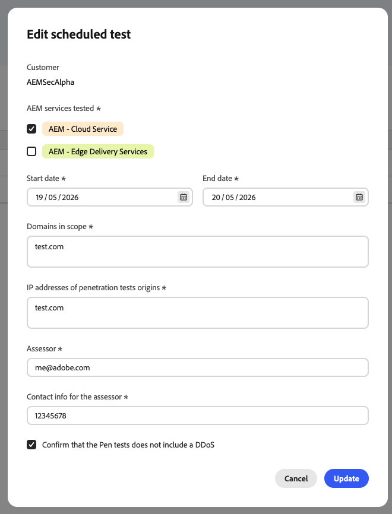
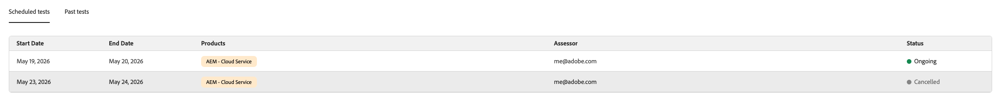
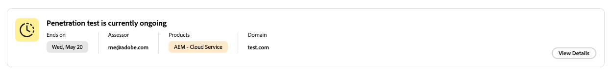
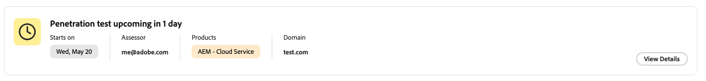
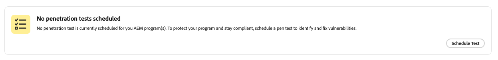

# Penetration Tests {#penetration-tests}

AEM as a Cloud Service lets you submit information about planned penetration tests directly from Experience Hub, so you don't need to contact Adobe separately. All penetration tests must be disclosed to Adobe in advance. When you schedule a test, Adobe is notified so that any unusual activity detected during the test, such as a spike in traffic or suspicious requests, can be correctly attributed to your test instead of being treated as a potential security incident.

>[!NOTE]
>
>You can only run penetration tests against AEM. Testing any other product requires additional acknowledgement from Adobe. Send findings that include proof of exploitation to [customer-pen-test@adobe.com](mailto:customer-pen-test@adobe.com).

## Access Penetration Tests {#access-penetration-tests}

To manage your penetration tests:

1. Go to AEM Experience Hub.
1. Select the **Admin & IT** profile.
1. In the left navigation, under **Security and Compliance**, select **Penetration Tests**.

## View Planned and Past Tests {#view-planned-and-past-tests}

The **Penetration Tests** page shows your scheduled and ongoing tests in a table, including their start and end dates, the AEM services tested, the assessor, and the status of each test.

Select the **Past tests** tab to see tests you've already run.

## Schedule a New Test {#schedule-a-new-test}

To schedule a penetration test:

1. Select **Schedule new test**.
1. Provide the following information:

   - **AEM services tested**: the services you plan to test, for example, AEM - Cloud Service or AEM - Edge Delivery Services
   - **Start date** and **End date** for the test
   - **Domains in scope** for the test
   - **IP addresses of penetration tests origins**
   - **Assessor** performing the test
   - **Contact info for the assessor**
   - Confirmation that the test doesn't include a distributed denial-of-service (DDoS) attack

1. Select **Schedule**.

You can only schedule a test for the current date or a future date. Scheduling a test for a past date isn't supported.

## View Test Details {#view-test-details}

Select a row in the table to see the full details of that penetration test, including options to edit or cancel it.

## Edit a Test {#edit-a-test}

You can edit a scheduled penetration test, for example, to update the dates, domains in scope, or IP addresses. Open the test's details, select **Edit**, make your changes, and select **Update**. Adobe is notified of any changes you make.

## Cancel a Test {#cancel-a-test}

To cancel a scheduled penetration test, open its details and select **Cancel test**. Adobe is notified when a test is cancelled, and the test's status changes to **Cancelled** in the table.

## Widget on the Experience Hub Landing Page {#widget-on-the-experience-hub-landing-page}

The Experience Hub landing page for the Admin & IT profile also shows a summary of your penetration test status:

- An ongoing test
- An upcoming scheduled test
- No test currently scheduled

