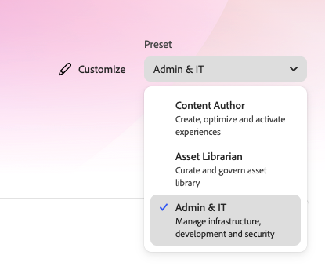
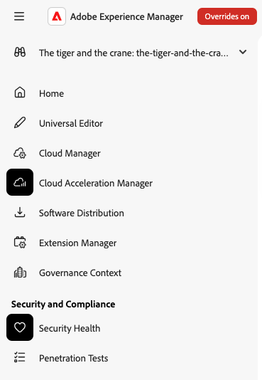
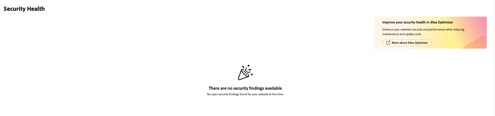
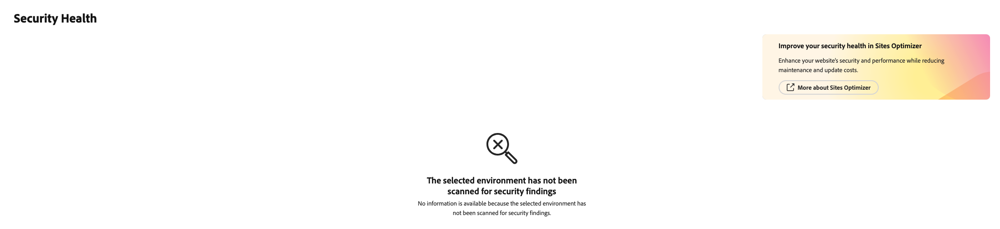
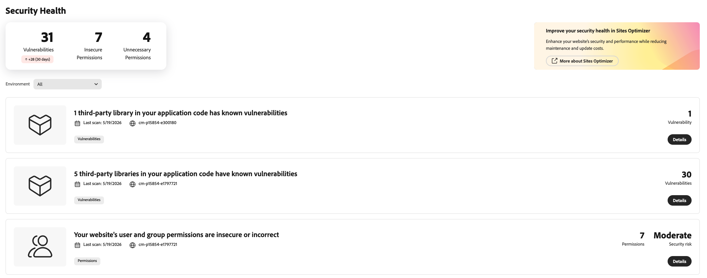
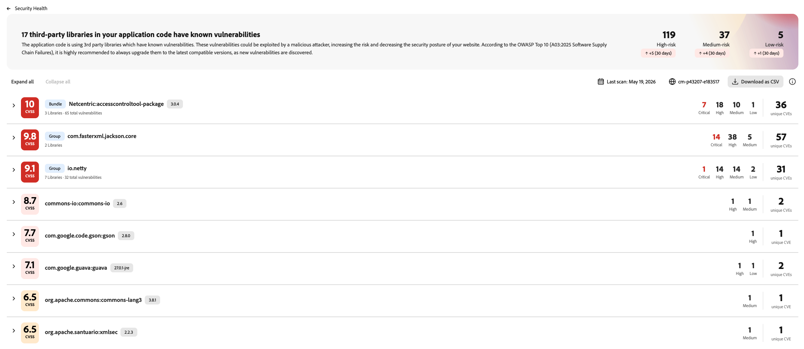
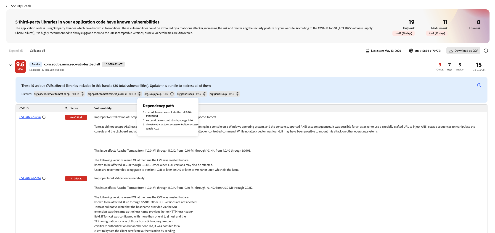
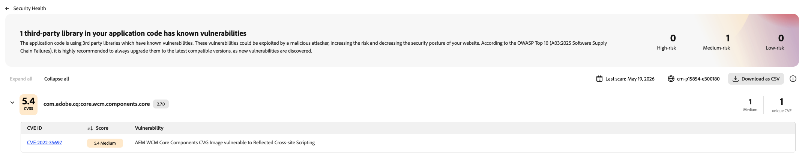
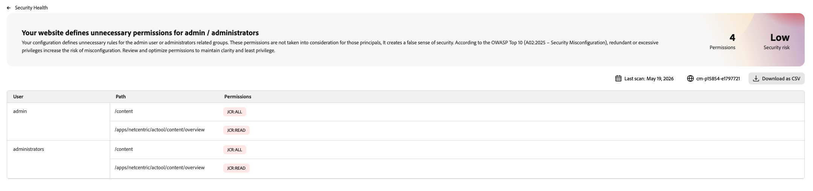
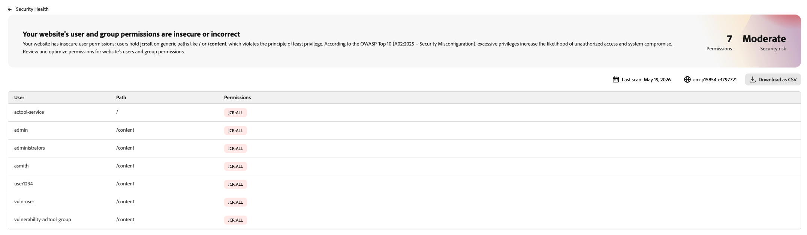

# Security Health {#security-health}

AEM as a Cloud Service automatically scans your production environments for common security issues and surfaces the results in Experience Hub. Security Health helps administrators find and resolve issues, such as vulnerable third-party libraries and overly permissive access control entries, without waiting for a scheduled security audit.

## Access Security Health {#access-security-health}

To view your security findings:

1. Go to AEM Experience Hub.
1. Select the **Admin & IT** profile.
1. In the left navigation, under **Security and Compliance**, select **Security Health**.

## Understand What You See {#understand-what-you-see}

The information Security Health displays depends on the current state of your program and environments.

**No issues detected**

If the scan doesn't find any issues for your program, Security Health shows a confirmation message and no further action is required.

**Environment not scanned**

Security scans run daily and only target production environments. If you select a sandbox program, a program without a production environment, or an environment that hasn't been scanned yet, Security Health shows a notice instead of results.

**Findings available**

When issues are detected, Security Health shows key performance indicators for vulnerabilities, insecure permissions, and unnecessary permissions, including a 30-day comparison when historical data is available, along with a list of findings. Select a finding to see its details. The detail view differs depending on the type of issue.

## Types of Findings {#types-of-findings}

Security Health reports on three types of issues, aligned with the [OWASP Top 10](https://owasp.org/Top10/2025/).

### Vulnerabilities in Third-Party Libraries {#vulnerabilities-in-third-party-libraries}

Corresponds to OWASP Top 10 category A03:2025 (Software Supply Chain Failures).

Your custom code often depends on third-party Java libraries. AEM as a Cloud Service extracts the list of libraries your code uses and checks them against public vulnerability databases. For each vulnerability found, Security Health shows:

- The affected library
- The CVE ID
- The CVE score
- A description of the vulnerability

Findings are grouped to make them easier to act on:

- By bundle, when a library is a nested dependency of another library
- By group, when multiple libraries from the same group are affected (for example, Apache CXF)
- By library, in all other cases

Groups are sorted by descending maximum CVE score. You can export the list of findings as a CSV file.

When multiple groupings are found, Security Health lists each one with its own risk breakdown, so you can see at a glance which groupings need attention first.

When vulnerabilities come from nested dependencies of a bundle, Security Health groups them under that bundle. Expand it to see the dependency path and every CVE it introduces.

When a single library has a known vulnerability, Security Health lists that library on its own, along with the related CVE.

### Redundant Permissions {#redundant-permissions}

Corresponds to OWASP Top 10 category A02:2025 (Security Misconfiguration).

The AEM permission system lets you define access control entries that don't actually change what a principal can do. For example, denying the `admin` user access to a path has no effect, because AEM administrators bypass permission checks. Rules like this create a false sense of security without providing any real protection.

Security Health lists these redundant entries by user and path, and lets you sort the list by user. You can export the list as a CSV file. Review these entries and remove the ones that don't provide real protection, to keep your permission configuration clear and aligned with the principle of least privilege.

### Overly Broad or Insecure Permissions {#overly-broad-or-insecure-permissions}

Also corresponds to OWASP Top 10 category A02:2025 (Security Misconfiguration).

Because the AEM permission system can be complex to configure precisely, some permission entries grant more access than necessary. For example, a permission might grant a user full control over a path when only write access is needed. Overly broad permissions increase the risk that a person, script, or automation makes an unintended change, such as deleting content that then needs to be restored from a backup.

Security Health lists these entries by user and path, and lets you sort the list by user. You can export the list as a CSV file. Review the findings and reduce each permission to only what's required.

## Limitations {#limitations}

Keep the following limitations in mind when you review Security Health findings:

- Scans run only against production environments. Development, stage, RDE, and sandbox environments aren't scanned.
- Scans cover Java-based third-party libraries only. JavaScript dependencies used in UI code aren't analyzed.
