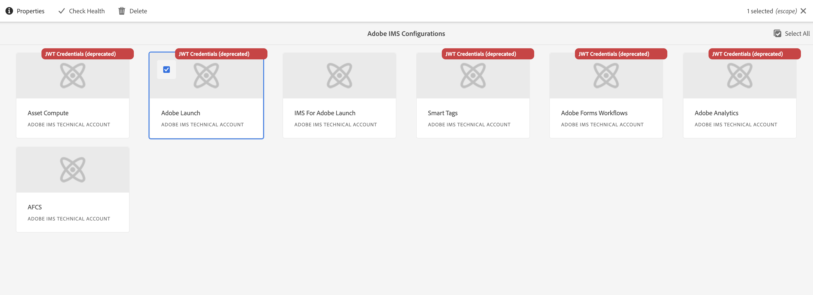

# Setting Up IMS Integrations for AEM as a Cloud Service {#setting-up-ims-integrations-for-aemaacs}

Adobe Experience Manager (AEM) as a Cloud Service can be integrated with many other Adobe solutions. For example, Adobe Target, Adobe Analytics, and others. 

The integrations use an IMS integration:

* [IMS integrations are now configured with S2S OAuth](#configuration-with-the-developer-console) 
* Previously, configurations were made with [JWT Credentials that are now subject to deprecation in the Adobe Developer Console](/help/security/jwt-credentials-deprecation-in-adobe-developer-console.md)
  * These [JWT configurations can be migrated to OAuth](#migrating-old-JWT-configuration-to-oauth)

## Configuration with the Developer Console {#configuration-with-the-developer-console}

## Migrating an old JWT configuration to OAuth {#migrating-old-JWT-configuration-to-oauth}

To migrate an old JWT configuration; in this example, a Launch IMS Configuration:

1. In AEM, navigate to **Tools**, **Security**, **Adobe IMS Integration**.

1. Select the JWT configuration that needs to be migrated. JWT configurations are marked with the warning **JWT Credentials (deprecated)**.

1. Select **Properties**:

   

1. The configuration will open as read-only:

   

1. Select **OAuth** from the **Authentication Type** dropdown:

   

1. The properties available will be updated. Use details from the Developer Console to complete them:

   

1. Use **Save & Close** to persist your updates. 
   When you return to the console the **JWT Credentials (deprecated)** warning will be gone-