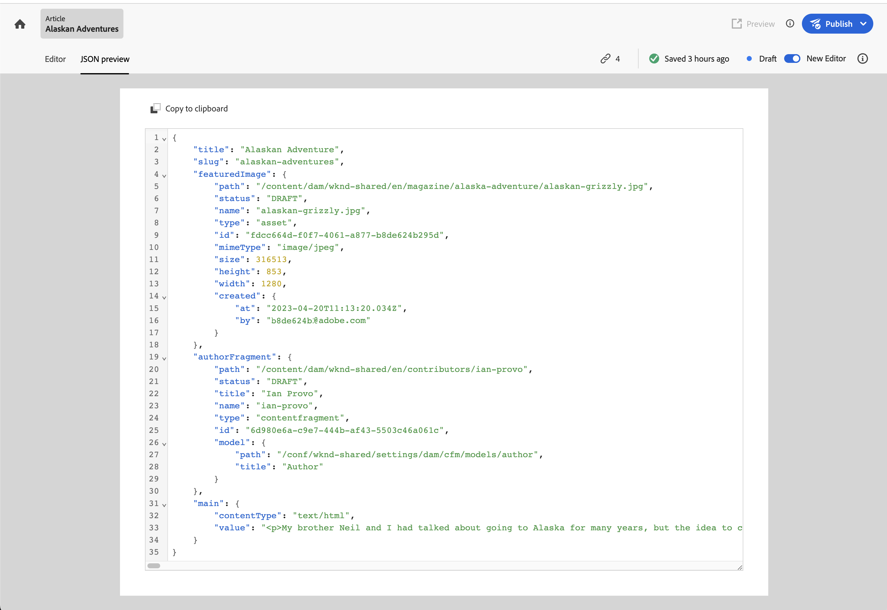

# Analyzing Content Fragment Structure {#analyzing-content-fragments-structure}

Content Fragments are designed for [Headless delivery using GraphQL](/help/sites-cloud/administering/content-fragments/content-delivery-with-graphql.md). This means that they can have a multi-layered structure. 

<!-- CHECK: is this needed here? is a duplicate >
<!--

-->

Experience Manager (AEM) provides several methods of viewing and analyzing the structure of your fragments.

## References {#references}

The structure is built up using References:

* [Data types for References are defined in the Content Fragment Model](/help/sites-cloud/administering/content-fragments/content-fragment-models.md#using-references-to-form-nested-content)
* When authoring you can:
  * [Manage these references](/help/sites-cloud/administering/content-fragments/authoring.md##manage-references)
  * [Find Parent References of your Fragment](/help/sites-cloud/administering/content-fragments/managing.md#parent-references-fragment)

<!-- CHECK: Replace with snippet? See also authoring.md -->

<!--
## JSON preview {#json-preview}

When developing the models for Content Fragments as part of your AEM headless implementation, you might want to view sample JSON output for a content fragment, as based on a model. For example, to get an idea of how the final output will look. This could be helpful when validating the model JSON structure, maybe with default sample content per data type. With **Copy to clipboard** you can also copy the JSON content to another application.

Select **JSON preview** from the editor toolbar to show the JSON representation of the current fragment. For example:

-->

<!-- CHECK: Replace with snippet? -->

## Structure tree {#structure-tree}

Open the **Structure tree** tab from the editor toolbar to show the hierarchical structure of the Content Fragment, and its references. Use the link icon to open references.

For example:

<!-- CHECK: screenshot checked 2023.08.07 -->

