# Authoring Content Fragments {#authoring-content-fragments}

>[!IMPORTANT]
>
>Various features of the Content Fragment Editor are available through the Early Adopter Program.
>
>To see the status, and how to apply if you are interested, check the [Release Notes](/help/release-notes/release-notes-cloud/release-notes-current.md).

Authoring your Content Fragments is focused on both headless delivery and page authoring.

There are two editors available for Content Fragments. The editor described in this section:

* has been developed for headless content delivery (though it can be used for all scenarios)
* is available from the **Content Fragments** console

This editor provides:

* [Auto-saving](#saving-autosaving), to prevent accidental loss of edits.
* [In-line uploading of assets as content references](#reference-images), without having to upload them to the Asset DAM first.
* [Generate Variations](#generate-variations-ai) to use the Generative AI to accelerate content creation based on prompts.
* [Preview](#preview-content-fragment) of the rendered experience delivered by the Content Fragment.
* Ability to [Publish](#publish-content-fragment) and [Unpublish](#unpublish-content-fragment) from the editor.
* Ability to [view, and open, associated language copies](#view-language-copies) in the editor.
* Ability to [view version details](#view-version-history) in the editor. You can also revert to a selected version.
* Ability to [view, and open, parent references](#view-parent-references).
* A hierarchical view of the Content Fragment, and its references, using the [Structure tree](#structure-tree).

>[!WARNING]
>
>The editor described in this section is *only* available in the *online* Adobe Experience Manager (AEM) as a Cloud Service.

## Content Fragment Editor {#content-fragment-editor}

When you first open the Content Fragment Editor, you see four main areas:

* top toolbar: for key information, and actions
  * a link to the Content Fragment Console (Home icon)
  * information about the model, and folder
  * links to [Preview (if the Default Preview URL Pattern is configured for the model)](/help/sites-cloud/administering/content-fragments/content-fragment-models.md#content-fragment-model-properties)
  * [Publish](#publish-content-fragment), and [Unpublish](#unpublish-content-fragment) actions
  * an option to show all **Parent References** (link icon)
  * the fragment **[Status](/help/sites-cloud/administering/content-fragments/managing.md#statuses-content-fragments)**, and last saved information
  * a toggle to switch to the original (Assets-based) editor

    >[!WARNING]
    >
    >The original editor opens in the same tab. It is not recommended to have both editors open at the same time.

* left panel: shows the **[Variations](#variations)** for the Content Fragment, and its **Fields**:
  * these links can be used to [navigate the Content Fragment structure](#navigate-structure)
* right panel: presents tabs [showing the properties (metadata) and tags](#view-properties-tags), information about the [version history](#view-version-history), and information related to any [language copies](#view-language-copies)
  * in the **Properties** tab you can update the **Title** and **Description** for the fragment, or **Variation**
  * In the **Comments** tab you can add, and read, comments to help you collaborate with other authors
* central panel: shows the actual fields, and content, of the selected variation
  * allows you to edit the content
    * when configured (as multiple) in the model, various data types allow you to **Add** instances of the relevant field
  * if **Tab Placeholder** fields are defined within the model they are shown here and:
    * can be used for navigating
    * will either be shown horizontally, or as a drop-down list

  >[!NOTE]
  >
  >Depending on definitions in the underlying model, fields can be subject to certain types of [Validation](/help/assets/content-fragments/content-fragments-models.md#validation).

## Navigate the Content Fragment structure {#navigate-structure}

A single Content Fragment;

* Consists of two levels:

  * **[Variations](#variations)** of the Content Fragment
  * **Fields** - defined by the Content Fragment Model, and used by every variation

* Can contain a variety of references.

### Variations and Fields {#variations-and-fields}

In the left panel you can see:

* the list of **[Variations](#variations)** that have been created for this fragment:
  * **Main** is the Variation that is present when the Content Fragment is first created, you can add others later
  * you can use Generate Variations(#generate-variations) to use a prompt based template that Adobe has created for a specific use case.
  * you can also [create a Variation](#create-variation)
* the **Fields** within the fragment, and its variations:
  * the icon indicates the [Data Type](/help/sites-cloud/administering/content-fragments/content-fragment-models.md#data-types)
  * the text is the field name
  * together these provide a direct link to the field content in the central panel (for the current Variation)

### Follow Links {#follow-links}

In various parts of the editor you can see the link icon. This icon can be used to open the item shown; for example, a Content Fragment Model, a Parent Reference, or a fragment that is referenced:

### Structure tree {#structure-tree}

Open the **Structure tree** tab from the editor toolbar to show the hierarchical structure of the Content Fragment, and its references. Use the link icons to navigate to the references.

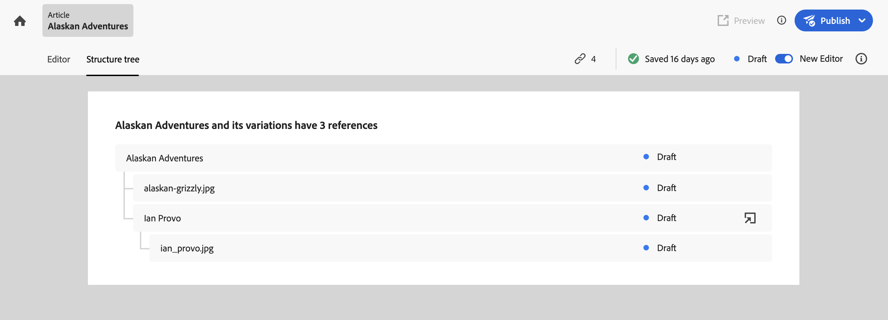

>[!NOTE]
>
>See [Analyzing Content Fragment Structure - Structure tree](/help/sites-cloud/administering/content-fragments/analysis.md#structure-tree) for more details.

## Saving and auto-saving {#saving-autosaving}

<!-- CHECK: cannot be saved, no undo, redo -->

With every update that you make, the Content Fragment is automatically saved. The last time saved is shown in the top toolbar.

## Variations {#variations}

[Variations](/help/sites-cloud/administering/content-fragments/overview.md#main-and-variations) are a significant feature of AEM's Content Fragments. They allow you to create and edit copies of the **Main** content for use on specific channels, and scenarios, making headless content delivery and page authoring even more flexible.

From the editor you can:

* [Create variations](#create-variation) of the **Main** content

* [Use Generate Variations AI](#generate-variations-ai) to use Generative AI to use a prompt based template that Adobe has created for a specific use case.

* Select the required variation for editing the content

* [Rename your variation](#rename-variation)

* [Delete a Variation](#delete-variation)

### Create a Variation {#create-variation}

To create a Variation of your Content Fragment:

1. In the left panel, select the **plus sign** (**Create variation**) that is to the right of **Variations**.

   >[!NOTE]
   >
   >After creating your first variation, existing variations will be listed in the same panel.

   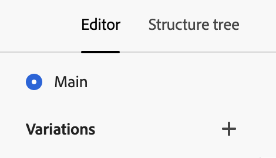

1. In the dialog, enter a **Title** for your variation, and a **Description** if wanted:

   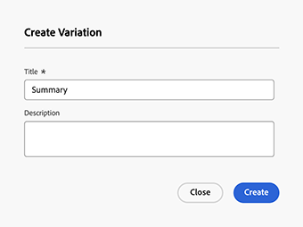

1. **Create** the variation. It appears in the list.

### Rename a Variation {#rename-variation}

To rename a **Variation**:

1. Select the required variation.

1. Open the **Properties** tab in the right panel.

1. Update the variation **Title**.

1. Either press **Return** or move to another field to auto-save the change. The title is updated in the **Variations** panel on the left.

### Create variations using GenAI with Generate Variations {#generate-variations-ai}

Use Generative Variations to leverage Generative AI to accelerate content creation.

To use the Generative Variations in the Content Fragment Editor:

1. Open the Content Fragment Editor. In the header you will find the entry point to Generate Variations:

      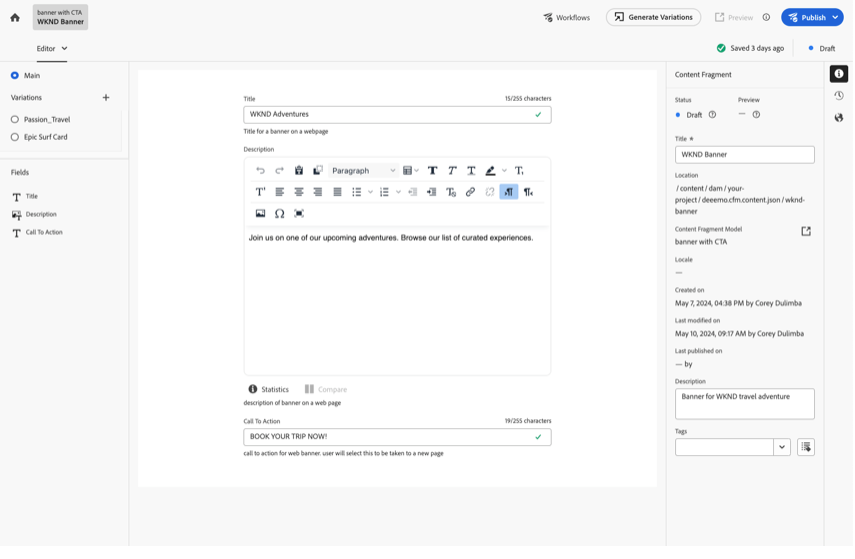

1. Generate variations opens in new tab. In the left rail you can see the AEM Cloud instance and the Content Fragment you are creating content for. Select the prompt you want to use or create a new prompt. 

    >[!NOTE]
    >
    >The available Adobe prompt templates available is limited now, but more will be added in future releases.

      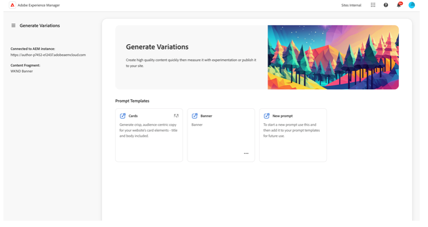

1. Generate content by filling in the prompts. The content model from the fragment will be automatically used to generate content using GenAI.

    >[!NOTE]
    >
    >We are currently only supporting text fields.

      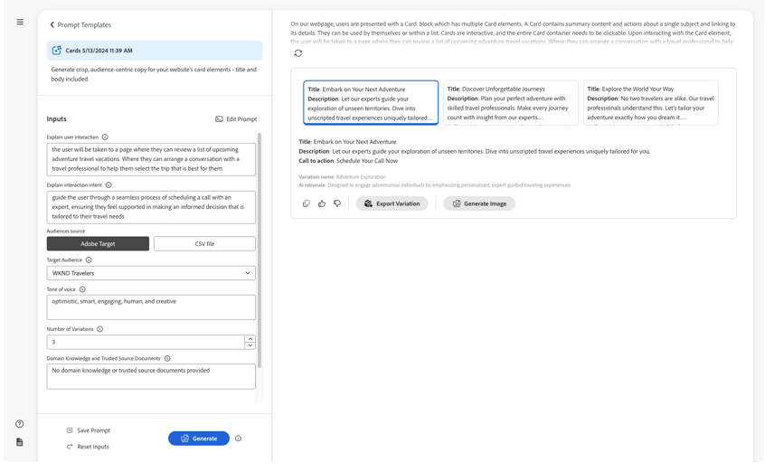

1. Select the generate variant you like and select “export variation”. Confirm the name of the content fragment variation and select either:
 
    * **Export**: export variation to Content Fragment and stay in the Generate Variation application.
    * **Export and open**: export variation to Content Fragment and open a new tab that shows the Content Fragment with the new variation from GenAI.

        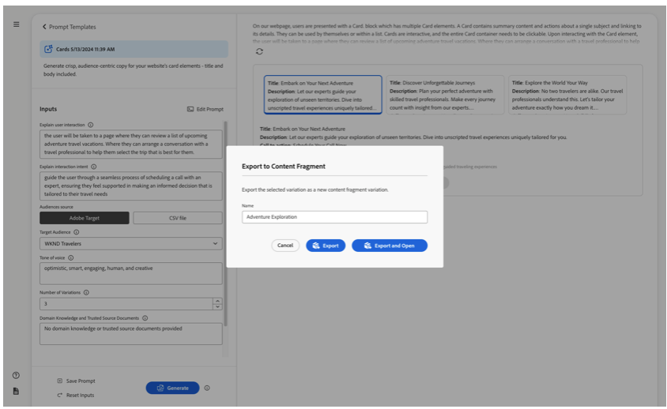

1. Variations generated are shown in Main Content Fragment Editor.

    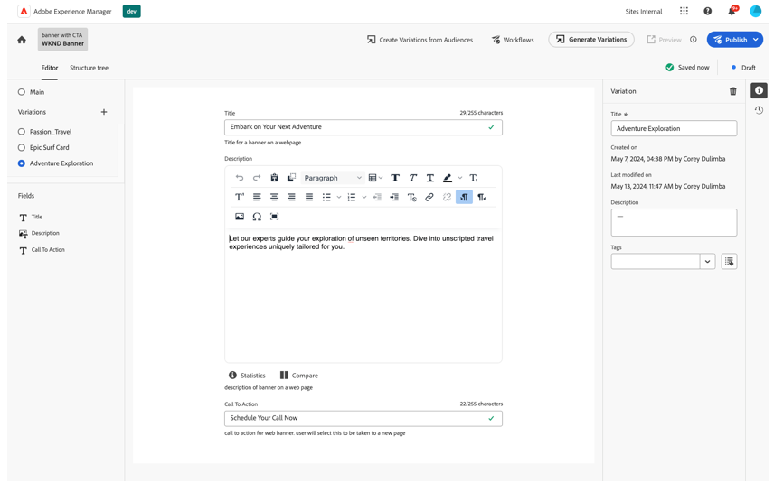

See [Generate Variations](/help/generative-ai/generate-variations.md) to learn more.

### Delete a variation {#delete-variation}

To delete a Variation of your Content Fragment:

    >[!NOTE]
    >
    >You cannot delete **Main**.

1. Select the Variation.

1. In the **Variation** panel, select the delete icon (Trash Can):

   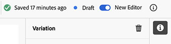

1. A dialog opens. Select **Delete** to confirm the action.

## Edit Multi line text fields - Plain text or Markdown {#edit-multi-line-text-fields-plaintext-markdown}

**[Multi line text](/help/sites-cloud/administering/content-fragments/content-fragment-models.md#data-types)** fields can have one of three formats:

* Plain Text
* [Markdown](/help/sites-cloud/administering/content-fragments/markdown.md)
* [Rich Text](#edit-multi-line-text-fields-rich-text)

Fields that are defined as either Plain Text or Markdown have a simple text box, without (on-screen) formatting options:

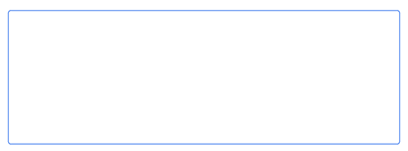

## Edit Multi line text fields - Rich Text {#edit-multi-line-text-fields-rich-text}

For **[Multi line text](/help/sites-cloud/administering/content-fragments/content-fragment-models.md#data-types)** fields that are defined as **Rich Text**, various features are available:

* Edit the content:
  * Undo/Redo
  * Paste/Paste as Text
  * Copy
  * Select paragraph format
  * Create/manage table
  * Format text; bold, italic, underline, color
  * Set paragraph alignment
  * Create/manage lists; bulleted, numbered
  * Indent text; decrease, increase
  * Clear current formatting
  * Insert links
  * Select and insert references to image assets
  * Add special characters
* [Full-screen editor](#full-screen-editor-rich-text) - toggle between full-screen and in-flow
* [Statistics](#statistics-rich-text)
* [Compare and Synchronize](#compare-and-synchronize-rich-text)

For example:

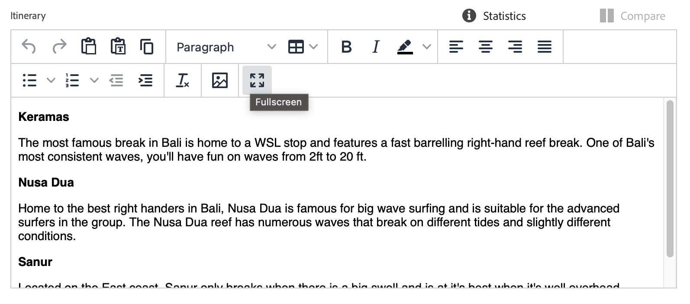

>[!NOTE]
>
>Multi line text fields are also indicated by the appropriate [icon](#fields-datatypes-icons) in the **Fields** panel.

### Full-screen editor - Rich Text {#full-screen-editor-rich-text}

The full-screen editor offers the same editing options as when in-flow - but offers more space for the text.

For example:

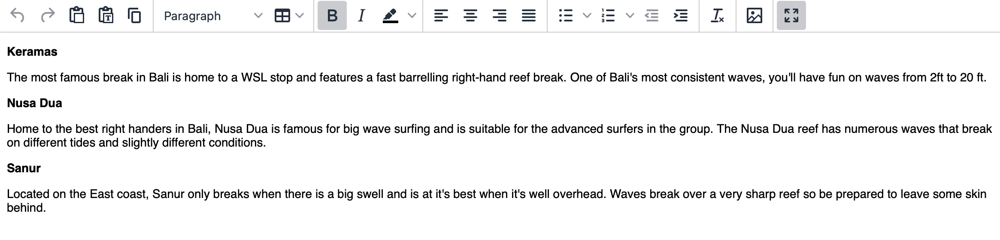

### Statistics - Rich Text {#statistics-rich-text}

The action **Statistics** displays a range of information about the text in a Multi line field. 

For example:

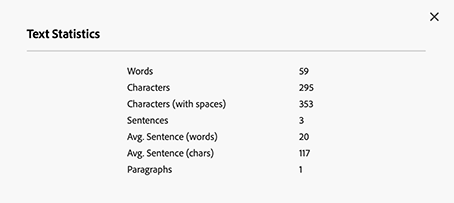

### Compare and Synchronize - Rich Text {#compare-and-synchronize-rich-text}

The action **Compare** is available for Multi line fields when you have a **Variation** open. 

This opens the Multi line field in full-screen and:

* displays the content for both **Main** and the current **Variation** in parallel, with any differences highlighted

* differences are indicated by color:

  * green indicates content added (to the variation)
  * red indicates content removed (from the variation)
  * blue indicates replaced text

* provides the **Sync** action, which synchronizes the content from **Main** to the current variation

  * if **Main** has been updated, then these changes will be transferred to the variation
  * if the variation has been updated, then these changes will be overwritten by the content from **Main**

  >[!CAUTION]
  >
  >Synchronization is only available to copy changes *from **Main** to the variation*.
  >
  >Transferring changes *from a variation to **Main*** is not available as an option.

For example, a scenario where the variation content had been completely rewritten, so a synchronization will replace that new content with the content from **Main**:

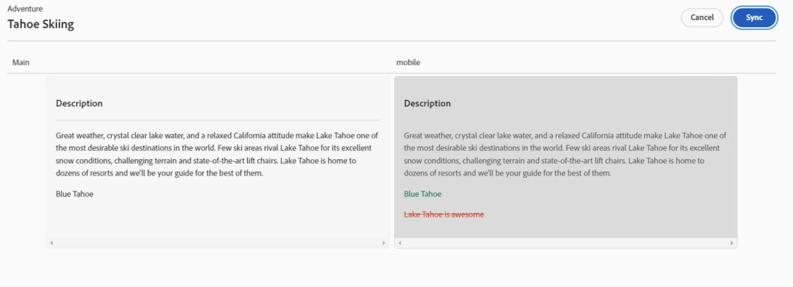

## Manage References {#manage-references}

### Fragment References {#fragment-references}

[Fragment References](/help/sites-cloud/administering/content-fragments/content-fragment-models.md#fragment-reference-nested-fragments) can be used to:

* [create a reference to an existing Content Fragment](#create-reference-existing-content-fragment)
* [create a Content Fragment, and then reference it](#create-reference-content-fragment)

#### Create a reference to an existing Content Fragment {#create-reference-existing-content-fragment}

To create a reference to an existing Content Fragment:

1. Select the field.
1. Select **Add existing fragment**. 
1. Select your required fragment from the fragment selector.

   >[!NOTE]
   >
   >You are allowed to select only one fragment at a time.

#### Create a Content Fragment, and reference {#create-reference-content-fragment}

Alternatively you can [select **Create new fragment** to open the **Create** dialog](/help/sites-cloud/administering/content-fragments/managing.md#creating-a-content-fragment). Once created, this fragment will be referenced.

### Content References {#content-references}

[Content References](/help/sites-cloud/administering/content-fragments/content-fragment-models.md#content-reference) are used to reference other AEM content types, such as images, pages, and Experience Fragments.

#### Reference Images {#reference-images}

In **Content Reference** fields you can:

* reference assets that already exist in your local repository
* reference assets that reside in a remote repository
* upload assets directly to the field; this avoids the need to use the **Assets** console to upload

  >[!NOTE]
  >
  >To directly upload an image to the **Content Reference** field, it **must**:
  >
  >* have a **Root Path** defined (in the [Content Fragment Model](/help/sites-cloud/administering/content-fragments/content-fragment-models.md#content-reference)). This specifies where the image will be stored.
  >* include **Image** in the list of accepted content types

##### Reference Local Assets {#reference-local-assets}

To add a local asset, you can either:

* drag and drop the new asset file directly (for example, from your file system) into the **Content Reference** field
* use the **Add asset** action, then select either **Browse Assets** or **Upload** to open the appropriate selector for you to use:

  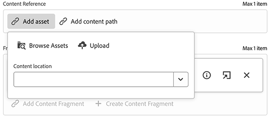

##### Reference Remote Assets {#reference-remote-assets}

To reference remote assets: 

1. Specify the remote **Repository** when browsing for assets:

   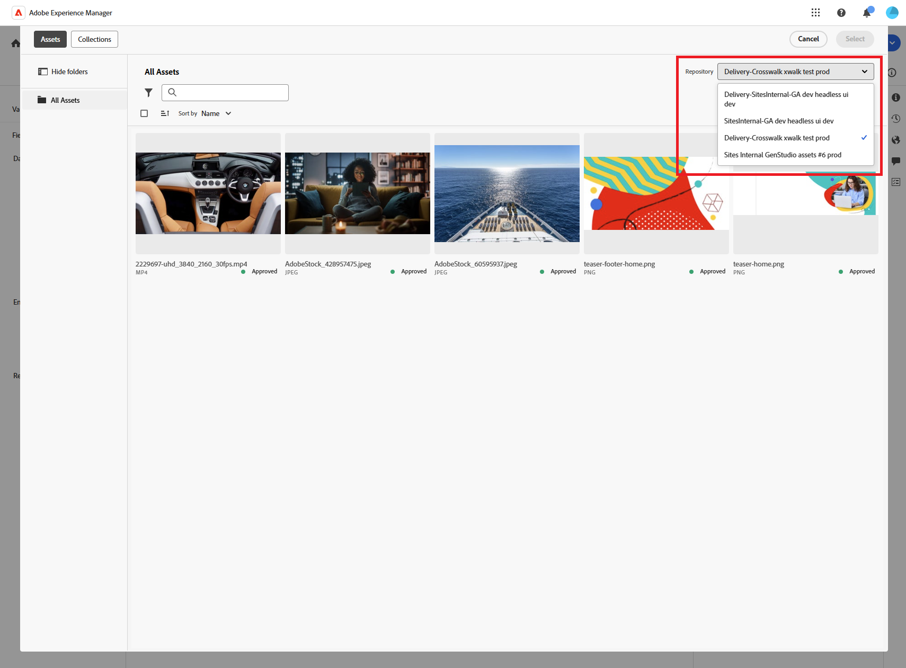

2. After selection the location can be seen in the asset information: 
  
   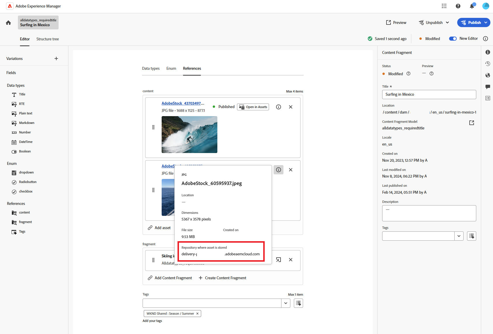

###### Remote Assets - Limitations {#remote-assets-limitations}

There are some limitations when referencing remote assets:

* Only [Approved](/help/assets/approve-assets.md) assets are available for reference from a remote Asset repository.

* If a referenced asset is removed from the remote repository, this results in a broken Content Reference.

* All Delivery Asset Repositories to which the user has access are available for selection, the available list cannot be limited.

* Both the AEM instance and remote asset repository instances must be at the same version.

* No Asset metadata is exposed via the either Management API or the Delivery API. You have to use the Asset Metadata API to retrieve the asset metadata details:

  * the individual asset metadata: [https://adobe-aem-assets-delivery.redoc.ly/#operation/getAssetMetadata](https://adobe-aem-assets-delivery.redoc.ly/#operation/getAssetMetadata)
  
  * get bulk metadata information using the search API (experimental): [https://adobe-aem-assets-delivery-experimental.redoc.ly/#operation/search](https://adobe-aem-assets-delivery-experimental.redoc.ly/#operation/search)

>[!NOTE]
>
>See also [AEM GraphQL API for use with Content Fragments - Dynamic Media for OpenAPI asset support (Remote Assets)](/help/headless/graphql-api/content-fragments.md#dynamic-media-for-openapi-asset-support)

#### Reference Pages {#reference-pages}

To add references to AEM pages, Experience Fragments, or other such content types:

1. Select **Add content path**.

1. Add the required path in the input field.

1. Confirm with **Add**.

>[!NOTE]
>
>This should not be used for references to:
>
>* Content Fragments - use a [Fragment Reference](#fragment-references)
>* Images - use [Reference Images](#reference-images)

### View Parent References {#view-parent-references}

Selecting the link icon in the top toolbar opens a list of all parent references. 

For example:

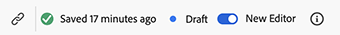

A window opens, listing all related references. To open a reference, select the name or title, or the link icon. 

For example:

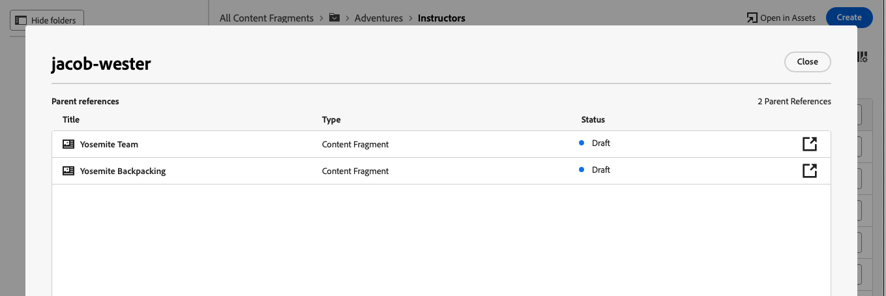

## View Properties, and Tags {#view-properties-tags}

In the properties tab of the right panel, properties (metadata) and tags can be viewed. The properties can be either:

* for the **Content Fragment** - if **Main** is currently selected
* for a specific **Variation**

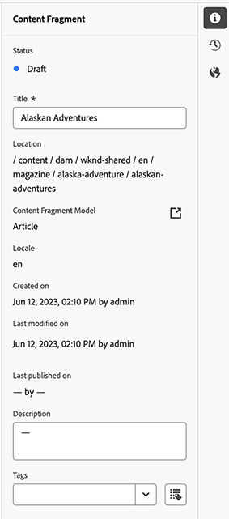 

### Edit Properties and Tags {#edit-properties-tags}

In the properties tab (right panel) you can also edit:

* **Title**
* **Description**
* **Tags**: using the drop-down list, or the selection dialog

  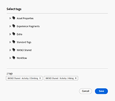 

### Open the Content Fragment Model {#open-content-fragment-model}

When you have **Main** selected, the name of the underlying Content Fragment Model is shown in the properties section. Selecting the link icon, opens the model in a separate tab.

For example:

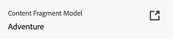

## View the Version History {#view-version-history}

In the **Version history** tab of the right panel, details of the current, and previous, versions are shown:

>[!NOTE]
>
>A new version is created when the content fragment is published.

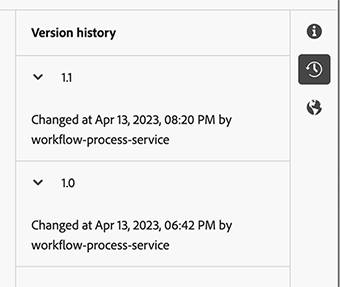

### Compare Version {#compare-version}

For a content fragment you can compare a previous version against the current version.

To compare a previous version to the current:

1. Select the three dots icon next to the version.

1. Select **Compare**. 

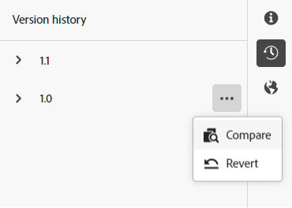

This opens up a view that displays differences between the current version of the content, and the selected previous version of the content fragment. From the **Variations with changes** drop-down, you can select to see differences from the Main content and/or content from a Variation. 

Differences are indicated by color:

* Green: indicates content added (to the current version)
* Red: indicates content removed (from the current version)

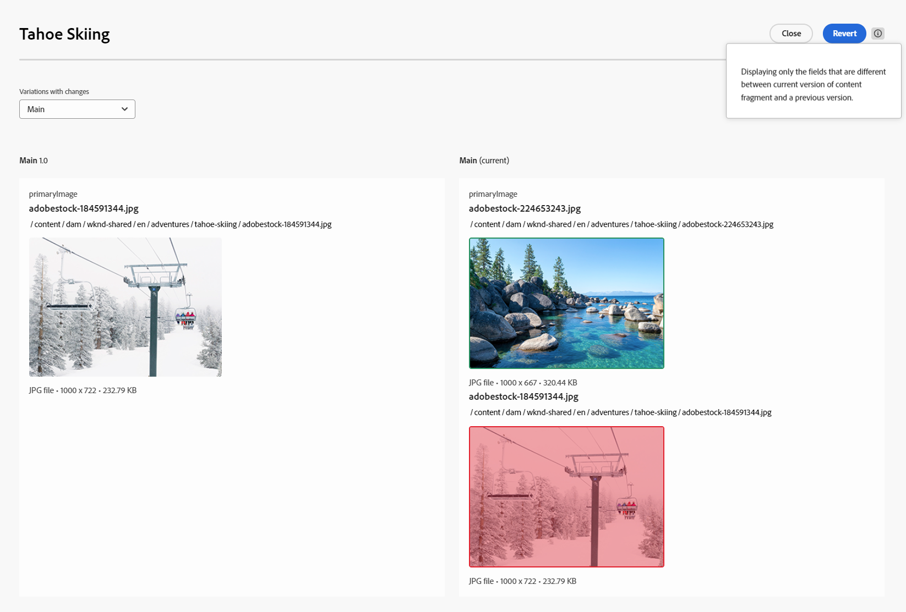

### Revert to a Version {#revert-version}

You can revert to any version. 

To revert to a specific version:

1. Select the three dots icon next to the version.

1. Select **Revert**.

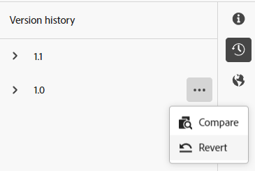

## View the Language Copies {#view-language-copies}

In the **Language properties** tab details of any related language copies are shown. Selecting a link icon, opens the copy in a separate tab.

For example:

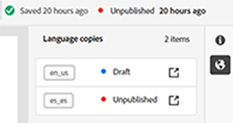

>[!NOTE]
>
>For more details about translating a Content Fragment, and creating language copies, see the [AEM Headless Translation Journey](/help/journey-headless/translation/overview.md).

## Commenting on your Fragment {#commenting-on-your-fragment}

To enable you to collaborate in-product and in-context, the **Comments** tab in the right panel provides the following capabilities:

* Add a new comment
* Tag specific users in a comment
  * They will receive a notification, with a link to open the fragment directly
* Like an existing comment
* Reply to a comment
* Format your comments; basic formatting is available
* Perform a text search through existing comments
* Edit an existing comment
* Delete comments

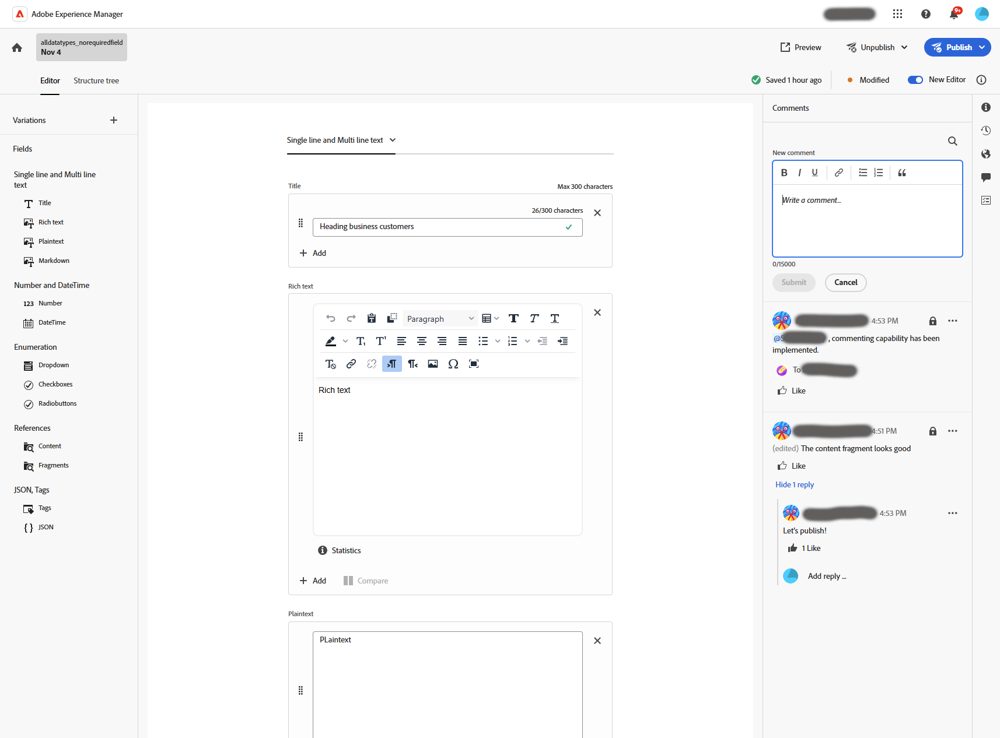

>[!NOTE]
>
>These comments are not visible as [Annotations in the original editor](/help/assets/content-fragments/content-fragments-managing.md#annotating-a-content-fragment), nor in the [Timeline of the Assets console](/help/assets/content-fragments/content-fragments-managing.md#timeline-for-content-fragments).

## Preview your Fragment {#preview-content-fragment}

The Content Fragment editor provides authors with the option to preview their edits in an external frontend application. 

To use this feature, you first need to:

* Work with your IT team to set up the external frontend application that will render the Content Fragment by consuming its JSON output. 
* When the external frontend application is set up, the **Default Preview URL Pattern** must be defined as a [property of the appropriate Content Fragment Model](/help/sites-cloud/administering/content-fragments/content-fragment-models.md#properties).

When the URL has been defined, the **Preview** button is active. You can select this button to launch the external application (in a separate tab) to render the Content Fragment. 

## Publish your Fragment {#publish-content-fragment}

You can **Publish** your fragment to either your:

* Preview instance
* Publish instance

You can publish your fragment from either the editor, or the console. See [Publishing and Previewing a Fragment](/help/sites-cloud/administering/content-fragments/managing.md#publishing-and-previewing-a-fragment) for full details.

## Unpublish your Fragment {#unpublish-content-fragment}

You can also **Unpublish** your fragment from either your:

* Preview instance
* Publish instance

You can unpublish your fragment from either the editor, or the console. See [Unpublishing a fragment](/help/sites-cloud/administering/content-fragments/managing.md#unpublishing-a-fragment) for full details.

## Fields, Data Types and Icons {#fields-datatypes-icons}

The **Fields** panel lists all fields within the Content Fragment. The icon indicates the **[Data Type](/help/sites-cloud/administering/content-fragments/content-fragment-models.md#data-types)**:

<table style="table-layout:auto">
 <tbody>
  <tr>
   <td>
<b>Single line text</b>
 </td>
   <td>
 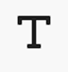 
</td>
  </tr>
  <tr>
   <td>
<b>Multi line text</b>
 </td>
   <td>
  
</td>
  </tr>
  <tr>
   <td>
<b>Number</b>
 </td>
   <td>
 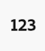 
</td>
  </tr>
  <tr>
   <td>
<b>Boolean</b>
 </td>
   <td>
 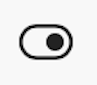 
</td>
  </tr>
  <tr>
   <td>
<b>Date and time</b>
 </td>
   <td>
  
</td>
  </tr>
  <tr>
   <td>
<b>Enumeration</b>
 </td>
   <td>
 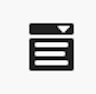 
</td>
  </tr>
  <tr>
   <td>
<b>Tags</b>
 </td>
   <td>
 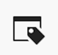 
</td>
  </tr>
  <tr>
   <td>
<b>Content Reference</b>
 </td>
   <td>
  
</td>
  </tr>
  <tr>
   <td>
<b>Fragment Reference</b>
 </td>
   <td>
 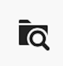 
</td>
  </tr>
  <tr>
   <td>
<b>JSON Object</b>
 </td>
   <td>
 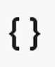 
</td>
  </tr>
  <tr>
   <td>
<b>Tab Placeholder</b>

Although not represented by an actual icon, a <b>Tab Placeholder</b> is represented in the left panel.  It is also represented in the central panel, either horizontally as shown, or in a drop-down list (when there are too many to show horizontally).
 </td>
   <td>
  
</td>
  </tr>
 </tbody>
</table>

## Good to know {#good-to-know}

* To edit a Content Fragment you need [the appropriate permissions](/help/implementing/developing/extending/content-fragments-customizing.md#asset-permissions). Contact your system administrator if you are experiencing issues.

  For example, if you do not have `edit` permissions the editor will be read-only.

* A Content Fragment Model can often define data fields named **Title** and **Description**. If these fields exist, they are user-defined fields and can be updated in the *central panel* when editing the fragment.

  The Content Fragment, and its variations, also have metadata fields (Variation properties) called **Title** and **Description**. These fields are an integral part of any Content Fragment and initially defined when the fragment. They can be updated in the *right panel* when editing the fragment.

* See the Assets documentation for full information about the [original Content Fragment editor](/help/assets/content-fragments/content-fragments-variations.md) - it is available from both the **Assets** console and the **Content Fragments** console.

* Your project team can customize the editor if necessary. See [Customizing the Content Fragment Console and Editor](/help/implementing/developing/extending/content-fragments-console-and-editor.md) for further details.
