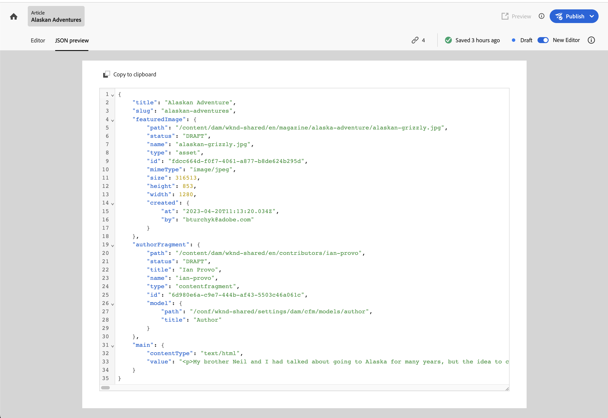

# Authoring Content Fragments {#authoring-content-fragments}

Authoring your Content Fragments is focused on both headless delivery and page authoring.

There are two editors available for Content Fragments. The editor described in this section:

* has been developed for headless content delivery (though it can be used for all scenarios)
* is available from the **Content Fragments** console

>[!CAUTION]
>
>To edit a Content Fragment you need [the appropriate permissions](/help/implementing/developing/extending/content-fragments-customizing.md#asset-permissions). Contact your system administrator if you are experiencing issues.

>[!NOTE]
>
>See the Assets documentation for full information about the [other Content Fragment editor](/help/assets/content-fragments/content-fragments-variations.md) - it is available from both the **Assets** console and the **Content Fragments** console.

>[!NOTE]
>
>Your project team can customize the editor if required. See [Customizing the Content Fragment Console and Editor](/help/implementing/developing/extending/content-fragments-console-and-editor.md) for further details.

## Content Fragment Editor {#content-fragment-editor}

<!-- CHECK: needs new screenshot -->

When you first open the Content Fragment Editor, you see four main areas:

* top toolbar: for key information, and actions
  * a link to the Content Fragment Console (Home icon)
  * information about the model, and folder
  * links to [Preview (if configured for the model)](/help/sites-cloud/administering/content-fragments/content-fragment-models.md#content-fragment-model-properties)
  * Publish actions
  * an option to show all **Parent References** (link icon)
  * [status](/help/sites-cloud/administering/content-fragments/managing.md#statuses-content-fragments) and last saved information
  * a toggle to switch to the Assets-based (original) editor
* left panel: shows the **[Variations](#variations)** for the Content Fragment, and its **Fields**:
  * these links can be used to [navigate the Content Fragment structure](#navigate-structure)
* right panel: presents tabs [showing the properties (metadata) and tags](#view-properties-tags), information about the [version history](#view-version-history), and information related to any [language copies](#view-language-copies)
  * in the **Properties** tab you can update the **Title** and **Description** for the fragment, or **Variation**
* central panel: shows the actual fields, and content, of the selected variation
  * allows you to edit the content
  * if **Tab Placeholder** fields are defined within the model they are shown here, and can be used for navigating

>[!CAUTION]
>
>A Content Fragment Model can often define data fields named **Title** and **Description**. If these fields exist, they are user-defined fields and can be updated in the *central panel* when editing the fragment.
>
>The Content Fragment, and its variations, also have metadata fields (Variation properties) called **Title** and **Description**. These fields are an integral part of any Content Fragment and initially defined when the fragment. They can be updated in the *right panel* when editing the fragment.

<!-- CHECK: needs new screenshot -->

## Navigate the Content Fragment structure {#navigate-structure}

A single Content Fragment consists of two levels:

* **[Variations](#variations)** of the Content Fragment
* **Fields** - defined by the Content Fragment Model, and used by every variation

In the left panel you can see:

* the list of **[Variations](#variations)** that have been created for this fragment:
  * **Main** is the Variation that is present when the Content Fragment is first created, you can add others later
  * you can select and open a Variation for editing
  * you can also [create a Variation](#create-variation)
* the **Fields** within the fragment, and its variations:
  * the icon indicates the [Data Type](/help/sites-cloud/administering/content-fragments/content-fragment-models.md#data-types)
  * the text is the field name
  * together these provide a direct link to the field content in the central panel (for the current Variation)

## Saving and auto-saving {#saving-autosaving}

<!-- cannot be saved, no undo, redo -->

With every update that you make, the Content Fragment is automatically saved. The last time saved is shown in the top toolbar.

## Variations {#variations}

[Variations](/help/sites-cloud/administering/content-fragments/overview.md#constituent-parts-of-a-content-fragment) are a significant feature of AEM's Content Fragments. They allow you to create and edit copies of the **Main** content for use on specific channels, and/or scenarios, making headless content delivery and page authoring even more flexible.

From the editor you can:

* [Create variations](#create-variation) of the **Main** content

* Select the required variation for editing the content

* [Rename your variation](#rename-variation)

* [Delete a Variation](#delete-variation)

### Create a Variation {#create-variation}

To create a Variation of your Content Fragment:

1. In the left panel, select the **plus sign** (**Create variation**) that is to the right of **Variations**.

   <!-- CHECK: needs new screenshot -->

   

1. In the dialog, enter a **Title** for your variation, and a **Description** if wanted:

   <!-- CHECK: needs new screenshot -->

   

1. **Create** the variation. It appears in the list.

### Rename a Variation {#rename-variation}

To rename a **Variation**:

1. Select the required variation.

1. Open the **Properties** tab in the right panel.

1. Update the variation **Title**.

1. Either press **Return** or move to another field to auto-save the change. The title is updated in the **Variations** panel on the left.

### Delete a variation {#delete-variation}

To delete a Variation of your Content Fragment:

>[!NOTE]
>
>You cannot delete **Main**.

<!-- CHECK: needs new screenshot -->

1. Select the Variation.

1. In the **Variation** panel, select the delete icon (Trash Can):

   

1. A dialog opens. Select **Delete** to confirm the action.

## Edit Multi line text fields - Plain text or Markdown {#edit-multi-line-text-fields-plaintext-markdown}

**[Multi line text](/help/sites-cloud/administering/content-fragments/content-fragment-models.md#data-types)** fields can have one of three formats:

<!-- CHECK: might need a new screenshot, or more details -->

* Plain Text
* Markdown
* [Rich Text](#edit-multi-line-text-fields-rich-text)

Fields that are defined as either Plain Text or Markdown have a simple text box, without formatting options:

## Edit Multi line text fields - Rich Text {#edit-multi-line-text-fields-rich-text}

For **[Multi line text](/help/sites-cloud/administering/content-fragments/content-fragment-models.md#data-types)** fields that are defined as **Rich Text**, various features are available:

* Edit the content:
  * Undo/Redo
  * Paste/Paste as Text
  * Copy
  * Select paragraph format
  * Create/manage table
  * Format text; bold, italic, underline, color
  * Set paragraph alignment
  * Create/manage lists; bulleted, numbered
  * Indent text; decrease, increase
  * Clear current formatting
  * Insert links
  * Select and insert references to image assets
  * Add special characters
* [Full-screen editor](#full-screen-editor) - toggle between full-screen and in-flow
* [Statistics](#statistics)
* [Compare and Synchronize](#compare-and-synchronize)

For example:

<!-- CHECK: needs new screenshot -->

>[!NOTE]
>
>Multi line text fields are also indicated by the appropriate [icon](#fields-icons) in the **Fields** panel.

### Full-screen editor - Rich Text {#full-screen-editor-rich-text}

The full-screen editor offers the same editing options as when in-flow - but offers more space for the text.

For example:

<!-- CHECK: needs new screenshot -->

### Statistics - Rich Text {#statistics-rich-text}

The action **Statistics** displays a range of information about the text in a Multi line field. 

For example:

<!-- CHECK: needs new screenshot -->

### Compare and Synchronize - Rich Text {#compare-and-synchronize-rich-text}

The action **Compare** is available for Multi line fields when you have a **Variation** open. 

This opens the Multi line field in full-screen and:

* displays the content for both **Main** and the current **Variation** in parallel, with any differences highlighted
* provides the **Sync** action, which synchronizes the content from **Main** to the current variation

For example:

<!-- CHECK: needs new screenshot -->

## Manage References {#manage-references}

### Fragment References {#fragment-references}

[Fragment References](/help/sites-cloud/administering/content-fragments/content-fragment-models.md##fragment-reference-nested-fragments) can be used to:

* [create a reference to an existing Content Fragment](#create-reference-existing-content-fragment)
* [create a Content Fragment, and then reference it](#create-reference-content-fragment)

#### Create a reference to an existing Content Fragment {#create-reference-existing-content-fragment}

To create a reference to an existing Content Fragment:

1. Select the field.
1. Select **Add existing fragment**. 
1. Select your required fragment from the fragment selector.

   >[!NOTE]
   >
   >You are allowed to select only one fragment at a time.

#### Create a Content Fragment, and reference {#create-reference-content-fragment}

Alternatively you can [select **Create new fragment** to open the **Create** dialog](/help/sites-cloud/administering/content-fragments/managing.md#creating-a-content-fragment). Once created, this fragment will be referenced.

### Content References {#content-references}

[Content References](/help/sites-cloud/administering/content-fragments/content-fragment-models.md#content-reference) are used to reference other AEM content types, such as images, pages, and Experience Fragments.

#### Reference Images {#reference-images}

In **Content Reference** fields you can both:

* reference assets that already exist in the repository
* upload them directly to the field; this avoids the need to use the **Assets** console to upload

  >[!NOTE]
  >
  >To directly upload an image to the **Content Reference** field, it **must**:
  >
  >* have a **Root Path** defined (in the [Content Fragment Model](/help/sites-cloud/administering/content-fragments/content-fragment-models.md#content-reference)). This specifies where the image will be stored.
  >* include **Image** in the list of accepted content types
  
  <!-- CHECK - error message when accepted content types missing Image?
  >
  >If the **Root Path** is not defined you will see an error message when trying to directly upload an image into the **Content Reference** field.
  -->

To add an asset, you can either:

* drag and drop the new asset file directly (for example, from your file system) into the **Content Reference** field
* use the **Add asset** action, then select either **Browse Assets** or **Upload** to open the appropriate selector for you to use:

  <!-- CHECK: needs new screenshot -->

  

#### Reference Pages {#reference-pages}

To add references to AEM pages, Experience Fragments, or other content types:

1. Select **Add content path**.

1. Add the required path in the input field.

1. Confirm with **Add**.

### View References {#view-references}

Selecting the link icon in the top toolbar opens a list of all parent references.

For example:

<!-- CHECK: needs new screenshot -->

A window opens, listing all related references. For example:

<!-- CHECK: needs new screenshot -->

## View Properties, and Tags {#view-properties-tags}

In the properties tab of the right panel, properties (metadata) and tags can be viewed. The properties can be either:

* for the **Content Fragment** - if **Main** is currently selected
* for a specific **Variation**

### Edit Properties and Tags {#edit-properties-tags}

In the properties tab (right panel) you can also edit:
* **Title**
* **Description**
* **Tags** 

### Open the Content Fragment Model {#open-content-fragment-model}

When you have **Main** selected, the name of the underlying Content Fragment Model is shown in the properties section. Selecting the link icon, opens the model in a separate tab.

For example:

## View the Language Copies {#view-language-copies}

In the **Language properties** tab details of any related language copies are shown. Selecting a link icon, opens the copy in a separate tab.

For example:

<!-- CHECK: needs new screenshot -->

>[!NOTE]
>
>For more details about translating a Content Fragment, and creating language copies, see the [AEM Headless Translation Journey](/help/journey-headless/translation/overview.md).

## View the Version History {#view-version-history}

In the **Version history** tab of the right panel, details of the current, and previous, versions are shown:

>[!NOTE]
>
>A new version is created when the content fragment is published.

<!-- CHECK: needs new screenshot -->

<!-- CHECK: Replace with snippet -->

## JSON preview {#json-preview}

Select **JSON preview** from the editor toolbar to show the JSON representation of the current fragment. For example:

>[!NOTE]
>
>See [Content Delivery - JSON Preview](/help/sites-cloud/administering/content-fragments/content-delivery-with-graphql.md#json-preview) for more details.

<!-- CHECK: Replace with snippet -->

## Structure tree {#structure-tree}

Open the **Structure tree** tab from the editor toolbar to show the hierarchical structure of the Content Fragment, and its references. 

>[!NOTE]
>
>See [Analyzing Content Fragment Structure - Structure tree](/help/sites-cloud/administering/content-fragments/analysis.md#structure-tree) for more details.

## Preview your Fragment {#preview-content-fragment}

The Content Fragment editor provides authors with the option to preview their edits in an external frontend application. 

To use this feature, you first need to:

* Work with your IT team to set up the external frontend application that will render the Content Fragment by consuming its JSON output. 
* Once the external frontend application is set up, the **Default Preview URL Pattern** needs to be defined as a [property of the appropriate Content Fragment Model](/help/sites-cloud/administering/content-fragments/content-fragment-models.md#content-fragment-model-properties).

When the URL has been defined, the **Preview** button is active. You can select this button to launch the external application (in a separate tab) to render the Content Fragment. 

## Publish your Fragment {#publish-content-fragment}

You can **Publish** your fragment to either your:

* Preview instance
* Publish instance

You can publish your fragment from either the editor, or the console. See [Publishing and Previewing a Fragment](/help/sites-cloud/administering/content-fragments/managing.md#publishing-and-previewing-a-fragment) for full details.

## Unpublish your Fragment {#unpublish-content-fragment}

You can also **Unpublish** your fragment from either your:

* Preview instance
* Publish instance

You can unpublish your fragment from either the editor, or the console. See [Unpublishing a fragment](/help/sites-cloud/administering/content-fragments/managing.md#unpublishing-a-fragment) for full details.

### Fields (and Icons) {#fields-icons}

<!-- CHECK: needs new screenshot -->

The **Fields** panel lists all fields within the Content Fragment. The icon indicates the **[Data Type](/help/sites-cloud/administering/content-fragments/content-fragment-models.md#data-types)**:

* **Single line text**

  

* **Multi line text**

  

* **Number**

  

* **Boolean**

  

* **Date and time**

  

* **Enumeration**

  

* **Tags**

  

* **Content Reference**

  
  
* **Fragment Reference**

  

* **JSON Object**

  

* **Tab Placeholder**

  Although not represented by an actual icon, a **Tab Placeholder** is represented in the panel:
  
  
