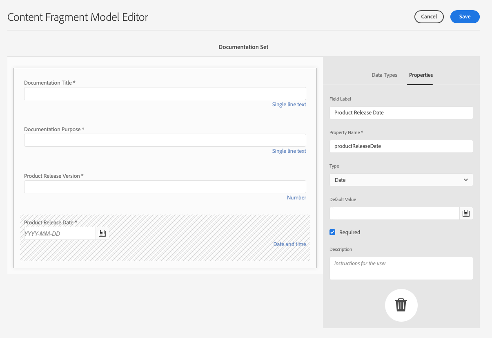
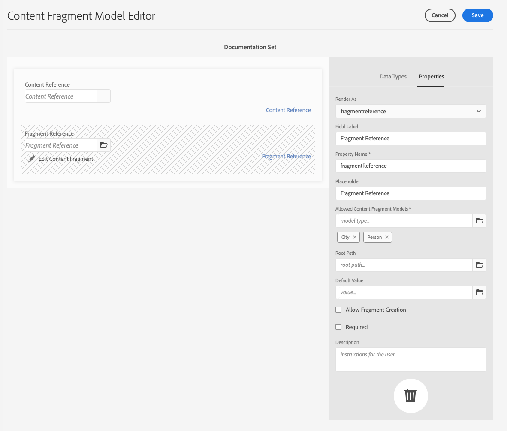

# Defining Content Fragment Models {#defining-content-fragment-models}

>[!IMPORTANT]
>
>Various features of the Content Fragment Models are available through the Early Adopter Program.
>
>To see the status, and how to apply if you are interested, check the [Release Notes](/help/release-notes/release-notes-cloud/release-notes-current.md).

Content Fragment Models in Adobe Experience Manager (AEM) as a Cloud Service define the structure for the content of your [Content Fragments](/help/sites-cloud/administering/content-fragments/overview.md). These fragments can then be used for page authoring, or as a foundation for your headless content.

This page covers how to define your content fragment model, using the dedicated editor. See [Managing your Content Fragment Models](/help/sites-cloud/administering/content-fragments/managing-content-fragment-models.md) for further tasks and options available once your fragments are created, including [actions available from the Content Fragments Console](/help/sites-cloud/administering/content-fragments/managing-content-fragment-models.md#actions), [allowing the model on your folder](/help/sites-cloud/administering/content-fragments/managing-content-fragment-models.md#allowing-content-fragment-models-assets-folder) and [publishing your model](/help/sites-cloud/administering/content-fragments/managing-content-fragment-models.md#publishing-a-content-fragment-model).

>[!CAUTION]
>
>If you will be querying against multiple referenced fragments, then it is not recommended that the various fragment models have field names with the same name, but different types.
>
>For further details see [AEM GraphQL API for use with Content Fragments - Limitations](/help/headless/graphql-api/content-fragments.md#limitations)

## Defining your Content Fragment Model {#defining-your-content-fragment-model}

The Content Fragment Model effectively defines the structure of the resulting Content Fragments using a selection of **[Data Types](#data-types)**. Using the model editor you can add instances of the data types, then configure them to create the required fields:

>[!CAUTION]
>
>Editing a model that is already used by existing Content Fragments can impact those dependent fragments.

1. In the Content Fragment Console, select the panel for [Content Fragment Models](/help/sites-cloud/administering/content-fragments/managing-content-fragment-models.md#basic-structure-handling-content-fragment-models-console) and navigate to the folder holding your Content Fragment model.

   >[!NOTE]
   >
   >You can also open a model directly after [creating it](/help/sites-cloud/administering/content-fragments/managing-content-fragment-models.md#creating-a-content-fragment-model).

1. Open the required model for **Edit**; use either the quick action, or select the model and then the action from the toolbar.

   Once open the model editor shows:

    * left: fields already defined
    * right: **Data Types** available for creating fields (and **Properties** for use once fields have been created)

   >[!NOTE]
   >
   >When a field is defined as **Required**, the **Label** indicated in the left pane is marked with an asterix (**&#42;**).

   

1. **To Add a Field**

   * Drag a required data type to the required location for a field:

     

   * Once a field has been added to the model, the right panel shows the **Properties** that can be defined for that particular data type. Here you can define what is required for that field. 

     * Many properties are self-explanatory, for additional details see [Properties (Data Types)](#properties).
     * Typing a **Field Label** auto-completes the **Property Name**  - if empty, and it can be manually updated afterwards.

       >[!CAUTION]
       >
       >When manually updating the property **Property Name** for a data type, names must contain *only* A-Z, a-z, 0-9 and underscore "_" as special character.
       >
       >If models created in earlier versions of AEM contain illegal characters, remove or update those characters.

     For example:

     

1. **To Remove a Field**

   Select the required field, then select the trash-can icon. You are asked to confirm the action.

   

1. Add all required fields, and define the related properties, as required. For example:

   

1. Select **Save** to persist the definition.

## Data Types {#data-types}

A selection of data types is available for defining your model:

* **Single line text**
  * Add a field for a single line of text; the maximum length can be defined
  * The field can be configured to allow fragment authors to create new instances of the field  

* **Multi line text**
  * A text area that can be Rich Text, Plain Text, or Markdown
  * The field can be configured to allow fragment authors to create new instances of the field  

  >[!NOTE]
  >
  >Whether the text area is Rich Text, Plain Text, or Markdown, is defined in the model by the property **Default Type**. 
  >
  >This format cannot be changed from the [Content Fragment editor](/help/sites-cloud/administering/content-fragments/authoring.md), but only from the Model.

* **Number**
  * Add a numerical field
  * The field can be configured to allow fragment authors to create new instances of the field  

* **Boolean**
  * Add a boolean checkbox

* **Date and time**
  * Add a date and/or time field

* **Enumeration**
  * Add a set of Checkbox, Radio Button, or Dropdown fields
    * You can specify the options available to the fragment author

* **Tags**
  * Allows fragment authors to access and select areas of tags
* **Fragment Reference**
  * References other Content Fragments; can be used to [create nested content](#using-references-to-form-nested-content)
  * The data type can be configured to allow fragment authors to:
    * Edit the referenced fragment directly.
    * Create a new Content Fragment, based on the appropriate model
    * Create new instances of the field 
  * The reference specifies the path to the referenced resource; for example `/content/dam/path/to/resource`
* **Fragment Reference (UUID)**
  * References other Content Fragments; can be used to [create nested content](#using-references-to-form-nested-content)
  * The data type can be configured to allow fragment authors to:
    * Edit the referenced fragment directly.
    * Create a new Content Fragment, based on the appropriate model
    * Create new instances of the field 
  * In the editor, the reference specifies the path to the referenced resource; internally the reference is held as a universally unique ID (UUID) that references the resource
    * You do not need to know the UUID; in the fragment editor you can browse to the required fragment

* **Content Reference**
  * References other content, of any type; can be used to [create nested content](#using-references-to-form-nested-content)
  * If an image is referenced, you can opt to show a thumbnail
  * The field can be configured to allow fragment authors to create new instances of the field 
  * The reference specifies the path to the referenced resource; for example `/content/dam/path/to/resource`  
* **Content Reference (UUID)**
  * References other content, of any type; can be used to [create nested content](#using-references-to-form-nested-content)
  * If an image is referenced, you can opt to show a thumbnail
  * The field can be configured to allow fragment authors to create new instances of the field 
  * In the editor, the reference specifies the path to the referenced resource; internally the reference is held as a universally unique ID (UUID) that references the resource
    * You do not need to know the UUID; in the fragment editor you can browse to the required asset resource

* **JSON Object**
  * Allows the Content Fragment author to enter JSON syntax into the corresponding elements of a fragment. 
    * To allow AEM to store direct JSON that you have copy/pasted from another service.
    * The JSON is passed through, and output as JSON in GraphQL.
    * Includes JSON syntax-highlighting, auto-complete, and error-highlighting in the Content Fragment editor.

* **Tab Placeholder**
  * Allows the introduction of tabs for use when editing the Content Fragment content.
    * These are shown as dividers in the model editor, separating sections of the list of content data types. Each instance represents the start of a new tab.
    * In the fragment editor each instance appears as a tab.

    >[!NOTE]
    >
    >This data type is purely used for formatting, it is ignored by the AEM GraphQL schema.

## Properties (Data Types) {#properties}

Many properties are self-explanatory, for certain properties additional details are below:

* **Property Name**

  When manually updating this property for a data type, names **must** contain *only* A-Z, a-z, 0-9 and underscore "_" as special character.

  >[!CAUTION]
  >
  >If models created in earlier versions of AEM contain illegal characters, remove or update those characters.

* **Render As**

  The various options for realizing/rendering the field in a fragment. Often this allows you to define whether the author will see a single instance of the field, or will be allowed to create multiple instances. When **Multiple Field** is used you can define the minimum and maximum number of items - see [Validation](#validation) for further details. 

* **Field Label**
  Entering a **Field Label** autogenerates a **Property Name**, which can then be manually updated if necessary.

* **Validation**
  Basic validation is available by mechanisms such as the **Required** property. Some data types have addition validation fields. See [Validation](#validation) for further details.

* For the data type **Multi line text** it is possible to define the **Default Type** as either:

  * **Rich Text**
  * **Markdown**
  * **Plain Text**

  If not specified, the default value **Rich Text** is used for this field.

  Changing the **Default Type** in a Content Fragment model will only take effect on an existing, related, Content Fragment after that fragment is opened in the editor and saved.

* **Unique**
  Content (for the specific field) must be unique across all Content Fragments created from the current model. 

  This is used to ensure that content authors cannot repeat content already added in another fragment of the same model. 

  For example, a **Single line text** field called `Country` in the Content Fragment Model cannot have the value `Japan` in two dependent Content Fragments. A warning is issued when the second instance is attempted.

  >[!NOTE]
  >
  >Uniqueness is ensured per language root. 

  >[!NOTE]
  >
  >Variations can have the same *unique* value as variations of the same fragment, but not the same value as used in any variation of other fragments.

* See **[Content Reference](#content-reference)** for more details about that specific data type and its properties.

* See **[Fragment Reference (Nested Fragments)](#fragment-reference-nested-fragments)** for more details about that specific data type and its properties.

* **Translatable**
  
  Checking the **Translatable** checkbox on a field in the Content Fragment Model editor will:

  * Ensure the field's property name is added to the translation configuration, context `/content/dam/<sites-configuration>`, if not already present. 
  * For GraphQL: set a `<translatable>` property on the Content Fragment field to `yes`, to allow GraphQL query filter for JSON output with only translatable content.

## Validation {#validation}

Various data types now include the possibility to define validation requirements for when content is entered in the resulting fragment:

* **Single line text**
  * Compare against a predefined regex.
* **Number**
  * Check for specific values.
* **Content Reference**
  * Test for specific types of content.
  * Only assets of specified file size or smaller can be referenced. 
  * Only images within a predefined range of width and/or height (in pixels) can be referenced. 
* **Fragment Reference**
  * Test for a specific Content Fragment model.
* **Min Number of Items** / **Max Number of Items**

  Fields that have been defined as a **Multiple Field** (set with **Render As**) have the options:

  * **Min Number of Items**
  * **Max Number of Items**

  These are validated in the [Content Fragment Editor](/help/sites-cloud/administering/content-fragments/authoring.md).
  
## Using References to form Nested Content {#using-references-to-form-nested-content}

Content Fragments can form nested content, using either of the following data types:

* [Content Reference](#content-reference)
  * Provides a simple reference to other content; of any type.
  * Provided by the data types:
    * **Content Reference** - path based
    * **Content Reference (UUID)** - UUID based
  * Can be configured for one or multiple references (in the resulting fragment).

* [Fragment Reference](#fragment-reference-nested-fragments) (Nested Fragments)
  * References other fragments, dependent on the specific models specified.
  * Provided by the data types:
    * **Fragment Reference** - path based
    * **Fragment Reference (UUID)** - UUID based
  * Allows you to include/retrieve structured data.
  
    >[!NOTE]
    >
    >This method is of particular interest when you are using [Headless Content Delivery using Content Fragments with GraphQL](/help/sites-cloud/administering/content-fragments/content-delivery-with-graphql.md).
  * Can be configured for one or multiple references (in the resulting fragment).

>[!NOTE]
>
>See [Upgrade your Content Fragments for UUID References](/help/headless/graphql-api/uuid-reference-upgrade.md) for further information about Content/Fragment Reference and Content/Fragment Reference (UUID), and upgrading to the UUID-based data types.

>[!NOTE]
>
>AEM has recurrence protection for:
>
>* Content References
>  This prevents the user from adding a reference to the current fragment, and may lead to an empty Fragment Reference picker dialog.
>
>* Fragment References in GraphQL 
>  If you create a deep query that returns multiple Content Fragments referenced by each other, it returns null on the first occurrence.

>[!CAUTION]
>
>If you will be querying against multiple referenced fragments, then it is not recommended that the various fragment models have field names with the same name, but different types.
>
>For further details see [AEM GraphQL API for use with Content Fragments - Limitations](/help/headless/graphql-api/content-fragments.md#limitations)

### Content Reference {#content-reference}

The **Content Reference** and **Content Reference (UUID)** data types allow you to render content from another source; for example, image, page or Experience Fragment.

In addition to standard properties you can specify:

* The **Root Path**, which specifies, or represents, where to store any referenced content
  >[!NOTE]
  >
  >This is mandatory if you want to directly upload and reference images in this field when using the Content Fragment editor.
  >
  >See [Reference Images](/help/sites-cloud/administering/content-fragments/authoring.md#reference-images) for further details.

* The content types that can be referenced
  >[!NOTE]
  >
  >These must include **Image** if you want to directly upload and reference images in this field when using the Content Fragment editor.
  >
  >See [Reference Images](/help/sites-cloud/administering/content-fragments/authoring.md#reference-images) for further details.

* Limitations for file sizes
* If an image is referenced:
  * Show Thumbnail
  * Image restraints of height and width


### Fragment Reference (Nested Fragments) {#fragment-reference-nested-fragments}

The **Fragment Reference** and **Fragment Reference (UUID)** data types can reference one, or more, Content Fragments. This feature is of particular interest when retrieving content for use in your app, as it allows you to retrieve structured data with multiple layers.

For example:

* A model defining details for an employee; including:
  * A reference to the model that defines the employer (company)

```xml
type EmployeeModel {
    name: String
    firstName: String
    company: CompanyModel
}

type CompanyModel {
    name: String
    street: String
    city: String
}
```

>[!NOTE]
>
>Fragment References are of particular interest for [Headless Content Delivery using Content Fragments with GraphQL](/help/sites-cloud/administering/content-fragments/content-delivery-with-graphql.md).

In addition to standard properties you can define:

* **Render As**:

  * **multifield** - the fragment author can create multiple, individual, references

  * **fragmentreference** - allows the fragment author to select a single reference to a fragment

* **Model Type**
  Multiple models can be selected. When adding references to a Content Fragment, any referenced fragments must have been created using these models.

* **Root Path**
  This specifies, or represents, a root path for any fragments referenced.

* **Allow Fragment Creation**

  This allows the fragment author to create a fragment based on the appropriate model.

  * **fragmentreferencecomposite** - allows the fragment author to build a composite, by selecting multiple fragments

  

>[!NOTE]
>
>A recurrence protection mechanism is in place. It prohibits the user from selecting the current Content Fragment in the Fragment Reference, and may lead to an empty Fragment Reference picker dialog.
>
>There is also recurrence protection for Fragment References in GraphQL. If you create a deep query across two Content Fragments that reference each other, it returns null.
