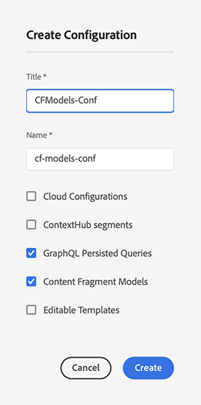

# Content Fragments - Configuration Browser{#content-fragments-configuration-browser}

Learn how to enable specific Content Fragment functionality in the Configuration Browser.

## Enable Content Fragment Functionality for your Instance {#enable-content-fragment-functionality-instance}

Before using Content Fragments, you must use the **Configuration Browser** to enable:

* **Content Fragment Models** - mandatory
* **GraphQL Persisted Queries** - optional

>[!CAUTION]
>
>If you do not enable **Content Fragment Models**:
>
>* the **Create** option is not available for creating models.
>* you cannot [select the Sites configuration to create the related end point](/help/headless/graphql-api/graphql-endpoint.md).

To enable content fragment functionality, you must do the following:

* Enable the use of content fragment functionality via the configuration browser
* Apply the configuration to your Assets folder

### Enable Content Fragment Functionality in Configuration Browser {#enable-content-fragment-functionality-in-configuration-browser}

To use certain [Content Fragment functionality](#creating-a-content-fragment-model), you **must** first enable them by way of the **Configuration Browser**:

>[!NOTE]
>
>For further details, see [Configuration Browser](/help/implementing/developing/introduction/configurations.md#using-configuration-browser).

>[!NOTE]
>
>[Subconfigurations](/help/implementing/developing/introduction/configurations.md#configuration-resolution) (a configuration nested within another configuration) are fully supported for use with Content Fragments, Content Fragment Models and GraphQL queries.
>
>Just to note that:
>
>
>* After creating models in a subconfiguration, it is NOT possible to move or copy the model to another subconfiguration.
>
>* A GraphQL endpoint is (still) based on a parent (root) configuration.
>
>* Persisted queries is (still) saved relevant to the parent (root) configuration.

1. Navigate to **Tools**, **General**, then open the **Configuration Browser**.

1. Use **Create** to open the dialog, where you:

   1. Specify a **Title**.
   1. The **Name** becomes the node name in the repository.
      * It automatically is generated based on the title and adjusted according to [AEM naming conventions](/help/implementing/developing/introduction/naming-conventions.md).
      * You can adjust it if necessary.
   1. To enable their use select 
      * **Content Fragment Models** 
      * **GraphQL Persisted Queries**

      

1. Select **Create** to save the definition.

<!-- 1. Select the location appropriate to your website. -->

### Apply the Configuration to your Folder {#apply-the-configuration-to-your-folder}

When the configuration **global** is enabled for content fragment functionality, it applies to any Assets folder - accessible through the **Assets** console.

To use other configurations (that is, excluding global) with a comparable Assets folder, you have to define the connection. This connection is done by selecting the appropriate **Configuration** in the **Cloud Services** tab of the **Folder Properties** of the appropriate folder.

