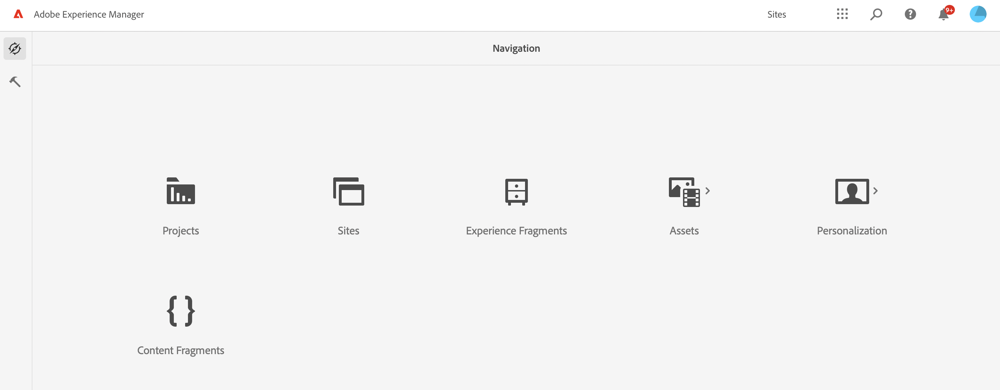
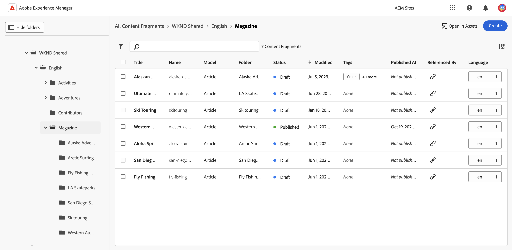
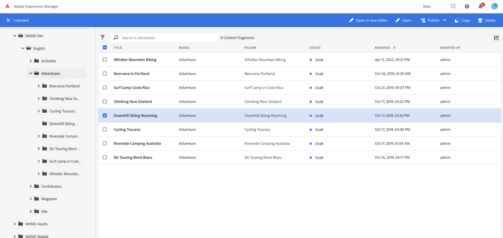
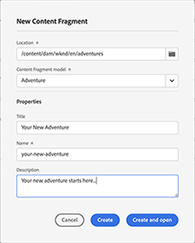
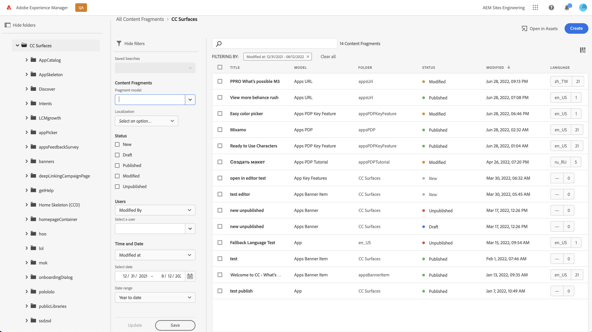
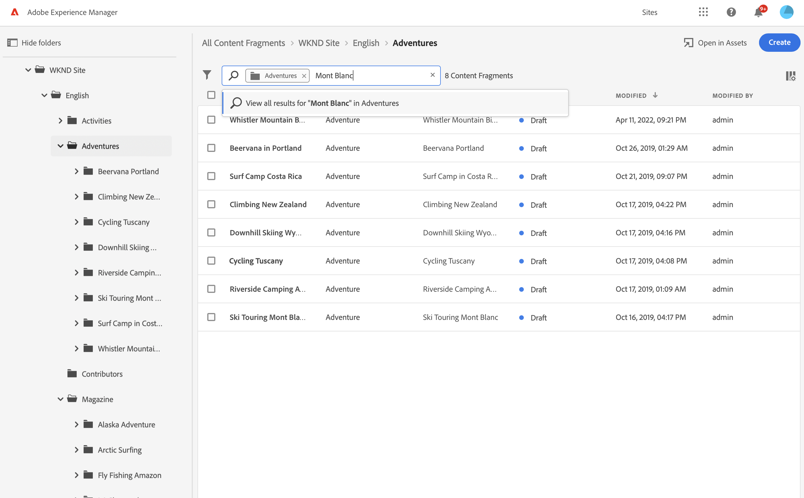

# Content Fragments Console  {#content-fragments-console}

Learn how the Content Fragments console optimizes access to your Content Fragments, helping you create, search, and manage them by taking administrative actions such as publish, unpublish, copy.

The Content Fragments console is dedicated to managing, searching for, and creating Content Fragments. It has been optimized for use in a Headless context, but is also used when creating Content Fragments for use in page authoring.

>[!NOTE]
>
>This console only displays Content Fragments. It does not display other asset types such as images and videos. 

>[!NOTE]
>
>Access to your Content Fragments is currently possible via:
>
>* this **Content Fragments** console
>* the **Assets** console - see [Managing Content Fragments](/help/assets/content-fragments/content-fragments-managing.md)

The Content Fragments console can be directly accessed from the top level of the Global Navigation:

Selecting **Content Fragments** will open the console in a new tab. 

Here you can see that there are three main areas:

* The top toolbar
  * Provides standard AEM functionality
  * Also shows your IMS organization
* The left panel
  * Here you can hide, or reveal, the folder tree
  * You can select a specific branch of the tree
* The main/right panel - from here you can:
  * See the list of all Content Fragments in the selected branch of the tree
    * The location is indicated by the breadcrumbs; these can also be used to change the location
    * Content Fragments from the selected folder, and all child folders will be shown
      * Various fields of information about a Content Fragment provide links; these can open the appropriate fragment in the editor
    * You can select a column header to sort the table according to that column; select again to toggle between ascending and descending
  * **[Create](#creating-new-content-fragment)** a new Content Fragment
  * [Filter](#filtering-fragments) the Content Fragments according to a selection of predicates, and save the filter for future use
  * [Search](#searching-fragments) the Content Fragments 
  * Customize the table view to show selected columns of information
  * Use **Open in Assets** to directly open the current location in the **Assets** console.

    >[!NOTE]
    >
    >The **Assets** console is used to access assets, such as images, videos, etc.  This console can be accessed:
    >
    >* using the **Open in Assets** link (in the Content Fragments console)
    >* directly from the global navigation pane

Selecting a specific fragment will open a toolbar focused on the actions available for that fragment. You can also select multiple fragments - the selection of actions will be adjusted accordingly.

  

## Creating a new Content Fragment {#creating-new-content-fragment}

Selecting **Create** opens the compact **New Content Fragment** dialog:

## Filtering Fragments {#filtering-fragments}

The Filter panel offers:

* a selection of predicates that can be selected and combined
* the opportunity to **Save** your configuration
* the option to retrieve a saved search filter for reuse

## Searching Fragments {#searching-fragments}

The search box supports full-text search. Entering your search terms in the search box:

Will provide the selected results:

The search box also provides quick access to **Recent Content Fragments** and **Saved Searches**:

