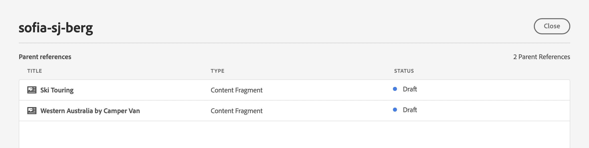
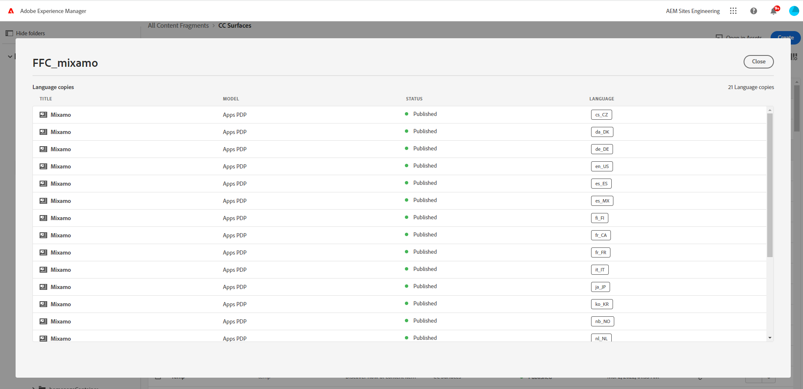
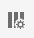
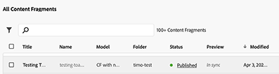
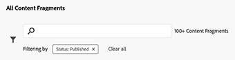

# Content Fragments Console  {#content-fragments-console}

Learn how the Content Fragments console optimizes access to your Content Fragments, helping you create, search, and manage them by taking administrative actions such as publish, unpublish, copy.

The Content Fragments console is dedicated to managing, searching for, and creating Content Fragments. It has been optimized for use in a Headless context, but is also used when creating Content Fragments for use in page authoring.

>[!NOTE]
>
>This console only displays Content Fragments. It does not display other asset types such as images and videos. 

>[!NOTE]
>
>Access to your Content Fragments is currently possible via:
>
>* this **Content Fragments** console
>* the **Assets** console - see [Managing Content Fragments](/help/assets/content-fragments/content-fragments-managing.md)

>[!NOTE]
>
>A selection of [keyboard shortcuts are available for use in this console](/help/sites-cloud/administering/content-fragments/content-fragments-console-keyboard-shortcuts.md).

>[!NOTE]
>
>Your project team can customize the console if required. See [Customizing the Content Fragment Console](/help/implementing/developing/extending/content-fragment-console-customizing.md) for further details.

The Content Fragments console can be directly accessed from the top level of the Global Navigation:

## Basic Structure and Handling of the Console {#basic-structure-handling-content-fragments-console}

Selecting **Content Fragments** will open the console in a new tab. 

Here you can see that there are three main areas:

* The top toolbar
  * Provides standard AEM functionality
  * Also shows your IMS organization
* The left panel
  * Here you can hide, or reveal, the folder tree
  * You can select a specific branch of the tree
  * This can be resized to show nested folders
* The main/right panel - from here you can:
  * See the list of all Content Fragments in the selected branch of the tree:
    * The location is indicated by the breadcrumbs; these can also be used to change the location
    * Content Fragments from the selected folder, and all child folders are shown:
      * [Various fields of information](#selectuse-available-columns) about a Content Fragment provide links; depending on the field, these can:
        * Open the appropriate fragment in the editor
        * Show information about references
        * Show information about language versions of the fragment
        * Fast filter by a selected tag
    * By using mouse-over on the column headers, a drop-down action selector, and width sliders, are shown. These let you do the following:
      * Sort - select the appropriate action for either ascending or descending
        This will sort the entire table according to that column. Sorting is only available on appropriate columns.
      * Resize the column - using either the action, or width sliders

## Actions {#actions}

Within the console there is a range of actions that you can use, either directly, or after selecting a specific fragment:

* Various actions are directly [available from the console](#available-actions)
* You can [select one, or more, Content Fragments to show appropriate actions](#actions-selected-content-fragment)

### Actions (unselected) {#actions-unselected}

Certain actions are available from the console - without selecting a specific Content Fragment:

* **[Create](/help/sites-cloud/administering/content-fragments/content-fragments-managing.md#creating-a-content-fragment)** a new Content Fragment
* [Filter](#filtering-fragments) the Content Fragments according to a selection of predicates, and save the filter for future use
* [Search](#searching-fragments) the Content Fragments 
* [Customize the table view to show selected columns of information](#select-available-columns)
* Use **Open in Assets** to directly open the current location in the **Assets** console

  >[!NOTE]
  >
  >The **Assets** console is used to access assets, such as images, videos, etc.  This console can be accessed:
  >
  >* using the **Open in Assets** link (in the Content Fragments console)
  >* directly from the global navigation pane

### Actions for a (selected) Content Fragment {#actions-selected-content-fragment}

Selecting a specific fragment will open a toolbar focused on the actions available for that fragment. You can also select multiple fragments - the selection of actions are adjusted accordingly.

* **Open**
* **[Publish](/help/sites-cloud/administering/content-fragments/content-fragments-managing.md#publishing-and-previewing-a-fragment)** (and **[Unpublish](/help/sites-cloud/administering/content-fragments/content-fragments-managing.md#unpublishing-a-fragment)**)
* **Copy**
* **Move**
* **Rename**
* **[Delete](/help/sites-cloud/administering/content-fragments/content-fragments-managing.md#deleting-a-fragment)**

>[!NOTE]
>
>Actions such as Publish, Unpublish, Delete, Move, Rename, Copy, trigger an asynchronous job. The progress of that job can be monitored via the AEM Async Jobs UI.

## The Information provided about your Content Fragments {#information-content-fragments}

The main/right panel (table view) of the console provides a range of information about your Content Fragments. Some items also provide direct links to further actions and/or information:

* **Name**
  * Provides a link to open the fragment in the editor.
* **Model**
  * Information only.
  * Can be used for [Fast Filtering](#fast-filtering#fast-filtering)
* **Folder**
  * Provides a link to open the folder in the console.
    Hovering over the folder name will show the JCR path.
* **Status**
  * Information only.
  * Can be used for [Fast Filtering](#fast-filtering#fast-filtering)
* **Preview**
  * Information only:
    * **In sync**: Content Fragment is in-sync on the **Author** and **Preview** services.
    * **Out of sync**: Content Fragment is out-of-sync on the **Author** and **Preview** services. You need to **Publish** to **Preview** to ensure that the two instances return to being in-sync.
    * blank: The Content Fragment does not exist on the **Preview** service.
* **Modified**
  * Information only.
* **Modified By**
  * Information only.
  * Can be used for [Fast Filtering](#fast-filtering#fast-filtering).
* **Tags**
  * Information only.
  * Shows all tags related to the Content Fragment; both Main and any variations.
  * Can be used for [Fast Filtering](#fast-filtering#fast-filtering).
* **Published At**
  * Information only.
* **Published By**
  * Information only.
  * Can be used for [Fast Filtering](#fast-filtering#fast-filtering).
* **Referenced By**
  * Provides a link that opens a dialog listing all parent references of that fragment; including referencing Content Fragments, Experience Fragments and pages. To open a specific reference, click on the **Title** in the dialog.

    

* **Language**

  * Indicates the locale of the content fragment, together with the total number of locales/language copies associated with the content fragment.

    

    * Click/tap on the count to open a dialog that displays all the language copies. To open a specific language copy, click on the **Title** in the dialog.

      

## Select the Available Columns {#select-available-columns}

As with other consoles you can configure the columns that are visible, and available for action:

This will present a list of columns that you can hide or show:

## Filtering Fragments {#filtering-fragments}

The Filter panel offers:

* a selection of predicates; 
  * including content fragment models, localization, tags, status fields, among others
  * one, or more, predicates can be selected and combined to create the filter
* the opportunity to **Save** your configuration
* the option to retrieve a saved search filter for reuse

Once selected, the **Filtering by** options are shown (under the Search box). They can be deselected from there. For example:

### Fast Filtering {#fast-filtering}

You can also select a predicate by clicking on a specific column value in the list. You can select one, or more, values to combine predicates. 

For example, select **Published** in the **Status** column:

>[!NOTE]
>
>Fast filtering is only supported for the **Model**, **Status**, **Modified By**, **Tags**, and **Published By** columns.

After selection, it is shown as a filter predicate, and the list is filtered accordingly:

## Searching Fragments {#searching-fragments}

The search box supports full-text search. Entering your search terms in the search box:

Will provide the selected results:

The search box also provides quick access to **Recent Content Fragments** and **Saved Searches**:

