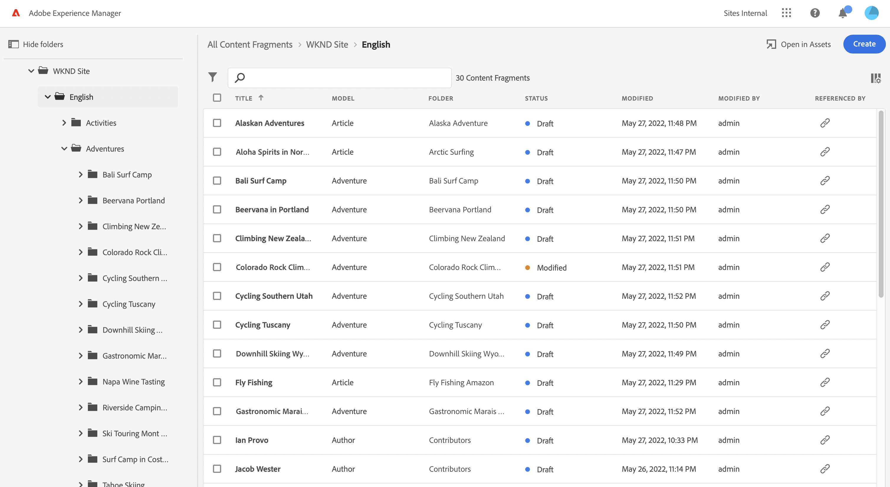
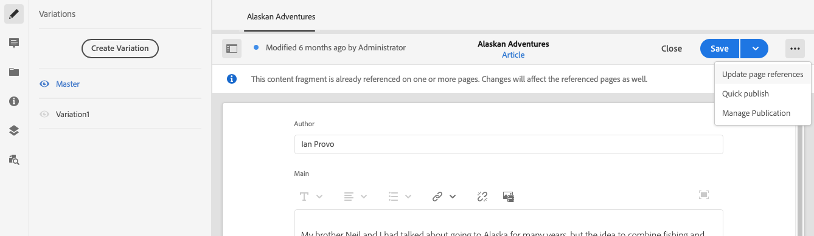

# Managing Content Fragments {#managing-content-fragments}

Learn how to use the **Content Fragments** console to manage your AEM Content Fragments. These can be used for page authoring, or as the basis of your headless content.

After defining your [Content Fragment Models](#creating-a-content-model) you can use these to [create your Content Fragments](#creating-a-content-fragment).

The [Content Fragment Editor](#opening-the-fragment-editor) provides various [modes](#modes-in-the-content-fragment-editor) to enable you to:

* [Edit the content](#editing-the-content-of-your-fragment) and [manage Variations](#creating-and-managing-variations-within-your-fragment)
* [Annotate your Fragment](/help/sites-cloud/administering/content-fragments/content-fragments-variations.md#annotating-a-content-fragment)
* [Associate Content with your Fragment](#associating-content-with-your-fragment)
* [Configure the Metadata](#viewing-and-editing-the-metadata-properties-of-your-fragment)
* [View the Structure Tree](/help/sites-cloud/administering/content-fragments/content-fragments-structure-tree.md)
* [Preview the JSON representation](/help/sites-cloud/administering/content-fragments/content-fragments-json-preview.md)

>[!NOTE]
>
>Content fragments can be used:
>
>* when authoring pages; see [Page Authoring with Content Fragments](/help/sites-cloud/authoring/fundamentals/content-fragments.md).
>* for [Headless Content Delivery using Content Fragments with GraphQL](/help/sites-cloud/administering/content-fragments/content-fragments-graphql.md).

>[!NOTE]
>
>Content Fragments are stored as **Assets**. They are primarily managed from the **Content Fragments** console, but can also be managed from the **Assets** console.

## Creating Content Fragments {#creating-content-fragments}

### Creating a Content Model {#creating-a-content-model}

[Content fragment models](/help/sites-cloud/administering/content-fragments/content-fragments-models.md) can be enabled and created, prior to creating content fragments with structured content.

### Creating a Content Fragment {#creating-a-content-fragment}

To create a content fragment:

1. From the **Content Fragments** console, select **Create** (top-right).

   >[!NOTE]
   >
   >To have the location of the new fragment predefined you can navigate to the folder where you want to create the fragment, or you can specify the location during the creation process.

1. The **New Content Fragment** dialog will open, from here you can specify the:

   * **Location** - this will be auto-completed with the current location, but you can select a different location if required
   * **Content Fragment Model** - select the model to be used as a basis of the fragment from the drop down list
   * **Title**
   * **Name** - this will be auto-completed based on the **Title**, but you can edit it if required
   * **Description** 

   

1. Select **Create**, or **Create and open** to persist your definition.

## Statuses of Content Fragments {#statuses-content-fragments}

During its existence a Content Fragment can have several statuses, as shown in the [Content Fragment Console](/help/sites-cloud/administering/content-fragments/content-fragments-console.md):

* **New**
  A new Content Fragment has been created, but never edited, nor opened, in the Content Fragment editor.
* **Draft**
  Someone has either edited or opened the (new) Content Fragment in the Content Fragment Editor - but it has not yet been published.
* **Published** 
  The Content Fragment has been published.
* **Modified**
  The Content Fragment has been edited after it was published (but before publishing the modification). 
* **Unpublished** 
  The Content Fragment has been unpublished.

## Actions for a Content Fragment in the Content Fragments Console {#actions-content-fragment-console}

In the **Content Fragments** console a range of actions are available for your content fragments from the toolbar:

* **Open in Assets**
* **Create**
* The **Referenced By** column also provides a direct link to show all parent references of that fragment; including referencing Content Fragments, Experience Fragments and pages.
* Hovering over the folder name will show the JCR path.

After selection of your fragment all appropriate actions are available:

* **Open**
* **Publish** (and **Unpublish**)
* **Copy**
* **Move**
* **Rename**
* **Delete**

>[!NOTE]
>
>Actions such as Publish, Unpublish, Delete, Move, Rename, Copy, trigger an asynchronous job. The progress of that job can be monitored via the AEM Async Jobs UI.

## Customizing the view in the Content Fragments Console {#viewing-content-fragment-console}

The console shows information about the content fragments - in the current folder and all child folders.

You can customize the information shown using the **Customize table** icon:

This will open the **Customize table** dialog where you can select/deselect the available columns:

## Search and Filter in the Content Fragments Console {#search-filter-content-fragment-console}

You can search and/or filter the Content Fragments to be shown in the console.

You can:

* select the required folder
* select the filters with the **Show Filters** icon and use the search box in parallel:

A selection of filters are available:

The filters and search combination can also be saved for later reference.

## Opening the Fragment Editor {#opening-the-fragment-editor}

To open your fragment for editing:

>[!CAUTION]
>
>To edit a content fragment you need [the appropriate permissions](/help/implementing/developing/extending/content-fragments-customizing.md#asset-permissions). Please contact your system administrator if you are experiencing issues.

1. Use the **Content Fragments** console to navigate to the location of your content fragment.
1. Open the fragment for editing, by selecting the fragment, then **Open** from the toolbar.

1. The fragment editor will open. Make your changes as required:

   

1. After making changes, use **Save**, **Save & close** or **Close** as required.

   >[!NOTE]
   >
   >**Save & close** is available via the **Save** dropdown.

   >[!NOTE]
   >
   >Both **Save & Close** and **Close** will exit the editor - see [Save, Close and Versions](#save-close-and-versions) for full information on how the various options operate for content fragments.

## Modes and Actions in the Content Fragment Editor {#modes-actions-content-fragment-editor}

There are various modes and actions available from the Content Fragment Editor.

### Modes in the Content Fragment Editor {#modes-in-the-content-fragment-editor}

Navigate through the various modes using the icons in the side panel:

* Variations: [Editing the content](#editing-the-content-of-your-fragment) and [Managing your Variations](#creating-and-managing-variations-within-your-fragment)

* [Annotations](/help/sites-cloud/administering/content-fragments/content-fragments-variations.md#annotating-a-content-fragment)
* [Associated Content](#associating-content-with-your-fragment)
* [Metadata](#viewing-and-editing-the-metadata-properties-of-your-fragment)
* [Structure Tree](/help/sites-cloud/administering/content-fragments/content-fragments-structure-tree.md)
* [Preview](/help/sites-cloud/administering/content-fragments/content-fragments-json-preview.md)

### Toolbar Actions in the Content Fragment Editor {#toolbar-actions-in-the-content-fragment-editor}

Some features in the top toolbar are available from multiple modes:

* A message will be shown when the fragment is already referenced on a content page. You can **Close** the message.

* The side panel can be hidden/shown using the **Toggle Side Panel** icon.

* Underneath the fragment name you can see the name of the [Content Fragment Model](/help/sites-cloud/administering/content-fragments/content-fragments-models.md) used for creating the current fragment:

  * The name is also a link that will open the model editor.

* See the status of the fragment; for example, information about when it was created, modified or published. The status is also color-coded:

  * **New**: grey
  * **Draft**: blue
  * **Published**: green
  * **Modified**: orange
  * **Deactivated**: red

* **Save** provides access to the **Save & close** option.
  
* The three dots (**...**) drop-down provides access to additional actions:
  * **Update page references**
    * This updates any page references. 
  * **[Quick publish](#publishing-and-referencing-a-fragment)**
  * **[Manage Publication](#publishing-and-referencing-a-fragment)**

<!--
This updates any page references and ensures that the Dispatcher is flushed as required. -->

## Save, Close and Versions {#save-close-and-versions}

>[!NOTE]
>
>Versions can also be [created, compared and reverted from the Timeline](/help/sites-cloud/administering/content-fragments/content-fragments-managing.md#timeline-for-content-fragments).

The editor has various options:

* **Save** and **Save & close**

  * **Save** will save the latest changes and remain in the editor.
  * **Save & close** will save the latest changes and exit the editor.

  >[!CAUTION]
  >
  >To edit a content fragment you need [the appropriate permissions](/help/implementing/developing/extending/content-fragments-customizing.md#asset-permissions). Please contact your system administrator if you are experiencing issues. 

  >[!NOTE]
  >
  >It is possible to remain in the editor, making a series of changes, before saving.

  >[!CAUTION]
  >
  >In addition to simply saving your changes, the actions also update any references and ensures that the Dispatcher is flushed as required. These changes can take time to process. Due to this, there can be a performance impact on a large/complex/heavily-loaded system.
  >
  >Please bear this in mind when using **Save & close** and then quickly re-entering the fragment editor to make and save further changes.

* **Close**

  Will exit the editor without saving the latest changes (i.e made since the last **Save**).

While editing your content fragment AEM automatically creates versions to ensure that prior content can be restored if you cancel your changes (using **Close** without saving):

1. When a content fragment is opened for editing AEM checks for the existence of the cookie-based token that indicates whether an *editing session* exists:

   1. If the token is found, the fragment is considered to be part of the existing editing session.
   2. If the token is *not* available and the user starts editing content, a version is created and a token for this new editing session is sent to the client, where it is saved in a cookie.

2. While there is an *active* editing session, the content being edited is automatically saved every 600 seconds (default).

   >[!NOTE]
   >
   >The auto save interval is configurable using the `/conf` mechanism.
   >
   >Default value, see:
   >&nbsp;&nbsp;`/libs/settings/dam/cfm/jcr:content/autoSaveInterval`

3. If the user cancels the edit, the version created at the start of the editing session is restored and the token is removed to end the editing session.
4. If the user selects to **Save** the edits, the updated elements/variations are persisted and the token is removed to end the editing session.

## Editing the Content of your Fragment {#editing-the-content-of-your-fragment}

Once you have opened your fragment, you can use the [Variations](/help/sites-cloud/administering/content-fragments/content-fragments-variations.md) tab to author your content.

## Creating and Managing Variations within your Fragment {#creating-and-managing-variations-within-your-fragment}

Once you have created the Master content, you can create, and manage, [Variations](/help/sites-cloud/administering/content-fragments/content-fragments-variations.md) of that content.

## Associating Content with your Fragment {#associating-content-with-your-fragment}

You can also [associate content](/help/sites-cloud/administering/content-fragments/content-fragments-assoc-content.md) with a fragment. This provides a connection so that assets (i.e. images) can be (optionally) used with the fragment when it is added to a content page.

## Viewing and Editing the Metadata (Properties) of your Fragment {#viewing-and-editing-the-metadata-properties-of-your-fragment}

You can view, and edit, the properties of a fragment using the [Metadata](/help/sites-cloud/administering/content-fragments/content-fragments-metadata.md) tab.

## Publishing and Referencing a Fragment {#publishing-and-referencing-a-fragment}

>[!CAUTION]
>
>If your fragment is based on a model, then you should ensure that the [model has been published](/help/sites-cloud/administering/content-fragments/content-fragments-models.md#publishing-a-content-fragment-model).
>
>If you publish a content fragment for which the model has not yet been published, a selection list will indicate this and the model will be published with the fragment.

Content Fragments must be published for use in the publish environment. This is done using the standard Assets functionality

* From the **Publish** option in the toolbar of the [Content Fragments console](#actions-content-fragment-console)
  * **Now** - after confirmation, the fragment will be published immediately
  * **Schedule** - you can select the date and time when the fragment will be published
  
  When necessary you will be required to specify the **Activation date** and which references to publish. For example:
  

* From the [Content Fragment Editor](#toolbar-actions-in-the-content-fragment-editor)
  * [**Quick Publish**](/help/assets/manage-publication.md#quick-publish)
  * [**Manage Publication**](/help/assets/manage-publication.md#manage-publication) 

In addition, when you [publish a page that uses the fragment](/help/sites-cloud/authoring/fundamentals/content-fragments.md#publishing); the fragment will be listed in the page references.

>[!CAUTION]
>
>After a fragment has been published and/or referenced, AEM will display a warning when an author opens the fragment for editing again. This is to warn that changes to the fragment will affect the referenced pages as well.

## Unpublishing a Fragment {#unpublishing-a-fragment}

To unpublish Content Fragments, select one or more fragments, then **Unpublish**.

>[!NOTE]
>
>The **Unpublish** action will be visible when published fragments are available.

>[!CAUTION]
>
>If the fragment is already referenced from another fragment, or from a page, you will then see a warning message and be required to confirm that you want to proceed.

## Deleting a Fragment {#deleting-a-fragment}

To delete a fragment:

1. In the **Content Fragments** console navigate to the location of the content fragment.
2. Select the fragment.

   >[!NOTE]
   >
   >The **Delete** action is not available as a quick action.

3. Select **Delete** from the toolbar.
4. Confirm the **Delete** action.

   >[!CAUTION]
   >
   >If the fragment is already referenced from another fragment, or from a page, you will then see a warning message and be required to confirm that you want to proceed with a **Force Delete**. The fragment, together with its content fragment component, will be deleted from any content pages.

## Timeline for Content Fragments {#timeline-for-content-fragments}

>[!NOTE]
>
>This functionality is only available in the **Assets** console

In addition to the standard options, [Timeline](/help/assets/manage-digital-assets.md#timeline) provides both information and actions specific to content fragments:

* View information about versions, comments, and annotations
* Actions for Versions

  * **[Revert to this Version](#reverting-to-a-version)** (select an existing fragment, then a specific version)

  * **[Compare to Current](#comparing-fragment-versions)** (select an existing fragment, then a specific version)

  * Add a **Label** and/or **Comment** (select an existing fragment, then a specific version)

  * **Save as Version** (select an existing fragment, then the up arrow at the bottom of Timeline)

* Actions for Annotations

  * **Delete**

>[!NOTE]
>
>Comments are:
>
>* Standard functionality for all assets
>* Made in Timeline
>* Related to the fragment asset
>
>Annotations (for Content Fragments) are:  
>
>* Entered in the fragment editor
>* Specific to a selected segment of text within the fragment
>

For example:

## Comparing Fragment Versions {#comparing-fragment-versions}

>[!NOTE]
>
>This functionality is only available in the **Assets** console

The **Compare to Current** action is available from the [Timeline](/help/sites-cloud/administering/content-fragments/content-fragments-managing.md#timeline-for-content-fragments) after you have selected a specific version.

This will open:

* the **Current** (latest) version (left)

* the selected version **v&lt;*x.y*&gt;** (right)

They will be shown side by side, where:

* Any differences are highlighted

  * Deleted text - red
  * Inserted text - green
  * Replaced text - blue

* The full-screen icon allows you to open either version on its own; then toggle back to the parallel view
* You can **Revert** to the specific version
* **Done** will return you to the console

>[!NOTE]
>
>You cannot edit the fragment content when comparing fragments.

## Reverting to a Version  {#reverting-to-a-version}

>[!NOTE]
>
>This functionality is only available in the **Assets** console

You can revert to a specific version of your fragment:

* Directly from the [Timeline](/help/sites-cloud/administering/content-fragments/content-fragments-managing.md#timeline-for-content-fragments).

  Select the required version, then the **Revert to this Version** action.

* While [comparing a version to the current version](/help/sites-cloud/administering/content-fragments/content-fragments-managing.md#comparing-fragment-versions) you can **Revert** to the selected version.
