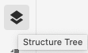
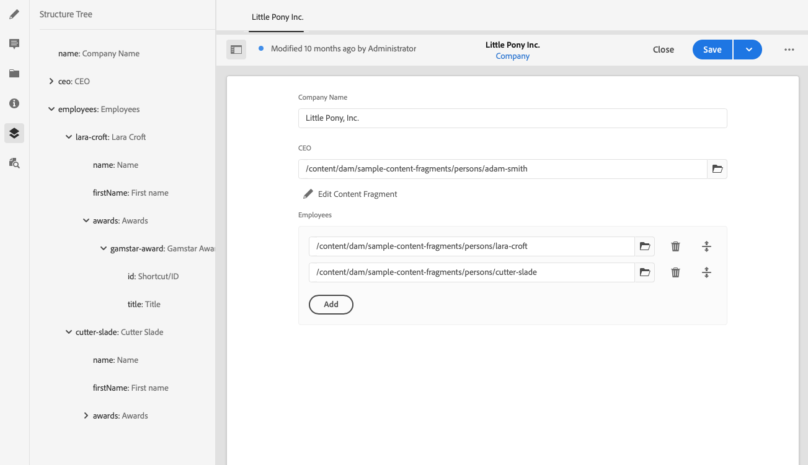

# Content Fragment Structure Tree {#content-fragment-structure-tree}

Use the Structure Tree feature of the Content Fragment Editor in AEM to help you understand your headless content.

In the Content Fragment Editor you can select the Structure Tree icon:

This will open a representation of the fragment's structure in the left hand pane. Using this you can navigate through, and to, referenced fragments. Selecting a reference opens that fragment for editing.

>[!NOTE]
>
>Using the breadcrumbs in the main panel, you can navigate back to your starting point.

