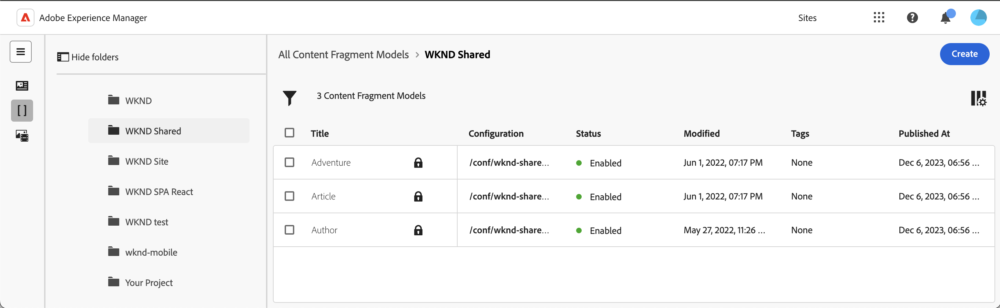
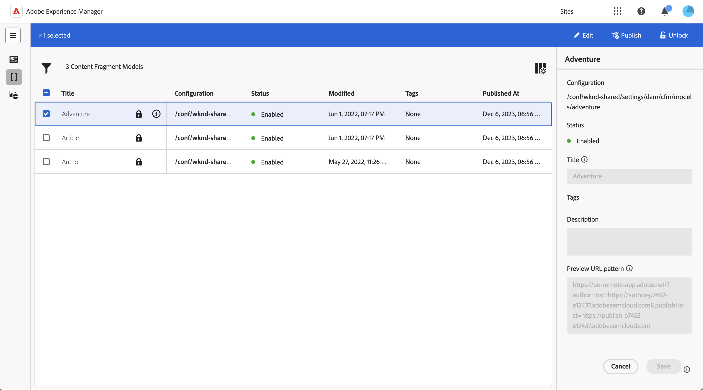
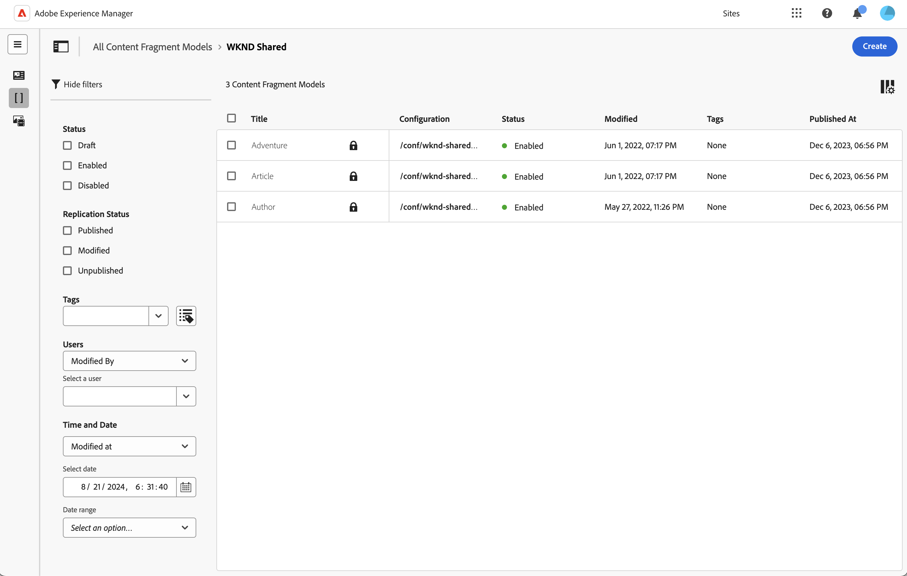
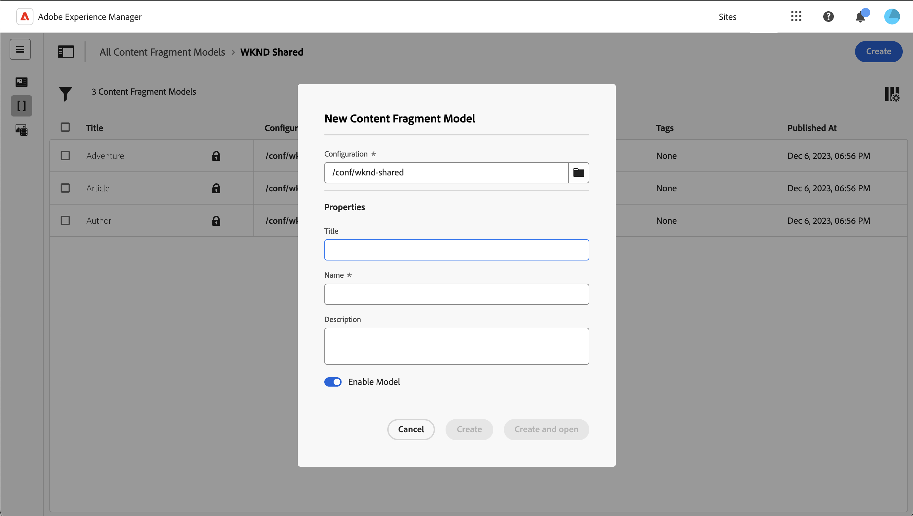

# Managing Content Fragment Models {#managing-content-fragment-models}

From the Content Fragment console you can manage your Content Fragment Models, then [open the editor](/help/sites-cloud/administering/content-fragments/content-fragment-models.md) to define the structure.

Content Fragment Models in Adobe Experience Manager (AEM) as a Cloud Service define the structure for the content of your [Content Fragments](/help/sites-cloud/administering/content-fragments/overview.md). These fragments can then be used as a foundation for your headless content, or for page authoring. 

>[!IMPORTANT]
>
>Various features of the Content Fragment Console are available through the Early Adopter Program.
>
>To see the status, and how to apply if you are interested, check the [Release Notes](/help/release-notes/release-notes-cloud/release-notes-current.md).

>[!NOTE]
>
>This page covers the section of the console that (only) displays Content Fragment Models. For other panels see:
>
>* [Managing Content Fragments](/help/sites-cloud/administering/content-fragments/managing.md) 
>* [Viewing and Managing Assets in the Content Fragments Console](/help/sites-cloud/administering/content-fragments/assets-content-fragments-console.md)

>[!NOTE]
>
>Content Fragments are stored as **Assets**. Content Fragment Models are primarily managed from the **Content Fragments** console, but can also be managed from the [Assets](/help/assets/content-fragments/content-fragments-managing.md) console and the option [Content Fragment Models](/help/assets/content-fragments/content-fragments-models.md) that is available from **Tools** - **General**.

## How to work with Content Fragment Models {#how-to-work-with-content-fragment-models}

As a very quick overview, to work with Content Fragment Models you:

1. [Enable Content Fragment Model functionality for your instance](/help/sites-cloud/administering/content-fragments/setup.md)
1. [Create](#creating-a-content-fragment-model) your Content Fragment Model. 
   * At this point you can also **Enable** the model (for use when creating Content Fragments).
1. [Define](/help/sites-cloud/administering/content-fragments/content-fragment-models.md#defining-your-content-fragment-model) the structure of your model.
1. [Enable your Content Fragment Model](#enabling-a-content-fragment-model), if not already done.
1. [Allow your Content Fragment Models on the required Assets folders](#allowing-content-fragment-models-assets-folder) by configuring **Policies**.

## Basic Structure and Handling of Content Fragment Models in the Console {#basic-structure-handling-content-fragment-models-console}

You can use the far left panel of the [Content Fragments console](/help/sites-cloud/administering/content-fragments/overview.md#content-fragments-console) to select  **Content Fragment Models** as the resource type to view, browse and manage:

This will open the view for Content Fragment Models:

Here you can see that there are three main areas:

* The top toolbar
  * Provides standard AEM functionality
  * Also shows your IMS organization
  * Provides various [actions](#actions-unselected)
* The left panel
  * Shows all [configurations](/help/sites-cloud/administering/content-fragments/setup.md#enable-content-fragment-functionality-configuration-browser) listed as folders
  * Here you can hide, or reveal, the folder tree
  * You can select a specific folder of the tree
  * This can be resized to show nested folders (sub-configurations)
  * As well as Content Fragment Models, you can view [Content Fragments](/help/sites-cloud/administering/content-fragments/managing.md) or [Assets](/help/sites-cloud/administering/content-fragments/assets-content-fragments-console.md); you can also compress, or expand, links to the panels
* The main/right panel - from here you can:
  * See the list of all Content Fragment Models held under the selected folder:
    * Content Fragment Models from the selected folder, and all sub-folders will be shown:
      * The location is indicated by the breadcrumbs; these can also be used to change the location:
    * [Information is shown about each model](#information-content-fragment-models)
      * [You can select which columns to show](#select-columns-console)
    * [Various fields of information](#information-content-fragment-models) about a Content Fragment Model provide links; depending on the field, these can:
      * Open the appropriate model in the editor
      * Show information about the configuration
      * Show information about the status of the model
    * [Certain other fields of information](#information-content-fragments) about a Content Fragment Model can be used for [Fast Filtering](#fast-filtering):
      * Select a value in the column and it is immediately applied as a filter
      * Fast filtering is supported for the **Modified By**, **Published By** and **Status** column.s
    * By using mouse-over on the column headers a drop-down action selector, and width sliders, will be shown. These allow you to:
      * Sort - select the appropriate action for either ascending or descending
        This will sort the entire table according to that column. Sorting is only available on appropriate columns.
      * Resize the column - using either the action, or width sliders
    * Select one, or more, models for further [action](#actions-selected-content-fragment-models)
  * Open the [Filter panel](#filter-content-fragment-models)
  * A selection of [keyboard shortcuts](/help/sites-cloud/administering/content-fragments/keyboard-shortcuts.md) are available for use in this console

## The Information provided about your Content Fragment Models {#information-content-fragment-models}

The main/right panel (table view) of the console provides a range of information about your Content Fragment Models. Some items also provide direct links to further actions and/or information:

* **Name**
  * Provides a link to open the model in the editor.
* Locked
  * When the model is locked, this is indicated with a padlock icon.
* **Configuration**
  * Provides a link to open the configuration in the console.
    Hovering over the folder name will show the JCR path.
* **Status**
  * Information only.
  * Can be used for [Fast Filtering](#fast-filtering)
* **Modified**
  * Information only.
* **Modified By**
  * Information only.
  * Can be used for [Fast Filtering](#fast-filtering).
* **Tags**
  * Information only.
  * Shows all tags related to the model.
  * Can be used for [Fast Filtering](#fast-filtering).
* **Published At**
  * Information only.
* **Published By**
  * Information only.
  * Can be used for [Fast Filtering](#fast-filtering).

## Model Properties {#model-properties}

When you select a specific model, the properties of that model are shown (as defined when [creating the model](#creating-a-content-fragment-model)). If the model is not **Locked**, then some items can be updated. You can also use the information icon (next to the model **Title**) to open and close this information panel.

* **[Configuration](/help/sites-cloud/administering/content-fragments/setup.md#enable-content-fragment-functionality-configuration-browser)**
* **[Status](#enabling-a-content-fragment-model)**
* **Title**
* **Tags**
* **Description**
* **Preview URL pattern**

  Content Fragment Models allow authors to **Preview** their content in an external frontend application. Once the **Preview Service** is configured, add the URL for the frontend application.

  The preview URL should follow this pattern:
  &nbsp;&nbsp;&nbsp;&nbsp;`https://<preview_url>?param=${expression}`

  Available expressions are:

  * `${contentFragment.path}`
  * `${contentFragment.model.path}`
  * `${contentFragment.model.name}`
  * `${contentFragment.variation}`
  * `${contentFragment.id}`

<!-- CHECK: currently under FT -->
<!--
* **GraphQL**
  Define names relevant for GraphQL.
  Changing the GraphQL API Name, or Query field names will impact client applications.
  * **API Name**
    Represents the GraphQL type and query field names in the GraphQL schema.
  * **Single Query Field Name**
    Represents the GraphQL single query field name in the GraphQL schema.
  * **Multiple Query Field Name**
    Represents the GraphQL multiple query field name in the GraphQL schema.
-->

## Actions {#actions}

Once you have selected a folder (in the left panel) there is a range of actions that you can use, either directly, or after selecting a specific model:

* Various actions are directly [available from the console](#actions-unselected)
* You can [select one, or more, Content Fragment Models to show appropriate actions](#actions-selected-content-fragment)

### Actions (unselected) {#actions-unselected}

Certain actions are available from the console - after selecting a folder, but without selecting a specific Content Fragment Model:

* **[Create](#creating-a-content-fragment-model)** a new (empty) model

### Actions for a Content Fragment Model in the Content Fragments Console {#actions-selected-content-fragment-models}

Selecting a specific model opens a toolbar focused on the actions available for that model. You can also select multiple models - the actions available will be adjusted accordingly.

* **[Edit](/help/sites-cloud/administering/content-fragments/content-fragment-models.md)** to define your Content Fragment Model. 
* **Publish** to either the [Publish](/help/implementing/cloud-manager/manage-environments.md#environment-types) or [Preview](/help/implementing/cloud-manager/manage-environments.md#access-preview-service) tiers.
* **Lock**/**Unlock** to control whether a user is allowed to modify the Model.
* **[Enable](#enabling-a-content-fragment-model)**/**[Disable](#disabling-a-content-fragment-model)** to control whether a user is allowed to create Content Fragments based on this model.

Selecting a single model also shows the [model properties](#properties) in the right panel. 

## Select columns shown in the console {#select-columns-console}

As with other consoles you can configure the columns that are visible, and available for action:

This will present a list of columns that you can hide or show:

## Filter Content Fragment Models {#filter-content-fragment-models}

The Filter panel offers:

* a selection of predicates; 
  * including status fields, tags, users, among others
  * one, or more, predicates can be selected and combined to create the filter

<!--
* the opportunity to **Save** your filter
* the option to retrieve a saved search filter for reuse
-->

 Once selected, the **Filtering by** options are shown (at the top of the main panel). They can be deselected from there. For example:

### Fast Filtering {#fast-filtering}

You can also select a predicate by clicking on a specific column value in the list. You can select one, or more, values to combine predicates. 

For example, select **Enabled** in the **Status** column. Once selected, this will be shown as a filter predicate, and the list will be filtered accordingly.

>[!NOTE]
>
>Fast filtering is only supported for the **Status**, **Modified By**, **Tags**, and **Published By** columns.

>[!NOTE]
>
>Fast Filtering operates in the same way as for [Content Fragments](/help/sites-cloud/administering/content-fragments/managing.md#fast-filtering) in the console.

## Creating a Content Fragment Model {#creating-a-content-fragment-model}

1. Navigate to the folder appropriate to your [configuration, or subconfiguration](/help/sites-cloud/administering/content-fragments/setup.md).
1. Use **Create** to open the dialog.

   >[!CAUTION]
   >
   >The **Create** option will only be available:
   >
   >* If the [use of Content Fragment Models has been enabled](/help/sites-cloud/administering/content-fragments/setup.md)
   >* when you have selected the folder where you want to create the model.

1. Select the **Configuration** and specify the **Name**.

   >[!NOTE]
   >
   >The configuration will be auto-filled with the current configuration (the folder you are currently in). 
   >
   >You can also change the configuration, by clicking on the folder icon.

   You can also define various properties:

   * **Title**
     If you enter the **Title** first, the **Name** will be generated from that.
   * a **Description** 
   * **Enable model** to [enable the model](#enabling-disabling-a-content-fragment-model) 

    >[!NOTE]
    >
    >See [Content Fragment Model - Properties](#model-properties) for full details.

   

1. Use **Create** to save the empty model, or **Create and open**.

### Enabling a Content Fragment Model {#enabling-a-content-fragment-model}

Once a model has been created it must be enabled so that it:

* Is available for selection when creating a Content Fragment.
* Can be referenced from within a Content Fragment Model.
* Is available to GraphQL; so the schema is generated.

You can **Enable** a model:

* When creating a new model
  * An option is presented in the dialog.
* When a model has been specifically **Disabled**
  * When the required Model is selected, the **Enable** action is available in the top toolbar.

### Disabling a Content Fragment Model {#disabling-a-content-fragment-model}

A model can also be disabled so that:

* The model is no longer available as a basis for creating *new* Content Fragments.
* However:
  * The GraphQL schema keeps being generated and is still queryable (to avoid impacting JSON API).
  * Any Content Fragments based of the model can still be queried and returned from the GraphQL endpoint.
* The model cannot be referenced anymore, but existing references are kept untouched, and can still be queried and returned from the GraphQL endpoint.

To disable a Model that is flagged as **Enabled**, you use the **Disable** option from:

* The top toolbar, when the required Model is selected.

## Allowing Content Fragment Models on your Assets Folder {#allowing-content-fragment-models-assets-folder}

To implement content governance, you can configure **Policies** on Assets folder to control which Content Fragment Models are allowed for Fragment creation in that folder. 

>[!NOTE]
>
>The mechanism is similar to [allowing page templates](/help/sites-cloud/authoring/page-editor/templates.md#allowing-a-template-author) for a page, and its children, in advanced properties of a page. 

To configure the **Policies** for **Allowed Content Fragment Models**:

1. Navigate and open **Properties** for the required Assets folder.

1. Open the **Policies** tab, where you can configure:

   * **Inherited from `<folder>`**

     Policies are automatically inherited when creating new child folders; the policy can be reconfigured (and the inheritance broken) if subfolders need to allow models different to the parent folder. 

   * **Allowed Content Fragment Models by Path**

     Multiple models can be allowed.

   * **Allowed Content Fragment Models by Tag**

     Multiple models can be allowed.

   

1. **Save** any changes.

The Content Fragment Models allowed for a folder are resolved as follows:

* The **Policies** for **Allowed Content Fragment Models**.
* If empty, then try to determine the policy using the inheritance rules.
* If the inheritance chain does not deliver a result, then look at the **Cloud Services** configuration for that folder (also first directly and then via inheritance).
* If none of the above deliver any results, then there are no allowed models for that folder.

<!--
## Deleting a Content Fragment Model {#deleting-a-content-fragment-model}

>[!CAUTION]
>
>Deleting a Content Fragment model can impact dependent fragments.

To delete a Content Fragment model:

1. Navigate to, and select your Content Fragment Model. You can select multiple models.

1. Select **Delete** from the toolbar.

   >[!NOTE]
   >
   >If the model is referenced a warning is given, so that you can take appropriate action.
-->

## Publishing a Content Fragment Model {#publishing-a-content-fragment-model}

Content Fragment Models need to be published when/before any dependent Content Fragments are published.

To publish a Content Fragment Model:

1. Navigate to, and select your Content Fragment Model. You can select multiple models.

1. Select **Publish** from the toolbar.

1. In the Publish dialog select the **Destination**:

   * **Publish service**
   * **Preview service**

1. The workflow to publish the selected models and their references will be started. The published status is then shown in the console. 

<!--
## Unpublishing a Content Fragment Model {#unpublishing-a-content-fragment-model}

Content Fragment Models can be unpublished if they are not referenced by any fragments.

To unpublish a Content Fragment Model:

1. Navigate to, and select your Content Fragment Model.
1. Select **Unpublish** from the toolbar.
   The published status is indicated in the console. 

If you try to unpublish a model that is currently used by one or more fragments, then an error warning is shown. For example: 

The message suggests that you check the [References](/help/sites-cloud/authoring/basic-handling.md#references) panel to investigate further:

-->

## Locked Content Fragment Models {#locked-content-fragment-models}

This feature allows you to control whether a model can be updated, but it also provides governance for Content Fragment Models that have been published. 

### The Challenge {#the-challenge}

* Content Fragment Models determine the schema for GraphQL queries in AEM. 

  * AEM GraphQL schemas are created as soon as a Content Fragment Model is created, and they can exist on both author and publish environments. 

  * Schemas on publish are the most critical as they provide the foundation for live delivery of Content Fragment content in JSON format.  

* Problems can occur when Content Fragment Models are modified, or in other words edited. This means that the schema changes, which in turn may affect existing GraphQL queries. 

* Adding new fields to a Content Fragment Model should (typically) not have any detrimental effects. However, modifying existing data fields (for example, their name) or deleting field definitions, will break existing GraphQL queries when they are requesting these fields. 

### The Requirements {#the-requirements}

* To make users aware of the risks when editing models that are already used for live content delivery - in other words, models that have been published). 

* Also, to avoid unintended changes. 

Either of these criteria might break queries if the modified models are republished. 

### The Solution {#the-solution}

To address these issues, Content Fragment Models are *locked* into a READ-ONLY mode on author - as soon as they have been published. This status is indicated by **Locked**.

When the model is **Locked** (in READ-ONLY mode), you can see the contents and structure of models but you cannot edit them. 

You can manage **Locked** models from either the console, or the model editor:

* Console

  From the console, you can manage the READ-ONLY mode with the **Unlock** and **Lock** actions in the toolbar.

  * You can **Unlock** a model to enable edits.
  
    If you select **Unlock** a warning is shown, and you must confirm the **Unlock** action.

    You can then open the model for editing.
    
  * You can also **Lock** the model afterwards.
  * Republishing the model immediately returns it to **Locked** (READ-ONLY) mode.

* Model Editor

  * When you open a model that is locked you will be warned, and presented with three actions: **Cancel**, **View Read Only**, **Edit**.

  * If you select **View Read Only**, you can see the content and structure of the model.

  * If you select **Edit**, you can edit and save your updates: 
  
    

    >[!NOTE]
    >
    >There may still a warning at the top, but that is when the model is already in use by existing Content Fragments. 

  * **Cancel** returns you to the console.
