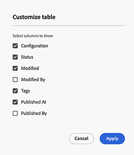
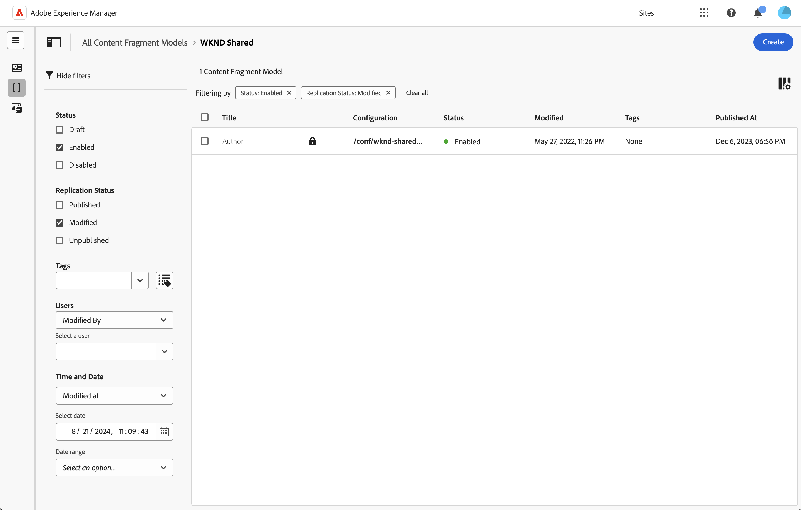

# Managing Content Fragment Models {#managing-content-fragment-models}

From the Content Fragment console you can manage your Content Fragment Models, then [open the editor](/help/sites-cloud/administering/content-fragments/content-fragment-models.md) to define the structure.

Content Fragment Models in Adobe Experience Manager (AEM) as a Cloud Service define the structure for the content of your [Content Fragments](/help/sites-cloud/administering/content-fragments/overview.md). These fragments can then be used as a foundation for your headless content, or for page authoring. 

## The Content Fragments Console {#content-fragments-console}

The Content Fragments console is dedicated to managing, searching for, and creating [Content Fragments](/help/sites-cloud/administering/content-fragments/managing.md), Content Fragment Models and [Assets](/help/sites-cloud/administering/content-fragments/assets-content-fragments-console.md). It has been optimized for use in a Headless context, but is also used when creating Content Fragments and Content Fragment Models for use in page authoring.

>[!NOTE]
>
>This page covers the section of the console that (only) displays Content Fragment Models. For other panels see:
>
>* [Managing Content Fragments](/help/sites-cloud/administering/content-fragments/managing.md)
>* [Viewing and Managing Assets in the Content Fragments Console](/help/sites-cloud/administering/content-fragments/assets-content-fragments-console.md)

The Content Fragments console provides direct access to your fragment models, and related tasks. The console can be directly accessed from the top level of the Global Navigation.

For detailed further information see:

* [Basic Structure and Handling of Content Fragment Models in the Content Fragments Console](#basic-structure-handling-content-fragment-models-console)

* [The Information provided about your Content Fragment Models](#information-content-fragment-models)

* [Actions for a Content Fragment Model in the Content Fragments Console](#actions-selected-content-fragment-models)

* [Select columns shown in the console](#select-columns-console)

* [Search and Filter Content Fragment Models in the Content Fragments Console](#filtering-fragment-models)

* A selection of [keyboard shortcuts](/help/sites-cloud/administering/content-fragments/keyboard-shortcuts.md) are available for use in this console

>[!CAUTION]
>
>This console is *only* available in the online Adobe Experience Manager (AEM) as a Cloud Service.

### Basic Structure and Handling of Content Fragment Models in the Console {#basic-structure-handling-content-fragment-models-console}

Here you can see that there are three main areas:

* The top toolbar
  * Provides standard AEM functionality
  * Also shows your IMS organization
  * Provides various [actions](#actions-unselected)
* The left panel
  * Here you can hide, or reveal, the folder tree
  * You can select a specific configuration of the tree
  * This can be resized to show sub-configurations
  * As well as Content Fragment Models, you can view [Content Fragments](/help/sites-cloud/administering/content-fragments/managing.md) or [Assets](/help/sites-cloud/administering/content-fragments/assets-content-fragments-console.md); you can also compress, or expand, links to the panels
* The main/right panel - from here you can:
  * See the list of all Content Fragment Models held under the selected configuration:
    * Content Fragment Models from the selected configuration, and all sub-configurations will be shown:
      * The location is indicated by the breadcrumbs; these can also be used to change the location:
    * [Information is shown about each model](#information-content-fragment-models)
      * [You can select which columns to show](#select-columns-console)
    * [Various fields of information](#information-content-fragment-models) about a Content Fragment provide links; depending on the field, these can:
      * Open the appropriate model in the editor
      * Show information about the configuration
      * Show information about the status of the model
    * [Certain other fields of information](#information-content-fragments) about a Content Fragment Model can be used for [Fast Filtering](#fast-filtering):
      * Select a value in the column and it is immediately applied as a filter
      * Fast filtering is supported for the **Modified By**, **Published By** and **Status** column.s
    * By using mouse-over on the column headers a drop-down action selector, and width sliders, will be shown. These allow you to:
      * Sort - select the appropriate action for either ascending or descending
        This will sort the entire table according to that column. Sorting is only available on appropriate columns.
      * Resize the column - using either the action, or width sliders
    * Select one, or more, models for further [action](#actions-selected-content-fragment-models)
  * Open the [Filter panel](#filter-fragment-models)

### The Information provided about your Content Fragment Models {#information-content-fragment-models}

The main/right panel (table view) of the console provides a range of information about your Content Fragments. Some items also provide direct links to further actions and/or information:

* **Name**
  * Provides a link to open the fragment in the editor.
* Locked
  * When the model is locked, this is indicated with a padlock icon.
* **Configuration**
  * Provides a link to open the configuration in the console.
    Hovering over the folder name will show the JCR path.
* **Status**
  * Information only.
  * Can be used for [Fast Filtering](#fast-filtering)
* **Modified**
  * Information only.
* **Modified By**
  * Information only.
  * Can be used for [Fast Filtering](#fast-filtering).
* **Tags**
  * Information only.
  * Shows all tags related to the Content Fragment; both Main and any variations.
  * Can be used for [Fast Filtering](#fast-filtering).
* **Published At**
  * Information only.
* **Published By**
  * Information only.
  * Can be used for [Fast Filtering](#fast-filtering).

#### Additional information {#additional-information}

When you select a specific model, additional information is shown. If the model is not **Locked**, then some items can be updated. You can also use the information icon (next to the model **Title**) to open and close this information panel.

* **[Configuration](/help/sites-cloud/administering/content-fragments/setup.md#enable-content-fragment-functionality-configuration-browser)**
* **[Status](#enabling-a-content-fragment-model)**
* **Title**
* **Tags**
* **Description**
* **Preview URL pattern**

### Actions {#actions}

Once you have selected a configuration (in the left panel) there is a range of actions that you can use, either directly, or after selecting a specific model:

* Various actions are directly [available from the console](#actions-unselected)
* You can [select one, or more, Content Fragment Models to show appropriate actions](#actions-selected-content-fragment)

#### Actions (unselected) {#actions-unselected}

Certain actions are available from the console - after selecting a configuration, but without selecting a specific Content Fragment Model:

* **[Create](#creating-a-content-fragment-model)** a new (empty) model

#### Actions for a Content Fragment Model in the Content Fragments Console {#actions-selected-content-fragment-models}

Selecting a specific model opens a toolbar focused on the actions available for that model. You can also select multiple models - the actions available will be adjusted accordingly.

* **[Edit](/help/sites-cloud/administering/content-fragments/content-fragment-models.md)** to define your Content Fragment Model
* **Publish**
* **Lock**/**Unlock**
* **[Enable](#enabling-a-content-fragment-model)**/**[Disable](#disabling-a-content-fragment-model)** to control whether it is available for use

Selecting a single model also shows [additional information](#additional-information) in the right panel. 

## Select columns shown in the console {#select-columns-console}

As with other consoles you can configure the columns that are visible, and available for action:

This will present a list of columns that you can hide or show:

## Filter Content Fragment Models {#filter-fragment-models}

The Filter panel offers:

* a selection of predicates; 
  * including status fields, tags, users, among others
  * one, or more, predicates can be selected and combined to create the filter

<!--
* the opportunity to **Save** your configuration
* the option to retrieve a saved search filter for reuse
-->

 Once selected, the **Filtering by** options are shown (at the top of the main panel). They can be deselected from there. For example:

### Fast Filtering {#fast-filtering}

You can also select a predicate by clicking on a specific column value in the list. You can select one, or more, values to combine predicates. 

For example, select **Enabled** in the **Status** column. Once selected, this will be shown as a filter predicate, and the list will be filtered accordingly.

>[!NOTE]
>
>Fast filtering is only supported for the **Status**, **Modified By**, **Tags**, and **Published By** columns.

>[!NOTE]
>
>Fast Filtering operates in the same way as for [Content Fragments](/help/sites-cloud/administering/content-fragments/managing.md#fast-filtering) in the console.

## Creating a Content Fragment Model {#creating-a-content-fragment-model}

1. Navigate to the folder appropriate to your [configuration, or subconfiguration](/help/sites-cloud/administering/content-fragments/setup.md).
1. Use **Create** to open the dialog.

   >[!CAUTION]
   >
   >If the [use of Content Fragment models have not been enabled](/help/sites-cloud/administering/content-fragments/setup.md), the **Create** option will not be available.

1. Select the **Configuration** and specify the **Name**.

   You can also define various properties:

   * **Title**
     If you enter the **Title** first, the **Name** will be generated from that.
   * a **Description** 
   * **Enable model** to [enable the model](#enabling-disabling-a-content-fragment-model) 

    >[!NOTE]
    >
    >See [Content Fragment Model - Properties](/help/sites-cloud/administering/content-fragments/content-fragment-models.md#content-fragment-model-properties) for full details.

   

1. Use **Create** to save the empty model, or **Create and open**.

### Enabling a Content Fragment Model {#enabling-a-content-fragment-model}

Once a model has been created it must be enabled so that it:

* Is available for selection when creating a Content Fragment.
* Can be referenced from within a Content Fragment Model.
* Is available to GraphQL; so the schema is generated.

You can **Enable** a model:

* When creating a new model
  * An option is presented in the dialog.
* When a model has been specifically **Disabled**
  * When the required Model is selected, the **Enable** action is available in the top toolbar.

### Disabling a Content Fragment Model {#disabling-a-content-fragment-model}

A model can also be disabled so that:

* The model is no longer available as a basis for creating *new* Content Fragments.
* However:
  * The GraphQL schema keeps being generated and is still queryable (to avoid impacting JSON API).
  * Any Content Fragments based of the model can still be queried and returned from the GraphQL endpoint.
* The model cannot be referenced anymore, but existing references are kept untouched, and can still be queried and returned from the GraphQL endpoint.

To disable a Model that is flagged as **Enabled**, you use the **Disable** option from either:

* The top toolbar, when the required Model is selected.
