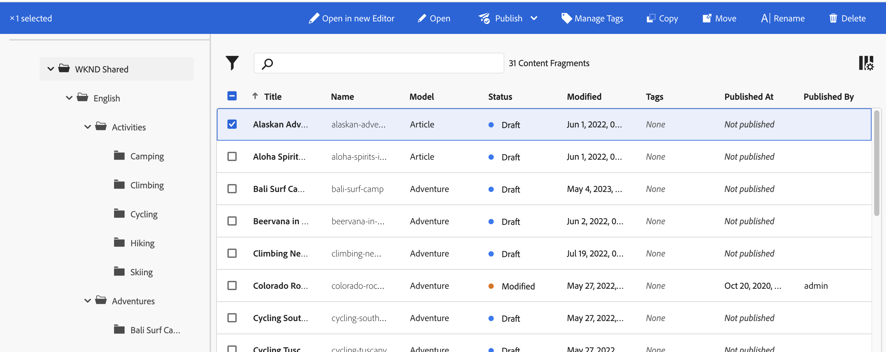
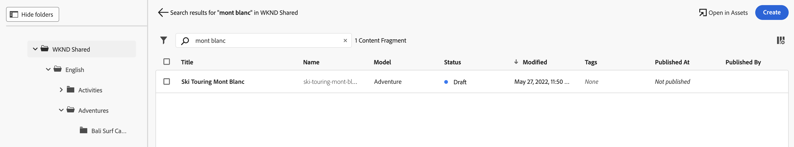
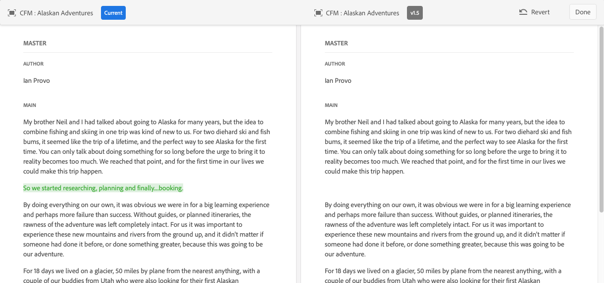

# Managing Content Fragments {#managing-content-fragments}

Learn how to manage your **Content Fragments** in Adobe Experience Manager (AEM) as a Cloud Service, from the dedicated [Content Fragments console](#content-fragments-console), and [Content Fragment editor](/help/sites-cloud/administering/content-fragments/authoring.md#content-fragment-editor). These Content Fragments can be used as the basis of your headless content, or for page authoring.

>[!NOTE]
>
>Your project team can customize the console and editor if required. See [Customizing the Content Fragment Console and Editor](/help/implementing/developing/extending/content-fragments-console-and-editor.md) for further details.

After defining your [Content Fragment Models](#creating-a-content-model) you can use these to [create your Content Fragments](#creating-a-content-fragment). Then open the [Content Fragment Editor](#opening-the-fragment-editor) to [author your content](/help/sites-cloud/administering/content-fragments/authoring.md).

<!--
* [Edit the content and manage your Variations](#editing-the-content-of-your-fragment)
* [View, and edit, the Properties (Metadata) and Tags](#viewing-and-editing-properties-and-tags)
* [View the Structure Tree](/help/sites-cloud/administering/content-fragments/authoring.md#structure-tree)
-->
<!-- CHECK -->
<!--
* [Preview the JSON representation](/help/sites-cloud/administering/content-fragments/authoring.md#json-preview)
-->

>[!NOTE]
>
>Content fragments can be used:
>
>* for [Headless Content Delivery using Content Fragments with GraphQL](/help/sites-cloud/administering/content-fragments/content-fragments-graphql.md),
>* when authoring pages; see [Page Authoring with Content Fragments](/help/sites-cloud/authoring/fundamentals/content-fragments.md).

>[!NOTE]
>
>Content Fragments are stored as **Assets**. They are primarily managed from the **Content Fragments** console, but can also be managed from the [Assets](/help/assets/content-fragments/content-fragments-managing.md) console.

## The Content Fragments Console {#content-fragments-console}

The Content Fragments console provides direct access to your fragments, and related tasks. The Content Fragments console can be directly accessed from the top level of the Global Navigation.

For detailed further information see:

* [Basic Structure and Handling of the Content Fragments Console](#basic-structure-handling-content-fragments-console)

* [The Information provided about your Content Fragments](#information-content-fragments)

* [Actions for a Content Fragment in the Content Fragments Console](#actions-selected-content-fragment)

* [Select columns shown in the console](#select-columns-console)

* [Search and Filter in the Content Fragments Console](#filtering-fragments)

* A selection of [keyboard shortcuts](/help/sites-cloud/administering/content-fragments/keyboard-shortcuts.md) are available for use in this console

>[!NOTE]
>
>This console only displays Content Fragments. It does not display other asset types such as images and videos. 

>[!CAUTION]
>
>This console is *only* available in the online Adobe Experience Manager (AEM) as a Cloud Service.

### Basic Structure and Handling of the Console {#basic-structure-handling-content-fragments-console}

Selecting **Content Fragments** will open the console in a new tab. 

<!-- CHECK: screenshot checked 2023.08.08 -->

Here you can see that there are three main areas:

* The top toolbar
  * Provides standard AEM functionality
  * Also shows your IMS organization
  * Provides various [actions](#actions-unselected)
* The left panel
  * Here you can hide, or reveal, the folder tree
  * You can select a specific branch of the tree
  * This can be resized to show nested folders
* The main/right panel - from here you can:
  * See the list of all Content Fragments in the selected branch of the tree:
    * Content Fragments from the selected folder, and all child folders will be shown:
      * The location is indicated by the breadcrumbs; these can also be used to change the location:
    * [Information is shown about each fragments](#information-content-fragments)
      * [You can select which columns to show](#select-columns-console)
    * [Various fields of information](#information-content-fragments) about a Content Fragment provide links; depending on the field, these can:
      * Open the appropriate fragment in the editor
      * Show information about references
      * Show information about language versions of the fragment
    * [Certain other fields of information](#information-content-fragments) about a Content Fragment can be used for [Fast Filtering](#fast-filtering):
      * Select a value in the column and is immediately applied as a filter
      * Fast filtering is supported for the **Model**, **Status**, **Modified By**, **Tags** and **Published By** columns.
    * By using mouse-over on the column headers a drop-down action selector, and width sliders, will be shown. These allow you to:
      * Sort - select the appropriate action for either ascending or descending
        This will sort the entire table according to that column. Sorting is only available on appropriate columns.
      * Resize the column - using either the action, or width sliders
    * Select one, or more, fragments for further [action](#actions-selected-content-fragment)
  * Use the [Search](#searching-fragments) box
  * Open the [Filter panel](#filtering-fragments)

### Actions {#actions}

Within the console there is a range of actions that you can use, either directly, or after selecting a specific fragment:

* Various actions are directly [available from the console](#actions-unselected)
* You can [select one, or more, Content Fragments to show appropriate actions](#actions-selected-content-fragment)

#### Actions (unselected) {#actions-unselected}

Certain actions are available from the console - without selecting a specific Content Fragment:

* **[Create](#creating-a-content-fragment)** a new Content Fragment
* [Filter](#filtering-fragments) the Content Fragments according to a selection of predicates, and save the filter for future use
* [Search](#searching-fragments) the Content Fragments 
* [Customize the table view to show selected columns of information](#select-columns-console)
* Use **Open in Assets** to directly open the current location in the **Assets** console

  >[!NOTE]
  >
  >The **Assets** console is used to access assets, such as images, videos, etc.  This console can be accessed:
  >
  >* using the **Open in Assets** link (in the Content Fragments console)
  >* directly from the global **Navigation** pane

#### Actions for a (selected) Content Fragment {#actions-selected-content-fragment}

Selecting a specific fragment will open a toolbar focused on the actions available for that fragment. You can also select multiple fragments - the selection of actions will be adjusted accordingly.

<!-- CHECK: screenshot checked 2023.08.08 -->

* **[Open in new Editor](#editing-the-content-of-your-fragment)**
* **[Publish](#publishing-and-previewing-a-fragment)** (and **[Unpublish](#unpublishing-a-fragment)**)
* **Copy**
* **Move**
* **Rename**
* **[Delete](#deleting-a-fragment)**

>[!NOTE]
>
>Use **Open** to open the selected fragment in the *old*/*original* editor.

>[!NOTE]
>
>Actions such as Publish, Unpublish, Delete, Move, Rename, and Copy each trigger an asynchronous job. The progress of that job can be monitored via the AEM Async Jobs UI.

### The Information provided about your Content Fragments {#information-content-fragments}

The main/right panel (table view) of the console provides a range of information about your Content Fragments. Some items also provide direct links to further actions and/or information:

* **Name**
  * Provides a link to open the fragment in the editor.
* **Model**
  * Information only.
  * Can be used for [Fast Filtering](#fast-filtering)
* **Folder**
  * Provides a link to open the folder in the console.
    Hovering over the folder name will show the JCR path.
* **Status**
  * Information only.
  * Can be used for [Fast Filtering](#fast-filtering)
* **Preview**
  * Information only:
    * **In sync**: Content Fragment is in-sync on the **Author** and **Preview** services.
    * **Out of sync**: Content Fragment is out-of-sync on the **Author** and **Preview** services. You need to **Publish** to **Preview** to ensure that the two instances return to being in-sync.
    * blank: The Content Fragment does not exist on the **Preview** service.
* **Modified**
  * Information only.
* **Modified By**
  * Information only.
  * Can be used for [Fast Filtering](#fast-filtering).
* **Tags**
  * Information only.
  * Shows all tags related to the Content Fragment; both Main and any variations.
  * Can be used for [Fast Filtering](#fast-filtering).
* **Published At**
  * Information only.
* **Published By**
  * Information only.
  * Can be used for [Fast Filtering](#fast-filtering).
* **Referenced By**: 
  * Provides a link that opens a dialog listing all [parent references](#parent-references-fragment)  of that fragment; including referencing Content Fragments, Experience Fragments and pages. To open a specific reference, click on the **Title** in the dialog.

    <!-- CHECK: screenshot checked 2023.08.08 -->

    

* **Language**: indicate any [Language](#language-copies-fragment) copies

  * Indicates the locale of the content fragment, together with the total number of local/[Language](#language-copies-fragment)  copies associated with the content fragment.

    

  * Click/tap on the count to open a dialog that displays all the language copies. To open a specific language copy, click on the **Title** in the dialog.

    <!-- CHECK: screenshot checked 2023.08.08 --> 

    

## Creating Content Fragments {#creating-content-fragments}

Before creating your Content Fragment, the underlying Content Fragment Model must be created.

### Creating a Content Model {#creating-a-content-model}

[Content Fragment Models](/help/sites-cloud/administering/content-fragments/content-fragment-models.md) must be enabled and created, prior to creating content fragments with structured content.

### Creating a Content Fragment {#creating-a-content-fragment}

To create a content fragment:

1. From the **Content Fragments** console, select **Create** (top-right).

   >[!NOTE]
   >
   >To have the location of the new fragment predefined you can navigate to the folder where you want to create the fragment, or you can specify the location during the creation process.

1. The **New Content Fragment** dialog will open, from here you can specify the:

   * **Location** - this will be auto-completed with the current location, but you can select a different location if required
   * **Content Fragment Model** - select the model to be used as a basis of the fragment from the drop down list
   * **Title**
   * **Name** - this will be auto-completed based on the **Title**, but you can edit it if required
   * **Description** 

   <!-- CHECK: screenshot checked 2023.08.08 --> 

   

1. Select **Create**, or **Create and open** to persist your definition.

## Statuses of Content Fragments {#statuses-content-fragments}

During its existence a Content Fragment can have several statuses, as shown in the [Content Fragment Console](/help/sites-cloud/administering/content-fragments/managing.md#content-fragments-console) and [Content Fragment editor](/help/sites-cloud/administering/content-fragments/authoring.md):

* **New** (grey)
  A new Content Fragment has been created, but never edited, nor opened, in the Content Fragment editor.
* **Draft** (blue)
  Someone has either edited or opened the (new) Content Fragment in the Content Fragment Editor - but it has not yet been published.
* **Published** (green)
  The Content Fragment has been published.
* **Modified** (orange)
  The Content Fragment has been edited after it was published (but before publishing the modification). 
* **Unpublished** (red)
  The Content Fragment has been unpublished.

## Editing the Content of your Fragment (and Variations) {#editing-the-content-of-your-fragment}

>[!IMPORTANT]
>
>For full details, [see Authoring Content Fragments](/help/sites-cloud/administering/content-fragments/authoring.md)

To open your fragment for editing:

<!-- CHECK - will it be Open or Open in new editor? -->

1. Use the **Content Fragments** console to navigate to the location of your content fragment.
1. Open the fragment for editing, by selecting the fragment, then **Open in new Editor** from the toolbar.

1. The fragment editor will open. Select your required **Variation** amd make your changes as required (they will be auto-saved):

   <!-- CHECK: screenshot checked 2023.08.08 -->

   

## Viewing, and Editing, Properties (Metadata) and Tags {#viewing-and-editing-properties-and-tags}

You can view, and edit, the properties (metadata) of a fragment using the [Properties](/help/sites-cloud/administering/content-fragments/authoring.md) tab of the editor. The information shown differs between **Main** and any **Variations**.

## Publishing and Previewing a Fragment {#publishing-and-previewing-a-fragment}

You can publish your Content Fragments to:

* the **[Publish Service](/help/headless/deployment/architecture.md)** - for full, public access

* the **[Preview Service](/help/headless/deployment/architecture.md)** - to preview the content prior to full availability

  >[!CAUTION]
  >
  >Publishing Content Fragments to the **Preview Service** is only available from the Content Fragments console; using the **Publish** action.

  >[!NOTE]
  >
  >For more details about the Preview environments, please see:
  >
  >* [Manage Environments](/help/implementing/cloud-manager/manage-environments.md#access-preview-service)
  >* [Configuring OSGi Settings for the Preview Tier](/help/implementing/preview-tier/preview-tier-configuring-osgi.md#configuring-osgi-settings-for-the-preview-tier)
  >* [Debugging Preview Using the Developer Console](/help/implementing/preview-tier/preview-tier-configuring-osgi.md#debugging-preview-using-the-developer-console)

>[!CAUTION]
>
>If your fragment is based on a model, then you should ensure that the [model has been published](/help/sites-cloud/administering/content-fragments/content-fragment-models.md#publishing-a-content-fragment-model).
>
>If you publish a content fragment for which the model has not yet been published, a selection list will indicate this and the model will be published with the fragment.

### Publishing {#publishing}

You can publish your Content Fragments using the **Publish** option from either:

* the toolbar of the [Content Fragments console](#actions-selected-content-fragment)

  * Select one, or more, fragments from the list.

* the toolbar of the [Content Fragments editor](/help/sites-cloud/administering/content-fragments/authoring.md#content-fragment-editor)

After selecting the **Publish** action:

1. Select either of the following options to open the appropriate dialog:

   * **Now** - select either the **Publish service**, or the **Preview service**; after confirmation, the fragment will be published immediately
   * **Schedule** - in addition to the required service, you can also select the date and time when the fragment will be published

1. Provide all details in the dialog. For example, for a scheduled publish request:

   <!-- CHECK: screenshot checked 2023.08.08 -->

   

   >[!NOTE]
   >
   >When necessary you will be required to specify the references to publish. By default, references also get published to the Preview service to ensure that there is no break in the content. 
  
1. Confirm the publish action.

After publication the fragment status will be updated and visible in the editor and console. If you have specified a scheduled publication, information will be shown.

>[!NOTE]
>
>In addition, when you [publish a page that uses the fragment](/help/sites-cloud/authoring/fundamentals/content-fragments.md#publishing); the fragment will be listed in the page references.

>[!CAUTION]
>
>After a fragment has been published and/or referenced, AEM will display a warning when an author opens the fragment for editing again. This is to warn that changes to the fragment will affect the referenced pages as well.

## Unpublishing a Fragment {#unpublishing-a-fragment}

You can unpublish Content Fragments:

* the toolbar of the [Content Fragments console](#actions-selected-content-fragment)

  * Select one, or more, fragments from the list.

* the toolbar of the [Content Fragments editor](/help/sites-cloud/administering/content-fragments/authoring.md#content-fragment-editor)

In both cases, select **Unpublish** from the toolbar, followed by either **Now** or **Scheduled**.

When the relevant dialog opens you can select the appropriate service:

<!-- CHECK: screenshot checked 2023.08.08 -->

>[!NOTE]
>
>The **Unpublish** action will be only visible when published fragments are available.

>[!CAUTION]
>
>If the fragment is already referenced from another fragment, or from a page, you will then see a warning message and be required to confirm that you want to proceed.

## Deleting a Fragment {#deleting-a-fragment}

To delete a fragment:

1. In the **Content Fragments** console navigate to the location of the content fragment.
1. Select the fragment.
1. Select **Delete** from the toolbar.
1. Confirm the **Delete** action.

   >[!CAUTION]
   >
   >If the fragment is already referenced from another fragment, or from a page, you will then see a warning message and be required to confirm that you want to proceed with a **Force Delete**. The fragment, together with its content fragment component, will be deleted from any content pages.

## Finding Parent References of your Fragment {#parent-references-fragment}

Details of parent references can be accessed from the

* **References** column of the Content Fragments Console
* the [references link in the top toolbar of the Content Fragments editor](/help/sites-cloud/administering/content-fragments/authoring.md#view-references)

Both provide a link that opens a dialog listing all parent references of that fragment; including referencing Content Fragments, Experience Fragments and pages. To open a specific reference, click on the **Title** in the dialog.

For example:

<!-- CHECK: screenshot checked 2023.08.08 -->

## Finding Language Copies of your Fragment {#language-copies-fragment}

Details of Language Copies can be accessed from:

* the **Language** column of the [Content Fragments Console](#information-content-fragments)
* the [Language Copies tab of the Content Fragments editor](/help/sites-cloud/administering/content-fragments/authoring.md#view-language-copies)

The icon indicates the locale of the content fragment, together with the total number of locales/language copies associated with the content fragment. For example, from the console:

<!-- CHECK: screenshot checked 2023.08.08 -->

Click/tap on the count to open a dialog that displays all the language copies. To open a specific language copy, click on the **Title** in the dialog.

<!-- CHECK: screenshot checked 2023.08.08 -->

## Select columns shown in the console {#select-columns-console}

As with other consoles you can configure the columns that are visible, and available for action:

<!-- CHECK: screenshot checked 2023.08.08 -->

This will present a list of columns that you can hide or show:

<!-- CHECK: screenshot checked 2023.08.08 -->

## Filtering Fragments {#filtering-fragments}

The Filter panel offers:

* a selection of predicates; 
  * including content fragment models, localization, tags, status fields, among others
  * one, or more, predicates can be selected and combined to create the filter
* the opportunity to **Save** your configuration
* the option to retrieve a saved search filter for reuse

 Once selected, the **Filtering by** options are shown (under the Search box). They can be deselected from there. For example:

<!-- CHECK: screenshot checked 2023.08.08 -->

### Fast Filtering {#fast-filtering}

You can also select a predicate by clicking on a specific column value in the list. You can select one, or more, values to combine predicates. 

For example, select **Published** in the **Status** column:

>[!NOTE]
>
>Fast filtering is only supported for the **Model**, **Status**, **Modified By**, **Tags**, and **Published By** columns.

<!-- CHECK: screenshot checked 2023.08.08 -->

Once selected, this will be shown as a filter predicate, and the list will be filtered accordingly:

<!-- CHECK: screenshot checked 2023.08.08 -->

## Searching Fragments {#searching-fragments}

The search box supports full-text search. Entering your search terms in the search box:

<!-- CHECK: screenshot checked 2023.08.08 -->

Will provide the selected results:

<!-- CHECK: screenshot checked 2023.08.08 -->

The search box also provides quick access to **Recent Content Fragments** and **Saved Searches**:

<!-- CHECK: screenshot checked 2023.08.08 -->

<!-- 
## Timeline for Content Fragments {#timeline-for-content-fragments}

>[!NOTE]
>
>This functionality is only available in the **Assets** console

In addition to the standard options, [Timeline](/help/assets/manage-digital-assets.md#timeline) provides both information and actions specific to content fragments:

* View information about versions, comments, and annotations
* Actions for Versions

  * **[Revert to this Version](#reverting-to-a-version)** (select an existing fragment, then a specific version)

  * **[Compare to Current](#comparing-fragment-versions)** (select an existing fragment, then a specific version)

  * Add a **Label** and/or **Comment** (select an existing fragment, then a specific version)

  * **Save as Version** (select an existing fragment, then the up arrow at the bottom of Timeline)

* Actions for Annotations

  * **Delete**

>[!NOTE]
>
>Comments are:
>
>* Standard functionality for all assets
>* Made in Timeline
>* Related to the fragment asset
>
>Annotations (for Content Fragments) are:  
>
>* Entered in the fragment editor
>* Specific to a selected segment of text within the fragment
>

For example:

-->

<!--
## Comparing Fragment Versions {#comparing-fragment-versions}

>[!NOTE]
>
>This functionality is only available in the **Assets** console

The **Compare to Current** action is available from the Timeline after you have selected a specific version.

This will open:

* the **Current** (latest) version (left)

* the selected version **v&lt;*x.y*&gt;** (right)

They will be shown side by side, where:

* Any differences are highlighted

  * Deleted text - red
  * Inserted text - green
  * Replaced text - blue

* The full-screen icon allows you to open either version on its own; then toggle back to the parallel view
* You can **Revert** to the specific version
* **Done** will return you to the console

>[!NOTE]
>
>You cannot edit the fragment content when comparing fragments.

--> 

<!--
## Reverting to a Version  {#reverting-to-a-version}

>[!NOTE]
>
>This functionality is only available in the **Assets** console

You can revert to a specific version of your fragment:

* Directly from the Timeline.

  Select the required version, then the **Revert to this Version** action.

* While comparing a version to the current version you can **Revert** to the selected version.
-->
