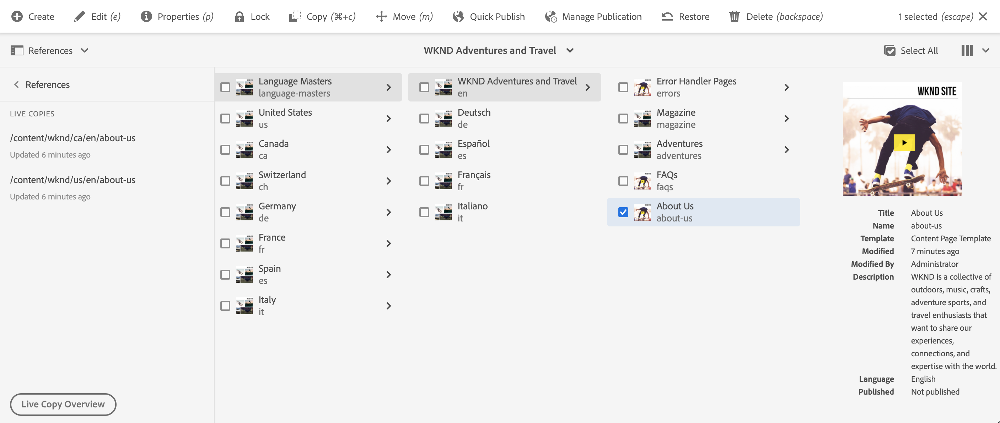
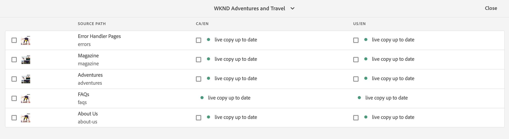
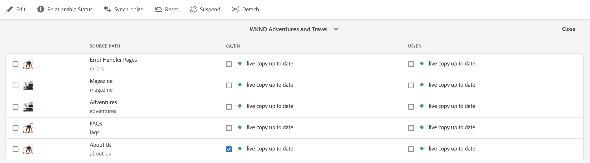
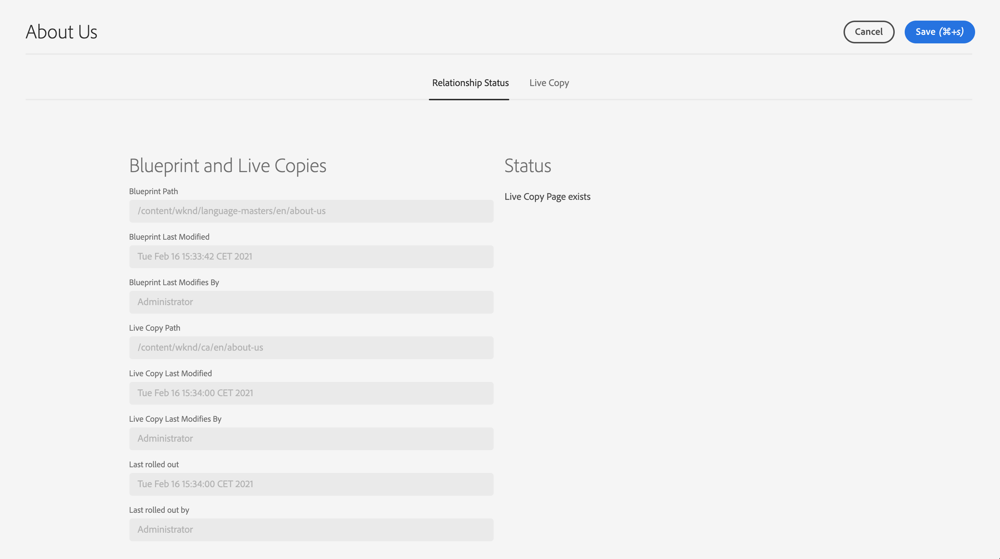
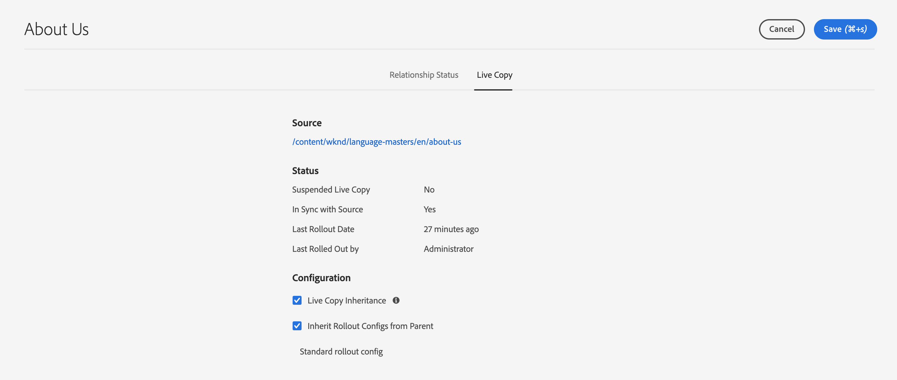

# Live Copy Overview Console {#live-copy-overview-console}

The **Live Copy Overview** console enables you to:

* View/manage inheritance across a site.
  * View the blueprint tree and corresponding Live Copy structure, together with their inheritance status
  * Change the inheritance status such as suspending and resuming
  * View blueprint and Live Copy properties
* Perform rollout actions.

## Opening the Live Copy Overview {#opening-the-live-copy-overview}

You can open the Live Copy Overview from the:

* [References side panel of a blueprint page (Sites console)](#opening-live-copy-overview-references-for-a-blueprint-page)
* [Properties of a blueprint page](#opening-live-copy-overview-properties-of-a-blueprint-page)

### References to a Blueprint Page {#references-to-a-blueprint-page}

The **Live Copy Overview** can be opened from the **References** side panel of the **Sites** console:

1. In the **Sites** console, [navigate to your blueprint page and select it.](/help/sites-authoring/basic-handling.md#viewing-and-selecting-resources)
1. Open the **[References](/help/sites-authoring/basic-handling.md#references)** panel and select **Live Copies**.

   

   >[!TIP]
   >
   >You can also open References first and then select the blueprint.

1. Select **Live Copy Overview** to show and use the overview of all Live Copies related to the selected blueprint.
1. Use **Close** to exit and return to the **Sites** console.

### Properties of a Blueprint Page {#properties-of-a-blueprint-page}

The **Live Copy Overview** can be opened when viewing properties of a blueprint page:

1. Open **Properties** for the appropriate blueprint page.
1. Open the **Blueprint** tab - the **Live Copy Overview** option will be shown in the top toolbar:

   

1. Select **Live Copy Overview** to show and use the overview of all Live Copies related to the current blueprint.

1. Use **Close** to exit and return to the **Sites** console.

## Using the Live Copy Overview {#using-the-live-copy-overview}

The **Live Copy Overview** window provides and overview of the status of the Live Copies related to the selected page.

 

A rollout depends on the synchronization actions defined in the specific rollout configuration. Some actions are dependent on modifications to the content. However, there are also many actions that are not dependent on modifications to the content, but are dependent on events such as page activation. Such events do not modify the content, but do modify the internal properties related to the content.

The status fields are also dependent on the synchronization actions defined in the specific rollout configuration and indicate whether there have been any such actions to either the blueprint or the Live Copy since the last successful rollout. A status field will only reflect the actions in the specific rollout configuration. If no successful rollout has been ever been performed on a Live Copy, then the status will always show up-to-date.

For example, a rollout configuration is defined as `targetActivate`. Therefore, a rollout will depend solely on activation events. The status field will only indicate whether any activation events have occurred since the last successful rollout.

The **Live Copy Overview** can also be used to perform actions on the Live Copy:

1. Open the **Live Copy Overview**.
1. Select the required blueprint or Live Copy page and the toolbar will be updated to show the available actions. The [actions](/help/sites-administering/msm.md#terms-used) available depend on whether you select a [blueprint](#actions-for-a-blueprint-page) or [Live Copy](#actions-for-a-live-copy-page) page.

### Actions for a Blueprint Page {#actions-for-a-blueprint-page}

When you select a blueprint page, the following actions are available:

* **Edit** - Open the blueprint page for editing.
* **[Rollout](/help/sites-administering/msm.md#rollout-and-synchronize)** - Perform a rollout to push changes from the source to the Live Copy.

### Actions for a Live Copy Page {#actions-for-a-live-copy-page}

When you select a Live Copy page, the following actions are available:

* **Edit** - Open the Live Copy page for editing.
* **[Relationship Status](#relationship-status)** - View information about the status and inheritance.
* **[Synchronize](/help/sites-administering/msm.md#rollout-and-synchronize)** - Synchronize a Live Copy to pull changes from the source to the Live Copy.
* **[Reset](/help/sites-administering/msm-livecopy.md#resetting-a-live-copy-page)** - Reset a Live Copy page to remove all inheritance cancellations and return the page to the same state as the source page.
* **[Suspend](/help/sites-administering/msm.md#suspending-and-cancelling-inheritance-and-synchronization)** - Temporarily deactivates the live relationship between a Live Copy and its blueprint page.
* **[Resume](/help/sites-administering/msm-livecopy.md#resuming-inheritance-for-a-page)** - Resume allows you to reinstate a suspended relationship.
* **[Detach](/help/sites-administering/msm.md#detaching-a-live-copy)** - Permanently removes the live relationship between a Live Copy and its blueprint page.

## Relationship Status {#relationship-status}

The **Relationship Status** console has two tabs providing a range of functionality.

* [Relationship Status](#relationship-status-tab)
* [Live Copy](#live-copy-tab)

### Relationship Status {#relationship-status-tab}

This tab provides detailed information about the status of the relationship between the blueprint and Live Copy.

### Live Copy {#live-copy-tab}

This tab allows you to view and edit the Live Copy configuration.

