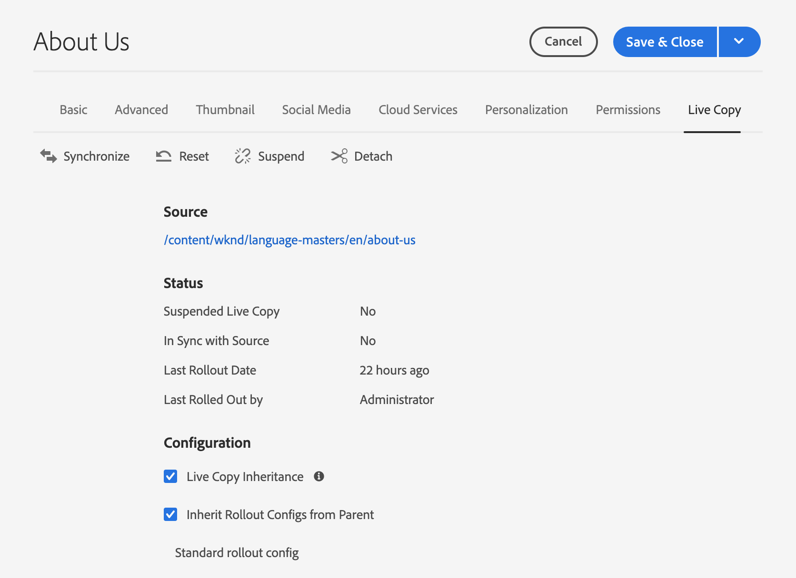
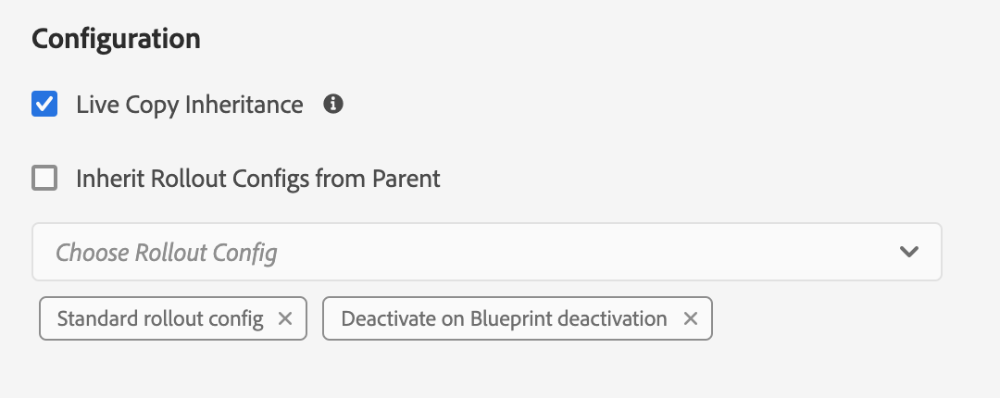

# Configuring Live Copy Synchronization {#configuring-live-copy-synchronization}

Adobe Experience Manager provides several synchronization configurations out-of-the-box. Before using Live Copies, you should consider the following to define how and when Live Copies are synchronized with their source content.

1. Decide whether existing rollout configurations meet your requirements
1. If existing rollout configurations do not, decide whether you need to create your own.
1. Specify the rollout configurations to use for your Live Copies.

## Installed and Custom Rollout Configurations {#installed-and-custom-rollout-configurations}

This section provides information about the installed rollout configurations and the synchronization actions that they use, and how to create custom configurations if necessary.

>[!CAUTION]
>
>Updating or changing an out-of-the-box rollout configuration is **not** recommended. If there is a requirement for a custom live action then it should be added in a custom rollout configuration.

### Rollout Triggers {#rollout-triggers}

Each rollout configuration uses a rollout trigger that causes the rollout to occur. Rollout configurations can use one of the following triggers:

* **On Rollout**: The **Rollout** command is used on the blue print page, or the **Synchronize** command is used on the Live Copy page.
* **On Modification**: The source page is modified.
* **On Activation**: The source page is activated.
* **On Deactivation**: The source page is deactivated.

>[!NOTE]
>
>Use of the **On Modification** trigger can impact performance. See [MSM best practices](best-practices.md#onmodify) for more information.

### Rollout Configurations {#rollout-configurations}

The following table lists the rollout configurations that are provided out-of-the-box with AEM. The table includes the trigger and synchronization actions of each rollout configuration. 

If the installed rollout configuration actions do not meet your requirements, you can [create a rollout configuration](#creating-a-rollout-configuration).

|Name|Description|Trigger|[Synchronization Actions](#synchronization-actions)|
|---|---|---|---|
|Standard rollout config|Standard rollout configuration which allows to start rollout process on rollout trigger and runs actions: create, update, delete content and order children nodes|On Rollout|`contentUpdate` `contentCopy` `contentDelete` `referencesUpdate` `productUpdate` `orderChildren`|
|Activate on Blueprint activation|Publishes the Live Copy when the source is published|On Activation|`targetActivate`|
|Deactivate on Blueprint deactivation|Deactivates the Live Copy when the source is deactivated|On deactivation|`targetDeactivate`|
|Push on modify|Pushes the content to the Live Copy when the source is modified Use this rollout configuration sparingly as it uses the On Modification trigger.|On Modification|`contentUpdate` `contentCopy` `contentDelete` `referencesUpdate` `orderChildren`|
|Push on modify (shallow)|Pushes content to the Live Copy when the blueprint page is modified, without updating references (for example, for shallow copies) Use this rollout configuration sparingly as it uses the On Modification trigger.|On Modification|`contentUpdate` `contentCopy` `contentDelete` `orderChildren`|
|Promote Launch|Standard rollout configuration for promoting launch pages.|On Rollout|`contentUpdate` `contentCopy` `contentDelete` `referencesUpdate` `orderChildren` `markLiveRelationship`|

### Synchronization Actions {#synchronization-actions}

The following table lists the synchronization actions that are provided out-of-the-box with AEM.

If the installed actions do not meet your requirements, you can [Create a New Synchronization Action](/help/implementing/developing/extending/msm.md#creating-a-new-synchronization-action).

|Action Name|Description|Properties|
|---|---|---|
|`contentCopy`|When nodes of the source do not exist on the Live Copy, this action copies the nodes to the Live Copy. [Configure the **CQ MSM Content Copy Action** service](#excluding-properties-and-node-types-from-synchronization) to specify the node types, paragraph items, and page properties to exclude.||
|`contentDelete`|This action deletes nodes of the Live Copy that do not exist on the source. [Configure the **CQ MSM Content Delete Action** service](#excluding-properties-and-node-types-from-synchronization) to specify the node types, paragraph items, and page properties to exclude.||
|`contentUpdate`|This action updates the Live Copy content with the changes from the source. [Configure the **CQ MSM Content Update Action** service](#excluding-properties-and-node-types-from-synchronization) to specify the node types, paragraph items, and page properties to exclude.||
|`editProperties`|This action edits properties of the Live Copy. The `editMap` property determines which properties are edited and their value. The value of the `editMap` property must use the following format: `[property_name_n]#[current_value]#[new_value]` `current_value` and `new_value` are regular expressions and `n` is an incremented integer. For example, consider the following value for `editMap`: `sling:resourceType#/(contentpage`&#8214;`homepage)#/mobilecontentpage,cq:template#/contentpage#/mobilecontentpage` This value edits the properties of the Live Copy nodes as follows: The `sling:resourceType` properties that are either set to `contentpage` or to `homepage` are set to `mobilecontentpage`. The `cq:template` properties that are set to `contentpage` are set to `mobilecontentpage`.|`editMap: (String)` identifies the property, the current value, and the new value. See the description for more information.|
|`notify`|This action sends a page event that the page has been rolled out. To be notified, one must first subscribe to rollout events.||
|`orderChildren`|This action orders the child nodes based on the order on the blueprint.||
|`referencesUpdate`|This synchronization action updates references on the Live Copy. It searches for paths in the Live Copy pages that point to a resource within the blueprint. When found, it updates the path to point to the related resource inside the Live Copy. References that have targets outside the blueprint are not changed.  [Configure the **CQ MSM References Update Action** service](#excluding-properties-and-node-types-from-synchronization) to specify the node types, paragraph items, and page properties to exclude.||
|`targetVersion`|This action creates a version of the Live Copy. This action must be the only synchronization action included in a rollout configuration.||
|`targetActivate`|This action activates the Live Copy. This action must be the only synchronization action included in a rollout configuration.||
|`targetDeactivate`|This action deactivates the Live Copy. This action must be the only synchronization action included in a rollout configuration.||
|`workflow`|This action starts the workflow that is defined by the target property (for pages only) and takes the Live Copy as payload. The target path is the path of the model node.|`target: (String)` is the path to the workflow model.|
|`mandatory`|This action sets the permission of several ACLs on the Live Copy page to read-only for a specific user group. The following ACLs are configured: `ActionSet.ACTION_NAME_REMOVE` `ActionSet.ACTION_NAME_SET_PROPERTY` `ActionSet.ACTION_NAME_ACL_MODIFY` Use this action for pages only.|`target: (String)` is the ID of the group for which you are setting permissions.|
|`mandatoryContent`|This action sets the permission of several ACLs on the Live Copy page to read-only for a specific user group. The following ACLs are configured: `ActionSet.ACTION_NAME_SET_PROPERTY` `ActionSet.ACTION_NAME_ACL_MODIFY` Use this action for pages only.|`target: (String)` is the ID of the group for which you are setting permissions.|
|`mandatoryStructure`|This action sets the permission of the `ActionSet.ACTION_NAME_REMOVE` ACL on the Live Copy page to read-only for a specific user group. Use this action for pages only.|`target: (String)` is the ID of the group for which you are setting permissions.|
|`VersionCopyAction`|If the blueprint/source page has been published at least once, this action creates a Live Copy page using the version that is published. Note: this action is only available for creating a Live Copy page based on a published source page, not for updating an existing Live Copy page.||
|`PageMoveAction`|The `PageMoveAction` applies when a page has been moved in the blueprint. The action copies rather than moves the (related) Live Copy page from the location before the move to the location after. The `PageMoveAction` does not change the Live Copy page at the location before the move. Therefore, for consecutive rollout configurations it has the status of a live relationship without a blueprint. [Configure the **CQ MSM Page Move Action** service](#excluding-properties-and-node-types-from-synchronization) to specify the node types, paragraph items, and page properties to exclude. This action must be the only synchronization action included in a rollout configuration.|Set `prop_referenceUpdate: (Boolean)` to true (default) to update references.|
|`markLiveRelationship`|This action Indicates a live relationship exists for launch-created content.||

### Creating a Rollout Configuration {#creating-a-rollout-configuration}

You can [create a rollout configuration](/help/implementing/developing/extending/msm.md#creating-a-new-rollout-configuration) when the installed rollout configurations do not meet your application requirements by performing the following steps.

1. [Create the rollout configuration-](/help/implementing/developing/extending/msm.md#create-the-rollout-configuration)
1. [Add synchronization actions to the rollout configuration](/help/implementing/developing/extending/msm.md#add-synchronization-actions-to-the-rollout-configuration).

The new rollout configuration is then available to you when configuring rollout configurations on a blueprint or Live Copy page.

### Excluding Properties and Node Types From Synchronization {#excluding-properties-and-node-types-from-synchronization}

You can configure several OSGi services that support corresponding synchronization actions so that they do not affect specific node types and properties. For example, many properties and subnodes related to the internal functioning of AEM should not be included in a Live Copy. Only the content that is relevant to the user of the page should be copied.

When working with AEM, there are several methods of managing the configuration settings for such services. See [Configuring OSGi](/help/implementing/deploying/configuring-osgi.md) for more details and the recommended practices.

The following table lists the synchronization actions for which you can specify the nodes to exclude. The table provides the names of the services to configure using the Web Console and the PID for configuring using a repository node.

|Synchronization Action|Service Name in Web Console |Service PID |
|---|---|---|
|`contentCopy`|CQ MSM Content Copy Action|`com.day.cq.wcm.msm.impl.actions.ContentCopyActionFactory`|
|`contentDelete`|CQ MSM Content Delete Action|`com.day.cq.wcm.msm.impl.actions.ContentDeleteActionFactory`|
|`contentUpdate`|CQ MSM Content Update Action|`com.day.cq.wcm.msm.impl.actions.ContentUpdateActionFactory`|
|`PageMoveAction`|CQ MSM Page Move Action |`com.day.cq.wcm.msm.impl.actions.PageMoveActionFactory`|
|`referencesUpdate`|CQ MSM References Update Action|`com.day.cq.wcm.msm.impl.actions.ReferencesUpdateActionFactory`|

The following table describes the properties that you can configure:

|Web Console Property|OSGi Property|Description|
|---|---|---|
|Excluded Node Types|`cq.wcm.msm.action.excludednodetypes`|A regular expression that matches the node types to be excluded from the synchronization action|
|Excluded Paragraph Items|`cq.wcm.msm.action.excludedparagraphitems`|A regular expression that matches the paragraph items to be excluded from the synchronization action|
|Excluded Page Properties|`cq.wcm.msm.action.excludedprops`|A regular expression that matches the page properties to be excluded from the synchronization action|
|Ignored Mixin NodeTypes|`cq.wcm.msm.action.ignoredMixin`|A regular expression that matches the names of mixin node types to be excluded from the synchronization action (only available to `contentUpdate` action)|

#### CQ MSM Content Update Action - Exclusions {#cq-msm-content-update-action-exclusions}

Several properties and node types are excluded by default, these are defined in the OSGi configuration of **CQ MSM Content Update Action**, under **Excluded Page Properties**.

By default properties matching the following regular expressions are excluded (that is, not updated) on rollout:

You can change the expressions defining the exclusion list as required.

For example, if you want the page **Title** to be included in the changes considered for rollout, remove `jcr:title` from the exclusions. For example, with the regex:

`jcr:(?!(title)$).*`

### Configuring Synchronization for Updating References {#configuring-synchronization-for-updating-references}

You can configure several OSGi services that support corresponding synchronization actions related to updating references.

When working with AEM, there are several methods of managing the configuration settings for such services. See [Configuring OSGi](/help/implementing/deploying/configuring-osgi.md) for more details and the recommended practices.

The following table lists the synchronization actions for which you can specify the reference update. The table provides the names of the services to configure using the Web Console and the PID for configuring using a repository node.

|Web Console Property|OSGi Property|Description|
|---|---|---|
|Update Reference across nested LiveCopies|`cq.wcm.msm.impl.action.referencesupdate.prop_updateNested`|Select this option in the web console or set this boolean property to `true` using the repository configuration to replace references that target any resource that is within the branch of the top-most Live Copy. Only available for `referencesUpdate` action.|
|Update Referencing Pages|`cq.wcm.msm.impl.actions.pagemove.prop_referenceUpdate`|Select this option in the web console or set this boolean property to `true` using the repository configuration to update any references to use the original page to instead reference the Live Copy page. Only available for `PageMoveAction`.|

## Specifying the Rollout Configurations to Use {#specifying-the-rollout-configurations-to-use}

MSM enables you to specify sets of rollout configurations that are used generally, and when required you can override them for specific Live Copies. MSM provides several locations for specifying the rollout configurations to use. The location determines whether the configuration applies to a specific Live Copy.

The following list of locations where you can specify the rollout configurations to use describes how MSM determines which rollout configurations to use for a Live Copy:

* **[Live Copy page properties](live-copy-sync-config.md#setting-the-rollout-configurations-for-a-live-copy-page):** When a Live Copy page is configured to use one or more rollout configurations, MSM uses those rollout configurations.
* **[Blueprint page properties](live-copy-sync-config.md#setting-the-rollout-configuration-for-a-blueprint-page):** When a Live Copy is based on a blueprint, and the Live Copy page is not configured with a rollout configuration, the rollout configuration that is associated with the blueprint source page is used.
* **Live Copy parent page properties:** When neither the Live Copy page nor the blueprint source page are configured with a rollout configuration, the rollout configuration that applies to the Live Copy page's parent page is used.
* **[System default](live-copy-sync-config.md#setting-the-system-default-rollout-configuration):** When the rollout configuration of the Live Copy's parent page cannot be determined, the system default rollout configuration is used.

For example, a blueprint uses the [WKND tutorial](/help/implementing/developing/introduction/develop-wknd-tutorial.md) site as source content. A site is created from the blueprint. Each item in the following list describes a different scenario regarding the use of rollout configurations:

* None of the blueprint pages or the Live Copy pages are configured to use a rollout configuration. MSM uses the system default rollout configuration for all Live Copy pages.
* The root page of the WKND site is configured with several rollout configurations. MSM uses these rollout configurations for all Live Copy pages.
* The root page of the WKND site is configured with several rollout configurations, and the root page of the Live Copy site is configured with a different set of rollout configurations. MSM uses the rollout configurations that are configured on the root page of the Live Copy site.

### Setting the Rollout Configurations for a Live Copy Page {#setting-the-rollout-configurations-for-a-live-copy-page}

Configure a Live Copy page with the rollout configurations to use when the source page is rolled out. Child pages inherit the configuration by default. When you configure the rollout configuration to use, you are overriding the configuration that the Live Copy page inherits from its parent.

You can also configure the rollout configurations for a Live Copy page when you [create the Live Copy](creating-live-copies.md#creating-a-live-copy-of-a-page).

1. Use the **Sites** console to select the Live Copy page.
1. Select **Properties** from the toolbar.
1. Open the **Live Copy** tab.

   The **Configuration** section shows the rollout configurations that the page inherits.

   

1. If necessary, adjust the **Live Copy Inheritance** flag. If checked the Live Copy configuration is effective on all children.

1. Clear the **Inherit Rollout Configuration From Parent** property, then select one or more rollout configurations from the list.

   The selected rollout configurations appear below the drop-down list.

   

1. Select **Save &amp; Close**.

### Setting the Rollout Configuration for a Blueprint Page {#setting-the-rollout-configuration-for-a-blueprint-page}

Configure a blueprint page with the rollout configurations to use when the blueprint page is rolled out.

The child pages of the blueprint page inherit the configuration. When you configure the rollout configuration to use, you could be overriding the configuration that the page inherits from its parent.

1. Use the **Sites** console to select the root page of the blueprint.
1. Select **Properties** from the toolbar.
1. Open the **Blueprint** tab.
1. Select one or more **Rollout Configurations** using the drop-down selector.
1. Persist your updates with **Save**.

### Setting the System Default Rollout Configuration {#setting-the-system-default-rollout-configuration}

To specify a rollout configuration to use as the system default, configure the following OSGi service.

* **Day CQ WCM Live Relationship Manager** with the service PID `com.day.cq.wcm.msm.impl.LiveRelationshipManagerImpl`

Configure the service using either the [web console](/help/implementing/deploying/configuring-osgi.md#osgi-configuration-with-the-web-console) or a [repository node](/help/implementing/deploying/configuring-osgi.md#osgi-configuration-in-the-repository).

* In the web console, the name of the property to configure is **Default rollout config**.
* Using a repository node, the name of the property to configure is `liverelationshipmgr.relationsconfig.default`.

Set this property value to the path of the rollout configuration to use as the system default. The default value is `/libs/msm/wcm/rolloutconfigs/default`, which is the **Standard Rollout Config**.
