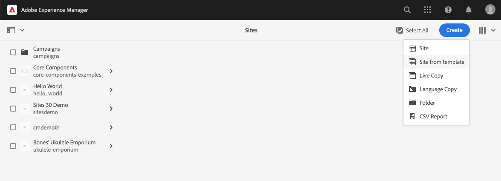
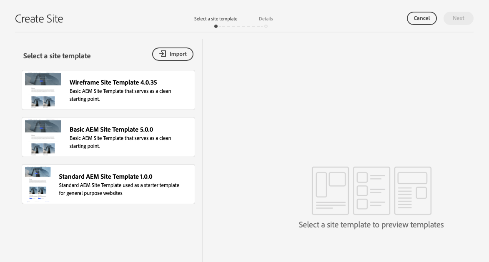
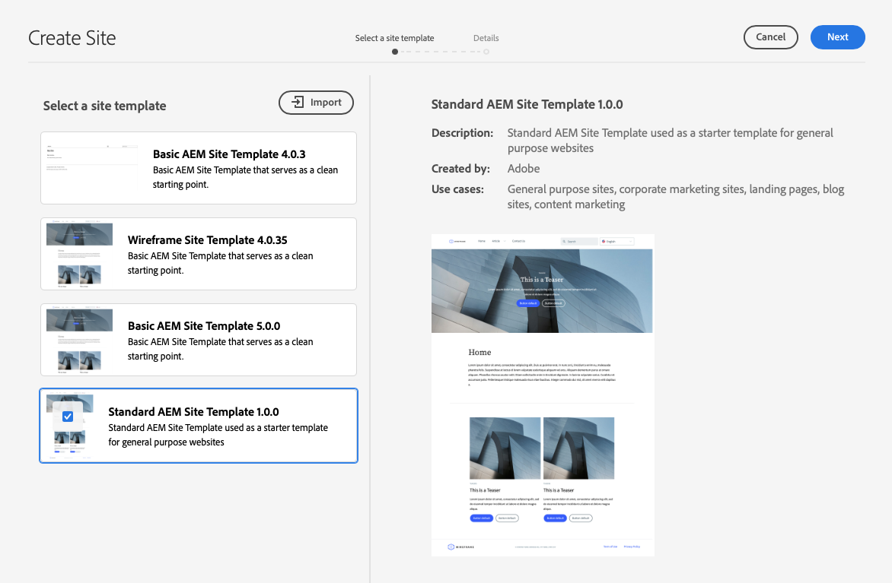
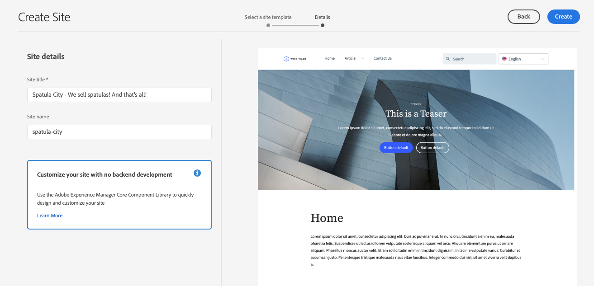
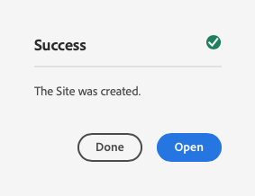
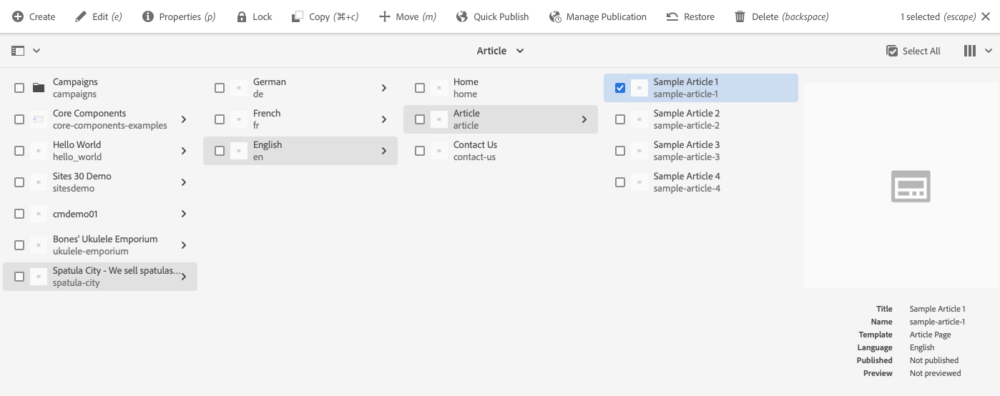

# Creating a Site {#creating-site}

Learn how to use AEM create a site using site templates to define the style and structure of your site.

## Overview {#overview}

Before content authors can create pages with content, the site must first be created. This is generally performed by an AEM administrator who defines the initial structure of the site. Using site templates makes site creation fast and flexible for non-developers.

## Planning Site Structure {#structure}

Take time to consider your site's purpose and planned content well in advance. This will drive how you design the structure of the site. A good site structure supports easy navigation and content discovery for your site visitors and supports various AEM features such as [multisite management and translation.](/help/sites-cloud/administering/msm-and-translation.md)

## Site Templates {#site-templates}

Because site structure is so important to the success of a site, it is convenient to have predefined structures available to quickly deploy a new site based on a set of existing standards. Site templates are a way to combine basic site content into a convenient and reusable package.

Site templates generally contain base site content and structure and site styling information to get new site started quickly. Templates are powerful because they are reusable and customizable. And since you can have multiple templates available in your AEM installation, you have the flexibility to create different sites to meet various business needs.

>[!TIP]
>
>For further detail on site templates, see the document [Site Templates.](site-templates.md)

>[!NOTE]
>
>The site template is not to be confused with [page templates.](/help/sites-cloud/authoring/page-editor/templates.md) Site templates define the overall structure of a site. A page template defines the structure and initial content of an individual page.

### Adobe-Provided Site Templates {#adobe-templates}

{{adobe-templates}}

## Creating a Site {#create-site}

Using a template to create a site is simple.

1. Sign into your AEM authoring environment and navigate to the Sites console

   * `https://<your-author-environment>.adobeaemcloud.com/sites.html/content`

1. Select **Create** at the top-right of the screen and from the drop-down menu select **Site from template**.

   

1. In the Create Site wizard, select an existing template in the left panel or on **Import** at the top of the left column to import a new template.

   

   1. If you chose to import, in the file browser, locate the template you want to use and select **Upload**.

   1. Once uploaded, it appears in the list of available templates. 
   
1. When selecting a template, it reveals information about the template in the right column. With your desired template selected, select **Next**.

   

1. Provide a title for your site. A site name can be provided or generated from the title if omitted.

   * The site title appears in the browsers title bar.
   * The site name becomes part of the URL.
   * The site name must comply with [AEM's page naming conventions](/help/sites-cloud/authoring/sites-console/organizing-pages.md#page-name-restrictions-and-best-practices).

1. Provide additional site details as required by the site template.

   * Different templates may require additional details.
   * For example, templates for [Edge Delivery Services projects](https://www.aem.live/developer/ue-tutorial) require the GitHub repository of your project.

1. Select **Create** and the site is created from the site template.

   

1. In the confirmation dialog that appears, select **Done**.

   

1. In the sites console, the new site is visible and can be navigated to explore its basic structure as defined by the template.

   

Content authors can now begin authoring!

## Site Customization {#site-customization}

Templates are helpful to quickly set up the basic structure and style of a site. However most projects require some additional styling and customization. Site templates help decouple the styling of the site so that front-end developers need no knowledge of AEM to style the site and can 
work separately from and parallel to the content creators. Depending on the type of project, this can take two forms.

* For projects with AEM page authoring with the Universal Editor and delivery through [edge delivery,](/help/edge/overview.md) all styling is done in the GitHub project.
  * Please see the document [Getting Started - Universal Editor Developer Tutorial](https://www.aem.live/developer/ue-tutorial) for more information.
* For projects with traditional AEM page authoring and delivery through [publish delivery,](/help/sites-cloud/authoring/author-publish.md) the AEM administrator simply downloads the site theme and provides it to the front-end developer who customizes it using their favorite tools and then commits the changes to the AEM code repository, which is then deployed.
  * Please see the document [AEM Quick Site Creation Journey](/help/journey-sites/quick-site/overview.md) for more information.
