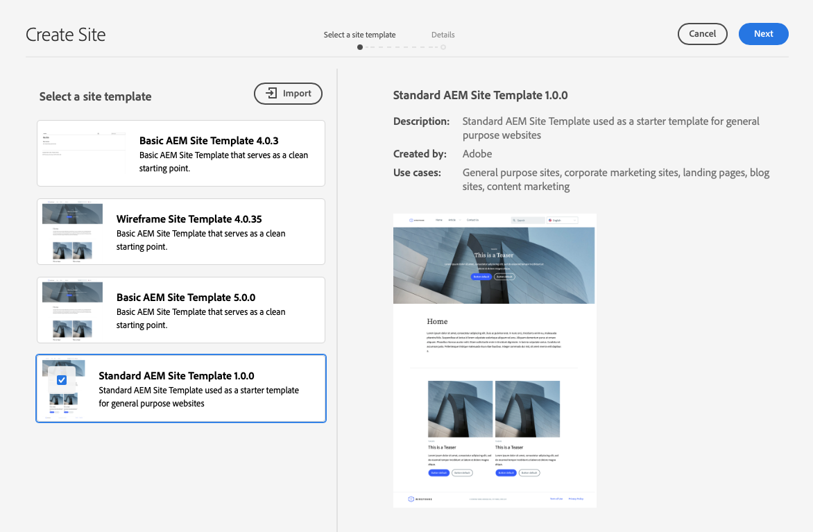

# Site Templates {#site-templates}

Learn how AEM site templates can be used to predefine site structure and initial content to allow you to quickly create sites.

## Overview {#overview}

It is convenient to have predefined structures available to quickly deploy a new site based on a set of existing standards. Site templates are a way to combine basic site content into a convenient and reusable package.

Site templates generally contain base site content and structure and site styling information, known as the [site theme](site-themes.md), to get a new site started quickly. Administrators select a site template upon which to base the site [during the site creation process](create-site.md).

Templates are powerful because they are reusable and customizable. And since you can have multiple templates available in your AEM installation, you have the flexibility to create different sites to meet various business needs.

>[!NOTE]
>
>AEM site templates should not be confused with [page templates](/help/sites-cloud/authoring/page-editor/templates.md). Site templates define the overall structure of a site. A page template defines the structure and initial content of an individual page.
>
>AEM site templates should not be confused with [AEM site themes](site-themes.md). AEM site themes only contain the styling information for an AEM site. AEM site templates define site structure and initial content, and contain an AEM site theme to allow for [quick site creation](create-site.md).

## Adding a Site Template to AEM {#adding}

You can add multiple templates to AEM, which can then be used to [create sites](create-site.md).

1. Sign into your AEM authoring environment and navigate to the Sites console

   * `https://<your-author-environment>.adobeaemcloud.com/sites.html/content`

1. Select **Create** at the top-right of the screen and from the drop-down menu select **Site from template**.

   

1. In the Create Site wizard, select **Import** at the top of the left column.

   

1. In the file browser, locate the template you want to use and select **Upload**.

1. Once uploaded, it appears in the list of available templates. 
   
Your template is uploaded and can be used to [create new sites](create-site.md).

When selecting an existing template, it reveals information about the template in the right column.

## Site Template Structure {#structure}

Site templates are simply packages with a logical structure that clearly reflects the purpose of the package content. A site template has the following structure.

* `files`: Folder with the UI kit, XD file, and possibly other files
* `previews`: Folder with screenshots of the site template
* `site`: Content package of the content that is copied for each site created from this template such as page templates, pages, and so on.
* `theme`: Sources of the [site theme](site-themes.md) to modify how the site looks including CSS, JavaScript, and so on.

## Standard Site Template {#standard-site-template}

Adobe provides a best-practices reference template that you can use as a basis for creating your own templates. [The Standard Site Template is available on GitHub](https://github.com/adobe/aem-site-template-standard).

[The latest release of the Standard Site Template](https://github.com/adobe/aem-site-template-standard/releases) can be downloaded and used directly for [creating new sites](create-site.md).

## Developing Site Templates {#developing-templates}

Adobe provides and AEM Site Template Builder as a set of scripts for creating new site templates.

[The AEM Site Template Builder is available along with usage documentation on GitHub](https://github.com/adobe/aem-site-template-builder). Front-end developer experience is required for customizing the [site theme](site-themes.md) and AEM developer knowledge is required for customizing the site structure and content.
