# Administering Tags {#administering-tags}

Tags are an intuitive method of classifying your content. They can be thought of as keywords or labels (metadata) that allow content to be more quickly found.

In Adobe Experience Manager (AEM), a tag can be a property of:

* A content node for a page
  * See the document [Using Tags](/help/sites-cloud/authoring/sites-console/tags.md) for more information.
* A metadata node for an asset 
  * See the document [Managing Metadata for Digital Assets](/help/assets/manage-metadata.md) for more information.

>[!TIP]
>
>It is best practice to minimize the number of tags that relate to the same ideas. For example, if you are managing content for an outdoor supply store, you probably don't need a tag for both **footwear** and **shoes**.

## Tag Features {#tag-features}

Tags offer robust features for organizing and managing content.

* Tags can be grouped into various namespaces.
  * Namespaces can be thought of as hierarchies that allow taxonomies to be built. 
  * These taxonomies are global throughout AEM.
* Tags can be applied by authors and used by site visitors.
* Irrespective of their creator, all forms of tags are made available for selection, both when assigning to a page, or when searching.
* Tags are used by the [List Component](https://experienceleague.adobe.com/docs/experience-manager-core-components/using/wcm-components/list.html) to generate dynamic lists based on the tags selected.

## Tag Requirements {#requirements}

There are a few technical details to keep in mind when creating and managing tags.

* Tags must be unique within a specific namespace.
* A tag's name may not include tag delimiters:
  * Colon (`:`) - Delimits the namespace tag
  * Slash (`/`) - Delimits sub-tags
* If a tag's title includes tag delimiters, they will be suppressed in the UI.
* Tags can be created and their taxonomy can be modified by members of the `tag-administrators` group and members who have modification rights to `/content/cq:tags`.
  * A tag that contains child tags is referred to as a container tag.
  * A tag that is not a container tag is referred to as a leaf tag.
  * A tag namespace can be either a leaf tag or container tag.

For more technical details on how tags work, see [AEM Tagging Framework](/help/implementing/developing/introduction/tagging-framework.md).

## Tagging Console {#tagging-console}

The tagging console is used to create and manage tags and their taxonomies. You can use the tagging console to manage your tags by:

* Grouping them into namespaces.
* Reviewing the usage of exiting tags before creating new ones.
* Reorganizing your tags without disconnecting the tag from currently referenced content.

To access the tagging console:

1. Sign in to an authoring environment with with administrative privileges.
1. In the global navigation menu select **`Tools`** &gt; **`General`** &gt;
**`Tagging`**.

## Creating New Tags {#creating-new-tags}

There are several steps to create and use tags to organize your content.

1. [Create a namespace for your tags](#creating-namespaces) (or choose an existing one to reuse).
1. [Create a new tag.](#creating-tags)
1. [Publish the tag.](#publishing-tags)

### Creating Namespaces {#creating-namespaces}

A namespace is used to organize other tags. It can be thought of as the lowest-level tag and is typically used to group other tags.

1. To create a namespace, open the [tagging console](#tagging-console) and select the **Create** button in the toolbar and then **Create Namespace**.

   

1. Provide the necessary information.

   * **Title** - A title for the namespace displayed to the user in the UI (optional)
   * **Name** - If a name is not specified, a valid node name is created from the **Title**. See the document [AEM Tagging Framework](/help/implementing/developing/introduction/tagging-framework.md#tagid) for more information.
   * **Description** - A description of the namespace (optional)

1. Once the required information is entered select **Create**.

The namespace is created. In the tagging console the namespaces are at the lowest level (at the far left column in the console) and are represented by folder icons, reflecting their nature as a "container" or grouping of other tags.

You can now [create new tags](#creating-tags) in this namespace or [manage existing tags.](#managing-tags)

A namespace need not contain any sub-tags. Because a namespace is itself a tag, it can be used to organize your content as any other tag. However, to continue creating a structured tagging taxonomy, you can [create sub-tags](#creating-tags) within that namespace based on your project requirements.

### Creating Tags {#creating-tags}

Tags are generally added to namespaces.

1. To create a tag, open the [tagging console.](#tagging-console)

1. Select the namespace where you want to create the tag. Or select another tag to create a sub-tag below it.

1. Select the **Create** button on the toolbar and then **Create Tag**.

1. The **Create Tag** dialog opens. Provide the required information for the new tag.

   * **Title** - A display title for the tag (required)
   * **Name** - A name for the tag (required). If not specified, a valid node name is created from the **Title**. See [TagID](/help/implementing/developing/introduction/tagging-framework.md#tagid).
   * **Description** - A description of the tag
   * **Tag Path** - Defaults to the namespace (or tag) you selected in the tagging console. This can be manually updated by tapping or clicking the path selector icon.

   

1. Select **Submit**.

The tag is created and the console is updated to show the new tag.

Tags allow for the flexible creation of your own taxonomy based on your organizational needs.

* You can create child tags of existing tags by selecting the parent tag in the console before creating your new tag.
* If you create a tag without selecting a namespace or another tag, you effectively create a namespace.

### Publishing Tags {#publishing-tags}

Just as with creating any other content in AEM, after you have created a tag (or namespace), it only exists in the authoring environment. For your tags to be available to your users, you must publish the tags.

1. To publish a tag, open the [tagging console.](#tagging-console)

1. Select the tag or tags you want to publish and in the toolbar, select **Publish**.

   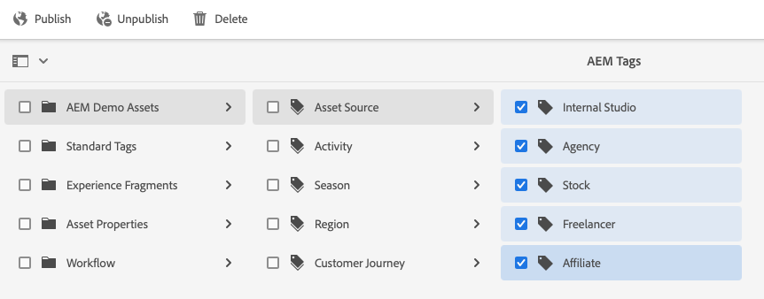

1. The **Publish Tag** dialog asks for a confirmation to publish the selected tags. Select **Publish**.

   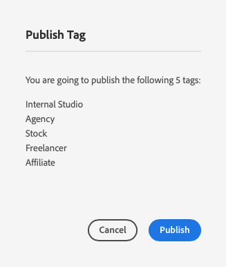

1. The publish action is confirmed with a **Success** dialog.

   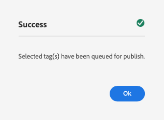

The selected tag(s) are queued for publication. Similar to page content, only the selected tag(s) is published, regardless of whether or not it has sub-tags.

To publish an entire taxonomy (a namespace and sub-tags), the best practice is to create a [package](/help/implementing/developing/tools/package-manager.md) of the namespace (see [Taxonomy Root Node](/help/implementing/developing/introduction/tagging-framework.md#taxonomy-root-node)).

<!--
Be sure to [apply permissions](#setting-tag-permissions) to the namespace before creating the package.
-->

## Managing Tags {#managing-tags}

There are several actions that you can take on existing tags and namespaces to manage and organize them. Simply select a tag or namespace in the [tagging console](#tagging-console) to reveal in the toolbar the actions available.

* [View Properties](#viewing-tag-properties)
* [Edit](#editing-tags)
* [Unpublish](#unpublishing-tags)
* [References](#viewing-tag-references)
* [Move](#moving-tags)
* [Merge](#merging-tags)
* [Delete](#deleting-tags)

When there is note sufficient space available on the toolbar, additional options are available behind the ellipsis icon.

### Viewing Tag Properties {#viewing-tag-properties}

When a single tag or namespace or other tag is selected in the tagging console, basic details of the selected tag such as time of last edit and last publication are shown in the column to the left of the tag column.

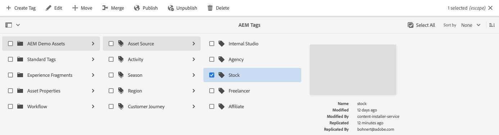

You can view more details about the tag including who last published it and when by switching the console to the **Properties** view.

1. To view the properties of a tag, open the [tagging console.](#tagging-console)

1. Select the tag whose properties you want to view and in the left rail select **Properties**.

   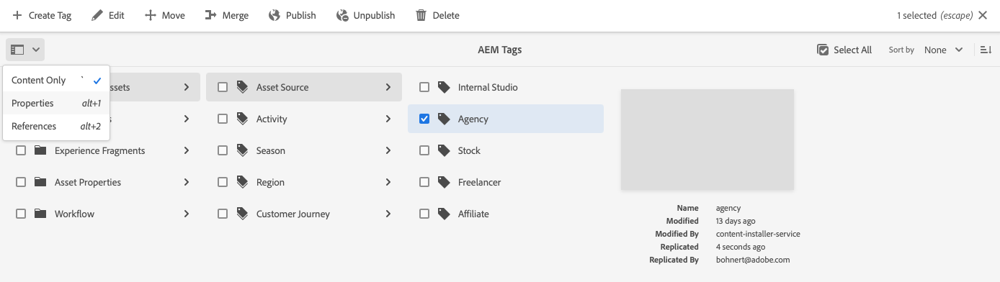

1. The detailed properties of the selected tag are displayed in the left rail.

   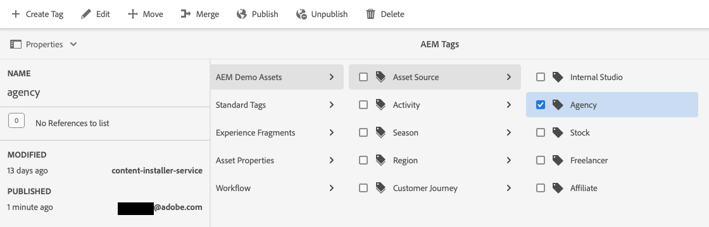

For more details on selecting viewing modes and the rail, see [Basic Handling](/help/sites-cloud/authoring/basic-handling.md#rail-selector).

### Editing Tags {#editing-tags}

Tags and namespaces can be edited after creation.

1. To edit a tag, open the [tagging console.](#tagging-console)

1. Select the tag you want to edit and in the toolbar, select **Edit**.

1. Make the desired changes. It is possible to alter the:

   * **Title**
   * **Description**
   * [**Localization** of the **Title**](#managing-tags-in-different-languages)

1. After edits are made, select **Submit**.

For details about adding language translations, see the section on [Managing Tags in Different Languages](#managing-tags-in-different-languages).

If the changes you made were to an already published tag, you may want to [republish it.](#publishing-tags)

### Unpublishing Tags {#unpublishing-tags}

To deactivate tag on your author instance and remove it from your publish instance, you can unpublish it. 

1. To unpublish a tag, open the [tagging console.](#tagging-console)

1. Select the tag or tags you want to unpublish and in the toolbar, select **Unpublish**.

   

1. The **Unuublish Tag** dialog asks for a confirmation to publish the selected tags. Select **Publish**.

   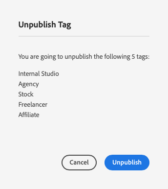

1. The unpublish action is confirmed with a **Success** dialog.

   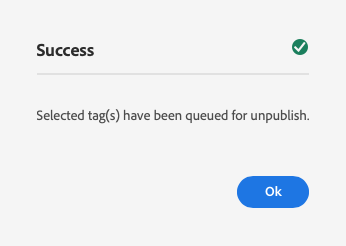

The selected tag(s) are queued for unpublication. If the selected tag is a container tag, all of its child tags will be deactivated in the author environment and removed from the publish environment.

### Viewing Tag References {#viewing-tag-references}

It can be useful to see to which content a particular tag is applied. You can do this by using the **References** view in the tagging console.

1. To view the references of a tag, open the [tagging console.](#tagging-console)

1. Select the tag whose references you want to view and in the left rail select **References**.

   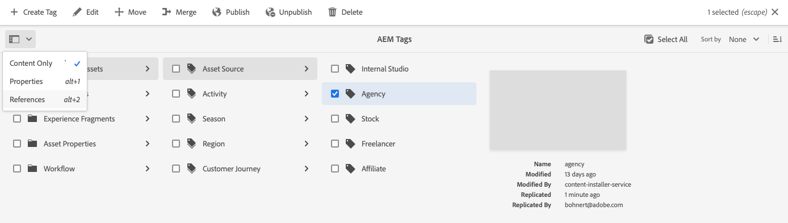

1. The total number of references for the selected tag is displayed in the left rail.

   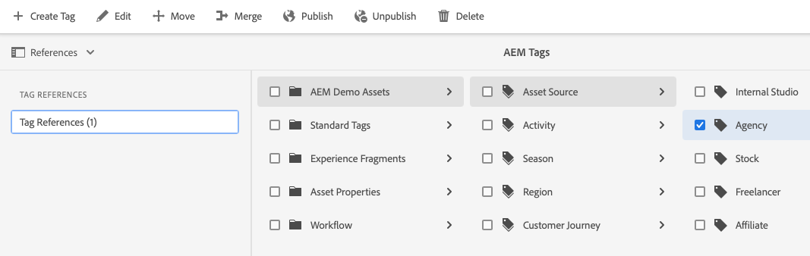

1. Select the number of tag references to view the detailed list of content that is assigned to the tag.

   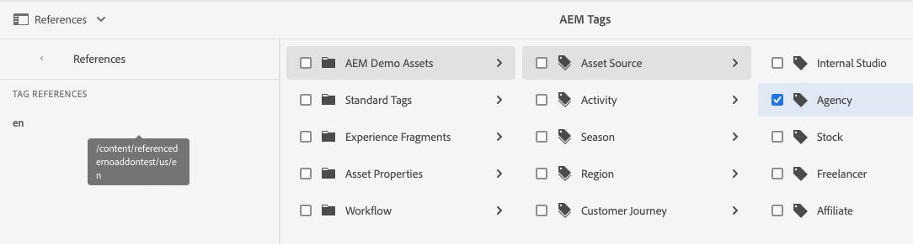

Hover the mouse or select a referencing content in the list to reveal the full path of the content.

For more details on selecting viewing modes and the rail, see [Basic Handling](/help/sites-cloud/authoring/basic-handling.md#rail-selector).

### Moving Tags {#moving-tags}

It can be necessary to clean up or otherwise reorganize your tagging taxonomy by moving a tag to a new location or renaming it.

>[!TIP]
>
>It is best practice that only administrators be permitted to move and rename tags.

1. To move or rename a tag, open the [tagging console.](#tagging-console)

1. Select the tag that you want to move or rename and select **Move** in the toolbar.

1. In the **Move Tag** dialog, specify which property you want to change.

   * **Rename to** - The new name you want to give the tag
      * This field is prepopulated with the current name of the tag.
      * Leave unmodified if you want to only move the tag and not rename it.
   * **Move to** - Where you want to move the tag
      * This field is prepopulated with the current location of the tag.
      * Leave unmodified if you want to only rename the tag and not move it.

   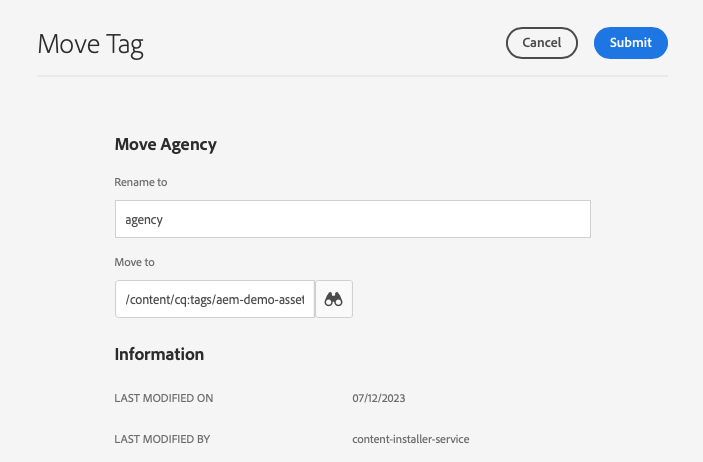

1. Select **Submit**.

The tag is renamed and/or moved to its new location. When the selected tag is a container tag, moving the tag will move all child tags as well.

### Merging Tags {#merging-tags}

If your tagging taxonomy has duplicates or tags that are similar, it can be useful to merge those tags. When tag `A` is merged into tag `B`, all the pages tagged with tag `A` become tagged with tag `B` and tag `A` is no longer available to authors.

1. To merge two tags, open the [tagging console.](#tagging-console)

1. Select the tag that you want to merge into another tag and then select **Merge** in the toolbar.

1. In the **Merge Tag** dialog, select the **Browse** icon of the **Merge into** field to specify into which tag you want to merge the selected tag.

   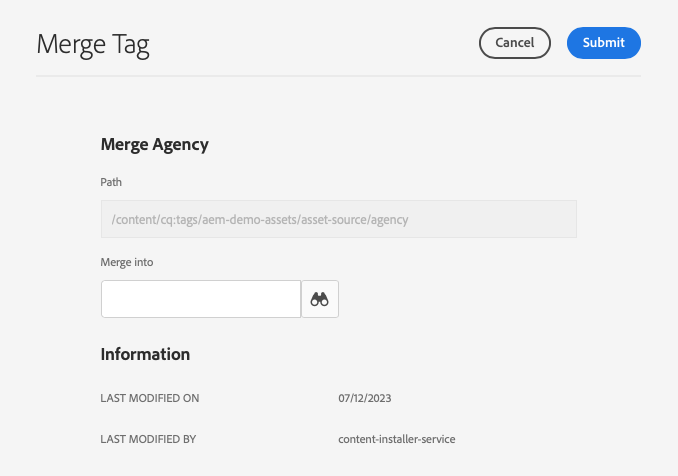

1. Select **Submit**.

The tag selected in the console is merged into the tag specified in the dialog. When a referenced tag is moved or merged, the tag is not physically deleted such that it is possible to maintain references. See [AEM Tagging Framework](/help/implementing/developing/introduction/tagging-framework.md#moving-and-merging-tags) for more information.

### Deleting Tags {#deleting-tags}

If your tagging taxonomy changes and makes a tag or namespace unnecessary, it can be deleted.

1. To delete a tag, open the [tagging console.](#tagging-console)

1. Select the tag that you want to delete and then select **Delete** in the toolbar.

1. The **Delete Tag** dialog asks for a confirmation to delete the selected tag(s). Select **Delete**.

   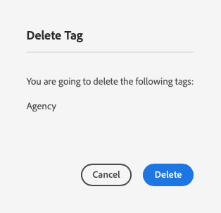

1. AEM checks to make sure that the tag is not referenced.

   1. If no references are found, AEM asks for final confirmation to delete. Select **Delete** 

      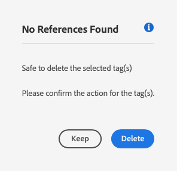

   1. If references are found, AEM presents them and asks for final confirmation to delete.

      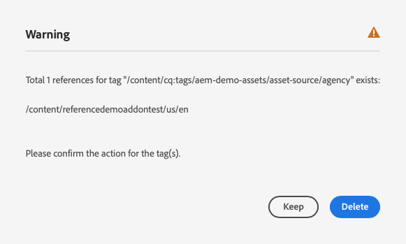

The selected tag(s) is deleted and permanently removed from the author environment. If the tag was published, it is also removed from the publish environment. If the selected tag is a container tag, all of its child tags are removed as well.

<!--

## Setting Tag Permissions {#setting-tag-permissions}

Tag permissions are ['secure (by default)'](/help/sites-administering/production-ready.md); a best practice for the publish environment that requires read permission to be explicitly allowed for tags. Bascially, this is done by creating a package of the Tag Namespace after permissions have been set on author, and installing the package on all publish instances.

* on author instance

    * sign in with administrative privileges
    * access the [Security Console](/help/sites-administering/security.md#accessing-user-administration-with-the-security-console),

        * for example, browse to http://localhost:4502/useradmin

    * in the left pane, select the group (or user) for which [read permission](/help/sites-administering/security.md#permissions) is to be granted
    * in the right pane, locate the **Path **to the Tag Namespace

        * for example, `/content/cq:tags/mycommunity`

    * select the `checkbox`in the **Read** column
    * select **Save**

* ensure all publish instances have same permissions

    * one approach is to [create a package](/help/sites-administering/package-manager.md#package-manager) of the namespace on author

        * on `Advanced` tab, for `AC Handling` select `Overwrite`

    * replicate the package

        * choose `Replicate` from package manager

-->

## Managing Tags in Different Languages {#managing-tags-in-different-languages}

The `title` property of a tag may be translated into multiple languages. Once translated, the appropriate tag title can be displayed according to the user or content language.

Let's assume that we have a tag called `Animals` that we want to translate into German and French.

1. Open the [tagging console.](#tagging-console)

1. Select the tag that you want to translate and then select **Edit** in the toolbar.

1. In the **Edit Tag** dialog, in the **Localization** column, select the target language, for example, German.

1. In the **German** field that appears, provide the translated title.

1. Repeat the previous two steps for French.

   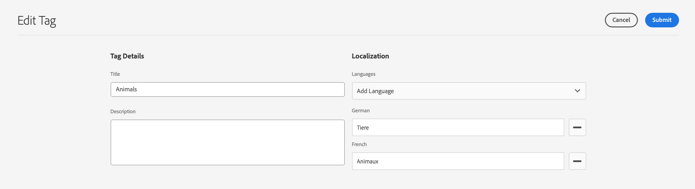

1. Select **Submit**.

For content pages, the language chosen for the tag is taken from the page language, when available.

However in the authoring environment, AEM uses the user language setting. So in the tagging console, for the `Animals` tag, `Animaux` would be displayed for a user who sets the language to French in their user properties.

To add a new language to the dialog, see the document [Building Tagging into AEM Applications](/help/implementing/developing/introduction/tagging-applications.md#adding-a-new-language-to-the-edit-tag-dialog)

>[!TIP]
>
>If you want to learn more about AEM localization features, see [Translating Your Content For Multilingual Sites](/help/sites-cloud/administering/translation/overview.md).
