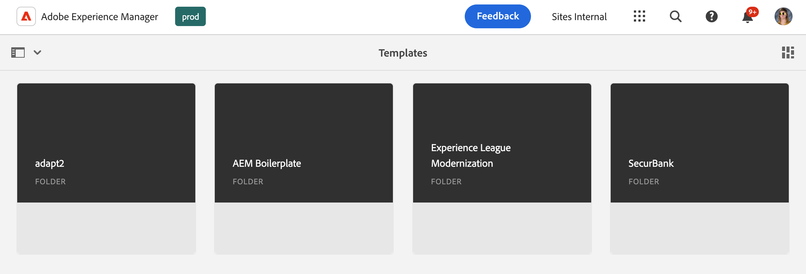
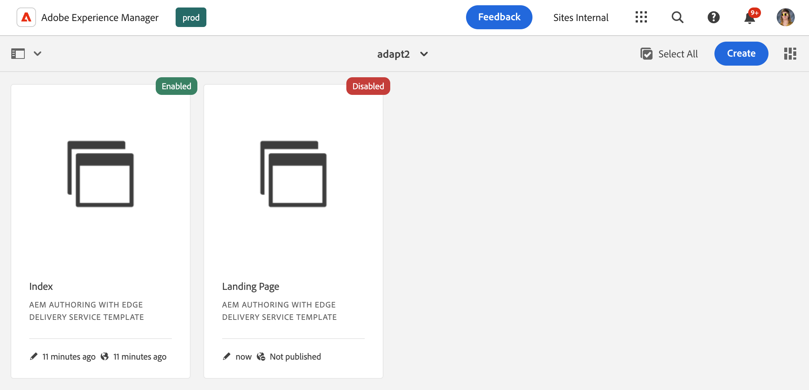
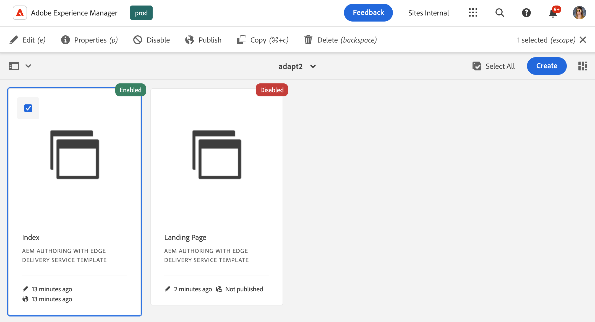

# The Templates Console {#templates-console}

Learn how the templates console serves as the central location to view and manage your page templates.

## Overview {#overview}

When creating a page, you need to select a template. The page template is used as the base for the new page. [AEM's editable templates](/help/implementing/developing/components/templates.md) can define the structure of the resultant page, any initial content, and the components that can be used (design properties).

Content authors are presented with a selection of available templates when they [create new pages in the sites console.](/help/sites-cloud/authoring/sites-console/creating-pages.md) Templates can be used to create pages that are editable with:

* [The Page Editor](/help/sites-cloud/authoring/page-editor/templates.md) or
* [The Universal Editor](/help/sites-cloud/authoring/universal-editor/templates.md)

The templates console allows an administrator to view and manage all page templates in a central location.

## Accessing the Templates Console {#accessing}

1. Sign into AEM as a Cloud Service.
1. Open the global navigation and select the **Tools** panel and then **General** -&gt; **Templates**.

## Orientation {#orientation}

The templates console is organized into folders with one folder per [configuration](/help/implementing/developing/introduction/configurations.md) where editable templates have been activated for the configuration.

[The default view](/help/sites-cloud/authoring/quick-start.md) of the console is the cards view. Tap or click a folder to explore its contents.

Select a template to reveal options available in the toolbar.

* [Edit](#edit-edit)
* [Properties](#properties)
* [Disable/Enable](#enable-disable)
* [Publish](#publish)
* [Copy](#copy)
* [Delete](#delete)

## Edit {#edit}

Editing a template opens the editor that was used to create the template. Either:

* [The Template Editor](/help/sites-cloud/authoring/page-editor/templates.md)
* [The Universal Editor](/help/sites-cloud/authoring/universal-editor/templates.md)

Using whichever editor, you can make the necessary changes to the template. Note that editing a template that is in use can affect your authors.

* For templates created with the Template Editor, changes made can affect live pages that are based on the selected template.
* For templates created with the Universal Editor, changes made affect only new pages your authors create based on the selected template.

If an author starts to a template created with the template editor that has already been enabled, a warning is displayed.

>[!TIP]
>
>Once you have selected a template in the console, use the hot key `e` to edit the selected template.

## Properties {#properties}

You can edit the [properties of the template](/help/sites-cloud/authoring/page-editor/templates.md) much in the same way that you can [edit page properties.](/help/sites-cloud/authoring/sites-console/page-properties.md) Template properties include:

* Template title
* Description
* Image

>[!TIP]
>
>Once you have selected a template in the console, use the hot key `p` to open the properties of the selected template.

## Enabling and Disabling {#enable-disable}

A template can have one of three states:

* **Draft** - The template is still being created and is not available for creating new pages.
* **Enabled** - The template is complete and available for creating new pages.
* **Disabled** - The template is complete but is unavailable for creating new pages.

When a template is created, it is by default either in a **Draft** state (for templates created with the [Template Editor](/help/sites-cloud/authoring/page-editor/templates.md)) or **Enabled** state(for templates created with the [Universal Editor](/help/sites-cloud/authoring/universal-editor/templates.md)).

A template must be enabled before it can be used by content authors to create pages. If a template is no longer needed, it can be disabled so that it no longer displays in the page creation wizard.

* Select the template and click or tap **Disable** to disable the template.
* Select the template and click or tap **Enable** to enable the template.

## Publishing {#publish}

A template created with the template editor can only be used once it is published. Select the template and click or tap **Publish** to publish.

Templates created with the Universal Editor do not need to be published in order to be used.

## Copying {#copy}

If you have a number of pages that are similar in structure, you can use the **Copy** button to create a cope of a template and then vary the copy based on your needs. This is also useful if you would like to use a template on another site.

1. Select the template and then tap or click **Copy** to create a copy.
1. Navigate to where you would like to create the copy.
1. Tap or click **Paste** in the toolbar.

Once pasted, you can:

* [Edit the template](#edit) to adjust it as necessary.
* [Use the properties window](#properties) to update the template title.
* [Enable the template](#enable-disable) so it can be used to create page.
* [Publish the template](#publish) if required.

>[!TIP]
>
>Once you have selected a template in the console, use the hot key `Command+c` or `ctrl+c` to copy the selected template.

## Deleting {#delete}

If a template is no longer needed, it can be deleted provided it is not referenced by any pages.

Select the template and then tap or click **Delete** to delete it.

>[!TIP]
>
>Once you have selected a template in the console, use the hot key `Backspace` to delete the selected template.

## Creating Templates {#create}

Use the **Create** button in the console to create a new template in your current location. For details on creating a template, please see the document [Templates to Create Pages that are Editable with the Page Editor.](/help/sites-cloud/authoring/page-editor/templates.md)

The **Create** button is only used to create templates that are editable with the Page Editor. Please see the document [Templates to Create Pages that are Editable with the Universal Editor](/help/sites-cloud/authoring/universal-editor/templates.md) to learn about creating templates based on pages made with the Universal Editor.
