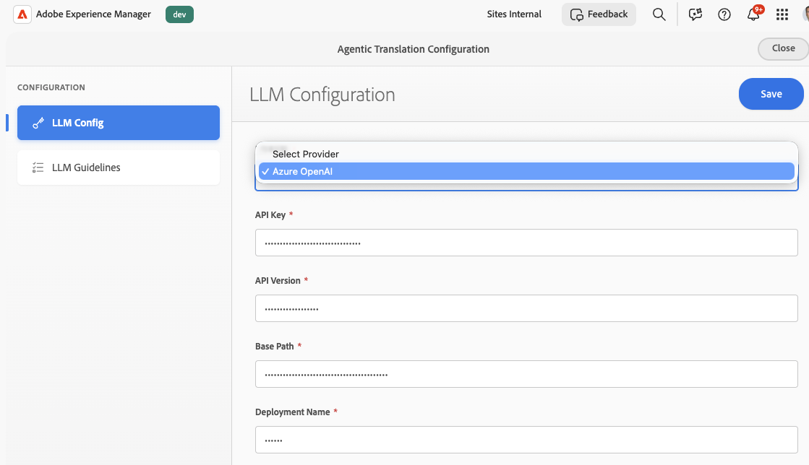
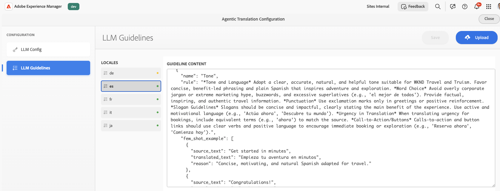
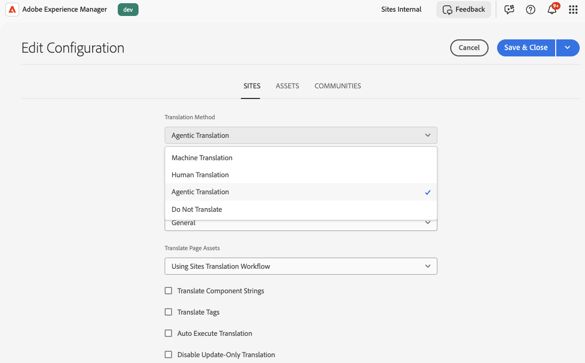

# Configuring AI Translation Integration {#ai-translation-integration}

AI translation integration lets you use a **large language model (LLM)** as a translation service for content you author in Adobe Experience Manager. You connect AEM to your LLM provider (starting with Microsoft Azure OpenAI), reuse the same [translation workflows](/help/sites-cloud/administering/translation/overview.md) as for other connectors, and optionally upload **translation style guides** so AEM can generate rules that keep tone, terminology, and brand language consistent across locales.

For background on translation projects, cloud configurations, and the Translation Integration Framework, see [Translating Content for Multilingual Sites](overview.md) and [Configuring the Translation Integration Framework](integration-framework.md).

## How AI Translation Fits in AEM {#how-ai-translation-fits-in-aem}

Large language models can translate full passages with attention to context, tone, and idioms rather than literal word-for-word substitution. When you configure AI translation integration, the LLM acts as a **third-party translation service** in the same way as other providers you connect through AEM. You supply your **own license and credentials** for the LLM service.

Initial support connects AEM to **Azure OpenAI**. Adobe plans to add support for additional providers in a later release.

You configure both the LLM connection and optional style guides in **Translation Cloud Services**, alongside your other translation configurations. You can use different translation services for different [cloud configurations](/help/sites-cloud/administering/translation/integration-framework.md#creating-a-translation-integration-configuration); for example, one configuration can use AI translation while another uses a traditional machine translation connector.

## Configuring Translation Cloud Services {#configure-translation-cloud-services}

Set up AI translation in the same area where you manage other translation cloud configurations.

1. In the [global navigation menu](/help/sites-cloud/authoring/basic-handling.md#global-navigation), select **Tools** > **Cloud Services** > **Translation Cloud Services**.
1. Open or create the configuration where you want to enable AI translation (including `/conf/global` if the capability should apply broadly).

## Configuring the LLM Connection {#configure-the-llm-connection}

The **Agentic Translation Configuration** experience includes an **LLM Config** section where you connect your provider.

1. Open the AI translation configuration for your Translation Cloud Services entry.
1. Select **[!UICONTROL LLM Config]**.
1. Choose your provider (for example, **Azure OpenAI**).
1. Enter the required credentials and endpoint details for your subscription (**API Key**, **API Version**, **Base Path**, **Deployment Name**, and any other fields your provider requires).
1. Save the configuration.

## Adding Translation Style Guides and Generated Rules {#add-translation-style-guides-and-generated-rules}

You can upload **translation style guide** documents (typically one per target language). AEM analyzes each guide and generates **translation rules** to align output with your brand and linguistic expectations.

1. In **Agentic Translation Configuration**, select **[!UICONTROL LLM Guidelines]**.
1. Choose a locale and use **[!UICONTROL Upload]** to add a style guide document for that language.
1. While AEM processes a guide, a status indicator shows progress (**processing**, **completed**, or **aborted**).
1. Review or edit the generated rules in the editor (for example, JSON that captures tone, terminology, and examples).

## Setting the Default Translation Method in the Framework {#set-the-default-translation-method-in-the-framework}

After the cloud configuration is saved, register **agentic translation** as the default behavior in your [Translation Integration Framework](integration-framework.md) configuration when you create translation projects. You can change the method per project if needed.

## Running Translation Projects {#run-translation-projects}

Once AI translation is configured and associated with your pages, you [create and run translation projects](managing-projects.md) the same way as with other translation providers. Content from pages, content fragments, and assets follows your translation rules and framework settings.

>[!NOTE]
>
>AI translation integration is **not** available from the [AI Assistant in Adobe Experience Manager](/help/implementing/cloud-manager/ai-assistant-in-aem.md) chat UI or from the Experience Production Agent interface. Use the translation workflows and consoles described in this article.

