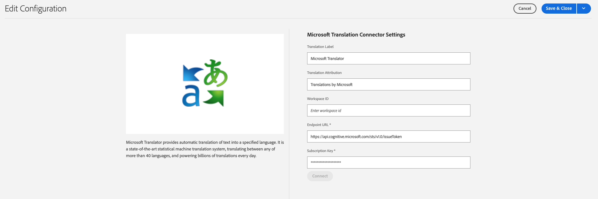

# Connecting to Microsoft Translator {#connecting-to-microsoft-translator}

AEM provides a built-in connector for [Microsoft Translator](https://www.microsoft.com/en-us/translator/business/) to translate page content or assets. After obtaining a license from Microsoft to use Microsoft Translator, please configure the connector following the instructions on this page. 

>[!TIP]
>
>If you are new to translating content, see [Sites Translation Journey](/help/journey-sites/translation/overview.md), which is guided path through translating your AEM Sites content using AEM's powerful translation tools, ideal for those with no AEM or translation experience.

|Property|Description|
|---|---|
|Translation Label|The display name for the translation service|
|Translation Attribution|(Optional) For user-generated content, the attribution that appears next to translated text, for example, `Translations by Microsoft`|
|Workspace ID|(Optional) The ID of your customized Microsoft Translator engine to use|
|Subscription Key|Your Microsoft Subscription Key for Microsoft Translator|

The following procedure creates a Microsoft Translator configuration.

1. In the [navigation panel](/help/sites-cloud/authoring/basic-handling.md#first-steps), select **Tools** &gt; **Cloud Services** &gt; **Translation Cloud Services**.
1. Navigate to where you want to create the configuration. Normally this is in your site root or it can be a global, default configuration.
1. Select the **Create** button.
1. Define your configuration.
   1. Select **Microsoft Translator** in the drop-down.
   1. Type a title for your configuration. The title identifies the configuration in the Cloud Services console and in page property drop-down lists.
   1. Optionally, type a name to use for the repository node that stores the configuration.

   

1. Click **Create**.
1. In the **Edit Configuration** window, provide the values for the translation service described in the previous table.

   

1. Select **Connect** to verify the connection.
1. Select **Save &amp; Close**.

## Publishing the Translator Service Configurations {#publishing-the-translator-service-configurations}

As a final step, please publish your Microsoft Translator configurations to support published translated content, using the [publishing a tree](/help/sites-cloud/authoring/sites-console/publishing-pages.md#publishing-and-unpublishing-a-tree) action.  
