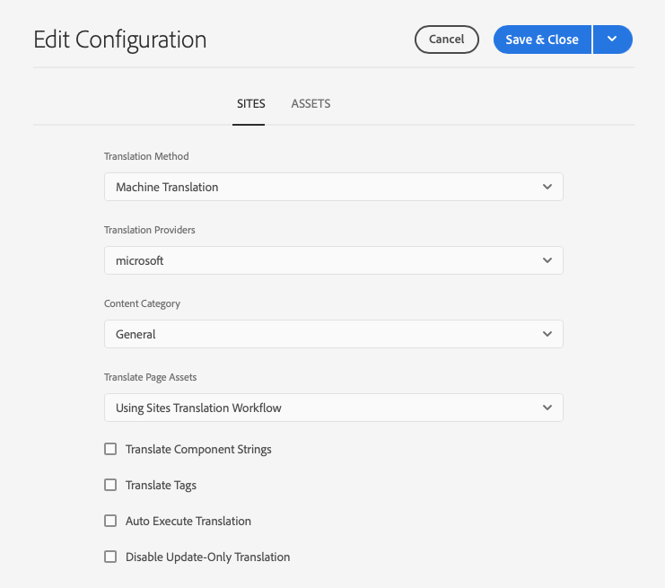
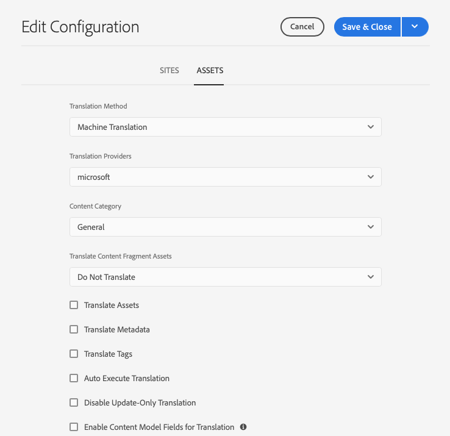

# Configuring the Translation Integration Framework {#configuring-the-translation-integration-framework}

The Translation Integration Framework integrates with third-party translation services to orchestrate the translation of AEM content. It involves three basic steps.

1. [Connect to your translation service provider](#connecting-to-a-translation-service-provider).
1. [Create a Translation Integration Framework configuration](#creating-a-translation-integration-configuration).
1. [Associate the cloud configurations with your pages](#configuring-pages-for-translation).

For an overview of the content translation features in AEM, see [Translating Content for Multilingual Sites](overview.md).

>[!TIP]
>
>If you are new to translating content, see [Sites Translation Journey](/help/journey-sites/translation/overview.md), which is guided path through translating your AEM Sites content using AEM's powerful translation tools, ideal for those with no AEM or translation experience.

## Connecting to a Translation Service Provider {#connecting-to-a-translation-service-provider}

Create a cloud configuration that connects AEM to your translation service provider. 

AEM includes the capability to [connect to Microsoft&reg; Translator](connect-ms-translator.md) by default. Other translation technology vendors with AEM connectors who are members of the Adobe Exchange partner program can be found [here](https://exchange.adobe.com/apps/browse/ec?page=1&partnerLevel=All&product=AEM&q=experience+manager+translation&sort=RELEVANCE).  

After you install a connector package, you can create a cloud configuration for the connector. Typically, you must provide your credentials for authenticating with the translation service. For information about adding a cloud configuration for the Microsoft&reg; Translator connector, see [Integrating with Microsoft&reg; Translator](connect-ms-translator.md).

You can create multiple cloud configurations for the same connector if necessary. For example, create one configuration for each of the accounts or projects that you have with the same vendor.

After you configure a connection, you can create the translation integration framework configuration that uses it.

## Creating a Translation Integration Configuration {#creating-a-translation-integration-configuration}

Create a translation integration framework configuration so you can specify how to translate your content. The configuration includes the following information:

* Which translation service provider to use
* Whether human or machine translation is to be performed
* Whether to translate other content that is associated with a page or asset, such as tags

After you create a framework configuration, you associate the cloud configuration with the pages that you want to translate according to the configuration. When the translation process is started, the translation workflow proceeds according to the associated framework configuration.

When different sections of your website have different translation requirements, create multiple framework configurations accordingly. For example, a multilingual website might include English, Spanish, and Japanese language copies. The site owner uses two different translation service providers for Spanish and Japanese translations. Therefore, two configurations of the framework are configured. Each configuration uses a different translation service provider.

After you configure a translation integration framework, you can [associate it with the pages](preparation.md) that use it.

>[!TIP]
>
>For an overview of the content translation features in AEM, see [Translating Content for Multilingual Sites](overview.md).

A single configuration of the framework controls how page content and assets are translated. To create a translation configuration:

1. In the [global navigation menu](/help/sites-cloud/authoring/basic-handling.md#global-navigation), select **Tools &gt; Cloud Services &amp; Translation Cloud Services**.
1. Navigate to where you want to create the configuration in your content structure. This is often based on a particular site or can be global.
1. Provide the following information in the fields and then select **Create**.:
   1. Select **Configuration Type** in the drop-down.
   1. Enter a **Title** for your configuration. The **Title** identifies the configuration in the **Cloud Services** console and in page property drop-down lists.
   1. Optionally, type a **Name** to use for the repository node that stores the configuration.
1. In the **Edit Configuration** window, configure the properties on the **Sites** and **Assets** tabs, and then select **Save &amp; Close**.

### Sites Configuration Properties {#sites-configuration-properties}

The **Sites** tab controls how the translation of page content is performed.

|Property|Description|
|---|---|
|Translation Method|This property defines the translation method that the framework performs for site content: - Machine Translation: The translation provider performs the translation using machine translation in real time. - Human Translation: Content is sent to the translation provider to be translated by translators. - Do Not Translate: Content is not sent for translation. This is to skip certain content branches which would not be translated but could be updated with latest content.|
|Translation Provider|This property defines the translation provider to perform the translation. A provider appears in the list when its corresponding connector is installed.|
|Content Category|(Machine Translation Only) This property is a category that describes the content that you are translating. The category can affect the choice of terminology and phrasing when translating content.|
|Translate Tags|This option enables translating tags that are associated with the page.|
|Translate Page Assets|This property defines how to translate assets that are added to components from the file system or referenced from assets: - Do not translate: Page assets are not translated. - Using sites translation workflow: Assets are handled according to the configuration properties on the **Sites** tab. - Using assets translation workflow: Assets are handled according to the properties configured on the **Assets** tab.|
|Auto-Execute Translation|Enable this property to execute translation jobs automatically after translation projects are created. You do not have an opportunity to review and scope the translation job when you select this option.|
|Disable Update-Only Translation|When this option is checked, updating the translation project submits all translatable fields for translation, not just the ones changed since last translation.|

### Assets Configuration Properties {#assets-configuration-properties}

Assets properties control how to configure assets. For more information about translating assets, see [Creating Language Copies for Assets](/help/assets/translate-assets.md).

|Property|Description|
|---|---|
|Translation Method|This property selects the type of translation that the framework performs for assets: - Machine Translation: The translation provider performs the translation immediately using machine translation. - Human Translation: Content is automatically sent to the translation provider to be manually translated. -Do Not Translate: Assets are not sent for translation.|
|Translation Provider|This property defines the translation provider to perform the translation. A provider appears in the list when its corresponding connector is installed.|
|Content Category|(Machine Translation only) This property describes the content that you are translating. The category can affect the choice of terminology and phrasing when translating content.|
|Translate Assets|Activate this property to include assets in the translation project.|
|Translate Metadata|Activate this property so you can translate asset metadata.|
|Translate Tags|Activate this property so you can translate tags that are associated with the asset.|
|Auto-Execute Translation|Select this property so you can run translation jobs automatically after translation projects are created. You do not have an opportunity to review or scope the translation job when you select this option.|
|Disable Update-Only Translation|When this option is checked, updating the translation project submits all translatable fields for translation, not just the ones changed since last translation.|
|Enable Content Model Fields for Translation|Enabling this option uses the **Translatable** field on [Content Fragment Models](/help/sites-cloud/administering/content-fragments/content-fragment-models.md#properties) to determine if the field is translated and automatically creates [translation rules](rules.md) accordingly. This option supersedes any translation rules that you may have created.|

## Configuring Pages for Translation {#configuring-pages-for-translation}

To configure the translation of your source pages into other languages, associate the pages with the following cloud configurations:

* The cloud configuration that connects AEM to your translation provider.
* The translation integration framework that configures the details of the translation.

The translation integration framework cloud configuration identifies the cloud configuration to use for connecting to the service provider. When you associate a source page with a framework cloud configuration, the page must be associated with the service provider cloud configuration that the framework cloud configuration uses.

When you associate a page with a cloud configuration, the descendants of the page inherit the association. For example, if you associated the `/content/wknd/language-masters/en/magazine` page with a Translation Integration Framework, the `magazine` page and child pages below it are translated according to the framework.

When required, you can override the association on a descendent page. For example, the content of a web site is mostly about travel and lifestyle. However, one branch of pages describes the company. In such a case, the root page of the site might be associated with a Translation Integration Framework that specifies machine translation using the Lifestyle category. The branch that describes the company would use a framework that performs machine translation using the General category.

### Associating a Page with a Translation Provider {#associating-a-page-with-a-translation-provider}

Associate a page with the translation provider that you are using to translate the page and descendent pages.

1. In the sites console, select the page to configure and select **View Properties**.
1. Select the **Cloud Services** tab.
1. In the **Add Configuration** drop-down list, select the configuration.
1. Select **Save &amp; Close**.

### Associating Pages with a Translation Integration Framework {#associating-pages-with-a-translation-integration-framework}

Associate a page with the Translation Integration Framework that defines how you want to perform the translation of the page and descendent pages.

1. In the sites console, select the page to configure and select **View Properties**.
1. Select the **Cloud Services** tab.
1. In the **Add Configuration** drop-down list, select the configuration.
1. Select **Save &amp; Close**.
