# Managing Translation Projects {#managing-translation-projects}

Translation projects enable you to manage the translation of AEM content. A translation project is a type of AEM [project](/help/sites-cloud/authoring/projects/overview.md) that contains resources that are to be translated into other languages. These resources are the pages and assets of the [language copies](preparation.md) that are created from the language master.

>[!TIP]
>
>If you are new to translating content, see [Sites Translation Journey,](/help/journey-sites/translation/overview.md) which is guided path through translating your AEM Sites content using AEM's powerful translation tools, ideal for those with no AEM or translation experience.

When resources are added to a translation project, a translation job is created for them. Jobs provide commands and status information that you use to manage the human translation and machine translation workflows that execute on the resources.

Translation projects are long-running items, defined by language and translation method/provider to align with organizational governance for globalization. They should be initiated once, either during initial translation or manually, and remain in effect throughout content and translation update activities.

Translation projects and jobs are created with translation preparation workflows. These workflows have three options, for both initial translation (Create &amp; Translate) and updates (Update Translation):

1. [Create new project](#creating-translation-projects-using-the-references-panel)
1. [Add to existing project](#adding-pages-to-a-translation-project)
1. [Content structure only](#creating-the-structure-of-a-language-copy)

AEM detects whether a translation project is being created for the initial translation of content, or to update already-translated language copies. When you create a translation project for a page and indicate the language copies for which you are translating, AEM detects whether the source page already exists in the targeted language copies:

* **The language copy does not include the page:** AEM treats this situation as the initial translation. The page is immediately copied to the language copy, and included in the project. When the translated page is imported into AEM, AEM copies it directly to the language copy.
* **The language copy already includes the page:** AEM treats this situation as an updated translation. A launch is created and a copy of the page is added to the launch, and included in the project. Launches enable you to review updated translations before committing it to the language copy:

  * When the translated page is imported into AEM, it overwrites the page in the launch.
  * The translated page overwrites the language copy only when the launch is promoted.

For example, the `/content/wknd/fr` language root is created for the French translation of the `/content/wknd/en` master language. There are no other pages in the French language copy.

* A translation project is created for the `/content/wknd/en/products` page and all child pages, targeting the French language copy. Because the language copy does not include the `/content/wknd/fr/products` page, AEM immediately copies the `/content/wknd/en/products` page and all child pages to the French language copy. The copies are also included in the translation project.
* A translation project is created for the `/content/wknd/en` page and all child pages, targeting the French language copy. Because the language copy includes the page that corresponds with the `/content/wknd/en` page (the language root), AEM copies the `/content/wknd/en` page and all child pages and adds them to a launch. The copies are also included in the translation project.

## Translation from the Sites Console {#performing-initial-translations-and-updating-existing-translations}

Translation projects can be created or updated directly from the sites console.

### Creating Translation Projects Using the References Panel {#creating-translation-projects-using-the-references-panel}

Create translation projects so that you can execute and manage the workflow for translating the resources of your language master. When you create projects, you specify the page in the language master that you are translating and the language copies for which you are performing the translation:

* The cloud configuration of the translation integration framework that is associated with the selected page determines many properties of the translation projects, such as the translation workflow to use.
* A project is created for each language copy that is selected.
* A copy of the selected page and associated assets are created and added to each project. These copies are later sent to the translation provider for translating.

You can specify that the child pages of the selected page are also selected. In this case, copies of the child pages are also added to each project so that they are translated. When any child pages are associated with different translation integration framework configurations, AEM creates additional projects.

You can also [manually create translation projects](#creating-a-translation-project-using-the-projects-console).

>[!NOTE]
>
>To create a project, your account must be a member of the `project-administrators` group.

### Initial Translations and Updating Translations {#initial-and-updating}

The References panel indicates whether the you are updating existing language copies or creating the first version of the language copies. When a language copy exists for the selected page, the Update Language Copies tab appears to provide access to project-related commands.

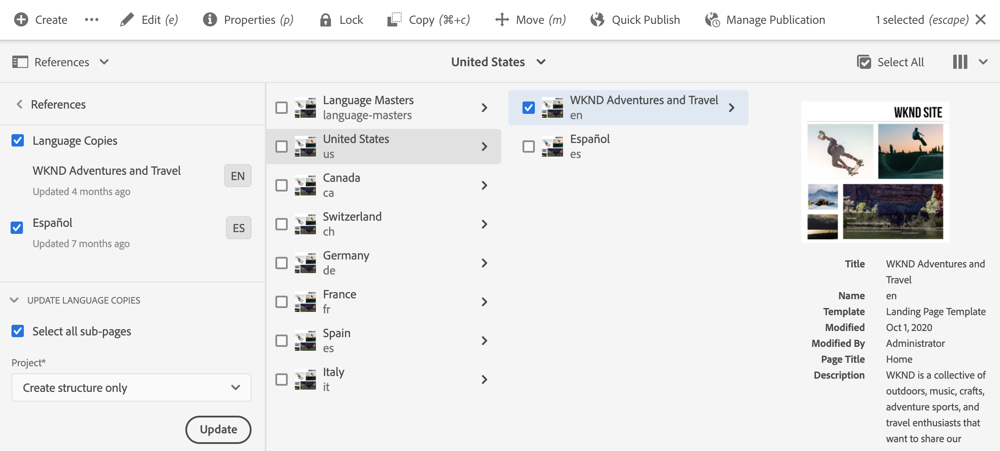

After translating, you can [review the translation](#reviewing-and-promoting-updated-content) before overwriting the language copy with it. When no language copy exists for the selected page, the Create & Translate tab appears to provide access to project-related commands.

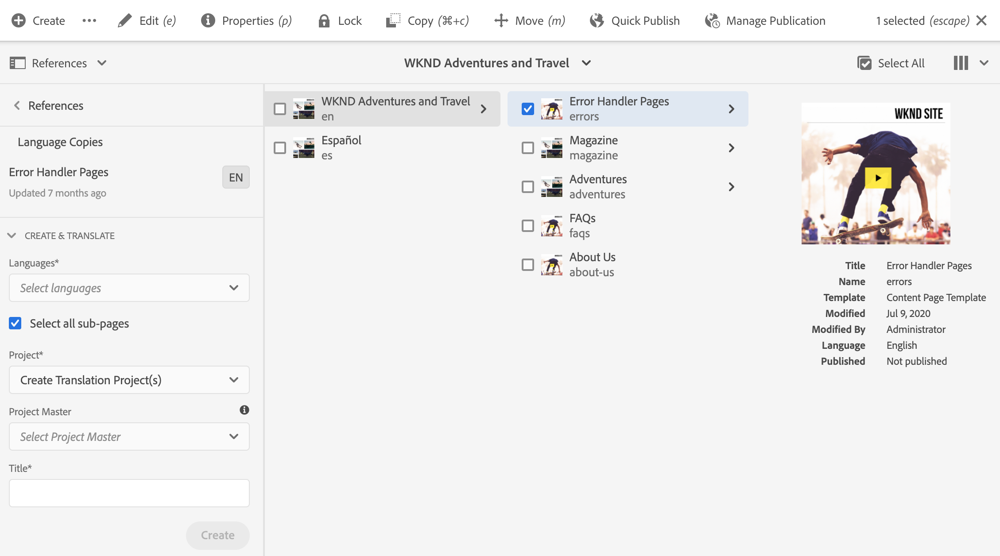

### Create Translation Projects for a New Language Copy {#create-translation-projects-for-a-new-language-copy}

1. Use the Sites console to select the page that you are adding to translation projects.

1. Using the toolbar, open the **References** rail.

   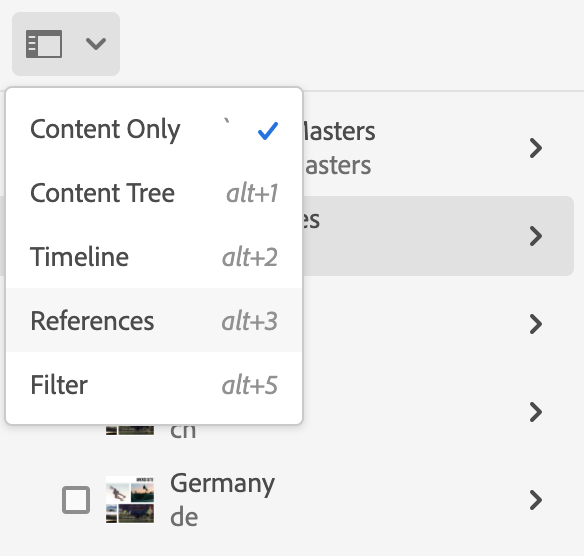

1. Select **Language Copies**, and then select the language copies for which you are translating the source pages.
1. Select **Create &amp; Translate** and then configure the translation job:

    * Use the **Languages** drop-down to select a language copy for which you want to translate. Select additional languages as required. Languages that appear in the list correspond with the [language roots that you have created](preparation.md#creating-a-language-root).
      * Selecting multiple languages creates one projects with a translation job for each language.
    * To translate the page that you selected and all child pages, select **Select all sub-pages**. To translate only the selected page that you selected, clear the option.
    * For **Project**, select **Create Translation Project(s)**.
    * Optionally for **Project Master**, select a project from which to inherit user roles and permissions.
    * In **Title** type a name for the project.

   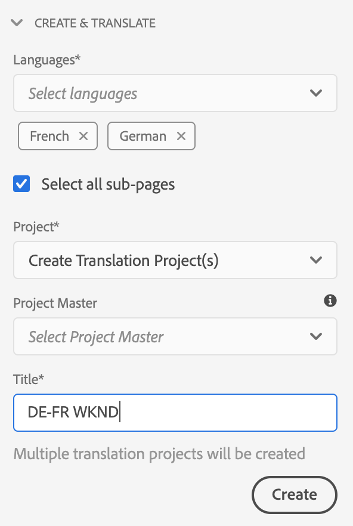

1. Select **Create**.

### Create Translation Projects for an Existing Language Copy {#create-translation-projects-for-an-existing-language-copy}

1. Use the Sites console to select the page that you are adding to the translation projects.

1. Using the toolbar, open the **References** rail.

   

1. Select **Language Copies**, and then select the language copies for which you are translating the source pages.
1. Select **Update Language Copies** and then configure the translation job:

    * To translate the page that you selected and all child pages, select **Select all sub-pages**. To translate only the selected page that you selected, clear the option.
    * For **Project**, select **Create Translation Project(s)**.
    * Optionally for **Project Master**, select a project from which to inherit user roles and permissions.
    * In **Title** type a name for the project.

   

1. Select **Create**.

### Adding Pages to a Translation Project {#adding-pages-to-a-translation-project}

After you have created a translation project, you can use the **Resources** rail to add pages to the project. Adding pages is useful when you are including pages from different branches in the same project.

When you add pages to a translation project, the pages are included in a new translation job. You can also [add pages to an existing job](#adding-pages-assets-to-a-translation-job).

As when creating a project, when adding pages, copies of the pages are added to a launch when necessary to avoid overwriting existing language copies. (See [Creating Translation Projects for Existing Language Copies](#performing-initial-translations-and-updating-existing-translations).)

1. Use the Sites console to select the page that you are adding to the translation project.

1. Using the toolbar, open the **References** rail.

   

1. Select **Language Copies**, and then select the language copies for which you are translating the source pages.

   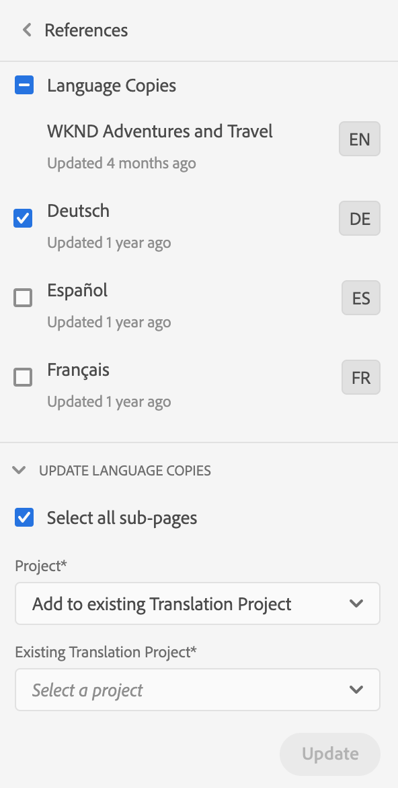

1. Select **Update Language Copies** and then configure the properties:

    * To translate the page that you selected and all child pages, select **Select all sub-pages**. To translate only the selected page that you selected, clear the option.
    * For **Project**, select **Add to existing Translation Project**.
    * Select the project in **Existing Translation Project**.

   >[!NOTE]
   >
   >The target language set in the translation project should match with the path of the language copy as shown in references rail.

1. Select **Update**.

### Creating the Structure of a Language Copy {#creating-the-structure-of-a-language-copy}

It is possible to create only the structure of the language copy, allowing you to copy content and structural changes in the language master to (untranslated) language copies. This is unrelated to a translation job or project. You can use this to keep your language masters in sync, even without translation.

Populate your language copy so that it contains content from the master language that you are translating. Before you populate your language copy, you must have [created the language root](preparation.md#creating-a-language-root) of the language copy.

1. Use the sites console to select the language root of the master language that you are using as the source.
1. Open the references rail by clicking or tapping **References** in the toolbar.

   

1. Select **Language Copies**, and then select the language copies that you want to populate.

   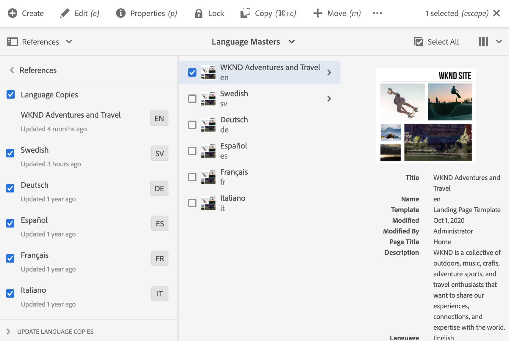

1. Select **Update Language Copies** to reveal the translation tools, and configure the properties:

    * Select the **Select all sub-pages** option.
    * For **Project**, select **Create Structure Only**.

   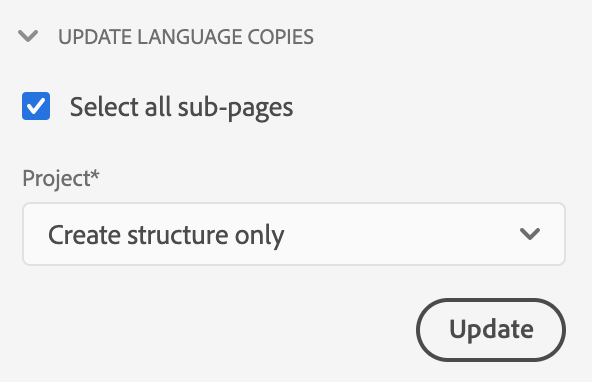

1. Select **Update**.

### Updating Translation Memory {#updating-translation-memory}

Manual edits of translated content can be synchronized back to the Translation Management System (TMS) to train its translation memory.

1. From the sites console, after updating text content in a translated page, select **Update Translation Memory**.
1. A list view shows a side-by-side comparison of the source and the translation for every text component that was edited. Select which translation updates should be synchronized to translation memory, and select **Update Memory**.

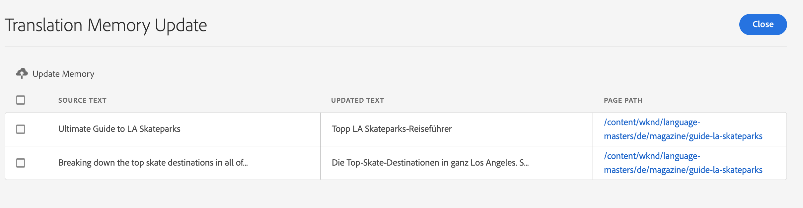

AEM updates the translation of the existing strings in the translation memory of the configured TMS.

* The action updates the translation of existing strings in the translation memory of the configured TMS. 
* It does not create new translation jobs.
* It sends the translations back to the TMS, via AEM translation API (see below).

To use this feature:

* A TMS must be configured for use with AEM.
* The connector must implement the method [`storeTranslation`](https://developer.adobe.com/experience-manager/reference-materials/cloud-service/javadoc/com/adobe/granite/translation/api/TranslationService.html).
  * Code within this method determines what happens to the translation memory update request.
  * The AEM translation framework sends the string value pairs (original and updated translation) back to the TMS  via this method implementation. 

The translation memory updates can be intercepted and sent to a custom destination, for cases where a proprietary translation memory is used.

### Checking Translation Status of a Page {#check-translation-status}

A property can be selected in the list view of the sites console that shows if a page has been translated, is in translation, or has not yet been translated.

1. In the site console, switch to [list view](/help/sites-cloud/authoring/basic-handling.md#viewing-and-selecting-resources).
1. Select, **View Settings** in the view drop-down.
1. In the dialog, check the **Translated** property and select **Update**.

The sites console now displays the **Translated** column showing the translation status of the pages listed.

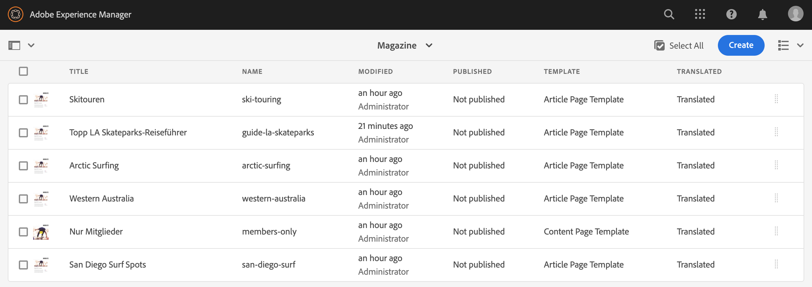

## Managing Translation Projects from the Project Console

Many translation tasks and advanced options can be accessed in the projects console.

### Understanding the Projects Console

Translation projects in AEM use the standard [AEM projects console](/help/sites-cloud/authoring/projects/overview.md). If you are not familiar with AEM projects, review that documentation.

As any other project A translation project is made up of tiles that present an overview of the project tasks.

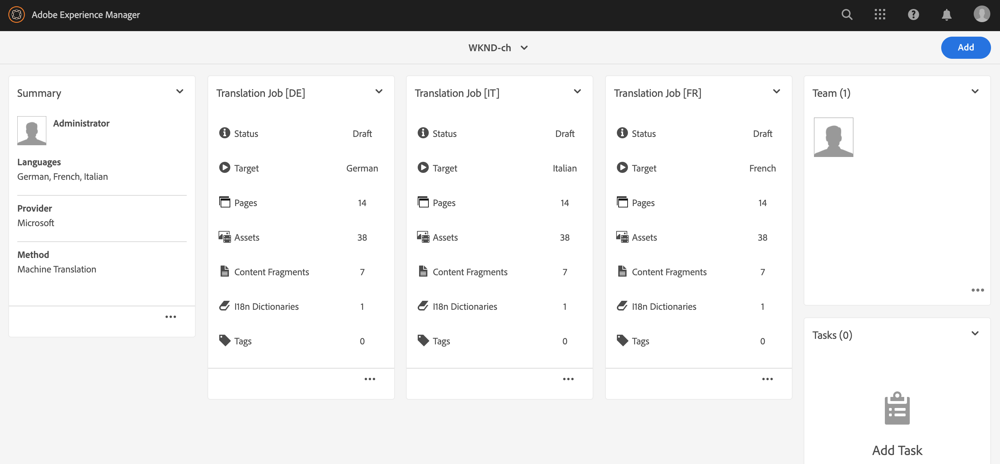

* **Summary** - An overview of the project
* **Tasks** - One or more translation tasks
* **Team** - Users collaborating on the translation project
* **Tasks** - Items that need to be completed as part of the translation effort

Use the commands and ellipsis buttons at the top and bottom of the tiles (respectively) to access controls and options for the various tiles.

### Creating a Translation Project Using the Projects Console {#creating-a-translation-project-using-the-projects-console}

You can manually create a translation project if you prefer to use the projects console instead of the sites console.

>[!NOTE]
>
>To create a project, your account must be a member of the `project-administrators` group.

When you manually create a translation project, you must provide values for the following translation-related properties in addition to the [basic properties](/help/sites-cloud/authoring/projects/managing.md#creating-a-project):

* **Name:** Project name
* **Source Language:** The language of the source content
* **Target Language:** The language or languages into which the content is being translated
  * If multiple languages are selected, a job is created for each language within the project.
* **Translation Method:** Select **Human Translation** to indicate that the translation is to be performed manually.

1. On the toolbar of the projects console, select **Create**.
1. Select the **Translation Project** template and then select **Next**.
1. Enter values for the **Basic** properties tab.
1. Select **Advanced** and provide values for the translation-related properties.
1. Select **Create**. In the confirmation box, select **Done** to return to the projects console, or select **Open Project** to open and start managing the project.

### Adding Pages and Assets to a Translation Job {#adding-pages-assets-to-a-translation-job}

You can add pages, assets, or tags to the translation job of your translation project. To add pages or assets:

1. On the bottom of the translation job tile of your translation project, select the ellipsis.

   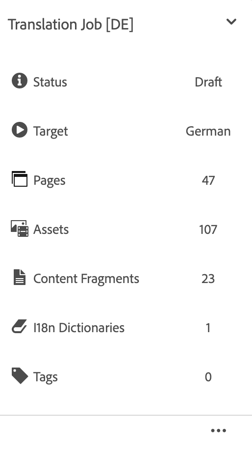

1. In the next window select the **Add** button in the toolbar and then select **Assets/Pages**.

   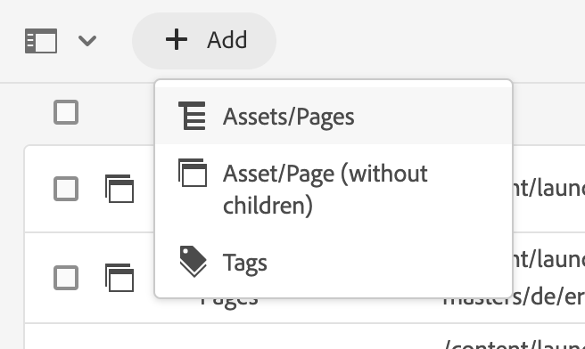

1. In the modal window, select the topmost item of the branch that you want to add, and then select the check mark icon. Multi-select is enabled in this window.

   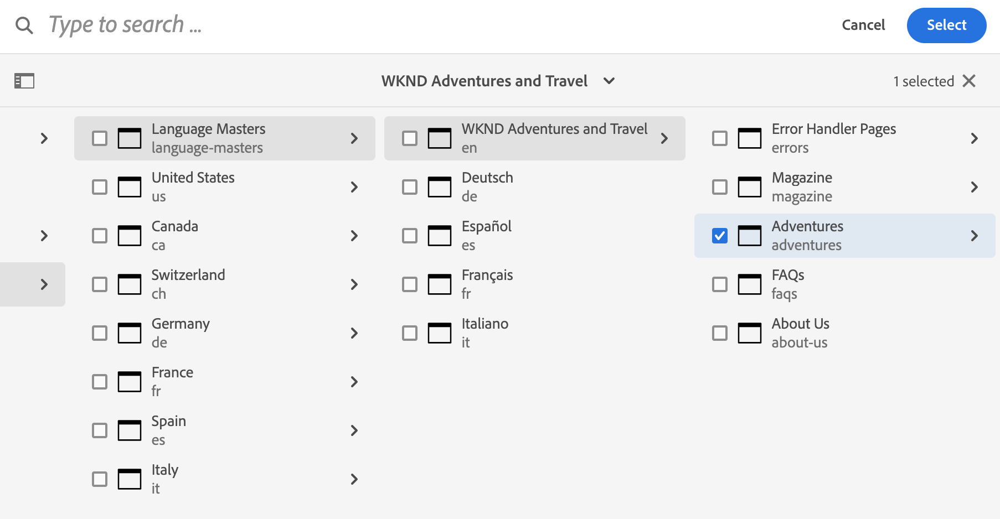

1. Alternatively, you can select the search icon to easily look for pages or assets you want to add to your translation job.

   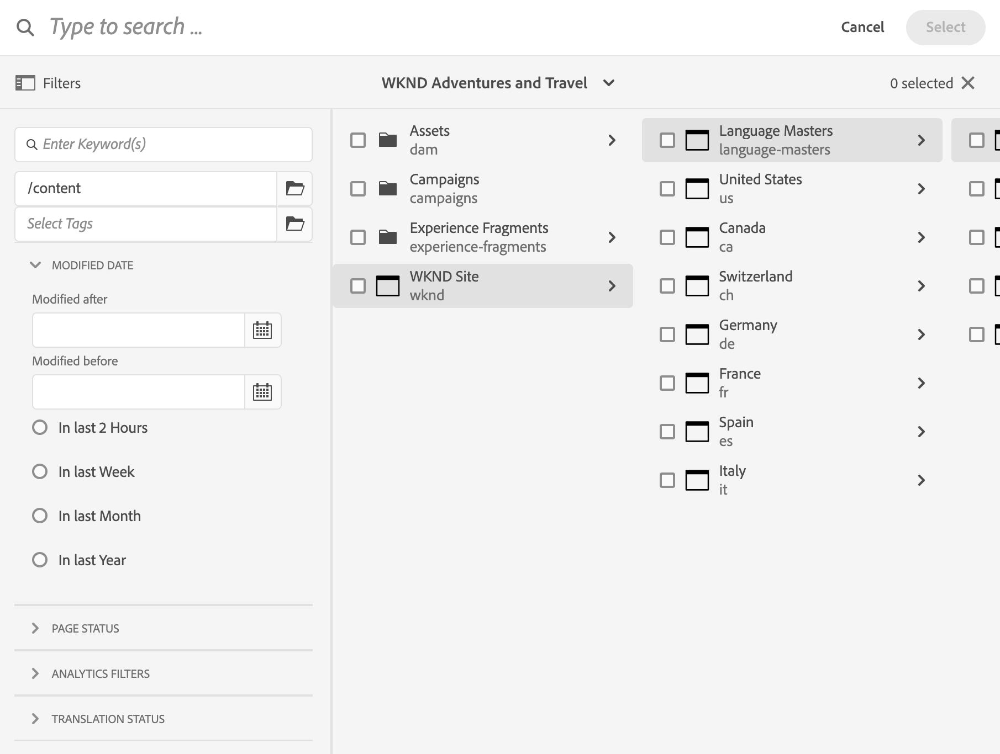

1. Once selected, select **Select**. Your pages and/or assets are added to the translation job.

>[!TIP]
>
>This method adds pages/assets and their children to the project. Select **Asset/Page (without children)** if you only want to add the parents.

### Adding i18n Dictionaries to a Translation Job {#adding-i-n-dictionaries-to-a-translation-job}

You can add pages, assets, tags or i18n dictionaries to the Translation Job of your Translation project. To add an i18n dictionary:

1. On the bottom of the Translation Job tile of your translation project, click the ellipsis.

   

1. Click Add and I18N-Dictionary.

   

1. Select the **Root Directory**, and dictionary (if necessary), that you want to add, and then select **Add**.

   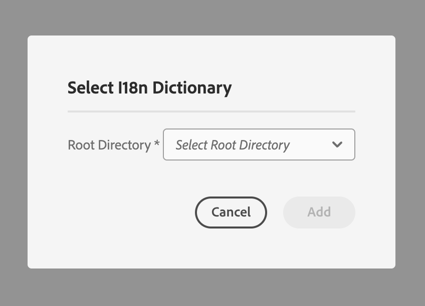

Your dictionary is now in your translation job.

>[!NOTE]
>
>For more information about i18n dictionaries, read [Using Translator to Manage Dictionaries](/help/implementing/developing/extending/i18n/translator.md).

### Adding Tags to a Translation Job {#adding-tags-to-a-translation-job}

You can add tags to a translation project similar to [how you add assets and pages to a project](#adding-pages-assets-to-a-translation-job). Just select **Tags** under the **Add** menu then follow the same steps.

### Seeing Translation Project Details {#seeing-translation-project-details}

The translation project properties are accessible via the ellipsis button of the project summary tile. In addition to the generic [project information](/help/sites-cloud/authoring/projects/overview.md#project-info), the translation project properties contains translation-specific.

In your translation project, select the ellipsis at the bottom of the Translation Summary tile. Most project-specific properties are on the **Advanced** tab.

* **Source Language:** The language of the pages that are being translated
* **Target Language:** The language or languages into which the pages are being translated
* **Cloud Configuration:** The cloud configuration for the translation service connector that is used for the project
* **Translation Method:** The translation workflow, either **Human Translation** or **Machine Translation**
* **Translation Provider:** The translation service provider that is performing the translation
* **Content Category:** (Machine Translation) The content category that is used for translating
* **Translation Provider Credential:** The credentials to sign into the provider
* **Automatically Promote Translation Launches:** After receiving translated content, translation launches are automatically promoted
  * **Delete Launch After Promotion:** If translation launches are automatically promoted, delete the launch after promotion
* **Automatically Approve Translations:** After receiving translated content, translation jobs are automatically approved
* **Repeat Translation:** Configure recurring execution of a translation project by selecting the frequency that the project will automatically create and execute translation jobs

When a project is created using the references rail of a page, these properties are automatically configured based on the properties of the source page.

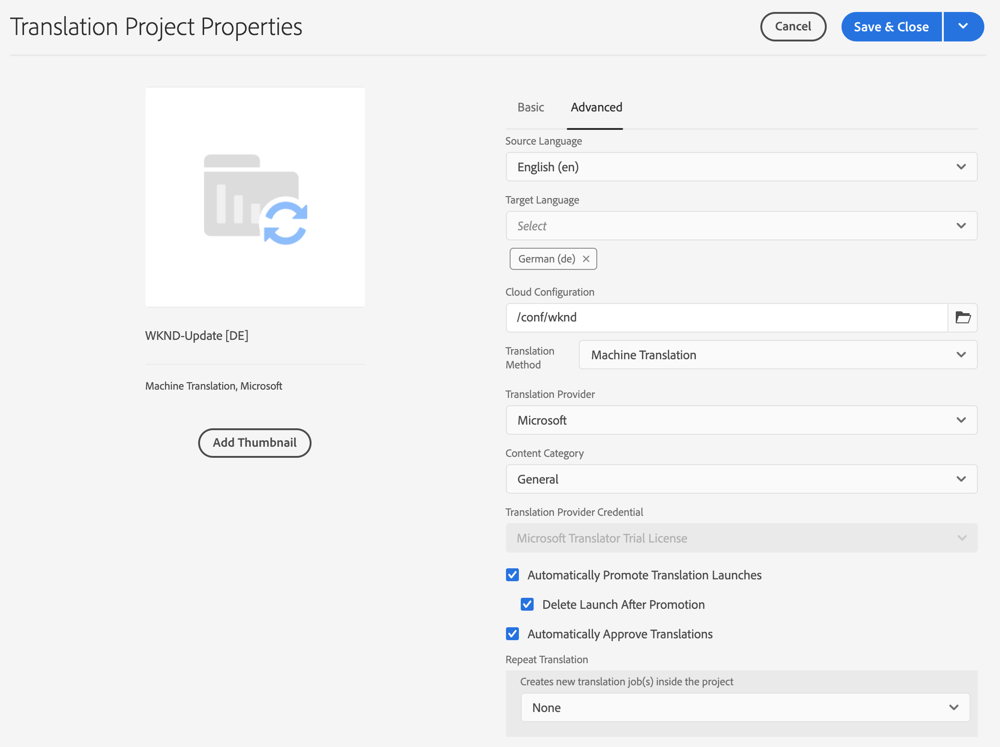

### Monitoring the Status of a Translation Job {#monitoring-the-status-of-a-translation-job}

The translation job tile of a translation project provides the status of a translation job, and the number of pages and assets in the job.

The following table describes each status that a job or an item in the job can have:

|Status|Description|
|---|---|
|**Draft**|The translation job has not been started. Translation jobs are in **Draft** status when they are created.|
|**Submitted**|Files in the translation job have this status when they have been successfully sent to the translation service. This status can occur after the **Request Scope** command or the **Start** command is issued.|
|**Scope Requested**|For the human translation workflow, the files in the job have been submitted to the translation vendor for scoping. This status appears after the **Request Scope** command is issued.|
|**Scope Completed**|The vendor has scoped the translation job.|
|**Committed for Translation**|The project owner has accepted the scope. This status indicates that the translation vendor should begin translating the files in the job.|
|**Translation In Progress**|For a job, the translation of one or more files in the job is not yet complete. For an item in the job, the item is being translated.|
|**Translated**|For a job, the translation of all files in the job is complete. For an item in the job, the item is translated.|
|**Ready For Review**|The item in the job is translated and the file has been imported into AEM.|
|**Complete**|The project owner has indicated that the translation contract is complete.|
|**Cancel**|Indicates that the translation vendor should stop working on a translation job.|
|**Error Update**|An error has occurred while transferring files between AEM and the translation service.|
|**Unknown State**|An unknown error has occurred.|

To see the status of each file in the job, select the ellipsis on the bottom of the tile.

### Setting the Due Date of Translation Jobs {#setting-the-due-date-of-translation-jobs}

Specify the date before which your translation vendor must return translated files. Setting the due date functions correctly only when the translation vendor that you are using supports this feature.

1. Select the ellipsis at the bottom of the translation summary tile.

   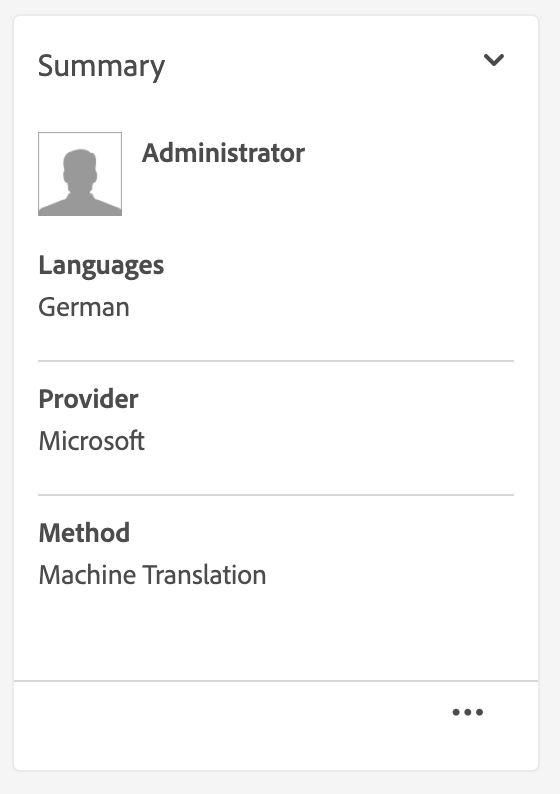

1. On the **Basic** tab, use the date picker of the **Due Date** property to select the due date.

   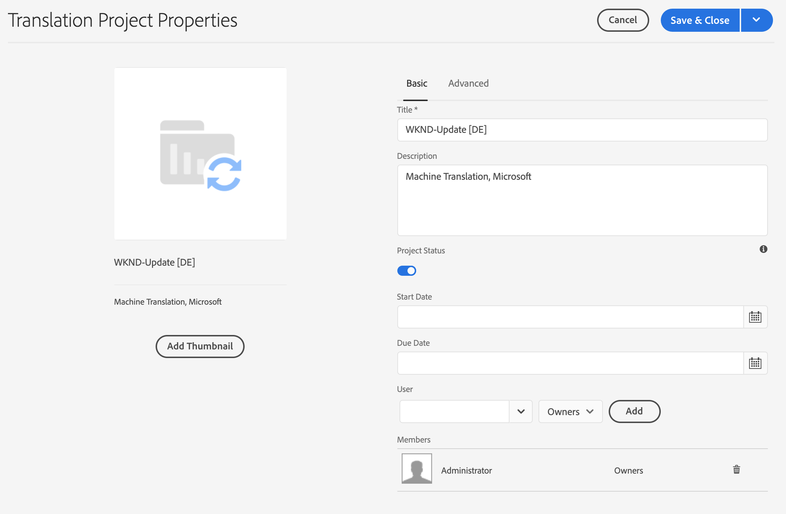

1. Select **Save &amp; Close**.

### Scoping a Translation Job {#scoping-a-translation-job}

Scope a translation job to obtain an estimate of the cost of translation from your translation service provider. When you scope a job, source files are submitted to the translation vendor who compares the text to their pool of stored translations (translation memory). Typically, the scope is the number of words that require translating.

To obtain more information about scoping results, contact your translation vendor.

>[!NOTE]
>
>Scoping is optional and only applies to human translation. You can start a translation job without scoping.

When you scope a translation job, the status of the job is **Scope Requested**. When the translation vendor returns the scope, the status is changed to **Scope Completed**. When scoping is completed you can use the **Show Scope** command to review the scoping results.

Scoping functions correctly only when the translation vendor that you are using supports this feature.

1. In the projects console, open your translation project.
1. On the title of the translation job, select the commands menu, then select **Request Scope**.
1. When the job status changes to **Scope Completed**, select the commands menu, then select **Show Scope**.

### Starting Translation Jobs {#starting-translation-jobs}

Start a translation job to translate the source pages to the target language. The translation is performed according to the property values of the translation summary tile.

You can start an individual job from within the project.

1. In the projects console, open the translation project.
1. On the translation job tile, select the commands menu, then select **Start**.
1. In the action dialog that confirms the starting of the translation, select **Close**.

After you start the translation job, the translation job tile shows the translation in **In Progress** status.

You can also start all translation jobs for a project.

1. In the project console, select the translation project.
1. In the tool bar select **Start Translation Job(s)**.
1. In the dialog box, review the list of jobs that are started and then confirm with **Start** or abort with **Cancel**.

### Canceling a Translation Job {#canceling-a-translation-job}

Cancel a translation job to halt the translation process and prevent the translation vendor from performing any further translations. You can cancel a job when the job has the **Committed For Translation** or **Translation In Progress** status.

1. In the projects console, open the translation project.
1. On the translation job tile, select the commands menu, then select **Cancel**.
1. In the action dialog that confirms the cancellation of the translation, select **OK**.

### Accept and Reject Workflow {#accept-reject-workflow}

When the content comes back after translation and is in **Ready for Review** status, you can go in the translation job and accept/reject content.

If you select **Reject Translation**, you have the option to add a comment.

Rejecting content sends it back to the translation vendor where they are able to see the comment.

### Completing and Archiving Translation Jobs {#completing-and-archiving-translation-jobs}

Complete a translation job after you have reviewed the translated files from the vendor.

1. In the projects console, open the translation project.
1. On the translation job tile, select the commands menu, then select **Complete**.
1. The job now has the status **Complete**.

For human translation workflows, completing a translation indicates to the vendor that the translation contract has been fulfilled and that they should save the translation to their translation memory.

Archive a translation job after it is complete and you no longer need to see job status details.

1. In the projects console, open the translation project.
1. On the translation job tile, select the commands menu, then select **Archive**.

When you archive the job, the translation job tile is removed from the project.

## Reviewing and Using Translated Content {#reviewing-and-promoting-updated-content}

You can use the sites console to review content, compare language copies, and activate the content.

### Promoting Updated Content {#promoting-updated-content}

When content is translated for an existing language copy, review the translations, make changes if necessary, and then promote the translations to move it to the language copy. You can review translated files when the translation job shows the **Ready For Review** status.

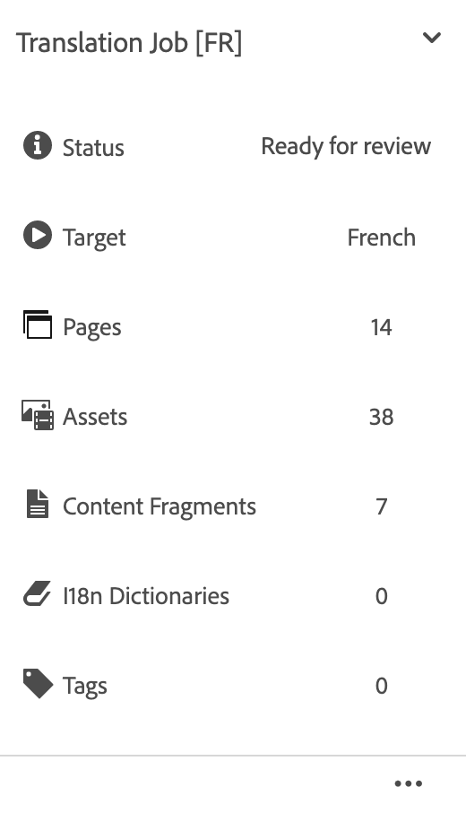

1. Select the page in the language master, select **References**, then select **Language Copies**.
1. Select the language copy to review.

   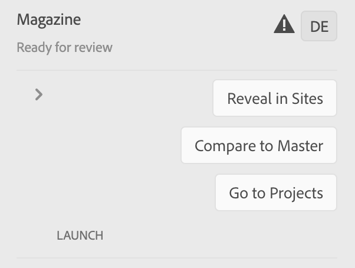

1. Select **Launch** to reveal the launch-related commands.

   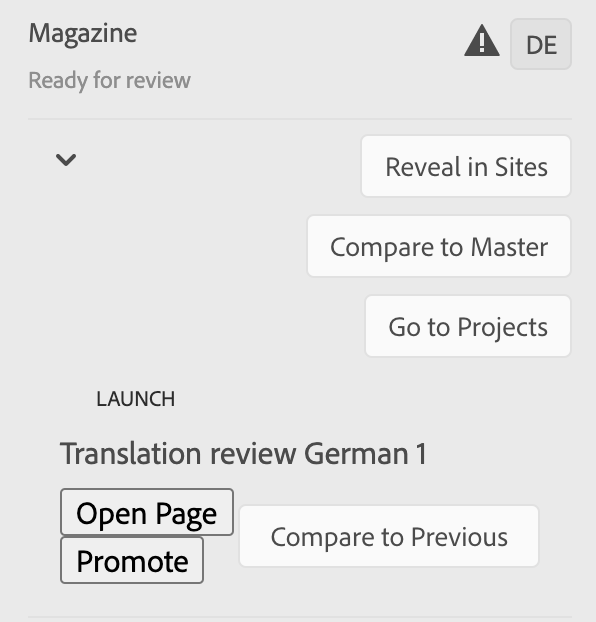

1. To open the launch copy of the page to review and edit the content, click **Open Page**.
1. After you have reviewed the content and made necessary changes, to promote the launch copy click **Promote**.
1. On the **Promote Launch** page, specify which pages to promote and then select **Promote**.

### Comparing Language Copies {#comparing-language-copies}

To compare language copies to the language master:

1. In the sites console, navigate to the language copy you want to compare.
1. Open the [References rail](/help/sites-cloud/authoring/basic-handling.md#references).
1. Under the **Copies** heading select **Language Copies.**
1. Select your specific language copy and then you can either click **Compare to Master** or **Compare to Previous** if applicable.

   

1. The two pages (launch and source) are opened side-by-side.
   * For full information about using this feature see [Page Diff](/help/sites-cloud/authoring/sites-console/page-diff.md).

## Moving or Renaming a Source Page {#move-source}

If an already translated source page needs to be [renamed or moved](/help/sites-cloud/authoring/sites-console/managing-pages.md#moving-or-renaming-a-page), translating the page again after the move creates a language copy based on the new page name/location. The old language copy based on the previous name/location is still there. To prevent this, you can use the update language copy functionality after the move:

1. Move a page which has a language copy.
1. Select the language copy root.
1. Open the **References** panel.
1. Select **Languages Copies**.
1. Select the target languages you want to update.
1. Select **Update language copies**.

   
   
1. Click **Update**. A [Launch](/help/sites-cloud/authoring/launches/promoting.md) will be created.
1. Navigate to the required language root and select it.
1. Using the **References** panel, select **Launches**.

   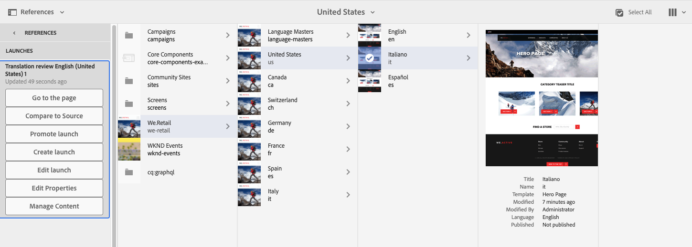
   
1. Click on the Launch that was created and click **Promote launch**.

Now the source page was moved, and the associated language copy.

## Importing and Exporting Translation Jobs {#import-export}

Although AEM offers several translation solutions and interfaces, it is also possible to import and export translation job information manually.

### Exporting a Translation Job {#exporting-a-translation-job}

You can download the content of a translation job, for example, to send to a translation provider that is not integrated with AEM via a connector, or to review the content.

1. From the drop-down menu of the translation job tile, select **Export**.
1. In the dialog box, select **Download Exported File**, and if necessary use the web browser dialog box to save the file.
1. In the dialog box, select **Close**.

### Importing a Translation Job {#importing-a-translation-job}

You can import translated content into AEM, for example, when your translation provider sends it to you because they are not integrated with AEM via a connector.

1. From the drop-down menu of the translation job tile, select **Import**.
1. Use the web browser's dialog box to select the file to import.
1. In the dialog box, select **Close**.
