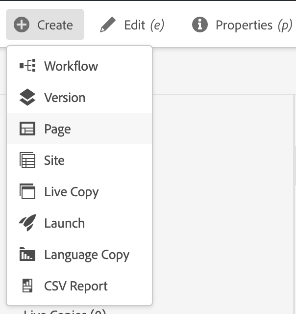
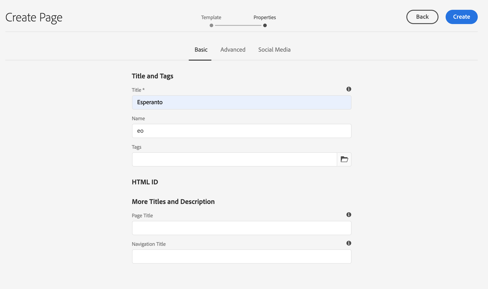
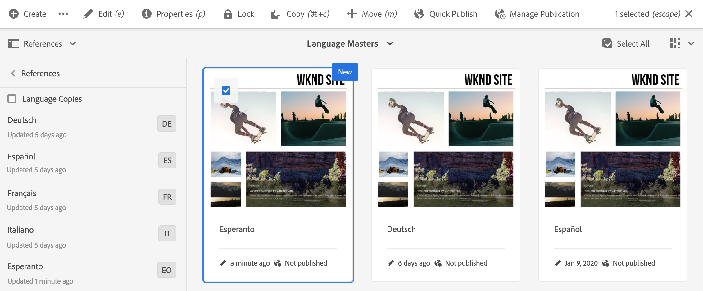
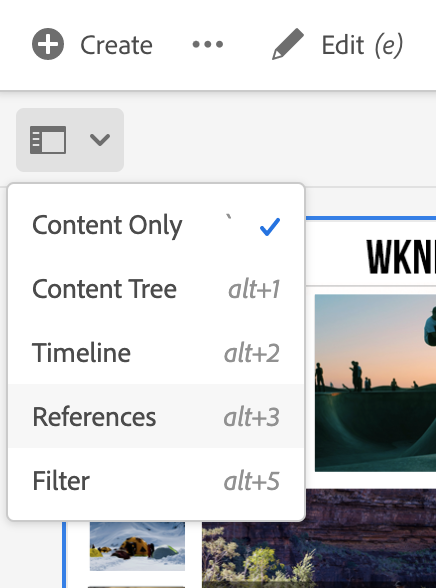

# Preparing Content for Translation {#preparing-content-for-translation}

Multilingual web sites generally provide some amount of content in multiple languages. The site is authored in one language and then translated into other languages. Generally, multilingual sites consists of branches of pages, where each branch contains the pages of the site in a different language.

>[!TIP]
>
>If you are new to translating content, see [Sites Translation Journey](/help/journey-sites/translation/overview.md), which is guided path through translating your AEM Sites content using AEM's powerful translation tools, ideal for those with no AEM or translation experience.

The [WKND tutorial site](/help/implementing/developing/introduction/develop-wknd-tutorial.md) includes several language branches and uses the following structure:

```text
/content
    |- wknd
        |- language-masters
            |- en
            |- de
            |- es
            |- fr
            |- it
        |- us
            |- en
            |- es
        |- ca
            |- en
            |- fr
        |- ch
            |- de
            |- fr
            |- it
        |- de
            |- de
        |- fr
            |- fr
        |- es
            |- es
        |- it
            |- it
```

The language copy for which you originally author site content is the language master. The language master is the source that is translated into other languages.

Each language branch of a site is called a language copy. The root page of a language copy, known as the language root, identifies the language of the content in the language copy. For example, `/content/wknd/fr` is the language root for the French language copy. Language copies must use a [correctly configured language root](preparation.md#creating-a-language-root) so that the correct language is targeted when translations of a source site are performed.

Use the following steps to prepare your site for translation:

1. Create the language root of your language master. For example, the language root of the English WKND demo site is `/content/wknd/language-masters/en`. Ensure that the language root is correctly configured according to the information in [Creating a Language Root](preparation.md#creating-a-language-root).
1. Author the content of your language master.
1. Create the language root of each language copy for your site. For example, the French language copy of the WKND sample site is `/content/wknd/language-masters/fr`.

After you prepare your content for translation, you can automatically create missing pages in your language copies and associated translation projects. (See [Creating a Translation Project](managing-projects.md).) For an overview of the content translation process in AEM, see [Translating Content for Multilingual Websites](overview.md).

## Creating a Language Root {#creating-a-language-root}

Create a language root as the root page of a language copy that identifies the language of the content. After you create the language root, you can create translation projects that include the language copy.

To create the language root you create a page and use an ISO language code as the value for the **Name** property. The language code must be in one of the following formats:

* `<language-code>` - The supported language code is a two-letter code as defined by ISO-639-1, for example, `en`.
* `<language-code>_<country-code>` or `<language-code>-<country-code>` - The supported country code is a lower-case or upper-case two-letter code as defined by ISO 3166, for example, `en_US`, `en_us`, `en_GB`, `en-gb`.

You can use either format, according to the structure that you have chosen for your global site. For example, the root page of the French language copy of the WKND site has `fr` as the **Name** property. The **Name** property is used as the name of the page node in the repository, and therefore determines the path of the page (`http://<host>:<4502>/content/wknd/language-masters/fr.html`).

1. Navigate to sites.
1. Select the site for which you want to create a language copy.
1. Select **Create**, and then select **Page**.

   

1. Select the page template and then select **Next**.
1. In the **Name** field type the country code in the format of `<language-code>` or `<language-code>_<country-code>`, for example, `en`, `en_US`, `en_us`, `en_GB`, `en_gb`. Type a title for the page.

   

1. Select **Create**. In the confirmation dialog box, select either **Done** to return to the Sites console, or **Open** to open the language copy.

## Seeing the Status of Language Roots {#seeing-the-status-of-language-roots}

AEM provides a **References** rail that shows a list of language roots that have been created.



Use the following procedure view the language copies for a page using the [rail selector](/help/sites-cloud/authoring/basic-handling.md#rail-selector).

1. On the sites console, select a page of the site and then select **References**.

   

1. In the references rail, select **Language Copies**. The rail shows the language copies of the web site.

## Language Copies on Multiple Levels {#multiple-levels}

Language roots can also be grouped under nodes, for example, by region, while still being recognized as roots of language copies.

```text
/content
    |- wknd
        |- language-masters
            |- europe
                |- de
                |- fr
                |- it
                |- es
                ]- pt
            |- americas
                |- en
                |- es
                |- fr
                |- pt
            |- asia
                |- ...
            |- africa
                |- ...
            |- oceania
                |- ...
        |- europe
        |- americas
        |- asia
        |- africa
        |- oceania            
```

>[!NOTE]
>
>Only one level is allowed. For example, the following will not allow the `es` page to resolve to a language copy:
>
>* `/content/wknd/language-masters/en`
>* `/content/wknd/language-masters/americas/central-america/es`
>
> This `es` language copy will not be detected as it is 2 levels (`americas/central-america`) away from the `en` node.

>[!TIP]
>
>In such a setup, language roots can have any page name, rather than just the ISO-code of the language. AEM will always check the path and name first, but if the page name does not identify a language, AEM will check the `cq:language` property of the page for the language identification.
