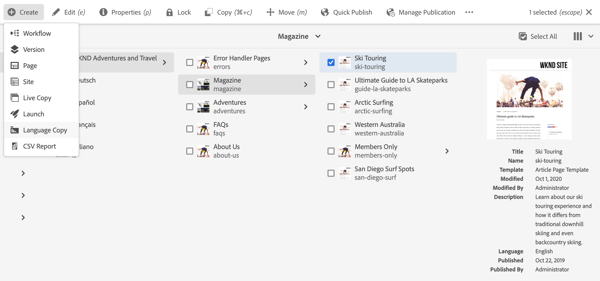
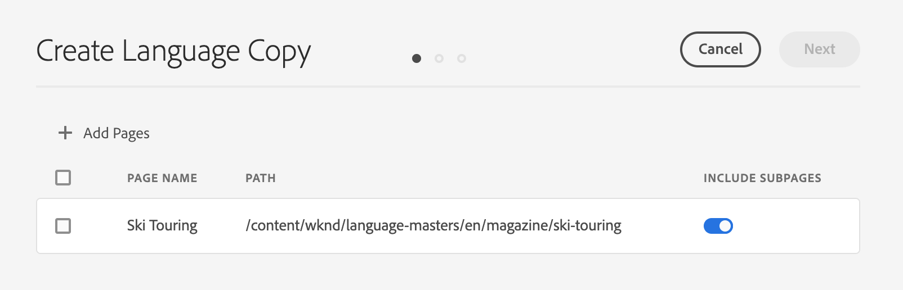
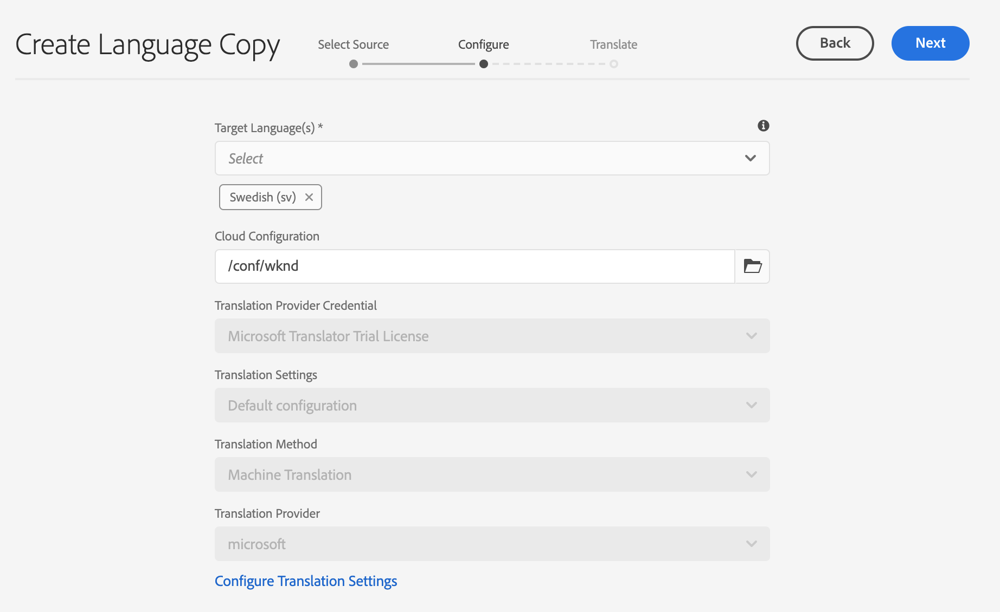
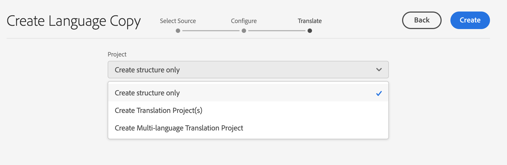
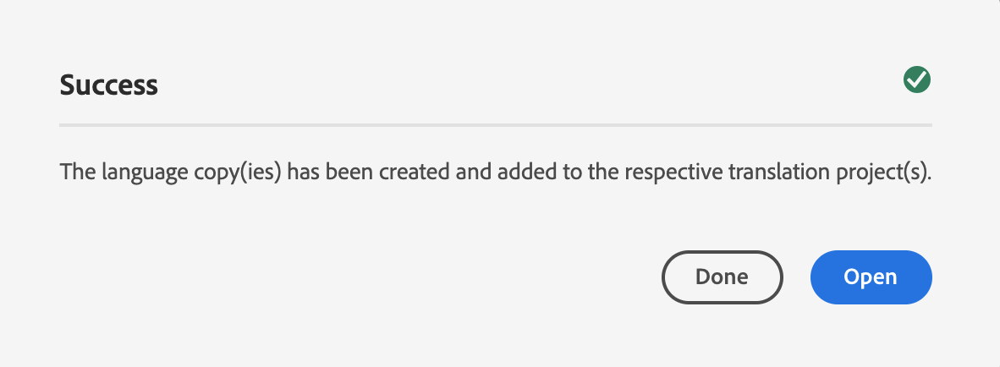

# Language Copy Wizard {#language-copy-wizard}

The Language Copy Wizard is a guided experience for creating and instrumenting multilingual content structure. The wizard makes creating a language copy simple and fast.

>[!TIP]
>
>If you are new to translating content, see [Sites Translation Journey](/help/journey-sites/translation/overview.md), which is guided path through translating your AEM Sites content using AEM's powerful translation tools, ideal for those with no AEM or translation experience.

>[!NOTE]
>
>The user must be a member of the `project-administrators` group to create a language copy of a site.

To access the wizard:

1. In the sites console, select a page and select **Create** and select **Language Copy**.

   

1. The wizard opens to the **Select Source** step which lets you add/remove pages. You also have the option of including or excluding the subpages. Select the pages you want to include and select **Next**.

   

1. The **Configure** step of the wizard lets you add/remove languages and select translation method. Select **Next**.

   

   >[!NOTE]
   >
   >By default, there is only one translation setting. To be able to select other settings, you have to configure cloud configurations first. See [Configuring the Translation Integration Framework](integration-framework.md).

1. In the **Translate** step of the wizard you can choose between creating the structure only, creating a translation project, or adding to an existing translation project.

   >[!NOTE]
   >
   >If you selected multiple languages in the previous step, multiple translation projects are created.

   

1. The **Create** button ends the wizard. Select **Done** to close the wizard or **Open** to view the resulting translation project.

   
