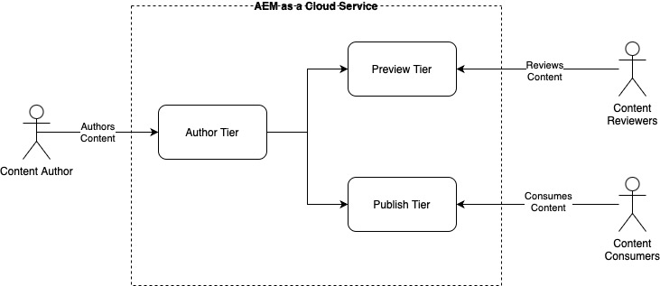

# Authoring and Publishing Concepts {#authoring-publishing}

For a content author, an AEM as a Cloud Service installation can be thought of as three primary tiers at its most basic level

* Author Tier
* Preview Tier
* Publish Tier

These tiers interact to let you make content available on your website so that your visitors can access it. The basic workflow is:

1. Content authors create their content using the author tier.
1. Content authors make their content available for reviewers to preview using the preview tier.
1. Once the content is ready for public consumption, authors publish the content using the publish tier.

Content can be of many different types, including pages, assets, and publications. Previewing content can be skipped at the discretion of the author.

For further details on the technical architecture of AEM as a Cloud Service, please see the document [An Introduction to the Architecture of Adobe Experience Manager as a Cloud Service](/help/overview/architecture.md).

{{edge-delivery-authoring}}

## Authoring Content {#author-environment}

The authoring environment of the author tier provides an easy to use graphical user interface for creating content. It requires the author to log on, using an account that is assigned the appropriate access rights.

Depending on how your instance and your personal access rights are configured you can perform many tasks on your content, including (among others):

* Generating new content or edit existing content on a page
* Using predefined templates to create content pages
* Creating, editing, and managing your assets and collections
* Moving, copying, and deleting content pages, and assets.
* Publishing (or unpublishing) pages, and assets.

Also, there are administrative tasks that help you manage your content:

* Workflows that control how changes are managed such as enforcing a review before publication
* Projects that coordinate individual tasks

AEM is also administered from the author environment.

Please see the document [Quick Start Guide to Authoring](/help/sites-cloud/authoring/quick-start.md) for an overview of the authoring process.

## Previewing Content {#previewing-content}

AEM also offers a preview service that lets developers and content authors preview a website's final experience before it reaches the publish environment and is available publicly.

Please see the document [Previewing Content](/help/sites-cloud/authoring/sites-console/previewing-content.md) for further details.

## Publish Environment {#publish-environment}

When ready, your site's content is published to the publish environment of the publish tier. Here the website's pages are made available to the intended audience in accordance with the look-and-feel of your content template.

Please see the document [Publishing Pages](/help/sites-cloud/authoring/sites-console/publishing-pages.md) for more information about publishing and unpublishing pages.

## Dispatcher {#dispatcher}

To optimize performance for visitors to your website, the **[Dispatcher](/help/implementing/dispatcher/overview.md)** implements load balancing and caching for both the publish and preview tiers.
