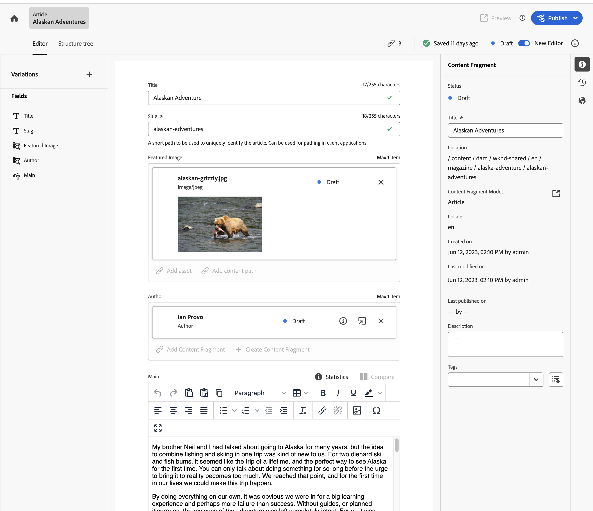

# Methods to Author Content in AEM {#authoring-methods}

Learn the different ways you can author content in AEM, how they differ, and when you might use one over the other.

## AEM's Authoring Flexibility {#authoring-flexibility}

AEM as a Cloud Service offers several different editors to edit different types of content and support different authoring use cases.

* [WYSIWYG Authoring using the Page Editor](#page-editor) - The Page Editor is the classic editor for authoring content in AEM, tried and trusted for thousands upon thousands of websites.
* [WYSIWYG Authoring using the Universal Editor](#universal-editor) - The Universal Editor is a modern UI allowing you to author AEM content in a content-agnostic way and is available for AEM projects leveraging Edge Delivery Services.
* [Document-Based Authoring ](#document-based) - If you use Edge Delivery services, you can choose to author your content as conventional documents such as Microsoft Word or Google Docs entirely outside of AEM consoles.
* [AEM Content Fragment Editor](#cf-editor) - This is the editor of choice for creating headless content.

Because of the integrated and scalable nature of AEM, these methods can be use exclusively or in combination with each other depending on the needs of your project.

Check with your system administrator or project manager if you are uncertain which authoring options are available to you or if you would like to explore new options for authoring your content.

## WYSIWYG Authoring using the Page Editor {#page-editor}

This is the classic editor for authoring content in AEM, tried and trusted for thousands upon thousands of websites.

The AEM page editor presents an integrated environment for authoring your content using a what-you-see-is-what-you-get (WYSIWYG) interface. Drag-and-drop predefined components to build your page and edit content in-place.

To learn more about the AEM page editor, please see the document [The AEM Page Editor](/help/sites-cloud/authoring/page-editor/introduction.md).

## WYSIWYG Authoring using the Universal Editor {#universal-editor}

The Universal Editor is a modern UI that allows you to author AEM content in a content-agnostic way and is the first choice for AEM projects leveraging Edge Delivery Services.

The Universal Editor is accessed through the Sites console within AEM, but offers the power and content-agnostic flexibility to author not only your AEM content, but also properly-instrumented external content.

To learn more about the Universal Editor, please see the document [Authoring Content with the Universal Editor](/help/sites-cloud/authoring/universal-editor/authoring.md).

## Document-Based Authoring  {#document-based}

If you use Edge Delivery services, you can choose to author your content as conventional documents such as Microsoft Word or Google Docs entirely outside of the [AEM **Sites** console](/help/sites-cloud/authoring/sites-console/introduction.md).

With document-based authoring, authors can use the tools they already know and still benefit from the speed and performance of AEM's Edge Delivery Services to publish their content. Document-based authoring requires no use of the AEM console.

To learn more about document-based authoring, see [Authoring and Publishing Content](/help/edge/docs/authoring.md).

## AEM Content Fragment Editor {#cf-editor}

The AEM Content Fragment editor is the editor of choice for creating headless content.

The AEM Content Fragment editor presents a clear interface for creating and managing structured content, ideal for headless delivery.

To learn more about the AEM Content Fragment editor, please see the documents [Managing Content Fragments](/help/sites-cloud/administering/content-fragments/managing.md) and [Authoring Content Fragments](/help/sites-cloud/administering/content-fragments/managing.md).

>[!NOTE]
>
>The *new* editor highlighted in this section is not available when developing locally for AEM as a Cloud Service.
>
>The [*original* Content Fragment editor](/help/assets/content-fragments/content-fragments-variations.md) is also available.
