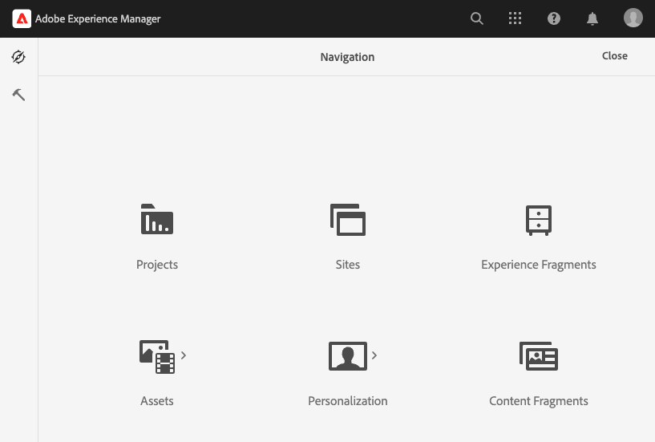
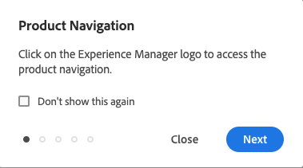
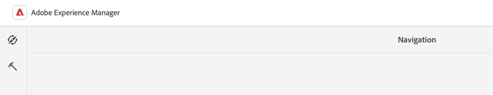
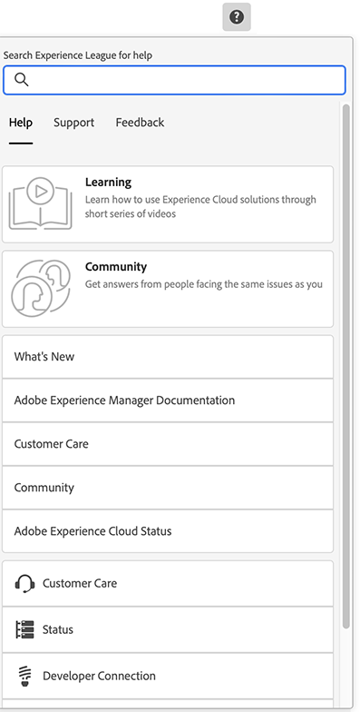
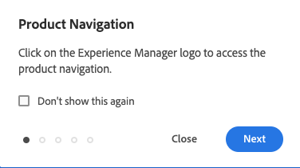
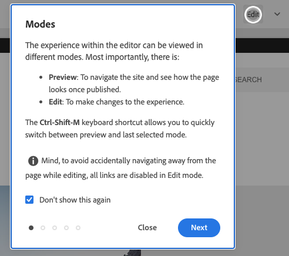

# Basic Handling {#basic-handling}

This document is designed to give an overview of basic handling when using the AEM author environment.

>[!TIP]
>
>Keyboard shortcuts are available throughout AEM. In particular when [using the sites console](/help/sites-cloud/authoring/sites-console/keyboard-shortcuts.md) and [the page editor](/help/sites-cloud/authoring/page-editor/keyboard-shortcuts.md).

{{edge-delivery-authoring}}

## A Touch-Enabled UI {#a-touch-enabled-ui}

AEM's user interface is enabled for touch. A touch-enabled interface lets you use touch to interact with the software through gestures such as tap, tap-and-hold, and swipe. Because the AEM UI is touch-enabled, you can use the touch gestures on your touch devices such as your mobile phone or tablet. However mouse actions on a traditional desktop device are also available, giving you flexibility in how you choose to author your content.

## First Steps {#first-steps}

Immediately after logging in you arrive on the [Navigation panel](#navigation-panel). Selecting one of the options opens the respective console.

To get a good understanding of the basic use of AEM, this document is based on the **Sites** console. Select on **Sites** to get started.

## Product Navigation {#product-navigation}

Whenever a user first accesses a console, a product navigation tutorial is started. Take a minute to select through to get a good overview of the basic handling of AEM.

Select **Next** to advance to the next page of the overview. Select **Close** or select outside of the overview dialog to close.

The overview will restart the next time you access a console unless you either view all slides or check the option **Don't show this again**.

## Global Navigation {#global-navigation}

You can navigate between the consoles using the global navigation panel. This is triggered as a full-screen drop-down when you select the **Adobe Experience Manager** link at the top-left of the screen.

You can close the global navigation panel by clicking or tapping **Close** to return to your previous location.

Global navigation has two panels, represented by icons at the left-margin of the screen:

* **[Navigation](#navigation-panel)** - Represented by a compass and the default panel when you log in to AEM
* **[Tools](#tools-panel)** - Represented by a hammer

The options available on these panels are described below.

### Navigation Panel {#navigation-panel}

The **Navigation** panel:

The title of the browser tab will update to reflect your location as you navigate through the consoles and content.

From Navigation the consoles available are:

|Console|Purpose|
|---|---|
|Projects|The Projects console gives you direct access to your projects. [Projects are virtual dashboards](/help/sites-cloud/authoring/projects/overview.md) that can be used to build a team. You can then give that team access to resources, workflows, and tasks, thus allowing people to work towards a common goal.|
|Sites|[The Sites console](/help/sites-cloud/authoring/sites-console/introduction.md) let you create, view, and manage sites running on your AEM instance. Through this console you can create, edit, copy, move, and delete pages, start workflows, and publish pages.|
|Experience Fragments|An [Experience Fragment](/help/sites-cloud/authoring/fragments/content-fragments.md) is a stand-alone experience that can be re-used across channels and have variations, saving the trouble of repeatedly copying and pasting experiences or parts of experiences.|
|Assets|The Assets console lets you import and manage [digital assets such as images, videos, documents, and audio files](/help/assets/overview.md). These assets can then be used by any site running on the same AEM instance. You can also create and manage [Content Fragments](/help/assets/content-fragments/content-fragments.md) from the Assets console.|
|Personalization|This console provides a framework of tools for [authoring targeted content and presenting personalized experiences](/help/sites-cloud/authoring/personalization/overview.md).|
|Content Fragments|[Content Fragments](/help/sites-cloud/administering/content-fragments/overview.md) allow you to design, create, curate and publish page-independent content. They allow you to prepare structured content ready for use in multiple locations/over multiple channels, and ideal for both page authoring and headless delivery.|
|Generate Variations|[Generate Variations](/help/generative-ai/generate-variations.md) uses generative Artificial Intelligence (AI) to create content variations based on prompts; these prompts are either provided by Adobe or created, and managed, by users.|

## Tools Panel {#tools-panel}

The **Tools** panel has a side panel containing a range of categories, that group together similar consoles. The **Tools** consoles provide access to several specialized tools and consoles that help you administer your websites, digital assets, and other aspects of your content repository. 

## The Header {#the-header}

The header is always present at the top of the screen. While most options in the header remain the same no matter where you are in the system, some are context-specific.

* [Global Navigation](#global-navigation) - Select the **Adobe Experience Manager** link to navigate between consoles.

  

* Feedback 

  

* Your IMS organization - select to change if required.

* [Solutions](https://www.adobe.com/experience-cloud.html) - Select this to access your other Adobe solutions.

  

* [Search](/help/sites-cloud/authoring/search.md) - You can also use the [shortcut key](/help/sites-cloud/authoring/sites-console/keyboard-shortcuts.md) `/` (forward slash) to invoke search from any console.

  

* [Help](#accessing-help)

  

* [Notifications](/help/sites-cloud/authoring/inbox.md) -   This icon is badged with the number of currently assigned incomplete notifications.

  
  
* [User Properties](/help/sites-cloud/authoring/account-environment.md) - Select this to change your user settings.

  

## Accessing Help {#accessing-help}

There are a number of help resources available and a few ways to access it.

* **Toolbar** - Depending on your location, the **Help** icon opens the appropriate resources:

  

* **Console** - The first time you navigate the system, [a series of slides introduce AEM navigation](#product-navigation).

  

* **Page Editor** - The first time you edit a page a series of slides introduce the page editor.

  

  * Navigate this overview as you would the [product navigation overview](#product-navigation) when first accessing any console.
  * From the [**Page Information** menu you can select **Help**](#accessing-help) to show this again at any time.

* **Tools Console** - From the **Tools** console you can also access the external **Resources**:

  * **Documentation** - View the Web Experience Management documentation
  * **Developer Resources** - Developer resources and downloads

>[!TIP]
>
>You can access an overview of shortcut keys available at any time using the hotkey `?` (question mark) when in a console.
>
>For an overview of all keyboard shortcuts see the following documentation:
>
>* [Keyboard shortcuts for editing pages](/help/sites-cloud/authoring/page-editor/keyboard-shortcuts.md)
>* [Keyboard shortcuts for consoles](/help/sites-cloud/authoring/sites-console/keyboard-shortcuts.md)
