# Creating Campaign Newsletters with AEM {#creating-newsletters}

In this document you will learn how to use AEM as a Cloud Service to create newsletters that can be sent with Adobe Campaign Classic.

By leveraging the integration between AEM as a Cloud Service and Adobe Campaign Classic, you can create your newsletters using AEM's powerful authoring tools. Then when you are ready to send your newsletter, you can use Campaign's recipient management and distribution features to send it.

## Prerequisites {#prerequisites}

Before you can create a newsletter with AEM and send it with Campaign, you must first [integrate Adobe Campaign Classic and AEM as a Cloud Service.](/help/sites-cloud/integrating/integrating-campaign-classic.md)

## Creating Newsletter Structure {#create-structure}

Newsletter content is managed in AEM much like you would manage your site content. You start by creating a "site" to hold your content. Within this "site" you can collect your newsletters by brand.

1. Sign into your AEM author instance.

1. From the main navigation page, open the **Sites** console.

1. In a standard installation of AEM, there will be an existing **Campaign** folder. Select it and click on the **Create** button and then **Page**.

   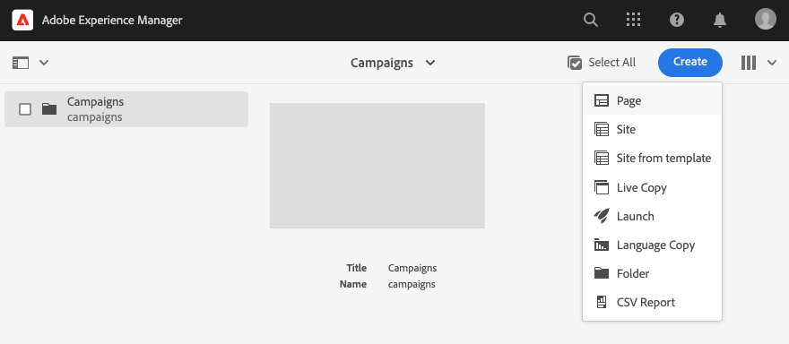

1. Select **Brand** as your site template and click **Next**.

   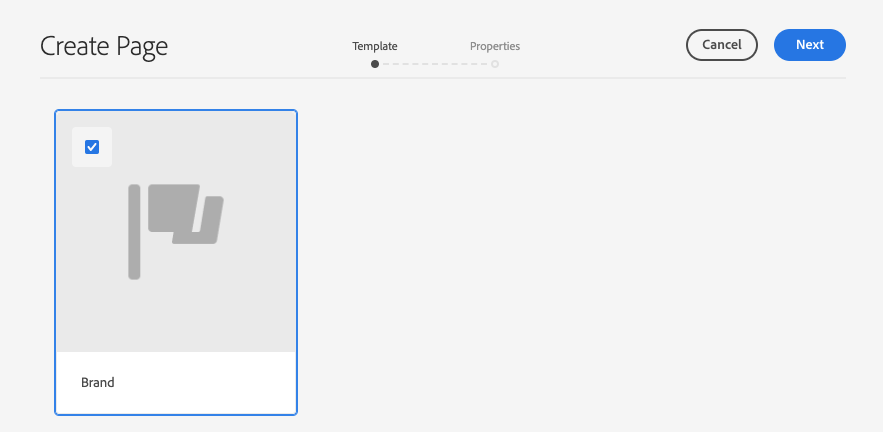

1. Enter a **Title** and click **Create** and then **Done**.

   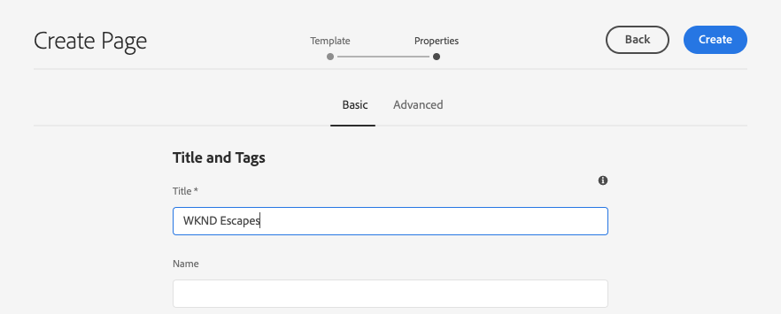

You now have a basic content structure to create your campaigns.

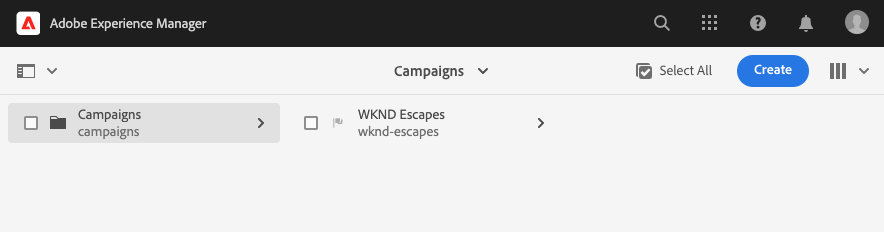

## Creating a Campaign {#create-campaign}

Now that you have a basic content structure for your campaign, you can create the campaign itself. The campaign will be used to organize possibly multiple newsletters.

1. Using [column view](/help/sites-cloud/authoring/getting-started/basic-handling.md#viewing-and-selecting-resources) in the sites console, select the brand that you previously created (in this case, **WKND Escapes**) and then select **Master Area**, which was automatically created for you, and then click the **Create** button and then **Page**.

   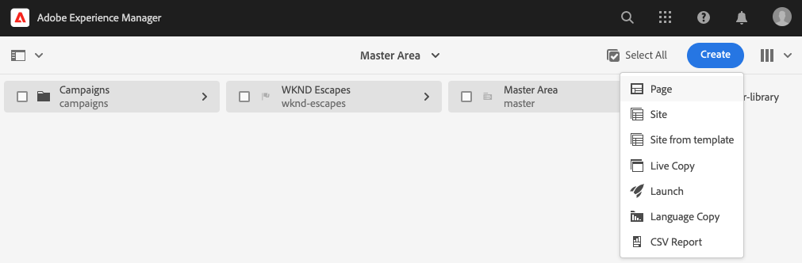

1. Select **Campaign** as the template then click **Next** and **Done**.

   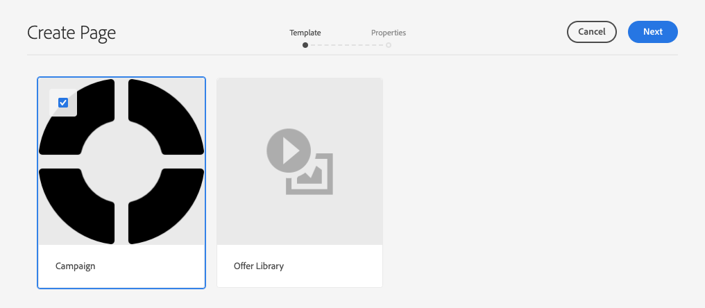

1. Enter a **Title** for the campaign and then click **Create** and **Done**.

   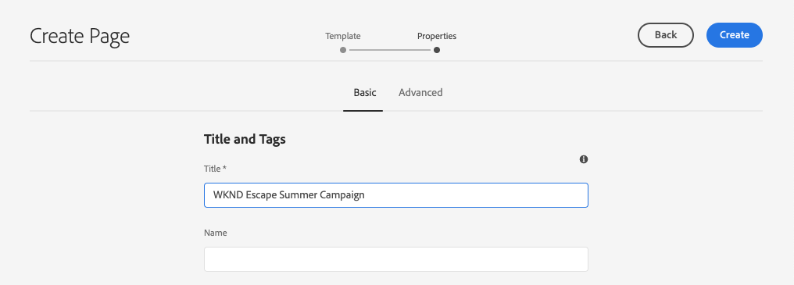

You now have a campaign where you can create your newsletters.

## Selecting Campaign Configuration {#campaign-configuration}

AEM can support multiple integration configurations. For your new campaign, you must define which configurations to use to send your newsletter content.

1. Using [column view](/help/sites-cloud/authoring/getting-started/basic-handling.md#viewing-and-selecting-resources) in the sites console, find the campaign that you previously created (in this case, **WKND Escape Summer Campaign**) and then select it using the checkbox and then click the **Properties** button on toolbar.

   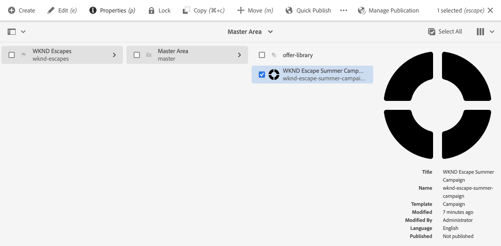

1. In the **Properties** window, select the **Cloud Service** tab to define the integration to use with this campaign.

   * Select **Adobe Campaign** from the **Cloud Service Configurations** drop-down list.
   * Select the desired Adobe Campaign integration configuration from the **Adobe Campaign** drop-down list.
   * Click **Save &amp; Close**.

   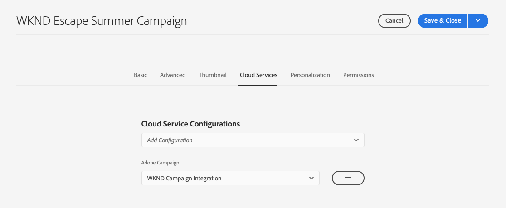

Your campaign is now linked to your Adobe Campaign integration. You are ready to create a newsletter in AEM and send it with Adobe Campaign.

## Create a Newsletter {#create-newsletter}

You create and manage your newsletters under the campaign content structure that you have already created and configured.

1. Using [column view](/help/sites-cloud/authoring/getting-started/basic-handling.md#viewing-and-selecting-resources) in the sites console, find the campaign that you previously configured (in this case, **WKND Escape Summer Campaign**), select it, and then click the **Create** button and then **Page**.

   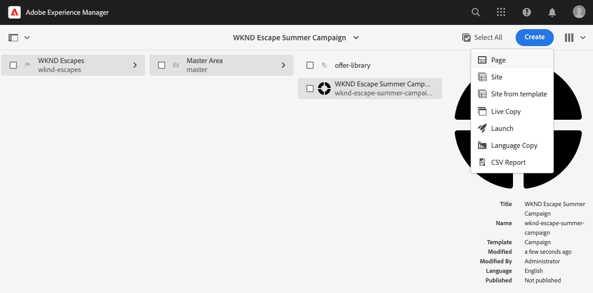

1. In the create page wizard, select the **Adobe Campaign Email (AC 6.1)** template and click **Next**.

   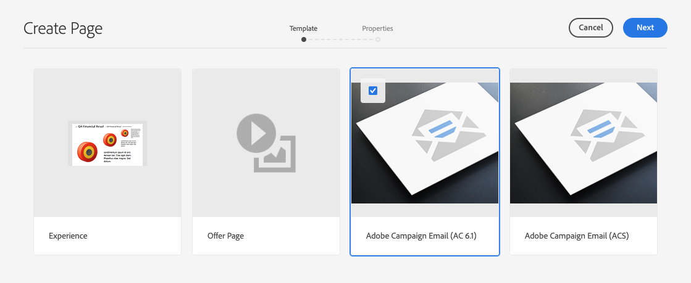

1. For the **Properties** step of the wizard, enter the **Title** for the newsletter, click **Create** and **Open**.

   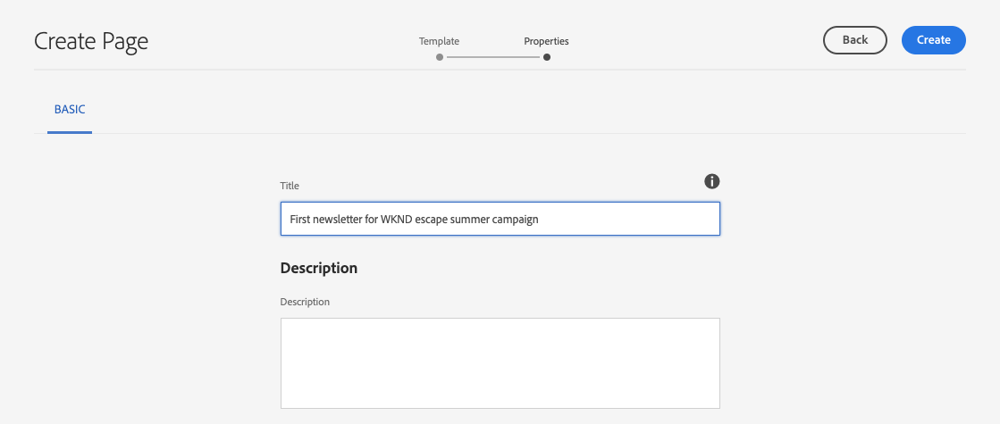

1. Edit the newsletter page as you would any other AEM content page to meet your requirements.

You now have a newsletter ready to send with Adobe Campaign.

## Publishing Your Newsletter {#publishing-newsletter}

You must publish your newsletter to make it available to Adobe Campaign to send.

1. Using [column view](/help/sites-cloud/authoring/getting-started/basic-handling.md#viewing-and-selecting-resources) in the sites console, find the newsletter that you previously created (in this case, **First newsletter for WKND escape summer campaign**), select it, and then click the **Page Information** button on top left and click on **Publish Page**.

1. Select the configuration(s) for which the page should be published and click **Publish**.

   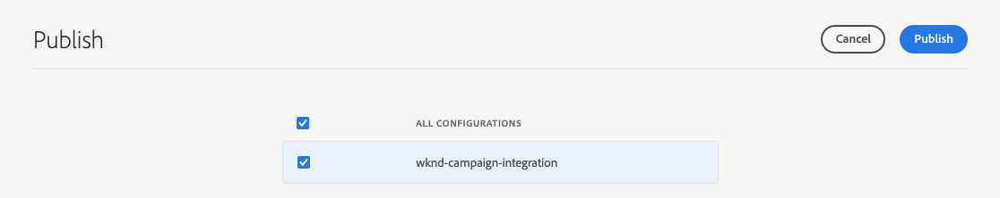

The newsletter page is now published to the AEM publish instance and is visible in Adobe Campaign Classic. To be able to select it within Adobe Campaign, it must be approved.

1. Click on the **Page Information** button for the newsletter once more and select **Start Workflow**.

1. Select **Approve for Adobe Campaign** as the workflow model (optionally providing a description) and click the **Start Workflow** button.

   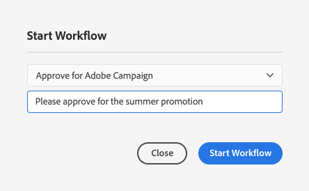

1. A banner appears at the top of the newsletter page editor providing next steps in the approval process. Click **Complete**.

   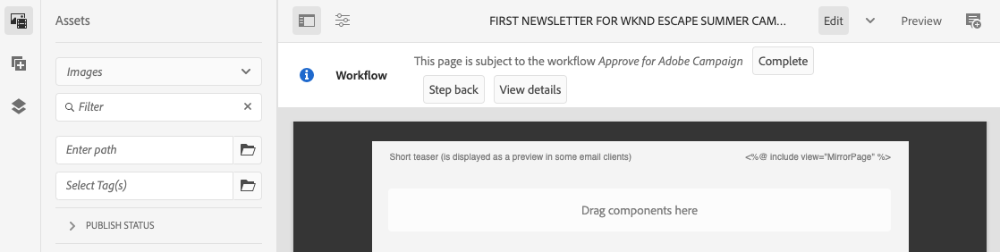

1. In the **Complete Work Item** dialog, select **Newsletter Review (Administrator)** in the **Next Step** drop-down list and click the **OK** button.

   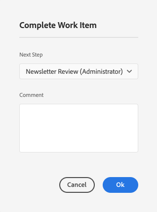

1. In the banner that appears at the top of the newsletter page editor, again click **Complete**.

1. In the **Complete Work Item** dialog, select **Newsletter approval** in the **Next Step** drop-down list and click the **OK** button.

   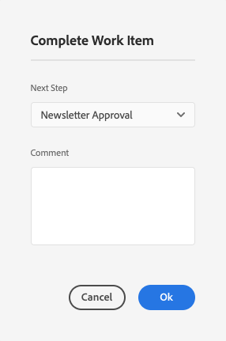

1. When the dialog closes, the banner that appeared at the top of the newsletter page editor disappears because the approval workflow is complete.

The newsletter is now published in AEM and approved for use in Adobe Campaign.

>[!TIP]
>
>The workflow steps described are simplified here to illustrate the process. In a normal work flow, creating the newsletter and approving it work normally be different roles
>
>See the document [Working with Workflows](/help/sites-cloud/authoring/workflows/overview.md) for more details on using workflows.

## Creating a Recipient {#creating-recipient}

To be able to send the newsletter that you created in AEM, you must first define your recipients in Adobe Campaign Classic.

1. Log into Adobe Campaign Classic using the client console.

1. Select **Tools** -&gt; **Explorer** from the menu bar.

1. In the explorer, navigate to the **Profiles &amp; Targets** -&gt; **Recipients** node.

   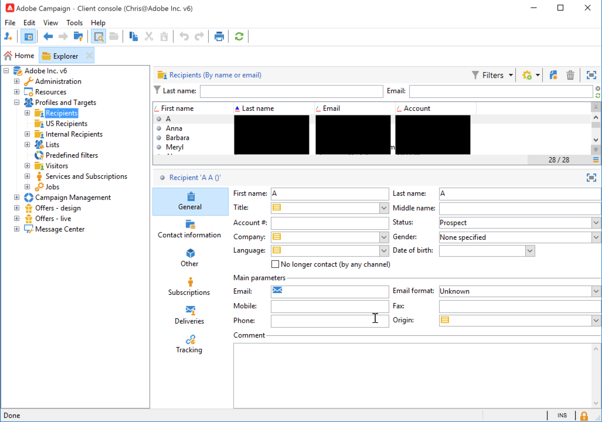

1. Click on **New** in the toolbar and provide the details of the recipient.

   * First name
   * Last Name
   * Email address

1. Click **Save**.

You now have a recipient to whom you can deliver your newsletter using Adobe Campaign Classic.

## Creating an Email Delivery {#create-delivery}

The final step is to send out your newsletter that you created in AEM to the recipient you added in Adobe Campaign Classic.

1. Log into Adobe Campaign Classic using the client console.

1. Select **Tools** -&gt; **Explorer** from the menu bar.

1. In the explorer, navigate to the **Campaign Management** -&gt; **Deliveries** node and click **New**.

   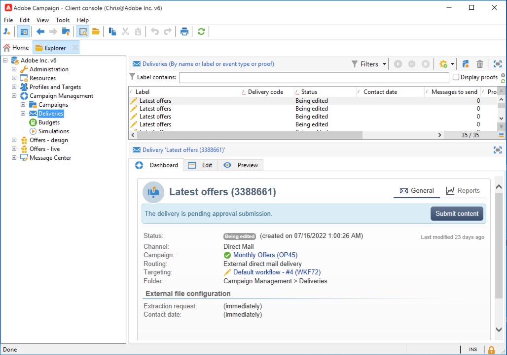

1. In the **Delivery** dialog, select **Email Delivery with AEM Content** as the **Delivery template** from the drop-down list and click **Continue**.

   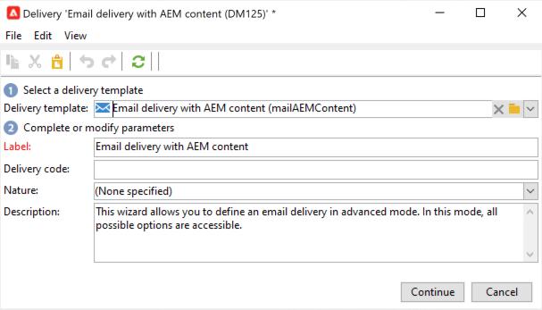

1. In the **Email parameters** section, click the **From** link and enter the sender's information and click **OK**.

    * Sender address
    * From field

    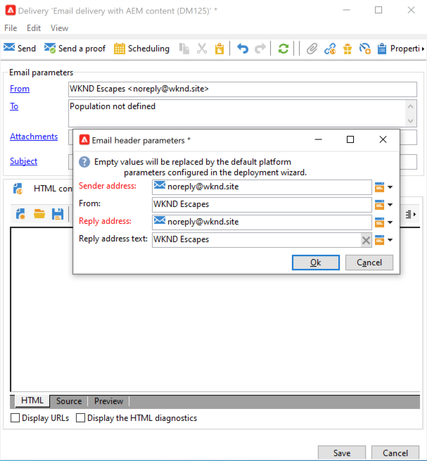

1. In the **Email parameters** section, click the **To** link to open the **Select Target** dialog and then click **Add**.

   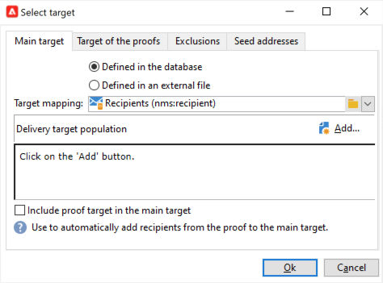

1. In the **Select target element** dialog, select **A recipient** and click **Next**.

   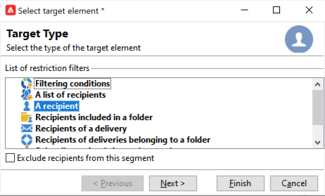

1. Using the filters, select the recipient you [created previously](#creating-recipient) and click **Finish**.

   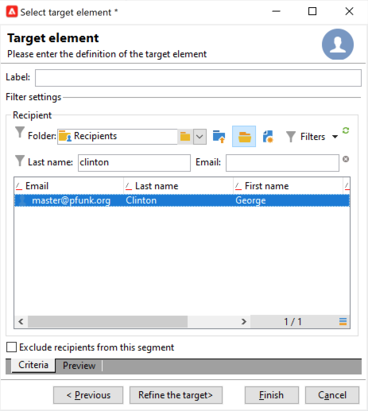

1. Back in the **Select Target** dialog, click **OK**.

1. In the delivery window, click **Synchronize**.

   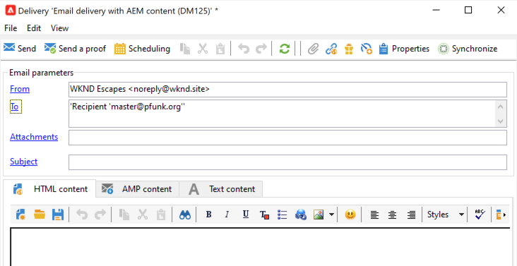

1. In the **Synchronize with AEM content** dialog, select the newsletter you created previously from the list, click **OK**.

1. The email content of Adobe Campaign is synchronized with the newsletter content you created in AEM.

   * Click **Refresh Content** if the content is not loaded automatically.

1. Click **Send** to send the email.

1. In the **Send to main delivery target** dialog, select **Deliver as soon as possible** and then click **Analyze**.

   

1. The analysis step builds the delivery, combining the content with the recipients. Now that the delivery has been created, click **Confirm Delivery** to sending the email. Click **Yes** to confirm.

1. The delivery has started. Click **Close**.

   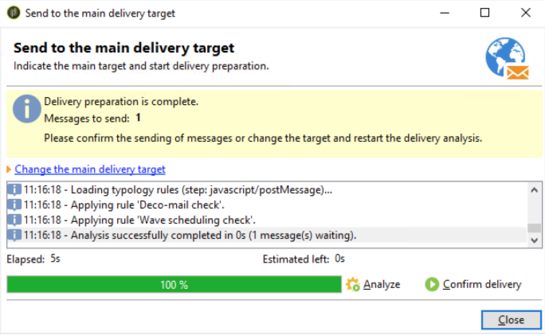

1. Click **Save** to save the delivery.

Your newsletter has been sent!

>[!TIP]
>
>This example showed a simplified delivery of sending a newsletter to a single recipient. Of course a normal delivery would contain many different recipients, which Adobe Campaign makes simple to manage. Please refer to the [Adobe Campaign Classic documentation](https://experienceleague.adobe.com/docs/campaign-classic.html) for more details on delivery and recipient management.
