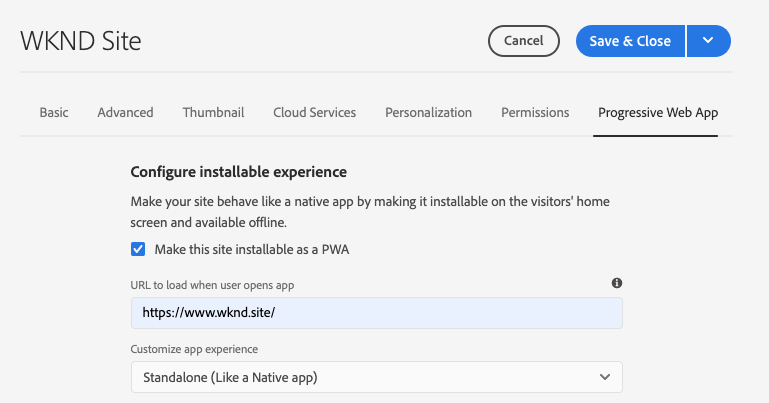
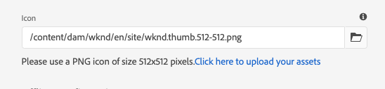
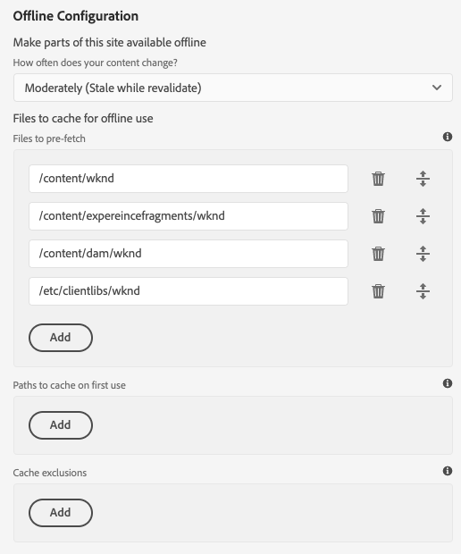

# Enabling Progressive Web App Features {#enabling-pwa}

Through a simple configuration, a content author can now enable progressive web app (PWA) features for experiences created in AEM Sites.

>[!CAUTION]
>
>This is an advanced feature that requires:
>
>* Knowledge of PWAs
>* Knowledge of your site and content structure
>* Understanding of caching strategies
>* Support from your development team
>
>Before using this feature is is recommended that you discuss this with your development team to define the best way to leverage it for your project.

>[!NOTE]
>
>The features described in this document are planned to be available with the [March 2021 release of AEM as a Cloud Service.](https://experienceleague.adobe.com/docs/experience-manager-release-information/aem-release-updates/update-releases-roadmap.html)

## Introduction {#introduction}

[Progressive web apps (PWAs)](https://developer.mozilla.org/en-US/docs/Web/Progressive_web_apps) enable immersive app-like experiences for AEM sites by allowing them to be stored locally on a user's machine and be accessible offline. A user could browse a site while on-the-go even if losing an internet connection. PWAs allow seamless experiences even if the network is lost or unstable.

Instead of requiring any re-coding of the site, a content author is able to configure PWA properties as an additional tab in the [page properties](/help/sites-cloud/authoring/fundamentals/page-properties.md) of a site.

* When saved or published, this configuration triggers an event handler that writes out the [manifest files](https://developer.mozilla.org/en-US/docs/Web/Manifest) and [service worker](https://developer.mozilla.org/en-US/docs/Web/API/Service_Worker_API) that enable PWA features on the site.
* Sling mappings are also maintained to ensure that service worker is served from the root of the application to enable proxying content allowing offline capabilities within the app.

With PWA, the user has a local copy of the site, giving an app-like experience even without an internet connection.

>[!NOTE]
>
>Progressive web apps are an evolving technology and support for local app installation and other features [depends on which browser you use.](https://developer.mozilla.org/en-US/docs/Web/Progressive_web_apps/Installable_PWAs#Summary)

## Prerequisites {#prerequisites}

To be able to use PWA features for your site, there are two requirements for your project environment:

1. [Use Core Components](#adjust-components) to take advantage of this feature
1. [Adjust your dispatcher](#adjust-dispatcher) rules to expose the required files

These are technical steps that the author will need to coordinate with the development team. These steps are only required once per site.

### Use Core Components {#adjust-components}

Core Components release 2.15.0 and later fully support the PWA features of AEM sites. Since AEMaaCS always includes the latest version of the Core Components, you can leverage PWA features out-of-the-box. Your AEMaaCS project automatically fulfills this requirement.

>[!NOTE]
>
>Adobe does not recommend using the PWA features on custom components or components not [extended from the ore Components.](https://experienceleague.adobe.com/docs/experience-manager-core-components/using/developing/customizing.html)
<!--
Your components need to include the [manifest files](https://developer.mozilla.org/en-US/docs/Web/Manifest) and [service worker,](https://developer.mozilla.org/en-US/docs/Web/API/Service_Worker_API) which supports the PWA features.

 To do this, the developer will need to add the following link to the `customheaderlibs.html` file of your page component.

```xml
<link rel="manifest" href="/content/<projectName>/manifest.webmanifest" crossorigin="use-credentials"/>
```

The developer will also need to add the following link to the `customfooterlibs.html` file of your page component.

```xml
<script>
        // Check that service workers are supported
        if ('serviceWorker' in navigator) {
            // Use the window load event to make sure the page load performs well
            window.addEventListener('load', () => {
                let serviceWorker = '/<projectName>sw.js';
                navigator.serviceWorker.register(serviceWorker);
            });
        }
</script>
```
-->

### Adjust Your Dispatcher {#adjust-dispatcher}

The PWA feature generates and uses `/content/<sitename>/manifest.webmanifest` files. By default, [the dispatcher](/help/implementing/dispatcher/overview.md) doesn't expose such files. To expose these files, the developer must add the following configuration to your site project.

```text
File location: [project directory]/dispatcher/src/conf.dispatcher.d/filters/filters.any >

# Allow webmanifest files
/0102 { /type "allow" /extension "webmanifest" /path "/content/*/manifest" }
```

Depending on your project you may want to include different types of extensions to the rewrite rules. The `webmanifest` extension can be useful to include in the rewrite conditions when you introduced a rule that hides and redirects requests to `/content/<projectName>.``

```text
RewriteCond %{REQUEST_URI} (.html|.jpe?g|.png|.svg|.webmanifest)$
```

## Enabling PWA for Your Site {#enabling-pwa-for-your-site}

With [the prerequisites](#prerequisites) met, it is very easy for a content author to enable PWA features to a site. The following is a basic outline of how to do this. Individual options are detailed in section [Detailed Options.](#detailed-options)

1. Log into AEM.
1. From the main menu, tap or click **Navigation** -&gt; **Sites**.
1. Select your sites project and tap or click [**Properties**](/help/sites-cloud/authoring/fundamentals/page-properties.md) or use the hotkey `p`.
1. Select the **Progressive Web App** tab and configure the applicable properties. At a minimum you will want to:
   1. Select the option **Enable PWA**.
   1. Define the **Startup URL**.

      

   1. Upload a 512x512 png icon to the DAM and reference that as the icon for the app.

      

   1. Configure the paths you want the service worker to take offline. Typical paths are:
      * `/content/<sitename>`
      * `/content/experiencefragements/<sitename>`
      * `/content/dam/<sitename>`
      * Any third party font references
      * `/etc/clientlibs/<sitename>`

      

1. Tap or click **Save &amp; Close**.

Your site is now configured and you can [install it as a local app.](#using-pwa-enabled-site)

## Using Your PWA-Enabled Site {#using-pwa-enabled-site}

Now that you have [configured your site to support PWA,](#enabling-pwa-for-your-site) you can experience it for yourself.

1. Access the site in a [supported browser.](https://developer.mozilla.org/en-US/docs/Web/Progressive_web_apps/Installable_PWAs#Summary)
1. You will see a new icon in the address bar of the browser, indicating that the site can be installed as a local app.
   * Depending on the browser, the icon may vary, and the browser may also display a notification (such as a banner or dialog box) indicating that it's possible to install as a local app.
1. Install the app.
1. The app will be installed on the home screen of your device.
1. Open the app, browse a bit, and see that pages are available offline.

## Detailed Options {#detailed-options}

The following section provides more detail on the options available when [configuring your site for PWA.](#enabling-pwa-for-your-site)

### Configure Installable Experience {#configure-installable-experience}

These settings allow your site behave like a native app by making it installable on the visitor's home screen and available offline.

* **Enable PWA** - This is the main toggle to enable PWA for the site.
* **Startup URL** - This is the [preferred start URL](https://developer.mozilla.org/en-US/docs/Web/Manifest/start_url) that the app will open when the user loads the locally-installed app.
  * This can be any path in your content structure.
  * This does not have to be the root and is often a dedicated welcome page for the app.
  * If this URL is relative, the manifest URL is used as the base URL to resolve it.
  * When left empty, the feature uses the address of the web page from which the we app got installed.
  * It is recommended to set a value.
* **Display mode** - A PWA-enabled app is still an AEM site delivered through a browser. [These display options](https://developer.mozilla.org/en-US/docs/Web/Manifest/display) define how the browser should be hidden or otherwise presented to the user on the local device.
  * **Standalone** - The browser is completely hidden from the user and it appears like a native app. This is the default value.
    * With this option, app navigation must be possible entirely through your content using links and components on the site's pages without using the browser's navigation controls.
  * **Browser** - The browser appears as it normally would when visiting the site.
  * **Minimal UI** - The browser is mostly hidden, like a native app, but basic navigation controls are exposed.
  * **Full Screen** - The browser is completely hidden, like a native app, but is rendered in full screen mode.
    * With this option, app navigation must be possible entirely through your content using links and components on the site's pages without using the browser's navigation controls.
* **Screen orientation** - As a local app, the PWA needs to know how to handle [device orientations.](https://developer.mozilla.org/en-US/docs/Web/Manifest/orientation)
  * **Any** - The app adjusts to the orientation of the user's device. This is the default value.
  * **Portrait** - This forces the app to open in portrait layout regardless of the orientation of the user's device.
  * **Landscape** - This forces the app to open in landscape layout regardless of the orientation of the user's device.
* **Theme color** - This defines the [color of the app](https://developer.mozilla.org/en-US/docs/Web/Manifest/theme_color) that affects how the local user's operating system displays the native UI toolbar and navigation controls. Depending on the browser, it can affect other app presentation elements.
  * Use the color well pop-up to select a color.
  * The color can also be defined by hex or RGB value.
* **Background color** - This defines the [background color of the app,](https://developer.mozilla.org/en-US/docs/Web/Manifest/background_color) which is shown as the app loads.
  * Use the color well pop-up to select a color.
  * The color can also be defined by hex or RGB value.
  * Certain browsers [build a splash screen automatically](https://developer.mozilla.org/en-US/docs/Web/Manifest#Splash_screens) from the app name, background color, and icon.
* **Icon** - This defines [the icon](https://developer.mozilla.org/en-US/docs/Web/Manifest/icons) that represents the app on the user's device.
  * The icon must be a png file of size 512x512 pixels.
  * The icon must be [stored in DAM.](/help/assets/overview.md)

### Cache Management (Advanced) {#offline-configuration}

These settings make parts of this site available offline and available locally on your visitor's device. This allows controlling the cache of the web app to optimize network requests and support offline experiences.

* **Caching strategy and frequency of content refresh** - This setting defines the caching model for your PWA.
  * **Moderately** - [This setting](https://web.dev/stale-while-revalidate/) is the case for most sites and is the default value.
    * With this setting, the content first viewed by the user will be loaded from the cache and while the user is consuming that content, the rest of the content in the cache will be revalidated.
  * **Frequently** - This is the case for sites that need updates to be very fast such as auction houses.
    * With this setting, the app will look for the most recent content via the network first, and if it is not available will fall back to the local cache.
  * **Rarely** - This is the case for sites that are nearly static such as reference pages.
    * With this setting, the app will look for the content in the cache first, and if not available will fall back to the network to retrieve it.
* **File pre-caching** - These files hosted on AEM will be saved to the local browser cache when the service worker is installing and before it is used. This guarantees that the web app is full functional when offline.
* **Paths inclusions** - Network requests for the defined paths are intercepted and cached content is return in accordance with the configured **Caching strategy and frequency of content refresh**.
* **Cache exclusions** - These files will never be cached regardless of the settings under **File pre-caching** and **Path inclusions**.

>[!TIP]
>
>Your developer team likely has valuable input regarding how your offline configuration should be set up.

## Limitations and Recommendations {#limitations-recommendations}

Not all PWA features are available for AEM Sites. These are a few notable limitations.

* A user must browse the page at least once before it is cached offline.
* Pages are not automatically synched or updated if the user is not using the app.

Adobe also makes the following recommendations when you implement PWA.

### Minimize the number of resources to pre-cache. {#minimize-precache}

Adobe advises you to limit the number of pages to pre-cache.

* Embed libraries to reduce the number of entries to manage when pre-caching.
* Limit the number of image variations to pre-cache.

### Enable PWA after the project scripts and stylesheets are stabilized. {#pwa-stabilized}

Client libraries are delivered with the addition of a cache selector observing the following pattern `lc-<checksumHash>-lc`. Every time one of the files (and dependencies) that compose a library change, this selector changes. If you listed a client-library to be pre-cached by the service-worker and you want to refer to a new version, you manually retrieve and update the entry. As a result, we advise you to configure your site to be a PWA after the project scripts and stylesheets are stabilized.

### Minimize the number of image variations. {#minimize-variations}

The Image Component of the AEM Core Components determines one the front end the best rendition to fetch. This mechanism also includes a timestamp that corresponds to the last modified time of that resource. This mechanism complicates the configuration of the PWA pre-cache.

When configuring the pre-cache, the user needs to list all the path variations that can be fetched. These variations are composed of parameters like quality and width. It is strongly advised to reduce the number of these variations to a maximum of three - small, medium, large. You can do that via the content-policy dialog of the [Image Component.](https://experienceleague.adobe.com/docs/experience-manager-core-components/using/components/image.html)

If not configured carefully, memory and network consumption can severely impact the performance of your PWA. Also if you intend to precache, say, 50 images, and have 3 widths per image, the user maintaining the site will have to maintain a list of up to 150 entries in the PWA pre-cache section of the page properties.

Adobe also advises you to configure your site to be a PWA after the project use of images has stabilized.
