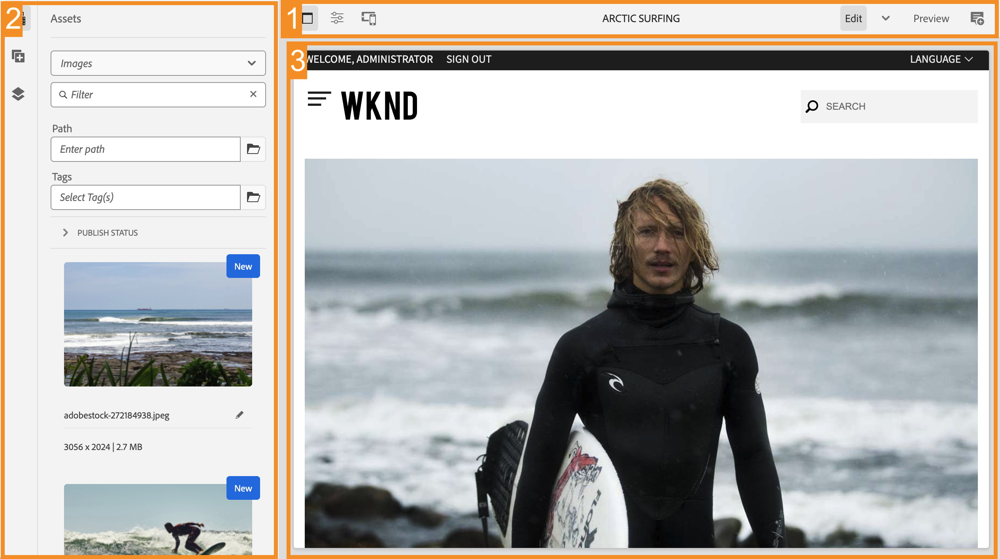
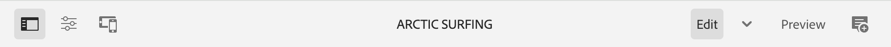

# The AEM Page Editor {#editing-page-content}

Once your page is created in the Sites console, you can edit the content of the page using the AEM Page Editor, a powerful tool for authoring your content.

>[!NOTE]
>
>Your account needs the appropriate access rights and permissions to edit pages. Contact your system administrator if you do not have permissions.

## Orientation {#orientation}

The AEM Page Editor is composed primarily of three sections:

1. [The toolbar](#toolbar) - The toolbar gives you quick access to change page mode and access additional page settings
1. The side panel - The side panel give you access to page components and assets as well as other authoring tools.
1. The editor - The editor is where you make changes to your content and preview it.

Content is added using [components](/help/sites-cloud/authoring/features/components-console.md) (appropriate to the content type) that can be dragged onto the page. These can then be edited in place, moved, or deleted.

### Toolbar {#page-toolbar}

The page toolbar offers access to context-appropriate functionality, dependent on the page configuration.

#### Side Panel {#side-panel}

This opens/closes the [side panel,](help/sites-cloud/authoring/getting-started/editor-side-panel.md) which holds the Asset Browser, Component Browser, and Content Tree.

#### Page Information {#page-information}

This provides access to the Page Information including page details and actions that can be taken on the page including viewing and editing page information, viewing page properties, and publishing/unpublishing the page.

Page Information opens a menu that also provides details about the last edit and the last publication. Depending on the characteristics of the page, its site, and your instance, more or fewer options might be available:

* [Open Properties](/help/sites-cloud/authoring/fundamentals/page-properties.md)
* [Rollout Page](/help/sites-cloud/administering/msm/overview.md#msm-from-the-ui)
* [Start Workflow](/help/sites-cloud/authoring/workflows/applying.md#starting-a-workflow-from-the-page-editor)
* [Lock Page](/help/sites-cloud/authoring/fundamentals/editing-content.md#locking-a-page)
* [Publish Page](/help/sites-cloud/authoring/fundamentals/publishing-pages.md#publishing-pages-1)
* [Unpublish Page](/help/sites-cloud/authoring/fundamentals/publishing-pages.md#unpublishing-pages)
* [Edit Template](/help/sites-cloud/authoring/features/templates.md)
* [View as Published](/help/sites-cloud/authoring/fundamentals/editing-content.md#view-as-published)
* [View in Admin](/help/sites-cloud/authoring/getting-started/basic-handling.md#viewing-and-selecting-resources)
* [Help](/help/sites-cloud/authoring/getting-started/basic-handling.md#accessing-help)
* [Promote Launch](/help/sites-cloud/authoring/launches/promoting.md) (only if the page is a launch)

In addition, **Page Information** can provide access to analytics and recommendations, when appropriate.

#### Emulator {#emulator}

This toggles the [emulator toolbar](/help/sites-cloud/authoring/features/responsive-layout.md#selecting-a-device-to-emulate), which is used to emulate the look-and-feel of the page on another device. This is automatically enabled in layout mode.

#### ContextHub {#context-hub}

This opens the [ContextHub](/help/sites-cloud/authoring/personalization/contexthub.md). It is only available in **Preview** mode.

#### Page Title {#page-title}

This is the title of the page, rendered in capital letters as information.

#### Mode Selector {#mode-selector}

Displays the current [mode](/help/sites-cloud/authoring/fundamentals/environment-tools.md#page-modes) and lets you select another mode such as edit, layout, timewarp, or targeting.

There are various modes when editing a page allowing for different actions:

* [Edit](/help/sites-cloud/authoring/fundamentals/editing-content.md) - the mode to use when editing the page content.
* [Layout](/help/sites-cloud/authoring/features/responsive-layout.md) - lets you create and edit your responsive layout dependent on device (if the page is based on a layout container)
* [Targeting](/help/sites-cloud/authoring/personalization/targeted-content.md) - increase content relevance through targeting and measuring across all channels.
* [Timewarp](/help/sites-cloud/authoring/features/page-versions.md#timewarp) - lets you view a pages state at a particular point in time.
* [Live Copy Status](/help/sites-cloud/authoring/fundamentals/editing-content.md#live-copy-status) - allows a quick overview of the live copy status and which components are/are not inherited.
* [Developer Mode](/help/implementing/developing/tools/developer-mode.md)
* [Preview](/help/sites-cloud/authoring/fundamentals/editing-content.md#previewing-pages) - used to view the page as it is shown on the publish environment; or to navigate using links in the content.
* [Annotate](/help/sites-cloud/authoring/fundamentals/annotations.md) - used to add or view annotations on the page.

>[!NOTE]
>
>* Depending on the characteristics of the page, some modes may not be available.
>* Access to some modes require the appropriate permissions/privileges.
>* Developer mode is not available on mobile devices due to space restrictions.
>* There is a [keyboard shortcut](/help/sites-cloud/authoring/getting-started/keyboard-shortcuts.md) ( `Ctrl-Shift-M`) to toggle between **Preview** and the currently selected mode (for example, **Edit**, **Layout**, and so on).

#### Preview {#preview}

Enables [preview mode](#preview-mode). This displays the page as it will appear when published.

#### Annotate {#annotate}

Lets you add [annotations](/help/sites-cloud/authoring/fundamentals/annotations.md) to the page when reviewing a page. After the first annotation, the icon will switch to a number indicating the number of annotations on the page.

### Side Panel {#side-panel}

The side panel provides you access to three different tabs.

* The components browser to add new content to your page
* The assets browser to add new assets to your page
* The content tree to browse the structure of your page

Please see the document [Page Editor Side Panel](/help/sites-cloud/authoring/getting-started/editor-side-panel.md) for more information.

### Editor {#editor}

The editor is where you make changes directly to your page content. The page is rendered as you would see it and you can drag and drop new content using the assets or components browsers in the side panel as well as edit content in-place.

## Editing Content {#editing-content}

Now that you understand the page editor, you are ready to edit your content.

Please see the document [Editing Content with the AEM Page Editor](help/sites-cloud/authoring/getting-started/edit-content.md) for more information.
