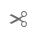
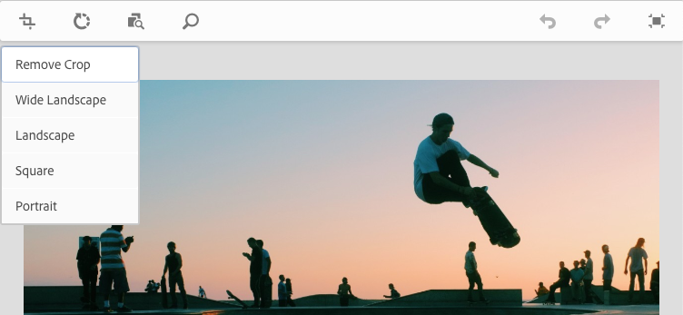
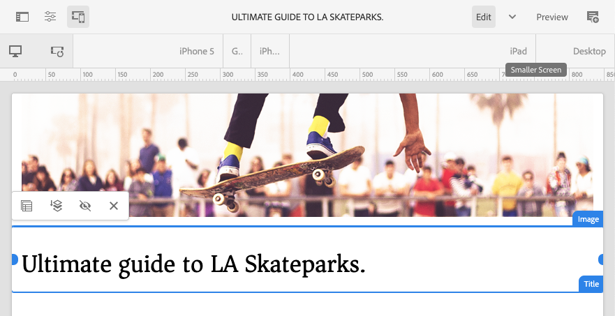

# Editing Page Content with the AEM Page Editor {#edit-content}

The AEM page editor is a powerful tool for authoring the content of a page. Learn how to use it to drag-and-drop content and edit content in-place.

## Overview {#overview}

There are three basic actions you can take in the page editor to edit your content:

1. [Adding new components](#adding-components) by dragging and dropping them onto the page.
1. [Adding new assets](#adding-asset) by dragging and dropping them onto the page.
1. [Editing components in-place](#edit-in-place) that already exist on the page.

The AEM page editor provides an intuitive UI for performing these tasks in addition to giving access to more advanced features.

In addition, the editor allows you to organize the existing content on you page by allowing you to 

* [Move components](#moving-components)
* [Edit component layout](#editing-component-layout)
* [Edit component inheritance](#inherited-components)

## Adding Components {#adding-components}

You can drag-and-drop new components onto your page by selecting them from the [component browser in the side panel](/help/sites-cloud/authoring/page-editor/editor-side-panel.md#components-browser) and dropping them in a component placeholder.

### Component Placeholder {#component-placeholder}

The component placeholder is an indicator to show where a component will be positioned when you drop it. It has two appearances.

* When adding a new component to the page (dragging from the component browser), it will appear as a gray box with details of the component you are placing.

  

* When [moving an existing component](#movging-components), it will appear as a blue square.

  

In both cases, the target selected will appear as a blue outline below the component you are dragging. The target if where the component will be placed when you release it.

### Adding a Component from the Components Browser {#adding-a-component-from-the-components-browser}

You can add a new component by using the [component browser](/help/sites-cloud/authoring/page-editor/editor-side-panel.md#components-browser). The [component placeholder](#component-placeholder) shows you where you are positioning the component.

1. Make sure that the page editor is in [**Edit** mode](/help/sites-cloud/authoring/page-editor/introduction.md#mode-selector).
1. Open the [component browser](/help/sites-cloud/authoring/page-editor/editor-side-panel.md#components-browser).
1. Drag the required component to the [required position](#component-placeholder) and release.
1. [Edit](#edit-content) the newly-placed component.

>[!NOTE]
>
>On a mobile device, the component browser will fill the entire screen. Once you start dragging a component, the browser will close to show the page again so you can place the component.

### Adding a Component from the Paragraph System {#adding-a-component-from-the-paragraph-system}

You can add a new component by using the **Drag components here** placeholder of the paragraph system:

1. Make sure that the page editor is in [**Edit** mode](/help/sites-cloud/authoring/page-editor/introduction.md#mode-selector).
1. There are two ways to select and add a new component from the paragraph system:

    * Select the **Insert Component** option (+) from either the toolbar of an existing component or the **Drag components here** box.

      

    * If you are on a desktop device you can double-click the **Drag components here** box.

1. The **Insert New Component** dialog open to let you select your required component. Tap or click the component you wish to add.

   * Use the search filters to find your component.
   * Use the information icon next to component names to find out more about the component.

    

1. The selected component is added to the target that you had selected. [Edit](#edit-content) the component as required.

## Adding an Asset {#adding-asset}

You can also add a new component to the page by dragging an asset from the [assets browser](/help/sites-cloud/authoring/page-editor/editor-side-panel.md#assets-browser). This automatically creates a component of the appropriate type (and containing the asset).

This behavior can be configured for your installation. Please see the document [Components Reference Guide](/help/implementing/developing/components/reference.md#component-placeholders) for further details.

To create a component by dragging one of the above asset types:

1. Make sure that your page is in [**Edit** mode](/help/sites-cloud/authoring/page-editor/introduction.md#mode-selector).
1. Open the [asset browser](/help/sites-cloud/authoring/page-editor/editor-side-panel.md#assets-browser).
1. Drag the required asset to the required position. The [component placeholder](#component-placeholder) shows you where the component is positioned and a target will show were it will be inserted.
1. Release the asset onto the target. A component, appropriate for the asset type, is created at the required location containing the selected asset.
1. [Edit](#edit-content) the component if necessary.

>[!NOTE]
>
>On a mobile device, the asset browser will fill the entire screen. Once you start dragging an asset, the browser will close to show the page again so you can place the asset.

If when browsing the assets you find that you need to make a quick change to an asset, you can start the [asset editor](/help/assets/manage-digital-assets.md) directly from the browser by clicking the edit icon next to the asset's name.

## Editing Components In-Place {#edit-in-place}

Selecting a component opens the component toolbar. This provides access to various actions that can be performed on the component.

The actions available in the component toolbar are appropriate for the selected component. You may see more or less depending on your selected component and they may or may not be described here.

* **Edit** allows you to modify the content of the component, often in-place. Its behavior depends on the component.

  

* **Configure** allows you to change some parameters of the component not directly related to its content, normally in a dialog. Its behavior depends on the component.

  

* **Copy** copies the component to the clipboard to paste elsewhere. The original component remains unchanged.

  

* **Cut** copies the component to the clipboard. The original component is removed.

  

* **Delete** deletes the component from the page with your confirmation.

  

* **Insert component** opens the dialog to [add a new component](#adding-a-component-from-the-paragraph-system).

  

* **Paste** pastes the component from the clipboard to the page. Whether the original remains, depends on whether you used **Copy** or **Cut**.

  * You can paste to the same page or to a different page.
  * If you paste to a different page that was already open before the cut/copy operation, you must refresh the page to see the pasted content.
  * The pasted item is pasted above the item where you select the paste action.
  * The Pate action will only be shown if there is content on the clipboard.

  

* **Group** lets you select multiple components at once. The same can be achieved on a desktop device by a **Control+Click** or **Command+Click**.

  

* **Parent** selects the parent component of the selected component.

  

* **Layout** lets you modify the [layout](#editing-component-layout) of the selected component. 

  * This only applies to the selected component and does not activate the [Layout mode](/help/sites-cloud/authoring/page-editor/introduction.md#mode-selector) for the entire page.

  

* **Convert to an experience fragment variation** lets you create an [experience fragment](/help/sites-cloud/authoring/fragments/content-fragments.md) from the selected component or add it to an existing experience fragment.

  

### Component Edit Dialog {#component-edit-dialog}

Some components offer additional editing options beyond what is available in-place. You can open a component's edit dialog the [Edit (pencil) icon of the component toolbar](#component-toolbar) to access additional configuration options.

The exact edit options will depend on the component. For some components [some actions will only be available in full screen mode](#edit-content-full-screen-mode). For example:

* Text component

  

* Image component

  

### Edit Components in Full-Screen Mode {#edit-content-full-screen-mode}

Many components offer a full-screen mode for editing that can be accessed with this button.

Full screen editing allows displaying more editing options than the in-place editor such as for the image component.

Use the **Minimize** button to exist full-screen mode.

## Moving Components {#moving-components}

To move a component:

1. Select the component to be moved with either tap-and-hold or click-and-hold.
1. Drag the component to the new location.
   
   * The page editor indicates the position of the component with a [placeholder](#component-placeholder) and where the paragraph can be dropped with a target.

   

1. Drop it in the desired location.

>[!TIP]
>
>You can also use [Cut and Paste](#component-toolbar) to move a component.

## Editing Component Layout {#editing-component-layout}

Instead of repeatedly switching from edit to [layout mode](/help/sites-cloud/authoring/page-editor/responsive-layout.md) to adjust a component, you can select the **Layout** action for a component to change that component's layout and save time by not having to leave the edit mode.

1. When in **Edit** mode of the sites console, select a component to reveal the component's toolbar.

1. Select the **Layout** action to adjust the layout of the component.

   

1. Once the Layout action is selected, you can modify the layout of the component as you would in [layout mode](/help/sites-cloud/authoring/page-editor/responsive-layout.md#defining-layouts-layout-mode).

    * The resizing handles for the component display.
    * The emulator toolbar is shown at the top of the screen.
    * Layout actions instead of the standard edit actions show on the component toolbar.

   

1. After making the necessary layout changes, tap or click the **Close** button in the component action menu to stop modifying the layout of the component and the component's toolbar returns to its normal edit state.

   

>[!TIP]
>
>The Layout action is limited in scope to the selected component. For example, if you are editing the layout of one component and then click another component, the standard edit toolbar (not the layout toolbar) displays for the newly selected component and the resizing handles and the emulator toolbar disappear.
>
>If you need to edit the overall layout of the page, affecting multiple components, switch to the [layout mode](/help/sites-cloud/authoring/page-editor/responsive-layout.md).

## Editing Component Inheritance {#inherited-components}

Inheritance is the mechanism where content can be linked such that changing one automatically changes the other. Inherited components can be the product of various scenarios, including:

* [Multi site management](/help/sites-cloud/administering/msm/overview.md)
* [Launches](/help/sites-cloud/authoring/launches/overview.md)

You can cancel and re-enable the inheritance. Depending on the component, these options are available from the component toolbar, if the component is part of a live copy or launch.

* **Cancel Inheritance**

  

* **Re-enable Inheritance** if inheritance is already cancelled

  

* **Rollout** is also available in the blueprint or Live Copy source

  
