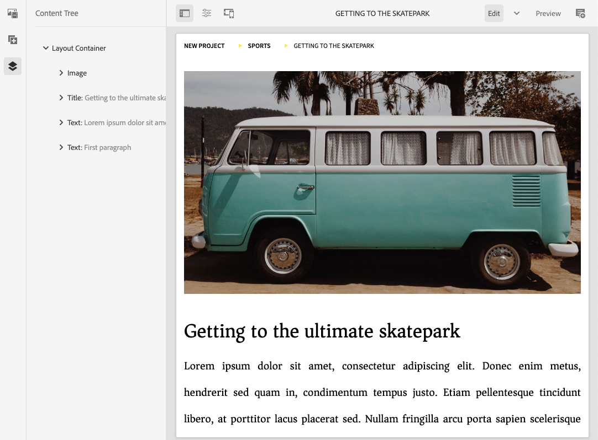

# Page Editor Side Panel {#side-panel}

Learn how to use the side panel in the AEM sites editor to add components and assets to your page.

## Side Panel Modes {#modes}

The side panel is always accessible in the page editor by tapping or clicking the **Toggle Side Panel** icon in the toolbar of the page editor.

When you open the side panel it will slide open from the left side and you can then select from three important tabs:

* [The components browser](#components-browser) to add new content to your page
* [The assets browser](#assets-browser) to add new assets to your page
* [The content tree](#content-tree) to browse the structure of your page

## Components Browser {#components-browser}

[Components](/help/implementing/developing/components/overview.md) are the building blocks used to create content with the AEM page editor. You place multiple components on a page and configure their options to build your content page.

The components browser shows all components that are available for use on your current page. These can be dragged to the appropriate location, then edited to add your content.

Tap or click the **Components** tab in the side panel to access the **Components** browser.

The actual appearance and handling is dependent on the device type you are using.

### Mobile Device {#mobile-device-components-browser}

When opening the component browser on a mobile device, it completely covers the page being edited.

To add a component to your page, select and drag the component and move it towards the right. The component browser will close to show the page again, where you can position the component.

>[!NOTE]
>
>A mobile device is detected when the width is less than 1024px.

### Desktop Device {#desktop-device-components-browser}

When opening the component browser on a desktop device, it appears at the left side of the window.

To add a component to your page, click the required component and drag it to the required location.

### Using the Components Browser {#using-component-browser}

Components in the **Components** browser are represented by:

* Component name
* Component group (in gray)
* Icon or abbreviation
  * Standard components' icons are monochrome.
  * Abbreviations are always the first two characters of the component name.

From the top toolbar in the **Components** browser you can:

* Filter components by name.
* Limit the display to a specific group using the drop-down selection.

For a more detailed description of the component, you can select the information icon next to the component in the **Components** browser (if available). For example, for the **Content Fragment**:

For more detailed information about the components available to you see the [Component Console](/help/sites-cloud/authoring/components-console.md)

## Assets Browser {#assets-browser}

The **Assets** browser shows all [assets](/help/assets/overview.md) that are available for use on your current page.

Tap or click the **Assets** tab on the side panel to browse through the assets.

Infinite scrolling is used to expand the list of assets as needed as you scroll.

The actual appearance and handling is dependent on the device type you are using:

### Mobile Device {#mobile-device-assets-browser}

When opening the assets browser on a mobile device, it completely covers the page being edited.

To add an asset to your page select and drag the required asset, then move it towards the right. The assets browser will close to show the page again, where you can add the asset to the required component.

>[!NOTE]
>
>A mobile device is detected when the width is less than 1024px.

### Desktop Device {#desktop-device-assets-browser}

When opening the assets browser on a desktop device, it opens at the left side of the window.

To add an asset to your page, select the required asset and drag it to the required component or location.

### Using the Assets Browser {#using-assets-browser}

To add an asset to your page, select and drag to the required location. This can be:

* An existing component of the appropriate type.
  * For example, you can drag an asset of type image onto an Image component.
* A [placeholder](/help/sites-cloud/authoring/page-editor/edit-content.md#component-placeholder) in the paragraph system to create a component of the appropriate type.
  * For example, you can drag an asset of type image onto the paragraph system to create an Image component.

>[!NOTE]
>
>Dragging and dropping of assets is available for specific assets and component types. See [Inserting a Component using the Assets Browser](/help/sites-cloud/authoring/page-editor/edit-content.md#adding-a-component-from) for more details.

From the top toolbar of the assets browser you can filter the assets by:

* Name
* Path
* Asset type such as images, videos, documents, paragraphs, Content Fragments, and Experience Fragments
* Asset characteristics such as orientation and style
  * Available only for certain asset types

If you need to quickly make a change to an asset, you can start the [asset editor](/help/assets/manage-digital-assets.md) directly from the asset browser by clicking the edit icon shown next to the asset's name.

## Content Tree {#content-tree}

The **Content Tree** gives an overview of all the components on the page in a hierarchy so you can see at a glance how the page is composed.

>[!NOTE]
>
>The Content Tree is not available if you are editing a page on a mobile device (if the browser width is less than 1024px).

Tap or click the **Content Tree** tab to access the content tree.

When open you can see a tree view representation of your page or template, so that it's easier to understand how its content is structured hierarchically. Also, on a complex page, it makes it easier to jump between components of the page.

A page can easily be composed of many of the same type of components, so the content tree displays descriptive text (in gray) after the name of the component type (in black). The descriptive text comes from common properties of the component such as title or text.

Component types are shown in the user language, whereas the component description text comes from the page language.

Clicking the chevron next to a component will collapse or expand that level.

Clicking on the component will highlight the component in the page editor. The actions available will depend on the page state. For example:

## A Basic Page {#basic-page}

The components of a basic page will have the usual options.

If the component you click in the tree is editable a wrench icon will appear to the right of the name. Clicking on this icon starts the edit dialog box for the component.

### A Live Copy {#live-copy}

A page that is part of a [livecopy](/help/sites-cloud/administering/msm/overview.md), where components are inherited from another page, will have different options.

## Associated Content Browser {#associated-content-browser}

If your page contains Content Fragments, you also have access to the [browser for Associated Content](/help/sites-cloud/authoring/fragments/content-fragments.md#using-associated-content).
