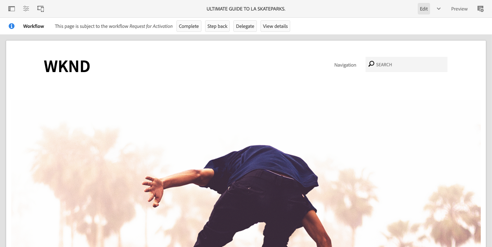

# The AEM Page Editor {#editing-page-content}

Once your page is created in the [**Sites** console](/help/sites-cloud/authoring/sites-console/introduction.md), you can edit the content of the page using the AEM page editor, a powerful tool for authoring your content.

>[!NOTE]
>
>When editing a page in the [**Sites** console](/help/sites-cloud/authoring/sites-console/introduction.md), the console will open the editor appropriate to the page's [template](/help/sites-cloud/authoring/page-editor/templates.md) either the page editor described in this document, or the [Universal Editor](/help/sites-cloud/authoring/universal-editor/authoring.md).

>[!NOTE]
>
>Your account needs the appropriate access rights and permissions to edit pages. Contact your system administrator if you do not have permissions.

## Orientation {#orientation}

The AEM page editor is composed primarily of three sections:

1. [The toolbar](#toolbar) - The toolbar gives you quick access to change page mode and access additional page settings.
1. [The side panel](#side-panel) - The side panel give you access to page components and assets as well as other authoring tools.
1. [The editor](#editor) - The editor is where you make changes to your content and preview it.

Content is added using [components](/help/sites-cloud/authoring/components-console.md) (appropriate to the content type) that can be dragged onto the page. These can then be edited in place, moved, or deleted.

### Toolbar {#page-toolbar}

The page toolbar offers access to context-appropriate functionality, dependent on the page configuration.

#### Side Panel {#side-panel-button}

This opens/closes the [side panel](/help/sites-cloud/authoring/page-editor/editor-side-panel.md), which holds the Asset Browser, Component Browser, and Content Tree.

#### Page Information {#page-information}

This provides access to detailed page information including page details and actions that can be taken on the page including viewing and editing page information, viewing page properties, and publishing/unpublishing the page.

**Page Information** opens a drop-down menu that provides details about the last edit and the last publication of the selected page. Additional actions are available depending on the characteristics of the page, its site, and your instance.

* [Open Properties](/help/sites-cloud/authoring/sites-console/page-properties.md)
* [Rollout Page](/help/sites-cloud/administering/msm/overview.md#msm-from-the-ui)
* [Start Workflow](/help/sites-cloud/authoring/workflows/applying.md#starting-a-workflow-from-the-page-editor)
* [Lock Page](/help/sites-cloud/authoring/page-editor/introduction.md#locking-unlocking)
* [Publish Page](/help/sites-cloud/authoring/sites-console/publishing-pages.md#publishing-pages-1)
* [Unpublish Page](/help/sites-cloud/authoring/sites-console/publishing-pages.md#unpublishing-pages)
* [Edit Template](/help/sites-cloud/authoring/page-editor/templates.md)
* [View as Published](/help/sites-cloud/authoring/page-editor/introduction.md#view-as-published)
* [View in Admin](/help/sites-cloud/authoring/basic-handling.md#viewing-and-selecting-resources)
* [Help](/help/sites-cloud/authoring/basic-handling.md#accessing-help)
* [Promote Launch](/help/sites-cloud/authoring/launches/promoting.md) (only if the page is a launch)

In addition, **Page Information** can provide access to analytics and recommendations, when appropriate.

#### Emulator {#emulator}

This toggles the [emulator toolbar](/help/sites-cloud/authoring/page-editor/responsive-layout.md#selecting-a-device-to-emulate), which is used to emulate the look-and-feel of the page on another device. This is automatically enabled in layout mode.

#### ContextHub {#context-hub}

This opens the [ContextHub](/help/sites-cloud/authoring/personalization/contexthub.md). It is only available in **Preview** mode.

#### Page Title {#page-title}

This is the title of the page, rendered in capital letters as information.

#### Mode Selector {#mode-selector}

The mode selector displays the current [mode](/help/sites-cloud/authoring/page-editor/introduction.md#mode-selector) and lets you select another mode such as edit, layout, timewarp, or targeting.

There are various modes when editing a page allowing for different actions:

* [Edit](/help/sites-cloud/authoring/page-editor/edit-content.md) - The mode to use when editing the page content
* [Layout](/help/sites-cloud/authoring/page-editor/responsive-layout.md) - Lets you create and edit your responsive layout dependent on device (if the page is based on a layout container)
* [Targeting](/help/sites-cloud/authoring/personalization/targeted-content.md) - Improves content relevance through targeting and measuring across all channels
* [Timewarp](/help/sites-cloud/authoring/sites-console/page-versions.md#timewarp) - View a pages state at a particular point in time
* [Live Copy Status](/help/sites-cloud/authoring/page-editor/introduction.md#live-copy-status) - Allows a quick overview of the live copy status and which components are/are not inherited
* [Developer Mode](/help/implementing/developing/tools/developer-mode.md)
* [Preview](/help/sites-cloud/authoring/page-editor/introduction.md#previewing-pages) - View the page as it is shown on the publish environment; or to navigate using links in the content
* [Annotate](/help/sites-cloud/authoring/page-editor/annotations.md) - Add or view annotations on the page

>[!NOTE]
>
>* Depending on the characteristics of the page, some modes may not be available.
>* Access to some modes require the appropriate permissions/privileges.
>* Developer mode is not available on mobile devices due to space restrictions.
>* There is a [keyboard shortcut](/help/sites-cloud/authoring/sites-console/keyboard-shortcuts.md) ( `Ctrl-Shift-M`) to toggle between **Preview** and the currently selected mode (for example, **Edit**, **Layout**, and so on).

#### Preview {#preview}

The **Preview** button enables [preview mode](#preview-mode), displaying the page as it will appear when published.

#### Annotate {#annotate}

**Annotate** mode lets you add [annotations](/help/sites-cloud/authoring/page-editor/annotations.md) to the page when reviewing a page. After the first annotation, the icon will switch to a number indicating the number of annotations on the page.

### Side Panel {#side-panel}

The side panel provides you access to three different tabs.

* The components browser to add new content to your page
* The assets browser to add new assets to your page
* The content tree to browse the structure of your page

Please see the document [Page Editor Side Panel](/help/sites-cloud/authoring/page-editor/editor-side-panel.md) for more information.

### Editor {#editor}

The editor is where you make changes directly to your page content. The page is rendered as you would see it and you can drag and drop new content using the assets or components browsers in the side panel as well as edit content in-place.

## Editing Content {#editing-content}

Now that you understand the page editor, you are ready to edit your content.

Please see the document [Editing Content with the AEM Page Editor](/help/sites-cloud/authoring/page-editor/edit-content.md) for more information.

## Status Notification {#status-notification}

If a page is part of a [workflow](/help/sites-cloud/authoring/workflows/overview.md) or multiple workflows, this information is shown in a notification bar below the toolbar when editing the page.

>[!NOTE]
>
>The status bar is only visible to user accounts with appropriate privileges.

The notification lists the workflow that is running against the page. If the user is involved in the current workflow step, options to [affect the workflow status](/help/sites-cloud/authoring/workflows/participating.md) and get more information about the workflow are also available such as:

* **Complete** - Opens the **Complete Work Item** dialog
* **Delegate** - Opens the **Complete Work Item** dialog
* **View details** - Opens the **Details** window of the workflow

Completing and delegating workflow steps via the notification bar works as it does when [participating in workflows](/help/sites-cloud/authoring/workflows/participating.md) from the Notification inbox.

If the page is subject to multiple workflows, the number of workflows is displayed at the right end of the notification along with arrow buttons to allow you to scroll through the workflows.

## Live Copy Status {#live-copy-status}

The **Live Copy Status** page mode gives you a quick overview of the live copy status and which components are/are not inherited:

* Green border: Inherited
* Pink border: Inheritance has been cancelled

For example:

## Previewing Pages {#previewing-pages}

There are two options for previewing a page:

* [Preview Mode](#preview-mode) - A quick, in-place preview
* [View as Published](#view-as-published) - A full preview that opens the page in a new tab

>[!TIP]
>
>* Links in the content are visible, but not accessible in **Edit** mode.
>* Use either of the preview options if you want to navigate using your links.
>* Use the [keyboard shortcut](/help/sites-cloud/authoring/sites-console/keyboard-shortcuts.md) `Ctrl-Shift-M` to switch between preview and the last selected mode.

>[!NOTE]
>
>The WCM Mode cookie is set for both preview options.

### Preview Mode {#preview-mode}

When editing content you can preview the page using the preview mode. This mode:

* Hides various edit mechanisms to give you a quick view of how the page will appear on publish.
* Lets you use links to navigate.
* Does **not** refresh the page content.

When authoring, preview mode is available using the icon at the top right of the page editor:

### View as Published {#view-as-published}

The **View as Published** option is available from the [Page Information](#page-information) menu. This opens the page in a new tab, refreshes the content and shows the page exactly as it will appear in the publish environment.

## Locking and Unlocking a Page {#locking-unlocking}

AEM lets you lock a page so that no one else can edit the contents. Locking is useful when you are making numerous edits to one specific page, or when you need to freeze a page for a short while.

1. Select the **Page Information** icon to open the menu.
1. Select the **Lock Page** option.

Once locked, a lock symbol is shown in the toolbar of the page editor.

Unlocking a page is very similar to [locking the page](#locking-a-page). Once the page is locked, the lock options are replaced by unlock actions.

>[!CAUTION]
>
>* Locking a page can be performed when impersonating a user. However a page locked in this way can only then be unlocked (by customers) using the user who was impersonated.
>* Pages cannot be unlocked by impersonating the user who locked the page.
>* If the user who locked the page is not available to unlock the page, contact Customer Support to evaluate options to remove the lock. 

## Undoing and Redoing Page Edits {#undoing-and-redoing-page-edits}

The following icons allow you to undo or redo an action. These are shown in the toolbar when appropriate:

>[!TIP]
>
>* The [keyboard shortcut](/help/sites-cloud/authoring/sites-console/keyboard-shortcuts.md) `Ctrl-Z` is also available to undo page edit actions.
>* The keyboard shortcut `Ctrl-Y` is also available to redo page edit actions.

>[!NOTE]
>
>Please see the document [Undo and Redo Limitations](/help/sites-cloud/authoring/page-editor/undo-redo.md) for the full details of what is possible when undoing and redoing page edits.
