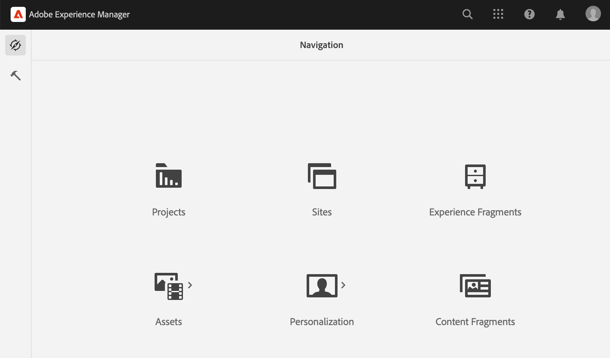
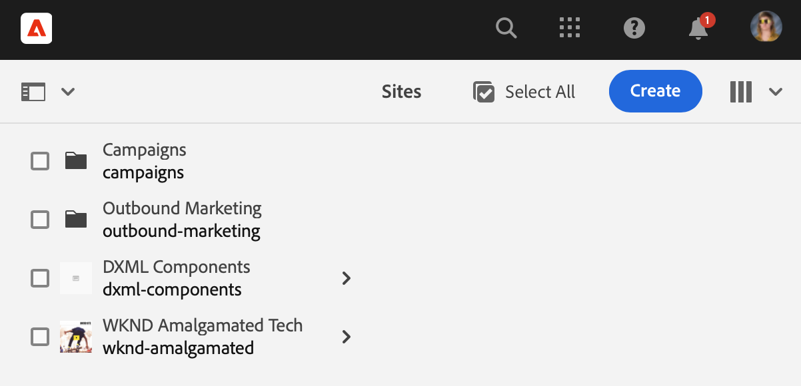
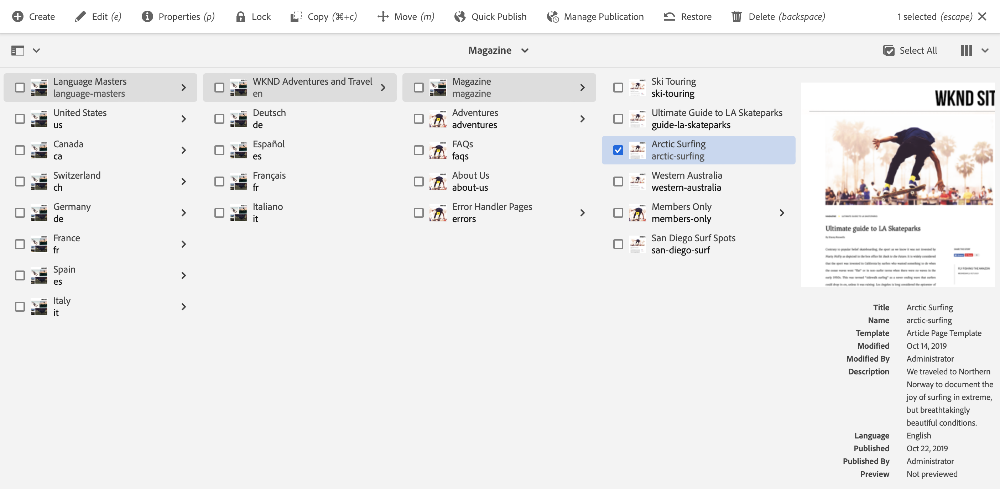
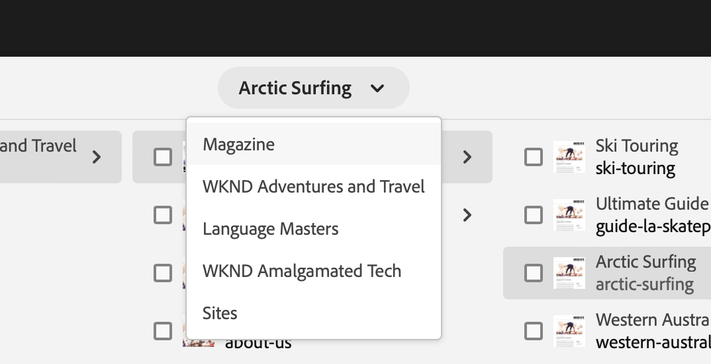
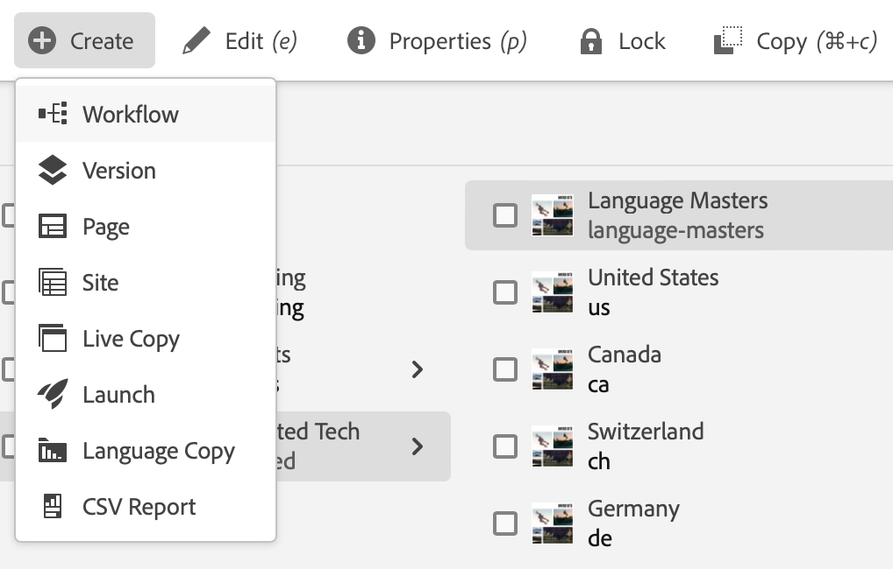
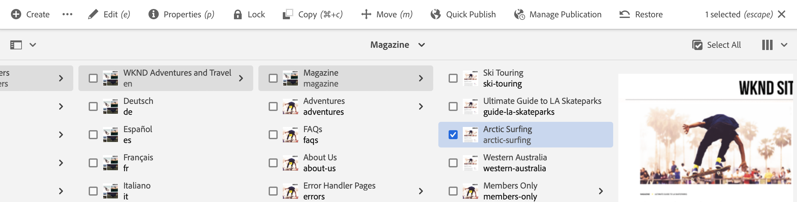
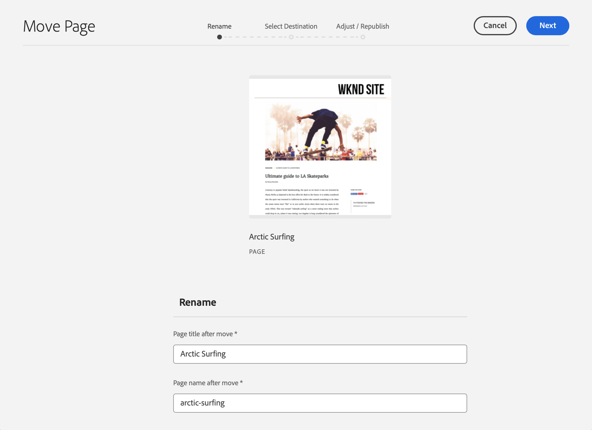
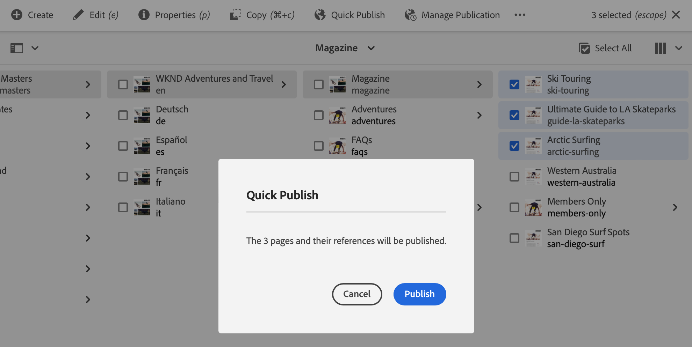

# Quick Start Guide to Authoring {#quick-guide-to-authoring}

Start here for a quick, high-level guide to get you started authoring content using the **Sites** console.

>[!TIP]
>
>This quick start guide focuses on Sites authoring, however most concepts are broadly applicable to other consoles.

## It all starts in the Sites console. {#sites-console}

Whether you want to create new content or view and manage your existing content, the central overview for you is the **Sites** console.

When you first sign in to AEM, you arrive at the global navigation screen. Simply tap or click **Sites** to open the **Sites** console.

To access the global navigation from any other location in AEM, tap or click the **Adobe Experience Manager** link at the top-left of any AEM screen, which opens a drop-down overlay of the global navigation.

Once in the **Sites** console, your content is simple to navigate and is presented in a column view by default.

## Views {#views}

By default the **Sites** console opens in **Column** view. Each hierarchy level is displayed as a column, which lends itself well to web-based hierarchically-organized content.

Tap or click an entry in a column to either select it or open the next level down in the hierarchy. A selected item is indicated with a tick.

There are two additional views available:

* **Card View** - This view presents every entry as an easily-manipulatable card, making additional options easily accessible.
* **List View** - This presents a single level of a hierarchy as a single list, providing more detail on the individual items.

Use the view switcher at the top-left of the screen to switch between views. This document uses the default columns view.

## Navigating Content {#navigating}

**Column View** presents you content as a series of cascading columns. Selecting an item in the current column either shows its details in the next column to the right if it is a document, or it shows the contents of the next hierarchy level if it is a folder.

In this way, you can traverse up and down your content structure.

To quickly jump between levels, you can use the breadcrumbs at the top of the page.

At any time you can also use the search icon at the top-right of the screen to locate particular content.

Search appears as a drop-down overlay over the entire console. Enter your search terms to find your content.

## Creating Content {#creating}

To create a new page, simply navigate to where you want it to be in the content hierarchy and then tap or click the **Create** button in the toolbar.

The options available are context-dependent. If you are at the root of your content structure, you have the ability to create an entirely new site. Otherwise you can create new pages or other page-related content.

Depending on what you select to create, the appropriate wizard will start to guide you through the creation process.

## Edit Content {#editing}

To edit a page, tap or click to select the page in the **Sites** console. Then in the toolbar that appears, tap or click the **Edit** icon.

This will open the page in the editor appropriate to the content.

If you wish to simply update the properties of a page such as tags or its name, you can tap or click the **Properties** icon in the toolbar.

## Organizing Content {#organizing}

To move or copy a page, select the page in the console and then in the toolbar tap or click **Move** or **Copy**. This starts a wizard to guide you through the steps of moving or copying, defining the name and location of resulting page.

## Publishing Content {#publishing}

When you are finished making the changes that you wanted to your content by using the **Sites** console, you can publish the content. Select the content you want to publish and tap or click the **Quick Publish** icon in the toolbar.

Confirm the publication with another tap or click on **Publish** in the dialog.

## Additional Resources {#additional-resources}

This is just a brief introduction to the power of authoring Sites content and as such does not cover every topic or every option.

Here are some more resources that go into depth about all the features of the console as well as discuss topics about content authoring in general.

* [Basic Handling](/help/sites-cloud/authoring/basic-handling.md)
* [Concepts of Authoring](/help/sites-cloud/authoring/author-publish.md)
* [Sites Console](/help/sites-cloud/authoring/sites-console/introduction.md)
* [Page Editor](/help/sites-cloud/authoring/page-editor/introduction.md)
* [Publishing Pages](/help/sites-cloud/authoring/sites-console/publishing-pages.md)
