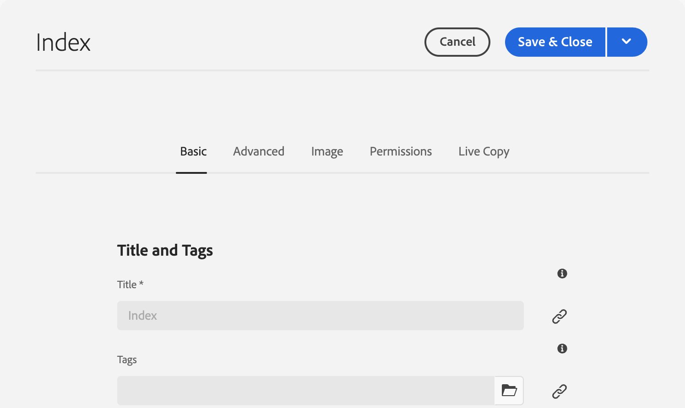
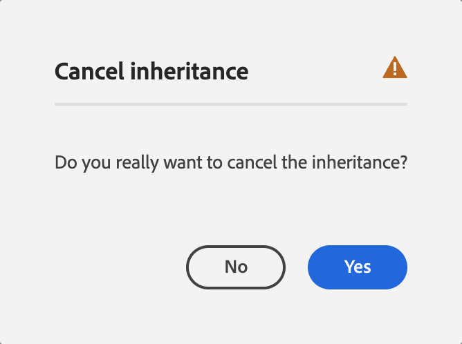
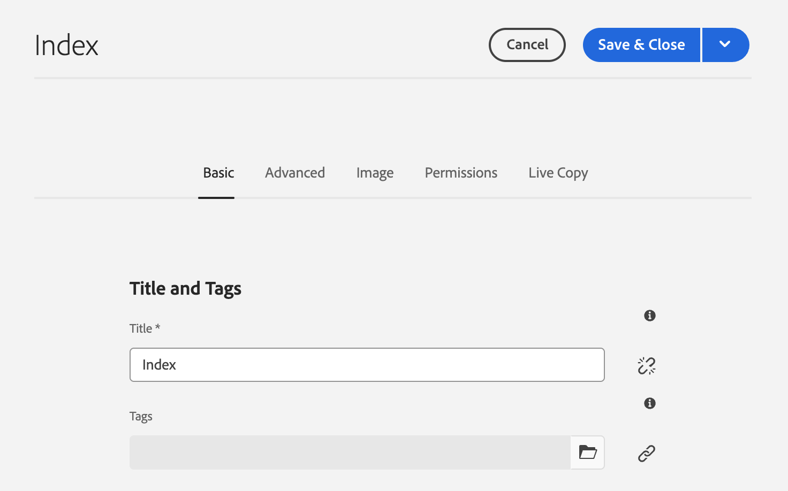
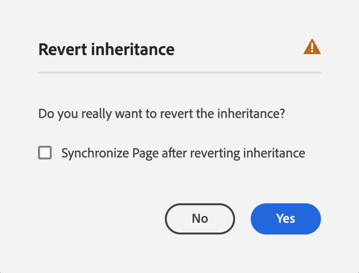

# Editing Page Properties {#page-properties}

Learn how to edit [the properties of a page](/help/sites-cloud/authoring/sites-console/page-properties.md) and change behavior of the page and how it is managed.

>[!TIP]
>
>For details on the individual page properties available, please see the document [Page Properties.](/help/sites-cloud/authoring/sites-console/page-properties.md)

## Editing Page Properties {#editing-page-properties-1}

* From the **Sites** console:
  * [Creating a new page](/help/sites-cloud/authoring/sites-console/creating-pages.md#creating-a-new-page) (a subset of the properties)
  * Clicking or tapping **Properties**
    * For a single page
    * For multiple pages (only a subset of the properties are available for editing en masse)
* From the page editor:
  * Using **Page Information** (then **Open Properties**)

### From the Sites Console - Single Page {#from-the-sites-console-single-page}

Clicking or tapping **Properties** to define the page properties:

1. Using the **Sites** console, navigate to the location of the page for which you want to view and edit properties.
1. Select the **Properties** option for the required page using either:
   * [Quick actions](/help/sites-cloud/authoring/basic-handling.md#quick-actions)
   * [Selection mode](/help/sites-cloud/authoring/basic-handling.md#selecting-resources)
   * The page properties are shown using the appropriate tabs.
1. Either view or edit the properties as required.
1. Then use **Save** to save your updates followed by **Close** to return to the console.

### When Editing a Page {#when-editing-a-page}

When editing a page you can use **Page Information** to define the page properties:

1. Open the page for which you want to edit properties.
1. Select the **Page Information** icon to open the selection menu:
1. Select **Open Properties** and a dialog box opens that lets you edit the properties, sorted by the appropriate tab. The following buttons are also available at the right of the toolbar:
   * **Cancel**
   * **Save & Close**
1. Use the **Save & Close** button to save the changes.

### From the Sites Console - Multiple Pages {#from-the-sites-console-multiple-pages}

From the **Sites** console you can select several pages then use **View Properties** to view and/or edit the page properties. This is referred to as bulk editing of page properties.

You can select multiple pages for bulk editing by various methods, including:

* When browsing the **Sites** console
* After using **Search** to locate a set of pages

After selecting the pages and then clicking or tapping the **Properties option**, the bulk properties are shown:

You can only bulk edit pages that:

* Share the same resource type
* Are not part of a livecopy
  * If any of the pages are in a live copy, then a message is shown when the properties are opened.

Once you have entered Bulk Editing you can:

* **View**

  * A list of the pages impacted
    * You can select/deselect if necessary
    * Tabs
      * As when viewing properties for a single page, the properties are ordered under tabs.
  * A subset of properties
    * Properties that are available on all selected pages and have been explicitly defined as available to bulk editing are visible.
    * If you reduce the page selection to one page, then all properties are visible.
  * Common properties with a common value
    * Only properties with a common value are shown in View mode.
    * When the field is multi-value (for example, Tags), values will only be shown when *all* are common. If only some are common, they will only be shown when editing.
    * When no properties with a common value exist, a message is displayed.

* **Edit**

  * You can update the values in the fields available.
    * The new values are applied to all selected pages when you select **Done**.
    * When the field is multi-value (for example, Tags), you can either append a new value or remove a common value.
  * Fields that are common, but have different values across the various pages are indicated with a special value such as the text `<Mixed Entries>`.

## Property Inheritance {#inheritance}

If the page is based on a blueprint or otherwise inherits content from another page, inheritance is reflected in the **Page Properties** window for the individual field.

Inherited properties can not be edited. Tap or click the **Cancel inheritance** icon next to a particular field to break its inheritance.

Confirm the cancellation in the **Cancel inheritance** modal.

Once inheritance is cancelled for a field, it then becomes editable.

To reinstate inheritance, tap or click the **Revert inheritance** icon next to the field.

Confirm the reversion in the **Revert inheritance** modal.

Select **Synchronize Page after reverting inheritance** to update the field with the latest values in the blueprint. If you do not, the values will be updated the next time the LiveCopy is synchronized.

>[!TIP]
>
>For more information about inheritance, please see the document [Multi Site Manager and Translation](/help/sites-cloud/administering/msm-and-translation.md)
