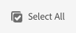

# The Sites Console {#sites-console}

Learn how to use the **Sites** console to manage and organize your AEM pages.

## Orientation {#orientation}

The **Sites** console allows you to view your page hierarchy. 

It offers different views and toolbars to help you manage and organize your pages.

* [The console toolbar](#toolbar) is always present to help you navigate.
* [Three different views](#views) allow you to easily locate and select your page.
* [The action toolbar](#action-toolbar) appears when you have selected an item to take action on it.
* [The side panel](#side-panel) has multiple options to show detailed information on a selected page.

## Console Toolbar {#console-toolbar}

The console toolbar is always present on the console and helps you orient yourself in your content and to navigate the content.

### Side Panel Selector {#side-panel-selector}

The side panel selector allow you to show additional information about the selected item in the console.

The options presented depend on your current console. For example, in **Sites** you can select content only (the default), the timeline, references, or filter side panel.

For more information about the side panel, see [Sites Console Side Panel](/help/sites-cloud/authoring/sites-console/console-side-panel.md).

### Breadcrumbs {#breadcrumbs}

Situated in the middle of the rail, and always showing the description of the currently selected item, the breadcrumbs allow you to navigate through the levels of your website.

Tap or click the breadcrumb text to display a drop-down listing the levels of the hierarchy of the currently selected item. Tap or click an entry to jump to that location.

### Select All {#select-all}

Tapping or clicking the **Select All** button selects all of the items in your current view of the console.

When you have selected all items, the count of the items selected is displayed at the top-right of the toolbar where the **Select All** button appeared.

You can deselect all items and exit selection mode by:

* Clicking or tapping the **X** next to the count.
* Using the **escape** key.

### Create Button {#create-button}

The **Create** button allows you to add new pages to your site as well as create additional Sites objects such as Live Copies or Launches.

Once clicked, the options displayed are appropriate to the console/context. The most common are:

* [Page](/help/sites-cloud/authoring/sites-console/creating-pages.md)
* [Site](/help/sites-cloud/administering/site-creation/create-site.md)
* [Live Copy](/help/sites-cloud/administering/msm/overview.md)
* [Launch](/help/sites-cloud/authoring/launches/overview.md)
* [Language Copy](/help/sites-cloud/administering/translation/overview.md)
* [CSV Report](/help/sites-cloud/authoring/sites-console/csv-export.md)

See the links to these features for details on how they function.

## Views and Selecting Pages {#views}

The **Sites** console offers three different views of your content hierarchy. You can view, navigate through, and select (for further action) your resources with any of the available views.

* [Column View](#column-view)
* [Card View](#card-view)
* [List View](#list-view)

The **View** icon at the far right of the AEM toolbar indicates the current view selected.

Tapping or clicking it allows you to select a different view.

You can switch between column view, card view, and list view. In the list view it also shows the view settings.

>[!NOTE]
>
>The **View Settings** option is only available when in **List View** mode.

Viewing, navigating, and selecting are each conceptually the same across all views, but have small variations in handling, dependent on the view you are using.

>[!NOTE]
>
>By default, AEM Assets does not display the original renditions of assets in the UI as thumbnails in any of the views. If you are an administrator, you can use overlays to configure AEM Assets to display original renditions as thumbnails.

### Selecting Resources {#selecting-resources}

Selecting a specific resource is dependent on a combination of the view and the device:

|View|Select Touch|Select Desktop|Deselect Touch|Deselect Desktop|
|---|---|---|---|---|
|Column|Select the thumbnail|Click the thumbnail|Select the thumbnail|Click the thumbnail|
|Card|Select and hold the card|Mouse over then use the check mark quick action|Select the card|Click the card|
|List|Select the thumbnail|Click the thumbnail|Select the thumbnail|Click the thumbnail|

#### Selecting Example {#selecting-example}

1. For example, in card view:

   

1. Once you have selected a resource the top header is covered by the [actions toolbar](#actions-toolbar) that provides access to actions currently applicable to the selected resource.

1. To exit selection mode select the **X** to the top-right, or use **escape**.

### Column View {#column-view}

The column view allows for visual navigation of a content tree through a series of cascading columns. This view lets you visualize and traverse the tree structure of your website.

Selecting a resource in the leftmost column will display the child resources in a column to the right. Selecting a resource in the right column will then display the child resources in another column to the right and so on.

* You can navigate up and down in the tree by tapping or clicking on the resource name or the chevron to the right of the resource name.

  * The resource name and chevron are highlighted when tapped or clicked.
  * The children of the clicked/tapped resource are displayed in the column to the right of the clicked/tapped resource.
  * If you select a resource name that has no children, its details are displayed in the final column.

* Tapping or clicking on the thumbnail selects the resource.

  * When selected, a check mark is overlaid on the thumbnail and the resource name is highlighted as well.
  * The details of the selected resource are shown in the final column.
  * The action toolbar becomes available.

* When a page is selected in column view, the selected page is displayed in the final colum along with the following details:

  * Page title
  * Page name (part of the page's URL)
  * Template the page is based on
  * Modification details
  * Page language
  * Publication, and Preview details

### Card View {#card-view}

In card view, each item at the current level in the hierarchy is displayed as a large card.

* Cards provide information such as:

  * A visual representation of the page content.
  * The page title.
  * Important dates (such as last edited, last published).
  * If the page is locked, hidden, or part of a livecopy.
  * Indicators if you are required to act on the item as part of a workflow.

Card view also offers [quick actions](#quick-actions) for the items such as selection and common actions such as edit.

You can navigate down the tree by tapping/clicking on cards (taking care to avoid tapping the quick actions) or up again by using the [breadcrumbs in the header](#the-header).

### List View {#list-view}

List view provides information for each resource at the current level in a list.

* You can navigate down through the tree by tapping/clicking on the resource name and back up by using the [breadcrumbs in the header](#the-header).
* To easily select all items in the list, use the [**Select All** checkbox in the toolbar](#select-all).

* Select the columns to be shown using **View Settings** option located under the Views button. The following columns are available for display:

  * **Name** - Page name, which can be useful in a multilingual authoring environment since it is part of the page's URL and does not change regardless of language
  * **Modified** - Last modified date and last modified by user
  * **Published** - Publication status
  * **Preview** - Preview status
  * **Template** - Template on which the page is based
  * **Operation**
  * **Workflow** - Workflow currently applied to the page. More information is available when you mouse over, or open Timeline.
  * **Translated**
  * **Page Views**
  * **Unique Visitors**
  * **Time on Page**

By default the **Name** column is shown, which makes up part of the URL for the page. In some cases the author might need to access pages that are in a different language and seeing the name of the page (which is usually unchanging) can be of great help if the author does not know the language of the page.

* Change the order of items using the dotted vertical bar at the far right of each item in the list.

Select the vertical selection bar and drag the item to a new position in the list.

>[!NOTE]
>
>Changing the order works only within an ordered folder that has `jcr:primaryType` value as `sling:OrderedFolder`.

## Actions Toolbar {#actions-toolbar}

Whenever a resource is selected, you can carry out various actions on the selected item. These actions are displayed in the actions toolbar.

The actions toolbar only appears when a resource is selected in the console. The action available in the actions toolbar change to reflect the actions you can take on the specific items selected. The most common actions are:

* [**Create**](#create-action) - Create new content or content-related actions
* **Edit** - Depending on how the selected page was created, the **Edit** action will open the appropriate editor.
  * [Page Editor](/help/sites-cloud/authoring/page-editor/introduction.md) - For pages created with the AEM Page Editor
  * [Universal Editor](/help/sites-cloud/authoring/universal-editor/authoring.md) - For pages created with the Universal Editor
* [**Properties**](/help/sites-cloud/authoring/sites-console/page-properties.md) - Opens the page properties window
* [**Lock**](/help/sites-cloud/authoring/sites-console/managing-pages.md#locking-a-page) - Lock a page to prevent others from changing it
* [**Copy**](/help/sites-cloud/authoring/sites-console/managing-pages.md#copying-and-pasting-a-page) - Copy a page
* [**Move**](/help/sites-cloud/authoring/sites-console/managing-pages.md#moving-or-renaming-a-page) - Move or rename a page
* [**Quick Publish**](/help/sites-cloud/authoring/sites-console/publishing-pages.md#quick-publish) - Publish a page or pages immediately
* [**Manage Publication**](/help/sites-cloud/authoring/sites-console/publishing-pages.md#manage-publication) - Schedule a page or pages for publication
* [**Restore**](/help/sites-cloud/authoring/sites-console/page-versions.md#restore-version) - Restore a version of a page or page tree
* [**Delete**](/help/sites-cloud/authoring/sites-console/managing-pages.md#deleting-a-page) - Delete a page or pages

Due to the space restrictions in some windows, the toolbar can quickly become longer than the space available. When this happens additional options appears. Clicking or tapping on the ellipsis (the three dots or **...**) opens a drop-down selector holding all remaining actions.

### Create Action {#create-action}

The create action offers similar options to the [**Create** toolbar button](#create-button) for creating new pages and similar items.

In addition, it offers the ability to create page-related actions.

* [**Workflow**](/help/sites-cloud/authoring/workflows/overview.md) - Apply a workflow to a page
* [**Version**](/help/sites-cloud/authoring/sites-console/page-versions.md) - Create a version of a page

## Templates

You can easily see which template the page is based on when selecting the page in either [**Column view**](/help/sites-cloud/authoring/basic-handling.md#column-view) or [**List view**](/help/sites-cloud/authoring/basic-handling.md#list-view).
