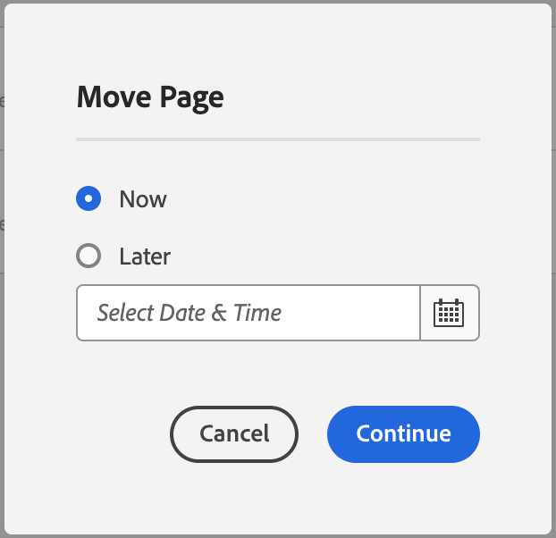

# Managing Pages {#managing-pages}

Learn how to manage the pages of your website in AEM including moving, copying, and deleting.

>[!TIP]
>
>Before you begin managing your pages, become familiar with [how your pages are organized in AEM](/help/sites-cloud/authoring/sites-console/organizing-pages.md).

>[!TIP]
>
>There are several [keyboard shortcuts](/help/sites-cloud/authoring/sites-console/keyboard-shortcuts.md) that you can use from the websites console that make organizing your pages more efficient.

## Access Privileges {#access-privileges}

Your account needs the appropriate access rights and permissions to act on pages such as create, copy, move, edit, and delete.

If you encounter any problems we suggest you contact your system administrator.

## Opening a Page For Editing {#opening-a-page-for-editing}

After [creating a page](/help/sites-cloud/authoring/sites-console/creating-pages.md) or navigating to an existing page using [the **Sites** console](/help/sites-cloud/authoring/sites-console/introduction.md), you can open it for editing.

1. Open [the **Sites** console](/help/sites-cloud/authoring/sites-console/introduction.md).
1. Navigate to find the page that you want to edit.
1. Select your page by using either:

    * [Quick actions](/help/sites-cloud/authoring/basic-handling.md#quick-actions)
    * [Selection mode](/help/sites-cloud/authoring/basic-handling.md#selecting-resources) and the toolbar

1. Tap or click the **Edit** icon.

   

1. The page is opened and you can edit the page as required. Depending on how the selected page was created, the **Edit** action will open the appropriate editor.
   * [Page Editor](/help/sites-cloud/authoring/page-editor/introduction.md) - For pages created with the AEM Page Editor
   * [Universal Editor](/help/sites-cloud/authoring/universal-editor/authoring.md) - For pages created with the Universal Editor

## Copying and Pasting a Page {#copying-and-pasting-a-page}

You can copy a page and all of its sub-pages to a new location:

1. Open [the **Sites** console](/help/sites-cloud/authoring/sites-console/introduction.md).
1. Navigate to find the page that you want to copy.
1. Select your page using either:

    * [Quick actions](/help/sites-cloud/authoring/basic-handling.md#quick-actions)
    * [Selection mode](/help/sites-cloud/authoring/basic-handling.md#selecting-resources) and the toolbar

1. Tap or click the **Copy** page icon.

   

1. Navigate to the location for the new copy of the page.
1. Select the **Paste** icon that became available.

   

1. The paste dialog presents a summary of the paste transaction and the ability to:
   * **New Site Name:** Change the pasted page's name
   * **Paste Without Children:** Omit the child pages of the selected page when pasting (by default child pages are pasted)

   

1. Select the **Paste** button to confirm the paste transaction and create the new page(s).

>[!NOTE]
>
>If you copy the page to a location where a page with the same name as the original already exists, the system will automatically generate a variation of the name by appending a number. For example, if `beach` already exists, a new page with the name `beach` becomes `beach1`.

>[!NOTE]
>
>If you start the paste action in selection mode, this is exited automatically as soon as the page is copied.

## Moving or Renaming a Page {#moving-or-renaming-a-page}

The procedure to move or rename a page is basically the same and both actions are handled by the Move Page wizard. With this wizard you can:

* Rename a page without moving it.
* Move the page without renaming it.
* Move and rename at the same time.

AEM offers you the functionality to update any internal links that refer to the page being renamed/moved. This can be done on a page-by-page basis to provide full flexibility.

1. Open [the **Sites** console](/help/sites-cloud/authoring/sites-console/introduction.md).
1. Navigate to find the page that you want to move.
1. Select your page using either:

    * [Quick actions](/help/sites-cloud/authoring/basic-handling.md#quick-actions)
    * [Selection mode](/help/sites-cloud/authoring/basic-handling.md#selecting-resources) and the toolbar

1. Tap or click the **Move** page icon to open the move page wizard.

   

1. From the **Rename** step of the wizard you can either:

    * Specify the name you want the page to have after it is moved, then select **Next** to proceed.
    * **Cancel** to abort the process.

   

   * The page name can remain the same if you are only moving the page.

   >[!NOTE]
   >
   >If you move a page to a location where a page with the same name already exists, the system will automatically generate a variation of the name by appending a number. For example, if `beach` already exists, a new page with the name `beach` becomes `beach1`.

1. From the **Select Destination** step of the wizard you can either:

    * Use the [column view](/help/sites-cloud/authoring/basic-handling.md#column-view) to navigate to the new location for the page:

        * Select the destination it by clicking the destination's thumbnail.
        * Click **Next** to continue.

    * Use **Back** to return to page name specification.

   >[!NOTE]
   >
   >By default the parent of the page you are moving or renaming is selected as the destination.

   

   >[!NOTE]
   >
   >If you move a page to a location where a page with the same name already exists, the system will automatically generate a variation of the name by appending a number. For example, if `winter` already exists, `winter` becomes `winter1`.

1. If the page is linked to or referenced, or has been published, then the details are listed in the **Adjust/Republish** step.

   * You can indicate which should be adjusted and/or republished as appropriate.

   >[!NOTE]
   >
   >If the page is neither linked to nor referenced, then this step will not be available.

   

1. Tap or click **Move** to define when the move action should occur.

   * **Now** will trigger an [asynchronous job](#asynchronous-actions) to move the page immediately.
   * **Later** will allow you to schedule a date for the move to be processed.

   

1. Tap or click **Continue** to complete the page move.

>[!NOTE]
>
>If the page was already published, moving the page automatically unpublishes it. By default, it is republished when the move is complete, but this can changed by un-checking the **Republish** field in the **Adjust/Republish** step.

>[!NOTE]
>
>Renaming a page is also subject to the [Page Naming Conventions](#page-naming-conventions) when specifying the new page name.

>[!NOTE]
>
>A page can only be moved to a location where the template upon which the page is based is allowed. See [Template Availability](/help/implementing/developing/components/templates.md#template-availability) for more information.

### Asynchronous Actions {#asynchronous-actions}

Page move actions are always processed asynchronously, allowing the user to continue authoring in the UI unimpeded.

The status of asynchronous jobs can be checked in the [**Async Jobs Status** dashboard](/help/operations/asynchronous-jobs.md#monitor-the-status-of-asynchronous-operations) at **Global Navigation** &gt; **Tools** &gt; **Operations** &gt; **Jobs**

>[!TIP]
>
>For more information about asynchronous job processing and how to configure the limit for page move/rename actions, see [Asynchronous Jobs](/help/operations/asynchronous-jobs.md) document in the Operations user guide.

### Deleting a Page {#deleting-a-page}

1. Open [the **Sites** console](/help/sites-cloud/authoring/sites-console/introduction.md).
1. Navigate to the page you want to delete.
1. Use [selection mode](/help/sites-cloud/authoring/basic-handling.md#viewing-and-selecting-resources) to select the required page, then use **Delete** from the toolbar:

   

1. A dialog will ask for confirmation.

   

    * **Do you want to archive pages before deletion?** - If checked, versions of the pages selected for deletion are created on deletion.
      * [Versions can be restored at a later date](/help/sites-cloud/authoring/sites-console/page-versions.md).
      * Pages deleted without previous versions cannot be restored.
1. Tap or click **Cancel** to abort the action or **Delete** to confirm the action.
      * If the page has no references, the page is deleted.
      * If the page has references, a message box will inform you that **One or more pages are referenced.** You can select **Force Delete** or **Cancel**.

>[!NOTE]
>
>If a page is already published, it will automatically be un-published before deletion.

### Locking a Page {#locking-a-page}

You can [lock/unlock a page](/help/sites-cloud/authoring/page-editor/edit-content.md#locking-a-page) from either a console or when editing an individual page. Information about whether a page is locked is also shown in both locations.

### Creating a New Folder {#creating-a-new-folder}

You can create folders to help organize your files and pages.

1. Open [the **Sites** console](/help/sites-cloud/authoring/sites-console/introduction.md).
1. Navigate to the required location.
1. To open the option list, select **Create** from the toolbar
1. Select **Folder** to open the dialog. Here you can enter the **Name** and **Title**:

   

1. Select **Create** to create the folder.

>[!NOTE]
>
>* Folders are also subject to the [Page Naming Conventions](#page-naming-conventions) when specifying the new folder name.
>* Folders can only be created directly under **Sites** or under other folders. They cannot be created under a page.
>* The standard actions move, copy, paste, delete, publish, unpublish, and view/edit properties can be performed on a folder.
>* Folders are not available for selection within a live copy.
